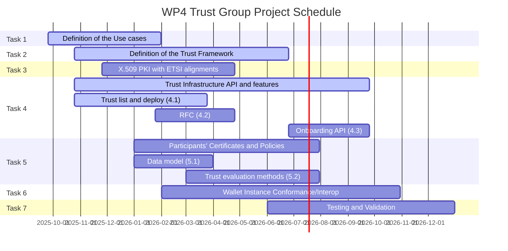

# WP4 Trust Group

Public resources shared within the WE BUILD WP4 Trust Infrastructure group

The Trust Registry Infrastructure group is dedicated to establishing the framework for trust evaluation and management within digital Wallet ecosystems, in compliance but not limited to the model defined by European regulation (910/2014 as amended by Regulation (EU) 2024/1183).  

The group develops an implementation of the trust model based on a trusted third party (Trusted Lists) resulting in a Trust Framework and an demo infrastructure of trust. 

The group aims to create a comprehensive infrastructure of trust that supports seamless interactions among diverse entities. 

## Contributing

We welcome contributions from all collaborators.

- Open issues for bugs, improvements, or questions
- Submit pull requests following the repository structure
- Use discussions (if enabled) for ideas and proposals

By contributing, you agree to follow the project's coding and documentation guidelines.

## Funding

Co-funded by the European Union

The project is co-funded by the European Union. However, the views and opinions expressed are those of the author(s) only and do not necessarily reflect those of the European Union or the granting authority. Neither the European Union nor the granting authority can be held responsible.

## Licensing

Licensed to the WE BUILD Consortium under the consortium agreements. The WE BUILD Consortium licenses this file to you under the Apache License, Version 2.0 (the "License"); you may not use these files except in compliance with the License.

Unless required by applicable law or agreed to in writing, software distributed under the License is distributed on an "AS IS" BASIS, WITHOUT WARRANTIES OR CONDITIONS OF ANY KIND, either express or implied. See the License for the specific language governing permissions and limitations under the License.

## Tasks



## Directory Structure

```
wp4-trust-group/
│
├── references/                     # Standards, Drafts, Documentation
│   ├── standards/                  # Official standards and specifications
│   ├── drafts/                     # Draft specifications and working documents
│   ├── reference-specifications/   # Reference implementations and profiles
│   └── overview.md                 # Overview of all references
│
├── task1-use-cases/               # Use cases​
│   ├── subtask1-1-onboarding/     # Use cases​ onboarding
│   └── subtask1-2-trust-registry/ # Use cases​ trust registry
│
├── task2-trust-framework/         # Trust Framework
│
├── task3-x509-pki-etsi/           # X.509 PKI with ETSI alignments
│
├── task4-trust-infrastructure-api/ # Trust Infrastructure API and additional features
│   ├── trust-infrastructure-api/   # Trust Infrastructure API
│   └── onboarding-api/             # Onboarding API
│
├── task5-participants-policies/ # Participants' Certificates and Policies
│   ├── data-model/                 # Data model
│   └── trust-evaluation-methods/   # Trust evaluation methods
│
├── task6-Wallet-conformance-interop/ # Wallet Instance Conformance/Interop Checks
│
├── task7-testing-validation/       # Testing and Validation
│
├── docs/                          # Documentation
│   ├── architecture/              # Architecture documentation
│   ├── api/                       # API documentation
│   ├── standards/                 # Standards compliance documentation
│   └── testing/                   # Testing documentation
│
├── examples/                      # Examples and use cases
│   ├── trust-framework/           # Trust framework examples
│   ├── api-usage/                 # API usage examples
│   └── testing/                   # Testing examples
│
├── tools/                         # Development and validation tools
│   ├── validation/                # Validation tools
│   ├── testing/                   # Testing tools
│   └── deployment/                # Deployment tools
│
├── .github/                       # CI/CD workflows and templates
│   ├── workflows/                 # GitHub Actions workflows
│   ├── ISSUE_TEMPLATE/            # Issue templates
│   └── PULL_REQUEST_TEMPLATE/     # Pull request templates
│
├── README.md                      # This file
└── LICENSE                        # License file
```

## References

### Community Regulations

- **eIDAS Regulation (EU) No 910/2014** - Regulation on electronic identification and trust services
  - [Official Document](https://eur-lex.europa.eu/eli/reg/2014/910/oj)
- **Regulation (EU) 2024/1183** - Amending Regulation (EU) No 910/2014
  - [Official Document](https://eur-lex.europa.eu/eli/reg/2024/1183/oj)
- **CIR  2025/848** -  Commission Implementing Regulation on the registration of wallet-relying parties
  - [Official Document](https://eur-lex.europa.eu/legal-content/EN/TXT/PDF/?uri=OJ:L_202500848j)

### Standards

- **ETSI TS 119 612** (v2.4.1) - Electronic Signatures and Trust Infrastructures (ESI); Trusted Lists
  - [Official Document](https://www.etsi.org/deliver/etsi_ts/119600_119699/119612/02.04.01_60/ts_119612v020401p.pdf)
  - [XSD Schema](https://forge.etsi.org/rep/esi/x19_612_trusted_lists/-/raw/v2.4.1/19612_xsd.xsd)
  - [SIE XSD Schema (ListOfTrustedLists)](https://forge.etsi.org/rep/esi/x19_612_trusted_lists/-/raw/v2.4.1/19612_sie_xsd.xsd)
- **ETSI TS 119 602** (v01.01.01) - Electronic Signatures and Trust Infrastructures (ESI); Trusted lists; Data model. Trusted lists in other formats, such as JSON, CBOR or ASN.1.
  - [Official Document](https://www.etsi.org/deliver/etsi_ts/119600_119699/119602/01.01.01_60/ts_119602v010101p.pdf)
- **ETSI TS 119 411-8** (v01.01.01) - Access Certificate Policy for EUDI Wallet Relying Parties
  - [Official Document](https://www.etsi.org/deliver/etsi_ts/119400_119499/11941108/01.01.01_60/ts_11941108v010101p.pdf)
- **ETSI TS 119 475** (v01.01.01) - Relying party attributes supporting EUDI Wallet User's authorisation decisions (Relying Party Attributes)
  - [Official Document](https://www.etsi.org/deliver/etsi_ts/119400_119499/119475/01.01.01_60/ts_119475v010101p.pdf)
- **ETSI TS 119 472-2** (v1.1.1) - Electronic Signatures and Trust Infrastructures (ESI); Profiles for Electronic Attestation of Attributes; Part 2: Profiles for EAA/PID Presentations to Relying Party
  - [Official Document](https://www.etsi.org/deliver/etsi_ts/119400_119499/11947202/01.01.01_60/ts_11947202v010101p.pdf)

### European Commission Technical Specifications

These below may have further updates and require to considered in future milestones.

- **EC TS02 v0.9** (2025-04) - Specification of systems enabling the notification and subsequent publication of Provider information
- **EC TS05 V1.0** (2025-06) - Common Formats and API for Relying Party Registration Information (upcoming ETSI TS)
  - [Official Document](https://github.com/eu-digital-identity-wallet/eudi-doc-standards-and-technical-specifications/blob/main/docs/technical-specifications/ts5-common-formats-and-api-for-rp-registration-information.md)
- **EC TS06 v1.0** (2025-06) - Common set of Relying Party information to be registered
  - [Official Document](https://github.com/eu-digital-identity-wallet/eudi-doc-standards-and-technical-specifications/blob/main/docs/technical-specifications/ts5-common-formats-and-api-for-rp-registration-information.md)

### Security Guidelines

- **ENISA EUCC Guidelines Cryptography v.2** (2025-05) - European Union Common Criteria-based Cryptography Guidelines
  - Reference: CIR (EU) 2024/2981, CIR (EU) 2024/482

#### Dependencies

- **IETF RFC 5914** - Trust Anchor Format
- **IETF RFC 5280** - Internet X.509 Public Key Infrastructure Certificate and Certificate Revocation List (CRL) Profile
- **W3C XML Digital Signature** - XML Signature Syntax and Processing Version 1.1
  - [Official Specification](https://www.w3.org/TR/xmldsig-core1/)
- **W3C XML Schema** - XML Schema Definition Language
  - [Part 1: Structures](https://www.w3.org/TR/xmlschema-1/)
  - [Part 2: Datatypes](https://www.w3.org/TR/xmlschema-2/)


### Drafts

- **ETSI EN 319 412-6** (v01.00.00) - Certificate profile requirements for PID, Wallet, EAA, QEAA and PSBEAA providers
  - [Official Document](https://www.etsi.org/deliver/etsi_en/319400_319499/31941206/01.00.00_20/en_31941206v010000c.pdf)
- **ETSI TS 119 472-3** (v0.0.11 Draft) - Electronic Signatures and Trust Infrastructures (ESI); Profiles for Electronic Attestation of Attributes; Part 3: Profiles for issuance of EAA or PID
  - [Work Item Page](https://portal.etsi.org/webapp/WorkProgram/Report_WorkItem.asp?WKI_ID=74935&curItemNr=121&totalNrItems=292&optDisplay=100000&qSORT=TB&qETSI_ALL=&SearchPage=TRUE&qINCLUDE_SUB_TB=&qINCLUDE_MOVED_ON=&qEND_CURRENT_STATUS_CODE=11+WI%3BM58&qSTOP_FLG=N&qKEYWORD_BOOLEAN=&qCLUSTER_BOOLEAN=&qCLUSTER=17&qFREQUENCIES_BOOLEAN=&qSTOPPING_OUTDATED=&butExpertSearch=Search&includeNonActiveTB=FALSE&includeSubProjectCode=&qREPORT_TYPE=TUBE)
  - [Draft Document](https://docbox.etsi.org/esi/esi/70-Drafts/0019472-3/ESI-0019472-3v0011.docx)
- **OpenID Federation 1.0** - Draft 43
- **OpenID Federation Wallet Architectures 1.0** - Draft 03


## Getting Started

1. Clone the repository
2. Review the task directories for specific implementation details
3. Check the references directory for relevant standards and specifications
4. Follow the contributing guidelines for any modifications

## Contact

For questions and discussions, please use the GitHub Issues or Discussions section of this repository.
