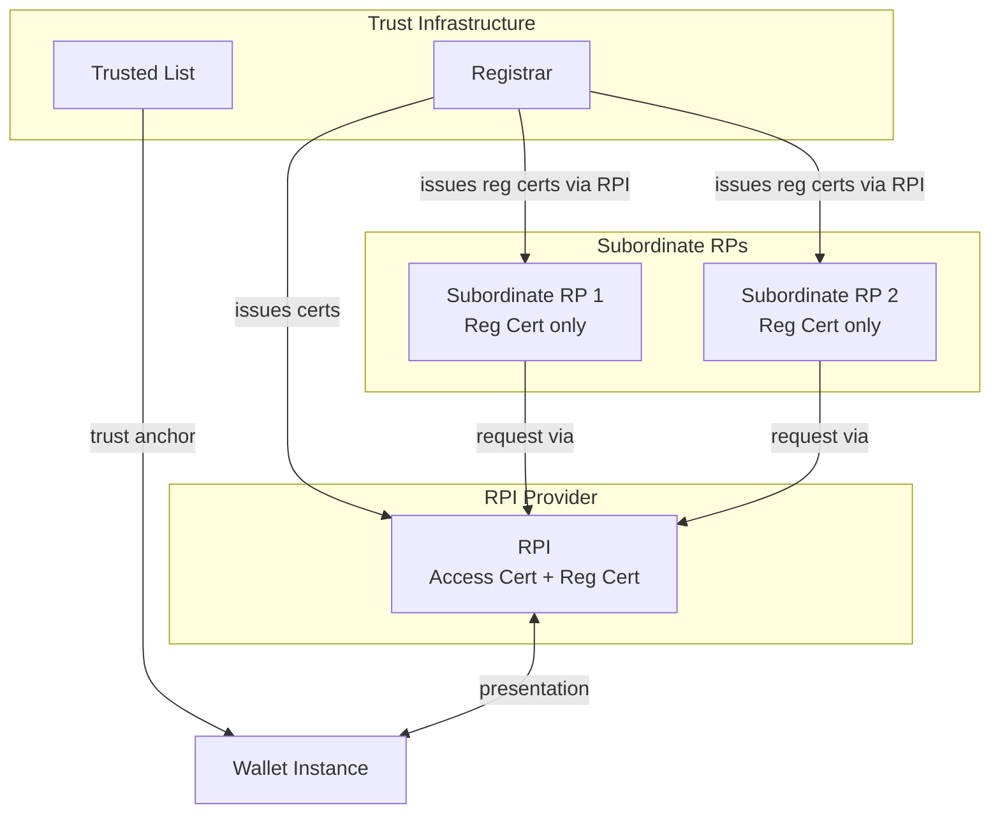
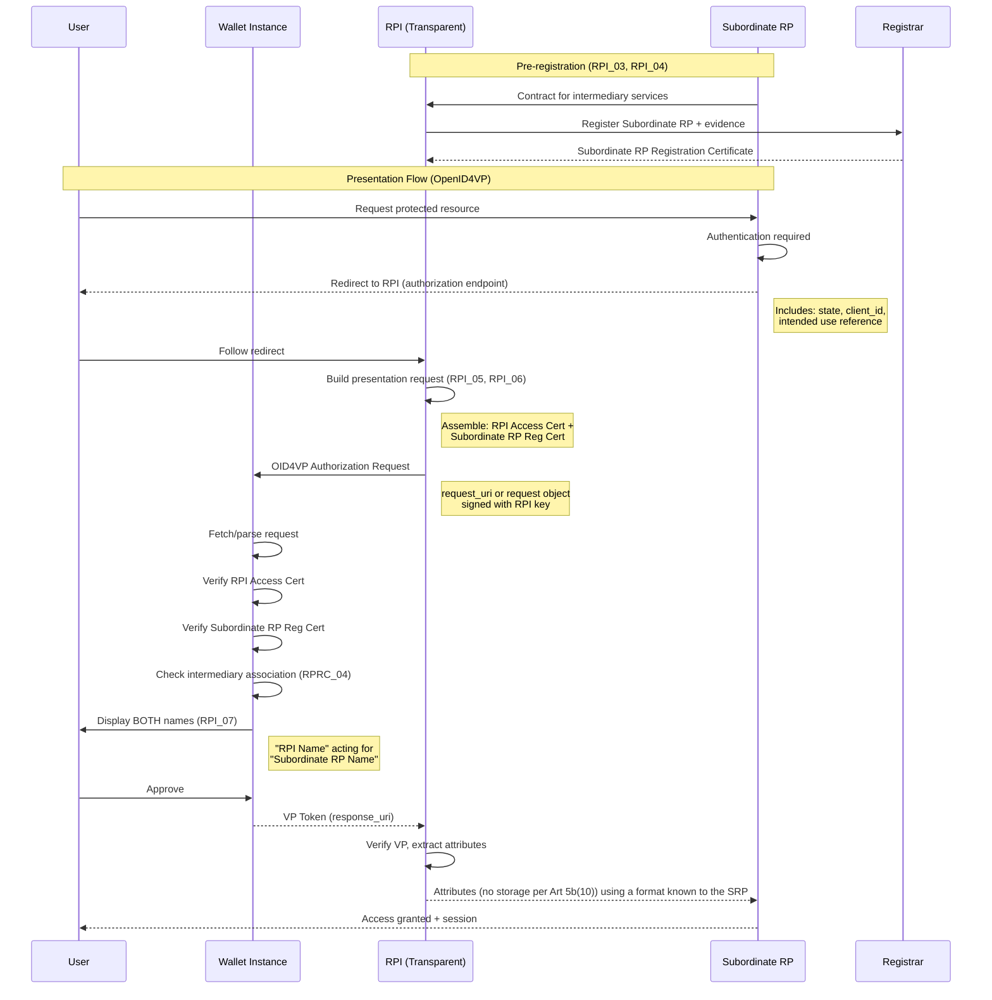
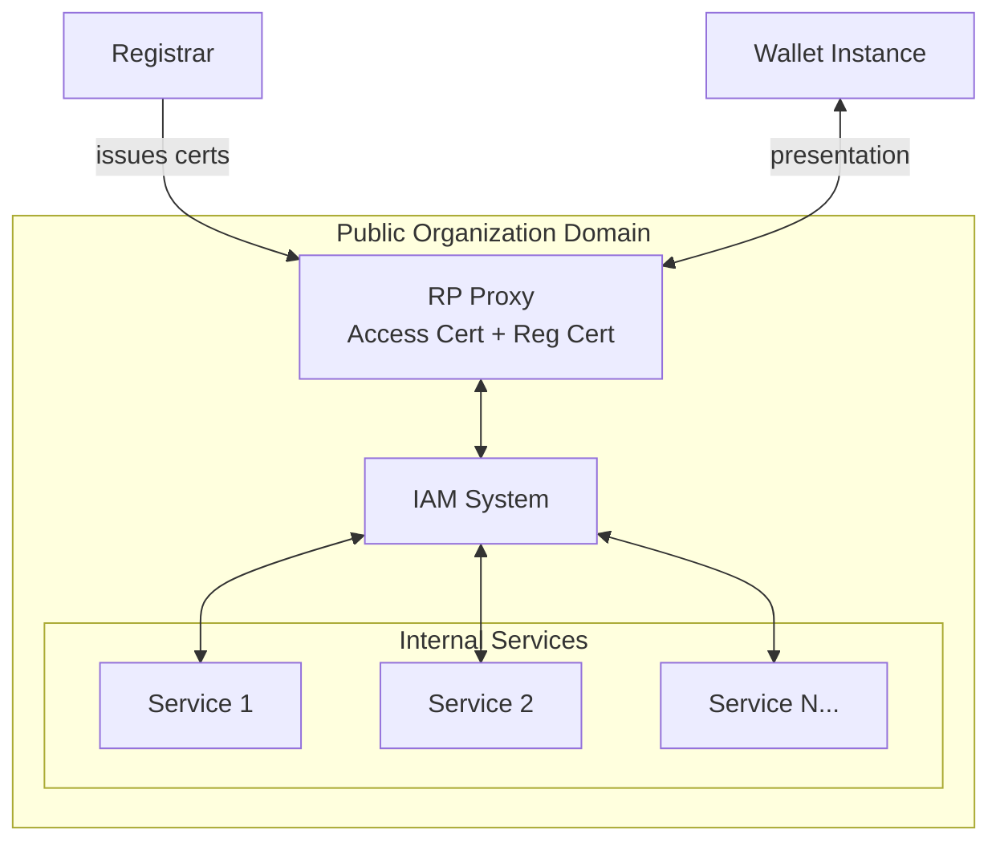
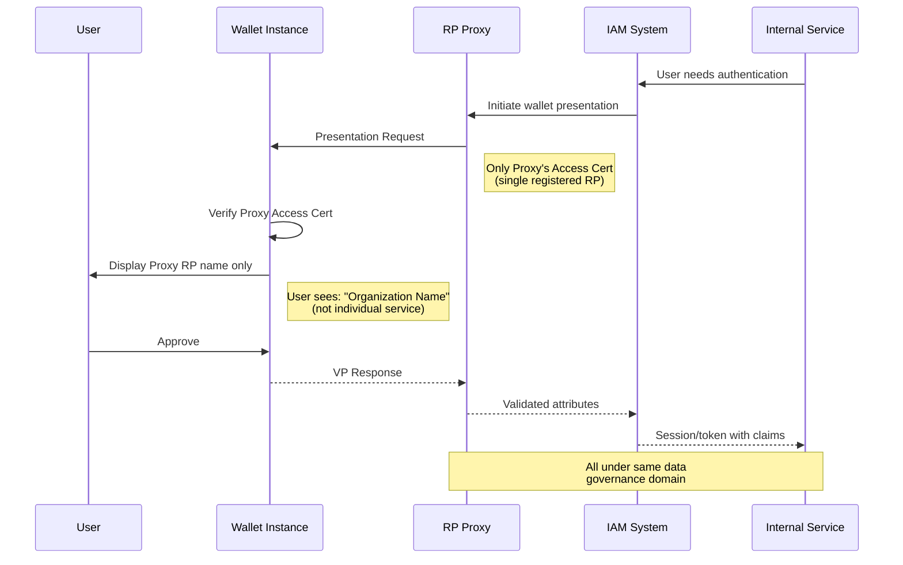
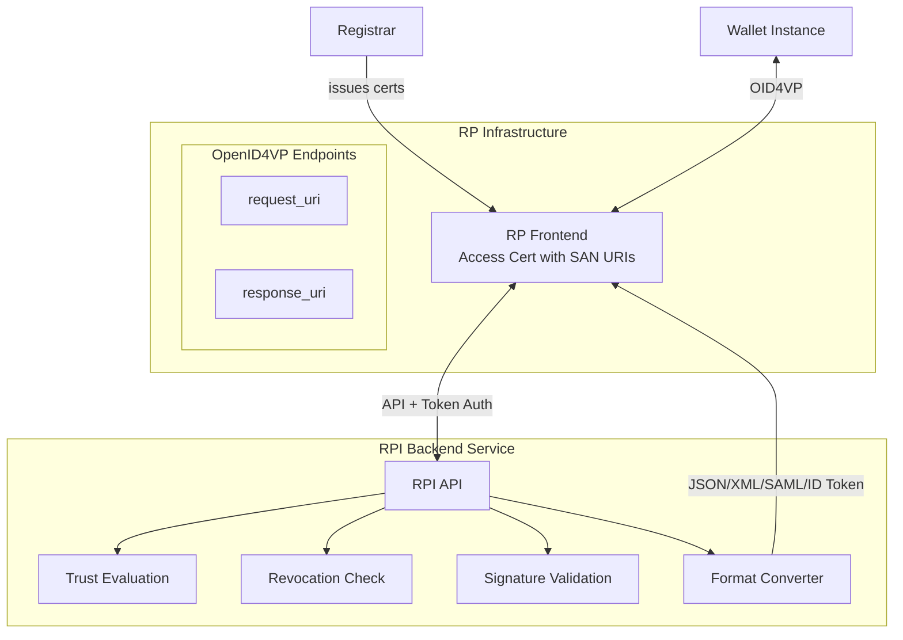
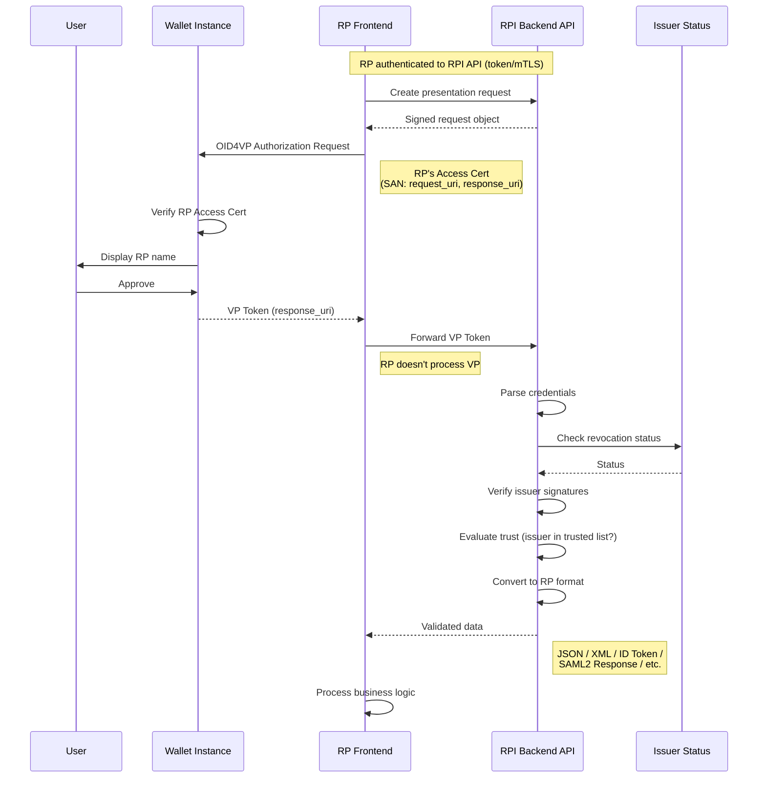

# Relying Party Intermediary (RPI) Implementation Scenarios

## Overview

This document describes three implementation scenarios for Relying Party Intermediaries (RPI) where only the first one it the only one that is compliant with the requirements defined in **ETSI TS 119 612 clause 5.5.1** and the **eIDAS 2.0 regulation** (Article 5b(10)).

## Terminology

| Term | Definition |
|------|------------|
| **RPI** | Relying Party Intermediary - registered as RP, acts on behalf of other RPs |
| **Subordinate RP** | A Relying Party using RPI services to interact with Wallet Instances |
| **Access Certificate** | Certificate for RP authentication to Wallet Units |
| **Registration Certificate** | Certificate containing RP registration data and intended use |

---

## Scenario 1: RPI Transparent Frontend (eIDAS Model)

**Real-world example:** Private organization providing aggregation services and interoperability solutions.

This scenario mets the following requirement:

> **Intermediaries acting on behalf of relying parties shall be deemed to be relying parties and shall not store data about the content of the transaction.**

### Description

The RPI is **transparent** to the Wallet Instance. Both the RPI and its Subordinate RPs are visible to the User.

### Requirements (per ARF HLRs)

| Entity | Access Certificate | Registration Certificate |
|--------|-------------------|-------------------------|
| **RPI** | ✅ Own certificate (RPI_01) | ✅ Own certificate (indicates intermediary role) |
| **Subordinate RP** | ❌ Not required | ✅ Own certificate (issued via RPI per RPI_03, contains association to RPI per RPRC_04) |

> **Clarification (per ARF HLLs):**
> - **RPI_01**: An intermediary SHALL register as a Relying Party, obtaining an access certificate containing its own name and unique identifier.
> - **RPI_03**: An intermediary SHALL register each intermediated Relying Party and receive a registration certificate for each registered intended use.
> - **RPI_06**: The intermediary SHALL include its own access certificate (RPI_01) and the registration certificate of the intermediated RP (RPI_03) in the presentation request.
> - **RPRC_04**: The registration certificate contains the 'association to the intermediary' (name and identifier) per CIR 2025/848 Annex I (15).
>
> Source: [ARF Annex 2.02 - Topic 52: Relying Party Intermediaries](https://github.com/eu-digital-identity-wallet/eudi-doc-architecture-and-reference-framework/blob/main/docs/annexes/annex-2/annex-2.02-high-level-requirements-by-topic.md#a2330-topic-52-relying-party-intermediaries)

### High-Level Flow

### Sequence Diagram

---

## Scenario 2: RP Proxy Frontend

**Real-world example:** Private or Public organization with hundreds of services under same domain, same data regulation/handling, no cross-domain interactions.

### Description

The RPI is registered as a **pure RP**. Subordinate RPs are **NOT transparent** to the Wallet Instance - the User only sees the proxy RP identity.

### Certificate Requirements

| Entity | Access Certificate | Registration Certificate |
|--------|-------------------|-------------------------|
| **RP Proxy** | ✅ Own certificate | ✅ Own certificate (covers all services) |
| **Subordinate Services** | ❌ None | ❌ None (internal services) |

### High-Level Architecture

### Sequence Diagram

---

## Scenario 3: RPI Backend

**Real-world example:** RP outsources trust evaluation, credential verification, and signature validation to specialized backend service.

### Description

The RP is registered as a **pure RP** with its own endpoints in access certificates (SAN URI). The RP frontend handles wallet communication but delegates all trust evaluation to the RPI Backend API.

### Certificate Requirements

| Entity | Access Certificate | Registration Certificate |
|--------|-------------------|-------------------------|
| **RP (Frontend)** | ✅ Own certificate (with SAN URIs for OID4VP endpoints) | ✅ Own certificate |
| **RPI Backend** | ❌ Not visible to wallet | N/A (API service) |

### High-Level Architecture

### Sequence Diagram

---

## Comparison Matrix

| Aspect | Transparent Frontend | Proxy Frontend | Backend |
|--------|---------------------|----------------|---------|
| **Wallet sees** | RPI + Subordinate RP | Proxy RP only | RP only |
| **Subordinate RP registration** | Required (via RPI) | Not required | Not applicable |
| **Access cert holder** | RPI | Proxy RP | RP |
| **Trust evaluation** | Wallet + RPI | Wallet + Proxy | RPI Backend |
| **Data flow** | RPI passes through | Proxy distributes | RP receives processed |
| **Use case** | Multi-tenant aggregation | Single-org multi-service | Outsourced verification |
| **Complexity** | High | Medium | Medium |

---

## References

- **ETSI TS 119 612** - Trusted Lists, clause 5.5.1
- **eIDAS 2.0 Regulation** - Article 5b(8) on intermediaries
- **ARF HLLs**: RPI_01, RPI_03, RPI_04, RPI_05, RPI_06, RPI_07, RPI_07a, RPRC_04
- **OpenID4VP 1.0** - Presentation request/response endpoints
- **CIR 2025/848** - Annex I, V on registration information

