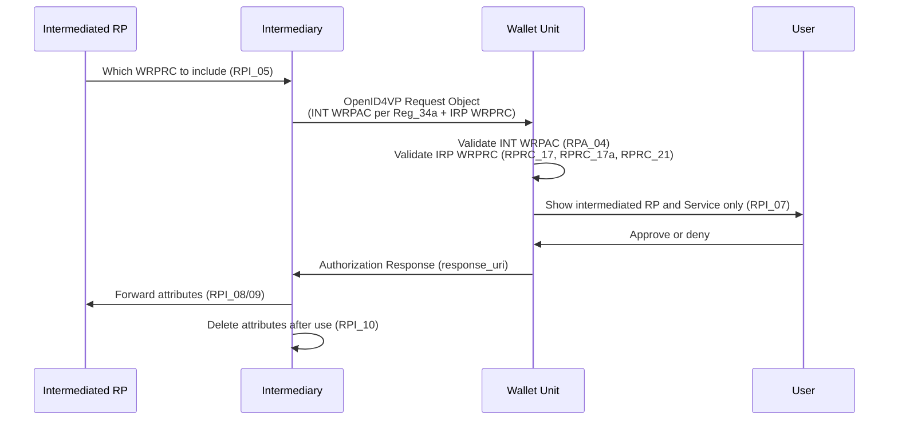

# Use Case UC-RPI-01: Relying Party Intermediary

## Scope

An **Intermediary** is a Relying Party that requests attribute presentation from a Wallet Unit **on behalf of** another registered Relying Party (the **intermediated RP**). Typical examples: identity/interop gateways, sector platforms, or SaaS verifiers that serve multiple service providers.

This use case covers registration, intermediated remote presentation (OpenID4VP), and wallet-side trust evaluation under **ARF v3.0.0**. Protocol details and JSON examples: [RPI OpenID4VP technical report](../../task2-trust-framework/rp-intermediary-openid4vp-technical-report.md).

## Actors

| Actor | Role |
| ----- | ---- |
| **Intermediary** | Registers as RP indicating it acts as intermediary (**RPI_01**); holds a **separate WRPAC set per intermediated RP** (**Reg_34a**); sends presentation requests |
| **Intermediated RP** | Registered at a Registrar; receives WRPRCs automatically per intended use × Service (**RPRC_09**); indicates which single WRPRC to include (**RPI_05**) |
| **Registrar** | Registers both parties; records the intermediary–RP relationship (**RPI_04**) |
| **Access CA / WRPRC Provider** | Issues WRPACs to the intermediary (bound to the intermediated RP/Service); issues WRPRCs to the intermediated RP |
| **Wallet Unit** | Authenticates the intermediary WRPAC; verifies the WRPRC in the request; **SHALL NOT** display intermediary trade names (**RPI_07**) |
| **Holder (User)** | Approves or denies presentation |

## Goal

- **Business**: Allow service providers to use a trusted third-party verifier without each holding a direct wallet connection, while showing the User the **intermediated RP** (the service consuming the data), not the intermediary.
- **Technical**: Intermediary authenticates with the WRPAC associated to this RP (**Reg_34a**); the intermediated RP’s identity, Service, intended use, and entitlements travel in the **WRPRC** (**RPRC_19**); the Wallet validates both per ARF Topic 52 and Topic 44.

## Scenarios

| ID | Scenario | Intermediated? |
| -- | -------- | -------------- |
| **S1** | Interop gateway requests PID for a cinema booking service | Yes |
| **S2** | Intermediary requests attributes for its **own** service | No (direct RP) |

### S1 — Intermediated presentation (primary)

**Example:** *VerifyNow* (intermediary) requests age verification on behalf of *Example Cinema Ltd.* (intermediated RP).

**Preconditions**

- Intermediary registered indicating it acts as intermediary, with a valid **WRPAC** associated to this intermediated RP and Service (**Reg_34a**).
- Intermediated RP registered; intended uses mapped to Services (**Reg_10d**); **WRPRC issued automatically** per intended use × Service (**RPRC_09**); relationship recorded (**RPI_04**).
- Intermediated RP indicated **which single WRPRC** the intermediary must include (**RPI_05**).

**Main flow**

1. Intermediated RP instructs the intermediary which WRPRC to include (**RPI_05**).
2. Intermediary builds and signs the OpenID4VP Request Object with the **applicable WRPAC** (**Reg_34a**) and includes the intermediated RP **WRPRC by value** (**RPI_06**, **RPRC_19**).
3. Wallet detects intermediation when the WRPAC subject is the intermediary and the WRPRC identifies a different entity that uses this intermediary (**RPRC_17a**).
4. Wallet validates the intermediary WRPAC (Access CA TL) and the WRPRC in the request ([UC-TE-04](wallet-unit-evaluates-relying-party.md)).
5. Wallet **SHALL NOT** display the intermediary or intermediary-Service trade names (**RPI_07** / **RPA_06** note b). It displays the **intermediated RP** and its Service; User approves (**RPA_07**).
6. There is no user-opt-in Registrar lookup (**RPI_07a**, **RPRC_16**, **RPRC_18** are empty in ARF v3.0.0). Binding is in the WRPRC (**RPRC_04**, **RPRC_17a**).
7. Wallet sends the response to the intermediary `response_uri`; intermediary forwards to the intermediated RP after agreed verifications (**RPI_08**, **RPI_09**) and deletes received credentials immediately (**RPI_10**).

**Postconditions (success)**

- The Wallet displays only the intermediated RP (and its Service) before consent. Intermediary name and Service MAY be logged by the Wallet Unit.
- Attributes disclosed match the intermediated RP registered entitlements in the WRPRC in the same request (**RPRC_21**).
- Intermediary deletes received credentials immediately after forwarding (**RPI_10**).

### S2 — Intermediary as direct Relying Party

An entity registered as intermediary may also act **in its own capacity** (**RPI_01** note c): WRPAC and WRPRC refer to the **same** party. Flow matches [UC-TE-04](wallet-unit-evaluates-relying-party.md).

## Onboarding (summary)

Both the Intermediary and the Intermediated RP are Relying Parties. Follow [Relying Party Onboarding](../subtask1-1-onboarding/relying_party_onboarding.md).

| Step | Intermediary | Intermediated RP |
| ---- | ------------ | ---------------- |
| Register | As RP indicating intermediary role (**RPI_01**); register **Services** (**Reg_10a**) | At Registrar in establishment MS (**RPI_03**); register Services and intended uses (**Reg_10d**) |
| Relationship | Receives a separate WRPAC set per intermediated RP (**Reg_34a**) | Provide evidence of intermediary use; Registrar records it (**RPI_04**) |
| Certificates | **WRPAC** per Service / intermediated RP (**Reg_34a**). Own WRPRC only for direct use (S2) | **WRPRC** issued automatically per intended use × Service (**RPRC_09**); includes intermediary association (**RPRC_04**) |
| Registry API | May register intended uses on behalf of the WRP ([TS5 notes](../../task5-participants-certificates-policies/ts5-registry-api-and-data-formats.md)) | Publication (**Reg_03**, **Reg_06**); not a presentation-time substitute for the WRPRC |

**Note:** In an intermediated transaction the intermediated RP does **not present** a WRPAC and therefore does **not need one for that role** (ARF §6.6.5). If that RP also registers Services that talk to Wallet Units directly, **Reg_10a** still applies.

## Wallet evaluation checklist

| Check | Source | Applies to |
| ----- | ------ | ---------- |
| WRPAC chain + revocation | Access CA TL (**RPA_04**) | Intermediary |
| Request Object signature | Public key in `x5c` | Intermediary |
| WRPAC bound to this RP/Service | **Reg_34a** | Intermediary ↔ Intermediated RP |
| WRPRC in the request (by value) | **RPRC_19** | Intermediated RP |
| WRPRC authenticity, validity, revocation | WRPRC Provider TL (**RPRC_17**) | Intermediated RP |
| WRPRC identifier/Service match, or uses this intermediary | **RPRC_17a**, **RPRC_04** | Both |
| Requested attributes ⊆ WRPRC | **RPRC_21** | Intermediated RP |
| Only intermediated RP displayed | **RPI_07** | User approval |
| EDP (if present) | EDP_02/03 | Evaluate against **intermediated** RP id/root, not intermediary WRPAC |

## Success criteria

- Intermediary authenticated via a valid WRPAC associated to this intermediated RP (**Reg_34a**).
- Intermediated RP identity and entitlements verified from the **WRPRC in the request** (**RPRC_17**, **RPRC_19**, **RPRC_21**).
- User is shown only the intermediated RP (and its Service) before consent (**RPI_07**).
- Intermediated transaction does not expose the intermediary’s own WRPRC in `verifier_info`.

## ARF requirements (key)

| ID | Summary |
| -- | ------- |
| RPI_01 | Intermediary registers as RP; obtains WRPAC (and Service identifiers) |
| RPI_03 | Intermediary registers each intermediated RP and receives that RP’s WRPRCs (**RPRC_09**) |
| RPI_04 | Registrar verifies and records the intermediary relationship |
| RPI_05 | Intermediated RP indicates which single WRPRC to include |
| RPI_06 | Intermediary sends request with applicable WRPAC (**Reg_34a**) and that WRPRC |
| RPI_07 | Wallet SHALL NOT display intermediary / intermediary-Service trade names |
| RPI_07a | Empty in ARF v3.0.0 |
| RPI_08–10 | Forward only to that RP; verify if agreed; delete immediately |
| RPRC_04 | Intermediated WRPRC contains intermediary unique identifier and Service identifier |
| RPRC_09 | WRPRC issued automatically per intended use × Service |
| RPRC_19 | Single WRPRC included in the presentation request by value |
| RPRC_16 / RPRC_18 / RPRC_19a | Empty in ARF v3.0.0 |

Full matrix: [Trusted List / Registration / Trust Evaluation Matrix](../../task2-trust-framework/trusted-list-registration-trust-evaluation-matrix.md).

## Out of scope (this use case)

- Proximity presentation (ISO 18013-5 / TS 119 472-2 clause 5.3) — see technical report §12
- Architecture-group implementation scenario variants

## References

- [Consolidated Terms — Intermediary](../terms-and-entities.md#316-intermediary)
- [RPI OpenID4VP technical report](../../task2-trust-framework/rp-intermediary-openid4vp-technical-report.md)
- [EUDI Wallet Trust and Entitlement Discovery](../../task2-trust-framework/eudi-wallet-trust-and-entitlement-discovery.md)
- [WRPRC Example 3 — With Intermediary](../../task5-participants-policies/relying_party_registration_certificate.md)
- [Embedded Disclosure Policies](../../task5-participants-policies/embedded-disclosure-policies-implementation.md)
- [ARF Topic 52 — Relying Party intermediaries](https://eudi.dev/3.0.0/annexes/annex-2/annex-2.02-high-level-requirements-by-topic/#a2330-topic-52-relying-party-intermediaries)
