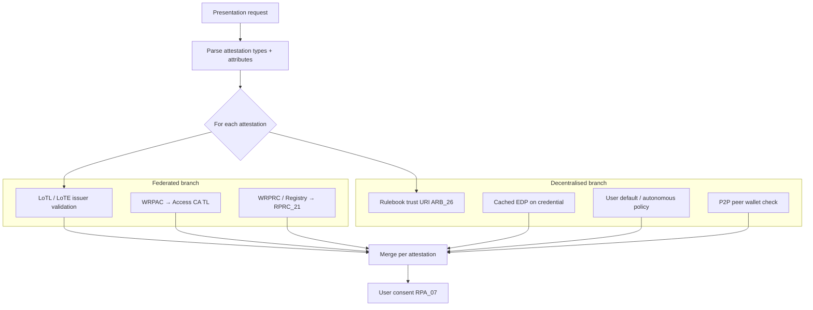
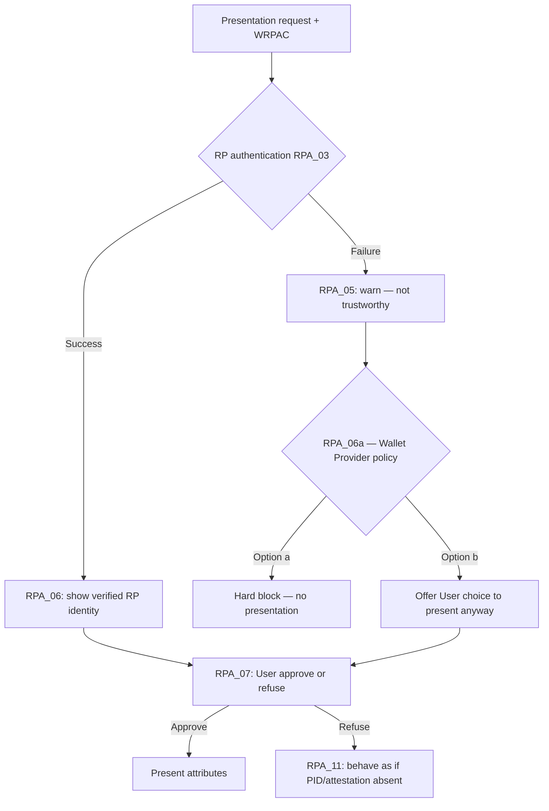
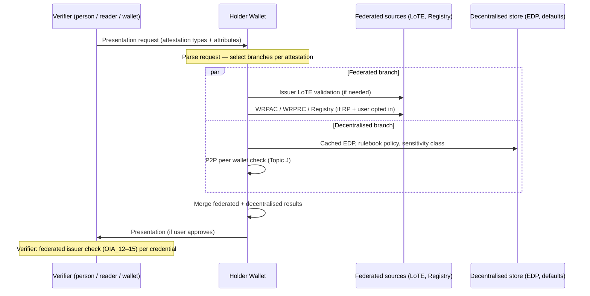

# Technical Report: Hybrid Trust Evaluation in Attestation Centric Frameworks — Federated and Decentralised Models in P2P and Multi-Scheme Flows

| Field | Value |
|-------|-------|
| **Status** | Draft technical report (non-normative) |
| **WP4 task** | Task 2 — Trust Framework |
| **Scope** | Hybrid trust framework mixing **federated** (LoTL, Registrar, WRPAC/WRPRC) and **decentralised** (rulebook anchors, credential-bound EDP, user-autonomous, P2P) models; attestation-centric composition; P2P / proximity / W2W; trust discovery vectors |
| **Related WP4 docs** | [EUDI Wallet Trust and Entitlement Discovery](eudi-wallet-trust-and-entitlement-discovery.md), [Trusted List Extensions for Credential Issuers](../task3-x509-pki-etsi/trusted-list-extensions-credential-issuers.md), [Embedded Disclosure Policies](../task5-participants-policies/embedded-disclosure-policies-implementation.md), [Credential Catalogue](credential-catalogue.md), [Trusted List / Registration Trust Evaluation Matrix](trusted-list-registration-trust-evaluation-matrix.md) |
| **Primary normative sources** | EUDI ARF v2.9.0 (Topics **6**, **44**, **55**, 1, 10, 12, 18, 24, 52; Discussion Topic J), [EU Age Verification Blueprint / AV Profile](https://ageverification.dev/) (Regulation (EU) No 910/2014 as amended, DSA Art. 28), CIR (EU) 2024/2982, CIR (EU) 2025/848, CIR (EU) 2025/1569, ETSI TS 119 472-2, ETSI TS 119 475, ISO/IEC 18013-5 |

---

## 1. Purpose

This report develops and evidences a thesis about the **EUDI Wallet as a hybrid trust framework** that **mixes federated and decentralised trust models** — and selects between them **per attestation**, based on **what is being requested**, not only on **who is requesting**.

### 1.1 Central claim

The ecosystem is **not** moving from federation to decentralisation wholesale. It is **composing both**:

| Model | Role in EUDIW | Typical trust anchor |
| ----- | ------------- | -------------------- |
| **Federated** | EU/MS-governed registration, LoTL, WRPAC/WRPRC, Registrar entitlements | Commission LoTE, Access CA TL, Registry |
| **Decentralised** | Scheme/rulebook-defined issuer trust, credential-bound policies, user-autonomous consent, offline P2P | Attestation Rulebook (ARB_26), cached EDP, holder default policy, peer wallet checks |

**Attestation-centric evaluation** is the **composition layer**: for each requested attestation, the wallet (and verifier) decides **which trust model(s) apply**, how much weight the federated RP-vector carries, and whether decentralised paths suffice.

The argument is especially visible in **peer-to-peer (P2P)**, **proximity**, and **wallet-to-wallet (W2W)** flows, where:

- the counterparty may not be a **federated** Relying Party (RP);
- low-sensitivity requests (e.g. age proof) may rely on **decentralised** credential integrity + user consent alone;
- high-sensitivity or regulated schemes may **require** federated RP registration or issuer TL validation;
- a single presentation can **mix** attestations governed by **different federated and decentralised frameworks** in one transaction.

This document is **informative**. Normative requirements remain in the cited specifications and in [EUDI Wallet Trust and Entitlement Discovery](eudi-wallet-trust-and-entitlement-discovery.md).

---

## 2. Executive summary

| Question | Short answer |
|----------|--------------|
| Is EUDIW federated or decentralised? | **Hybrid.** Federated infrastructure (LoTL, Registrar, WRPAC/WRPRC) coexists with decentralised mechanisms (rulebook trust, EDP on credentials, user-autonomous paths, P2P peer validation). |
| What selects which model applies? | The **requested attestation type(s) and attributes**, plus **scheme/catalogue rules** — not a single global choice per counterparty. |
| Is trust evaluation still “about the RP first”? | **Only for the federated slice.** RP-vector evaluation is **one branch** of a hybrid pipeline, not the universal gate (W2W, optional WRPRC, uncovered attributes, offline proximity use decentralised branches). |
| Does age proof require a certified wallet or federated RP? | **Not in the general case.** Age proof can run on **decentralised** paths: selective disclosure + issuer signature validation + user consent. Federated RP checks are **scheme-dependent add-ons**, not prerequisites. |
| What changes for trust discovery? | **Multi-vector, attestation-indexed discovery** across federated vectors (LoTL, Registry) and decentralised vectors (rulebook URI, cached EDP, user defaults, peer WUA). |
| Can the User override wallet blocking when RP auth fails? | **Yes — ARF permits and structures this.** **RPA_06a**: after failed WRPAC auth, wallet **SHALL** either hard-block **or** give User choice to present anyway; **RPA_07** always allows refuse; **RPRC_16–21** warn at consent rather than silently blocking. |
| Main risk | **Collapsing the hybrid into one model** — either pure federation (blocks P2P and low-risk flows) or pure decentralisation (drops RPRC_21 and Registrar protections where schemes require them). |

**Core thesis (informal):** *The object of the request precedes the subject of the request.* Trust is scoped to the **relationship implied by the attestation**, which may be backed by **federated registration**, **decentralised credential policy**, or **both**. If someone asks for a pencil, I may not trust them to return it; if they ask for “Hello”, I may answer without verifying who they are.

---

## 3. Hybrid trust framework: federated + decentralised

### 3.1 Two trust models in one ecosystem

EUDIW normative material **does not mandate a single trust topology**. It specifies **different discovery and validation mechanisms** that map cleanly to federated vs decentralised patterns:

#### Federated trust model

**Characteristics:** Central or MS-governed authorities publish trust; participants register; wallets and verifiers **look up** counterparty and issuer status.

| Mechanism | Function | WP4 / ARF reference |
| --------- | -------- | ------------------- |
| **LoTL / LoTE** | Issuer and infrastructure trust anchors (PID, QEAA, PuB-EAA, Access CA, WRPRC Provider) | Topic 31; [trust-infrastructure-schema](trust-infrastructure-schema.md) |
| **WRPAC** | Authenticate registered RP / provider to wallet | RPA_03, RPA_04 |
| **WRPRC / Registry** | RP entitlements; attribute allow-list (RPRC_21) | Topic 44; [§2.1](eudi-wallet-trust-and-entitlement-discovery.md#21-discovery-sequence-for-relying-party-interaction) |
| **Registrar policy** | Who may issue/request which attestation types | ISSU_24a, ISSU_34a, RPRC_23 |
| **Catalogue (scheme requirements)** | When federation artefacts are **mandatory** for a scheme | CIR 2025/1569 Art. 8; §2.3.4 |

WP4 documents the federated holder-side RP flow in UC-TE-04 ([Wallet Unit Evaluates Relying Party](../task1-use-cases/subtask1-2-trust-registry/wallet-unit-evaluates-relying-party.md)).

#### Decentralised trust model

**Characteristics:** Trust material travels **with the transaction or credential**; scheme providers define discovery; holder/user is final authority when federation data is absent or insufficient.

| Mechanism | Function | WP4 / ARF reference |
| --------- | -------- | ------------------- |
| **Attestation Rulebook trust (ARB_26)** | Issuer anchors defined by **scheme provider**, not EU RP registry | OIA_15, ISSU_10 |
| **Embedded Disclosure Policy (EDP)** | Issuer policy **bound to credential**, cached locally | EDP_06, EDP_10 |
| **User-autonomous authorisation** | Disclosure when attributes **uncovered** by WRPRC | §4.3.1 |
| **User default policy** | Holder-configured rules when WRPRC/Registry unavailable | §4.3.2 |
| **P2P / W2W peer validation** | Verifier is natural person; peer wallet checks, not Registrar | Topic J Req 9–10 |
| **Offline / proximity** | Policy evaluation without live federation lookup | EDP_10, ARB_02, Topic J offline note |

These are **decentralised** in the sense that trust decisions do not **require** a live query to a central RP registry — though they may still use **federated issuer LoTEs** when validating signatures (OIA_12–14).

> **Terminology note:** “Decentralised” here means **policy and discovery decentralised relative to RP federation** — not blockchain/DID-specific. Rulebook and EDP paths are **specification-native** decentralised patterns in ARF Topic 12 and Topic 43.

### 3.2 Attestation-centric composition (the hybrid glue)

The wallet does **not** pick “federated **or** decentralised” once per session. It **composes** both **per attestation** in the presentation request:

| Attestation class | Primary issuer trust | RP / counterparty trust | Dominant model |
| ----------------- | -------------------- | ----------------------- | -------------- |
| PID | **Federated** — PID Provider LoTE | Federated WRPAC/WRPRC when RP registered; else decentralised user path | **Hybrid** |
| QEAA | **Federated** — national QTSP TL | Same as PID | **Hybrid** |
| PuB-EAA | **Federated** — PuB-EAA LoTE | Same as PID | **Hybrid** |
| Non-qualified EAA | **Often decentralised** — rulebook mechanism (ARB_26) | EDP may list authorised RP IDs; may not require Registrar | **Hybrid → decentralised-leaning** |
| PID selective disclosure (`age_over_18`) | Federated issuer TL for signature | **Decentralised-leaning** for RP gate — low sensitivity, user consent | **Hybrid, RP-vector optional** |
| W2W presentation | Federated issuer TL (verifier validates credential) | **Decentralised** — peer wallet, no WRPAC | **Hybrid** |

ARF explicitly requires verifiers to **partition trust anchors by attestation type** (OIA_12–OIA_15 note) — this is the **technical enabler** of hybrid composition.



### 3.3 What changed vs “entity-centric federation only”

Early diagrams often implied **federated RP evaluation first, then disclose everything**:

1. Authenticate RP (WRPAC)
2. Authorise RP (WRPRC / Registry)
3. Disclose all requested attributes

**Hybrid model correction:**

1. Parse **what** is requested (attestation types, attributes, sensitivity).
2. For **each** attestation, run **federated branch** (issuer TL + RP-vector **if applicable**).
3. Run **decentralised branch** (EDP, rulebook, user policy, P2P checks **if applicable**).
4. **Merge** with scheme-specific precedence (catalogue may require federation for some schemes only).
5. User consent with **per-attribute provenance** (registration-based vs user-autonomous — §4.3.1).

Combined presentations (Topic 18) force this pipeline to run **in parallel across frameworks** — a single request can be **simultaneously** federated-heavy (QEAA) and decentralised-heavy (non-qualified EAA).

---

## 4. Evidence catalogue

Evidence is grouped by **which side of the hybrid** it supports. Most rows support **composition** (both models present; attestation/scheme selects weight).

### 4.1 Federated model: LoTE, registration, RP entitlements

| ID | Evidence | Implication |
| -- | -------- | ----------- |
| **RPA_03 / RPA_04** | RP authentication via access certificate; wallet trusts Access CA LoTE | **Federated** counterparty authentication for registered RPs |
| **RPRC_19 / RPRC_21** | WRPRC in request; requested attributes ⊆ registered list | **Federated** authorisation when user opts in and WRPRC exists |
| **OIA_12–OIA_14** | PID / QEAA / PuB-EAA validated via **Commission or MS LoTE** | **Federated** issuer trust for regulated credential classes |
| **ISSU_24a / ISSU_34a** | Wallet verifies provider registration via cert or Registrar | **Federated** issuance gate |
| **GenNot_05 / Reg_07–09** | Registry lifecycle drives TL updates | Registry as **federated source of truth** for registration state |
| **WP4 UC-TE-04** | Wallet evaluates RP before presentation | Documented **federated** holder-side RP path |

### 4.2 Decentralised model: rulebooks, credential-bound policy, user authority

| ID | Evidence | Implication |
| -- | -------- | ----------- |
| **OIA_15 / ARB_26** | Non-qualified EAA trust from **Attestation Rulebook**, not RP registry | **Decentralised** (scheme-local) issuer discovery |
| **EDP_10** | EDP stored at issuance; evaluated offline | **Decentralised** policy — no live federation query |
| **EDP_06** | Wallet evaluates EDP with RP info | Issuer policy **travels with credential** |
| **§4.3.1 uncovered attributes** | User-autonomous disclosure outside WRPRC | **Decentralised** holder authority |
| **§4.3.2 no WRPRC** | User default policy when registry path absent | **Decentralised** fallback |
| **Topic J Req 9–10** | Peer wallet validation, not Registrar | **Decentralised** counterparty model for W2W |
| **Topic J offline note** | Flow continues with user warning | Graceful **decentralised** degradation |
| **RPA_06a** | On RP auth failure: notify User **and** either block **or** give User choice to present | **Normative user override** of wallet hard-block (Topic 6) |
| **RPA_07** | User must approve before presentation; **SHALL always allow refuse** | Holder is final gate even when checks fail |
| **RPRC_16 / RPRC_18a** | User may **decline** Registrar lookup; wallet **SHALL NOT** go online | User opts out of federated RP verification |
| **RPRC_17 / RPRC_18 / RPRC_21** | On registration check failure: **notify at RPA_07** — not mandatory hard-stop | Warn-and-continue to user consent |

### 4.3 Hybrid composition: attestation-type partitioning

| ID | Evidence | Implication |
| -- | -------- | ----------- |
| **OIA_12–OIA_15** (note) | Verifier must use **different trust anchors per attestation class** | Same transaction = **multiple trust models** |
| **ISSU_07–ISSU_10** | Wallet issuance validation mirrors OIA partition | Holder-side **hybrid** at issuance and presentation |
| **RPRC_09 / RPRC_13** | WRPRC **optional** | Federation is **not universal** — decentralised paths remain valid |
| **RPRC_16** | User chooses Registrar lookup | **Explicit opt-in** to federated RP verification |
| **CIR 2025/1569 Art. 8** | Scheme may **require** federation artefacts for specific attestations only | **Hybrid by catalogue** — not all-or-nothing |
| **Topic 18** | Combined presentations across attestations | **Mixed federated + decentralised** in one request |
| **trusted-list-extensions** | Validation: read type from credential → TL → `allowedAttestationType` | **Credential-driven** federation lookup |

### 4.4 Normative: attestation-local disclosure policy (EDP) — hybrid bridge

EDP is the clearest **bridge** between models: an attestation issued under **federated issuer TL** may carry **decentralised disclosure rules** restricting which federated RPs may receive it.

| ID | Evidence | Implication |
| -- | -------- | ----------- |
| **EDP_02 / EDP_03** | EDP may restrict RP identifiers or access-cert trust roots | Issuer **overrides** generic federation for **that attestation** |
| **EDP_01** | EDP on QEAA / PuB-EAA / non-qualified EAA, not PID | Per-type **hybrid** rules within one wallet |
| **EDP_06** | Evaluate EDP **in conjunction with** RP information | **Merge** federated RP-vector with decentralised issuer policy |

### 4.5 Legal / architectural: P2P as decentralised counterparty on hybrid rails

| Source | Evidence | Implication |
| ------ | -------- | ----------- |
| **[European Digital Identity Regulation](https://eur-lex.europa.eu/eli/reg/2024/1183/oj) Art. 5a(4)(c), 5a(5)(a)(vi)** | Wallets shall support **secure interaction between two wallets** | P2P is a **first-class** use case, not an RP special case |
| **CIR 2024/2982 Art. 5(5)** | Presentation-to-RP rules apply **mutatis mutandis** to **two wallet units in proximity** | Proximity P2P inherits presentation mechanics but **not necessarily full RP registration stack** |
| **ARF Topic J** ([Discussion Paper J](https://github.com/eu-digital-identity-wallet/eudi-doc-architecture-and-reference-framework/blob/main/docs/discussion-topics/j-wallet-to-wallet-interactions.md)) | Verifier is a **natural person** with a wallet; flow driven by **presentation offer / request**; Req 9–10 validate **peer wallet**, not Registrar | Counterparty is **not** a federated RP; **requested attestations** define the interaction |
| **Topic J §3.2 note** | Offline → revocation checks may fail; **flow continues** with user warning | Trust evaluation **degrades gracefully**; user judges risk from **what** is requested |
| **OIA_01** | Proximity + remote presentation flows supported | ISO 18013-5 proximity is in scope alongside OpenID4VP |
| **ARB_02** | Rulebooks **must** specify if proximity without internet is required | Some attestations are **designed for offline P2P** |

### 4.6 Wallet certification is not a universal presentation gate

| ID | Evidence | Implication |
| -- | -------- | ----------- |
| **WUA_07** | KA presented **only to PID / Attestation Providers at issuance**, **not to RPs** | **Certified wallet (WIA/KA) is not required** for RP or P2P **presentation** trust |
| **WUA_10a** | Non-device-bound attestations may **not require KA** at issuance | Further decouples “certified device” from many presentation scenarios |
| **ISSU_33b** | Wallet **SHALL support all** Attestation Providers (except optional SUA carve-out) | Ecosystem is **open** at issuance; protectionist wallet-side blocking is **non-compliant** |

### 4.7 User override when RP authentication or registration checks fail (ARF Topic 6 & 44)

ARF **does not require** the Wallet Solution to hard-block every interaction with an **unauthenticated or unverified** Relying Party. It requires **warning** and routes the final decision to the **User**, with an explicit **Wallet Provider policy choice** on whether to allow override after failed RP authentication.

This is central to the **hybrid / decentralised-leaning** model: federated checks (WRPAC validation, Registrar lookup) inform the User; they do **not** always terminate the flow before consent.

#### 4.7.1 Relying Party authentication failure — Topic 6

| ID | Requirement | Override / user-choice implication |
| -- | ----------- | ---------------------------------- |
| **RPA_03** | Wallet **SHALL** perform RP authentication (WRPAC) in **all** presentation transactions | Authentication is **attempted** — but failure is not always terminal |
| **RPA_05** | If RP authentication **fails**, Wallet **SHALL inform** User that RP identity could not be verified and the request is **not trustworthy** | Mandatory **warning** — educates User before any override |
| **RPA_06a** | If RP authentication **fails**, Wallet **SHALL notify** User and **SHALL either** (a) **not present** attributes, **or** (b) **give the User the choice** to present or not | **Primary override HLR.** Note: *"It is up to the Wallet Provider to make a choice for one of these two options."* — ARF permits **wallet-vendor policy** to auto-block **or** to expose **user override** |
| **RPA_07** | No attribute presentation without **User approval**; Wallet **SHALL always allow** User to **refuse** | Even when auth **succeeds**, User can deny; when auth **fails**, User may still approve if RPA_06a option (b) is implemented |
| **RPA_06** | On auth **success**, display RP trade names + requested attributes when asking **RPA_07** approval | Contrast: success path shows **verified** RP identity |
| **CT_06** (Topic 55) | Missing/invalid SCT on access certificate → treat as **RP authentication failure** per **RPA_06a** | Certificate Transparency failures follow same **block-or-override** fork |

**Interpretation for hybrid trust:** Wallets that **always** prevent presentation when WRPAC validation fails implement only **half** of RPA_06a (option a). ARF **allows** — and for low-sensitivity / decentralised-leaning schemes **expects** — option (b): User proceeds **despite** failed federated RP authentication, after **RPA_05** warning. This aligns with age verification (AV Profile: no RP registration), P2P (no WRPAC), and §4.3.2 (no WRPRC / offline).



#### 4.7.2 Registration / Registrar verification failure — Topic 44

These HLRs apply when the User **opted in** to federated registration checks (**RPRC_16**). On failure they require **notification at consent**, not silent blocking:

| ID | Requirement | Override / user-choice implication |
| -- | ----------- | ---------------------------------- |
| **RPRC_16** | Wallet **SHALL offer** User choice whether to contact Registrar (with privacy trade-off explained) | User may **skip** federated registration verification entirely |
| **RPRC_18a** | If User **does not** want Registrar lookup, Wallet **SHALL NOT** go online — even without in-band WRPRC | **Explicit user opt-out** of federated RP verification |
| **RPRC_17** | Invalid/expired WRPRC → when asking **RPA_07**, **notify** User registration info could not be obtained | **Warn** — proceed to consent screen |
| **RPRC_18** | Registrar unreachable / invalid data → **notify** at **RPA_07** | **Warn** — proceed to consent |
| **RPRC_21** | Requested attributes **not** in Registrar-registered list → **notify** at **RPA_07** about unregistered attributes | **Warn only** — ARF does not mandate block; WP4 maps uncovered attributes to **user-autonomous** approval ([§4.3.1](eudi-wallet-trust-and-entitlement-discovery.md#431-uncovered-attributes-and-user-autonomous-authorization)) |
| **RPI_07a** | Intermediary–RP relationship check fails → **notify** at User consent | Same warn-and-consent pattern for intermediated flows |

**Contrast — issuance (not holder→RP presentation):** **RPRC_23** requires wallet to **always** verify provider registration at **issuance** (ISSU_24a/34a), **regardless** of RPRC_16 user preference. User override of federated checks is **scoped to RP presentation**, not to PID/EAA issuance.

#### 4.7.3 Related user-authority HLRs

| ID | Role |
| -- | ---- |
| **EDP_07** | User may **deny or allow** presentation based on embedded disclosure policy outcome — issuer-side constraint, user still decides |
| **OIA_06** | Attributes presented **only after User approval** |
| **Topic J Req 7 / W2W_04** | Holder wallet obtains User approval before presenting to another wallet — parallel consent gate without full RP federation |

#### 4.7.4 Design implication

Protectionist wallet implementations that **silently block** or **hide** the RPA_06a option (b) **over-federate**: they treat failed WRPAC as a hard gate for **all** attestation types. ARF instead separates:

1. **Federated signal** — auth/registration check result (warn User).
2. **Holder sovereignty** — RPA_07 approval; optional override via RPA_06a (b); optional opt-out via RPRC_16/18a.
3. **Attestation/scheme policy** — catalogue, EDP, or AV Profile may still restrict **what** can be disclosed to **which** counterparty classes — independent of whether WRPAC succeeded.

### 4.8 EU Age Verification Blueprint — regulatory evidence for hybrid trust (`ageverification.dev`)

The **[EU Age Verification Blueprint](https://ageverification.dev/)** (Commission reference implementation and **AV Profile**, aligned with Regulation (EU) No 910/2014 as amended and ARF) is the strongest **official** illustration that **trust evaluation follows the attestation/scheme**, not full EUDIW federation — even within the same legal framework.

| Source | Evidence | Hybrid implication |
| ------ | -------- | ------------------ |
| **AV Profile §2.6** ([Architecture and Technical Specifications](https://ageverification.dev/Technical%20Specification/architecture-and-technical-specifications/)) | *"The trust framework of EUDI Wallet requires that the Wallet Solution is certified … Relying Parties are registered … Wallet Unit needs to be able to authenticate the Relying Party. **In the Age Verification application there is no certification or registration need for the Age Verification App providers or the Relying Parties.**"* | Same regulation family; **different trust model per use case** — federated EUDIW vs lighter AV profile |
| **AV Profile §3.4.4** | *"The registration of Relying Parties that request age verification, or the registration of Age Verification App Providers **is not required**."* | **Decentralised-leaning** RP counterparty trust for proof-of-age |
| **AV Profile §3.4.4** | Trust based on **Commission/Member-State Proof-of-Age Attestation Provider Trusted List** (eIDAS Art. 22, ETSI TS 119 612); verifier checks **issuer on list**, not RP WRPAC/WRPRC | **Federated issuer** + **non-federated RP** hybrid |
| **[ageverification.dev](https://ageverification.dev/)** portal | Proof-of-age = EAA under **Art. 3(44)** EUDI Regulation; DSA **Art. 28** driver; ZKP for unlinkability; interoperable with RPs **outside the EU** | Attestation-object trust; counterparty may be **outside EUDIW RP registry** |
| **[EC Age Verification Manual](https://ec.europa.eu/digital-building-blocks/sites/spaces/EUDIGITALIDENTITYWALLET/pages/930450954/The+Age+Verification+Manual)** | Selective disclosure; issuers on **Commission-maintained trusted list**; OpenID4VP / DC API supported | Operational mirror of AV Profile trust split |
| **Louvain-la-Neuve Declaration / DSA** (cited in AV Profile §2.1) | Combines DSA minor-protection tools with EUDI Wallet — **without** mandating full wallet RP registration for age checks | Policy intent for **pragmatic hybrid** |

> **Note:** The portal URL is **[ageverification.dev](https://ageverification.dev/)** (EU Age Verification Blueprint), not a separate `age.dev` domain.

This blueprint **confirms the user's age-proof example at regulation level**: for proof-of-age, **what** is presented (threshold attestation from a listed issuer) matters; **who** requests it does not need to be a federated, WRPAC-authenticated EUDIW RP.

---

### 4.9 WP4 issue resolutions (implementation landscape)

| Issue | Relevant finding |
| ----- | ---------------- |
| [#72](../task6-wallet-conformance-interop/issue-72-resolution.md) | WRPRC is **scheme-dependent**, not universal; catalogue defines when issuer authorization applies |
| [#75](../task6-wallet-conformance-interop/issue-75-resolution.md) | RP **accepted issuers** subset is **unspecified** — ecosystem TL validation is attestation-type keyed, not RP-configurable today |
| [#79](../task6-wallet-conformance-interop/issue-79-resolution.md) | Verifier trusts issuers via **TL + `allowedAttestationType`** — again **credential-object** evaluation |
| [#82](../task6-wallet-conformance-interop/issue-82-resolution.md) | Over-asking handled via **RPRC_21 additive** model; uncovered attributes fall to **user notification** |
| [#89](../task6-wallet-conformance-interop/issue-89-resolution.md) | EBW confidential access needs **per attestation × RP** matrices — granularity is **explicitly multi-dimensional** |

---

## 5. Worked example: age proof attestation

### 5.1 EU Age Verification Blueprint (primary regulatory reference)

The Commission's **EU Age Verification Blueprint** ([ageverification.dev](https://ageverification.dev/)) implements proof-of-age as an **EAA under the EUDI Regulation** (Art. 3(44)), driven by **DSA Art. 28** (minor protection online), using the **AV Profile** attestation formats and a **scheme-specific trust model** that deliberately **diverges from full EUDIW federation**:

| Full EUDIW path (federated-heavy) | EU AV Profile path (hybrid) |
| --------------------------------- | --------------------------- |
| Certified Wallet Solution + registered Wallet Provider | AV app / integrated wallet function — **no AV app provider registration required** (AV Profile §2.6, §3.4.4) |
| RP registered; WRPAC authentication; WRPRC optional | **RP registration not required** for age-verification RPs |
| Wallet authenticates RP before disclosure | Verifier validates **Proof-of-Age attestation issuer** on **PoA Provider Trusted List** |
| PID selective disclosure or QEAA | Dedicated **Proof-of-Age attestation**; ZKP option for unlinkability ([Annex B](https://ageverification.dev/)) |

The AV Profile states explicitly that EUDIW's trust framework *requires* certified wallets and registered, authenticatable RPs — while the **Age Verification application does not** impose those requirements on app providers or RPs (§2.6). Trust shifts to:

1. **Federated branch:** Is the **attestation issuer** on the Commission/eIDAS Dashboard **Proof-of-Age Provider Trusted List**? (§3.4.4; eIDAS Art. 22)
2. **Decentralised branch:** User consent; minimal disclosure (age threshold only); optional ZKP; no RP identity federation

This is **hybrid trust by design**, published by the Commission as the reference standard for a cross-border age-verification pilot (2026), forward-compatible with EUDI Wallet integration.

### 5.2 Scenario

A cinema or online platform (possibly **not** a registered EUDIW RP — consistent with **AV Profile §3.4.4**) requests proof that the holder is over 18. The holder may present:

- a **Proof-of-Age attestation** under the EU AV Profile (Commission blueprint), or
- selective disclosure of `age_over_18` from a **PID** (EUDIW path), or
- a presentation via **wallet-to-wallet** / proximity (Topic J).

### 5.3 Federated vs decentralised weight for age proof

| Factor | Trust model | Relevance to age proof | Evidence |
| ------ | ----------- | ---------------------- | -------- |
| **EU AV Profile / PoA attestation** | **Hybrid (issuer federated, RP not)** | **Primary regulatory path** for standalone age verification | [ageverification.dev](https://ageverification.dev/); AV Profile §2.6, §3.4.4 |
| **PoA Provider Trusted List** | **Federated** (issuer only) | Verifier checks **issuer** on list — not RP registration | AV Profile §3.4.4; EC Age Verification Manual |
| **Requested attribute** (`age_over_18`, threshold claim) | **Decentralised-leaning** | Selective disclosure / ZKP — minimal data | AV portal (ZKP); PID Rulebook PID_12 |
| **Attestation type** | **Hybrid** | AV PoA vs PID path → different trust anchors | OIA_12 vs OIA_15; AV Profile Annex A |
| **RP WRPAC / WRPRC** | **Federated (optional for EUDIW RP flows)** | **Not required** under AV Profile | AV Profile §3.4.4 |
| **Certified wallet (WIA/KA)** | N/A at presentation | **Not required** for AV app path | AV Profile §2.6; WUA_07 |
| **Federated RP in EUDIW registry** | **Federated (EUDIW-only)** | **Not required** for AV; optional for full EUDIW RP flows | AV Profile §2.6, §3.4.4 |
| **User consent** | **Decentralised** | Final authority | RPA_07; DSA proportionality |

### 5.4 Evaluation sequence (hybrid composition)

1. Wallet parses request → identifies **attestation type** (EU AV **Proof-of-Age** vs PID `age_over_18` vs other EAA).
2. **If AV Profile path:** verifier/holder checks issuer against **PoA Provider Trusted List** (federated issuer branch); **skip** EUDIW RP WRPAC/WRPRC requirement (AV Profile §3.4.4).
3. **If PID path:** federated PID Provider LoTE for signature validation (OIA_12); RP-vector optional per scheme.
4. **Decentralised branch:** sensitivity classification → user default / autonomous policy; ZKP if AV Annex B profile.
5. **If full EUDIW registered RP** with WRPAC/WRPRC and user opted in → apply RPRC_21 for covered attributes only.
6. **If W2W verifier** → Topic J peer checks.
7. **Merge** → user consent (RPA_07) with provenance marked.

**Conclusion for the example:** The **EU Age Verification Blueprint** is explicit regulatory proof of the hybrid thesis: the Commission defines a **lighter trust model for proof-of-age** within the EUDI legal framework — **federated issuer list**, **no federated RP registration**, **no certified-wallet gate** for the AV app path. Combined with EUDIW's optional WRPRC and PID selective disclosure, age proof is the canonical case where **the attestation scheme selects the trust model**, not the counterparty's membership in the RP registry.

---

## 6. Multi-attestation requests and multi-framework granularity

### 6.1 Combined presentations (Topic 18)

When one request combines, for example:

- `age_over_18` from a **PID** (EU PID LoTE path),
- a **QEAA** bank balance attestation (national QTSP TL),
- a **non-qualified EAA** membership card (rulebook-specific trust),

the wallet and verifier must run **independent trust evaluations** per item — different LoTE fetches, different rulebooks, different EDPs, potentially different WRPRC attribute coverage.

WP4 already models multi-step TL discovery in [§2.1 step 3](eudi-wallet-trust-and-entitlement-discovery.md#21-discovery-sequence-for-relying-party-interaction): *“Parse requested credential types from presentation request”* — plural **types**, before RP entitlement matching.

### 6.2 Granularity matrix (hybrid dimensions)

| Dimension | Example axes | Trust model | Policy source |
| --------- | ------------ | ----------- | ------------- |
| Attestation type | PID, QEAA, PuB-EAA, sector EAA | **Hybrid** | OIA_12–15, catalogues |
| Attribute / claim | `age_over_18` vs full PID vs IBAN | **Decentralised-leaning → federated** | RPRC_21, user default, EBW taxonomy ([#89](../task6-wallet-conformance-interop/issue-89-resolution.md)) |
| Issuer | Bank A vs Bank B | **Federated** (LoTE) + **decentralised** (EDP) | TL `allowedAttestationType`, EDP |
| Trust framework | EU LoTE vs national TL vs private rulebook | **Federated vs decentralised** | LoTL chaining, ARB_26 |
| Counterparty class | Registered RP vs intermediary vs W2W peer | **Federated vs decentralised** | WRPAC/WRPRC, RPI_07, Topic J |
| Connectivity | Online registry lookup vs offline proximity | **Federated vs decentralised** | EDP_10, §4.3.2, Topic J |

**Implication:** Implementations need a **hybrid evaluation tensor** — not a single federated trust score, and not pure user discretion either.

---

## 7. Implications for trust discovery patterns and vectors

This section addresses **hybrid discovery architecture** — federated and decentralised **vectors** fetched in parallel, merged per attestation. *Cross-reference: trust discovery pattern work in the WP4 / architecture stream (incl. @David Kelts).*

### 7.1 From federated-only to hybrid multi-vector discovery

**Legacy pattern (federated-only mental model):**

```
Presentation Request → WRPAC → Access CA LoTE → WRPRC / Registry → User consent
```

**Hybrid pattern (normative reality):**

```
Presentation Request → parse {attestation_type[], attributes[]}
  For each attestation:
    Federated vectors:
      → LoTL / LoTE issuer trust (OIA_12–14)
      → WRPAC / WRPRC / Registry (RPRC_21) — when applicable
    Decentralised vectors:
      → rulebook trust URI (ARB_26, OIA_15)
      → cached EDP (EDP_10)
      → user default / autonomous policy (§4.3)
      → peer wallet attestation (Topic J)
  → merge with scheme precedence (catalogue)
  → user consent with per-vector provenance
```

### 7.2 Discovery vector catalogue

| Vector | Model | What it resolves | When it dominates |
| ------ | ----- | ---------------- | ----------------- |
| **LoTL → role-specific LoTE** | Federated | Issuer trust for PID/QEAA/PuB-EAA | Credential signature validation |
| **Rulebook trust URI (ARB_21/26)** | Decentralised | Non-qualified EAA issuer anchors | OIA_15; schemes outside EU RP federation |
| **Registrar / Registry** | Federated | RP registered attributes & status | User opted in (RPRC_16) and online |
| **In-band WRPRC** | Federated | RP entitlements without live registry | Registered RP remote/proximity flows |
| **Embedded Disclosure Policy (cached)** | Decentralised | Issuer-mandated RP restrictions **per attestation** | Proximity / offline (EDP_10) |
| **Peer wallet attestation (WUA, Topic J)** | Decentralised | Counterparty is another wallet | W2W; replaces WRPAC RP auth |
| **User default policy** | Decentralised | Attributes when federation path absent | §4.3.2; unknown requester |

### 7.3 Design principles for hybrid discovery (informative)

1. **Label each vector federated or decentralised** in wallet telemetry and UX provenance.
2. **Index caches by attestation type and scheme**, not only by RP entity ID.
3. **Run federated and decentralised fetches in parallel**; merge with explicit precedence (catalogue > EDP > WRPRC > user default — to be profiled).
4. **Pre-load decentralised policies at issuance** (EDP_10) so proximity works without federation connectivity.
5. **Never assume federated RP trust substitutes for issuer TL validation** — or vice versa.
6. **Do not collapse multi-framework requests** into one LoTE lookup (OIA_12–15).

---

## 8. P2P flow diagram — hybrid branches (informative)



---

## 9. Risks, threats, and anti-patterns

### 9.1 Open ecosystem hazards

As attestation types and rulebooks proliferate (catalogue growth, sector schemes, EBW, private EAAs), the wallet ecosystem becomes **composable and open by design** (ISSU_33b). That creates:

- **Policy implementation bugs** — wrong TL for attestation type, stale `allowedAttestationType`, missed EDP evaluation.
- **Conflicting precedence** — TL vs Registry vs rulebook (documented as unresolved in [trusted-list-extensions](../task3-x509-pki-etsi/trusted-list-extensions-credential-issuers.md) §Conflict Resolution).
- **UX consent fatigue** — users approving uncovered attributes without understanding framework boundaries.
- **Cross-framework correlation** — combined presentations (Topic 18) enabling linkage across contexts.

### 9.2 Anti-patterns: collapsing the hybrid

The following **collapse the hybrid into a single model** and fail interoperability or regulation:

| Anti-pattern | Collapse type | Why it fails | Counter-evidence |
| ------------ | ------------- | ------------ | ---------------- |
| Require certified wallet (WIA/KA) for all presentations | Forces federated issuance model onto presentation | KA is issuance-only to providers | WUA_07 |
| Block presentation unless RP is in national registry | **Federated-only** | WRPRC optional; decentralised user path exists | RPRC_09, §4.3.1 |
| **Hard-block all failed WRPAC without user override** | **Federated-only** | **RPA_06a option (b)** allows User choice after auth failure | RPA_05, RPA_06a |
| **Hide “present anyway” when RP auth fails** | **Federated-only UX** | User must be warned (RPA_05); override path required if vendor chose option (b) | RPA_05, RPA_06a |
| Skip issuer TL validation when RP is “known” | **Decentralised-only (RP trust substitution)** | OIA_12–15 require type-specific issuer validation | OIA_12–15 note |
| Wallet accepts only “known RPs” for all attestation types | Federated-only | Ignores rulebook trust for non-qualified EAAs | OIA_15, ARB_26 |
| Ignore cached EDP; always query federation online | Federated-only | Breaks offline proximity | EDP_10, ARB_02 |
| Treat W2W as full RP onboarding | Federated-only | Natural-person P2P is explicit scope | Topic J |
| User-only consent with no issuer validation | Decentralised-only | Verifier must validate signatures | OIA_12–15 |

**Protectionist shortcuts** (hard-coded RP allow-lists, wallet-vendor silos) are **federated-only collapses**: they optimise for **who** at the expense of **what**, and break when decentralised schemes and combined presentations arrive.

### 9.3 Legitimate controls (not protectionism)

- **Scheme-defined** RP requirements via catalogue (when legally specified).
- **Issuer EDP** restricting which RPs may receive **that attestation**.
- **User default deny** for high-sensitivity attributes when WRPRC absent.
- **Rate limits** on W2W (Topic J Req 12) to prevent RP masquerading.
- **Device-binding verification** (OIA_17) where attribute sensitivity warrants it.

---

## 10. Gaps and follow-up work (WP4)

| Gap | Suggested WP4 action |
| --- | -------------------- |
| No **hybrid evaluation profile** (merge + precedence) | Profile: federated RP sequence + decentralised EDP/rulebook/user paths per attestation |
| **Precedence rules** when federated RP-vector and decentralised EDP conflict | Normative guidance beyond EDP_06 “in conjunction with” |
| **Sensitivity → default branch** mapping | Link low-sensitivity attributes to decentralised-leaning defaults; high-sensitivity to federated requirements |
| **Combined presentation** hybrid UX | Topic 18 worked examples showing federated + decentralised vectors in one consent screen |
| **W2W verifier trust** vs WRPAC model | Track Topic J + presentation WUA; position as decentralised counterparty vector |
| **Trust discovery pattern catalogue** | Tag vectors (§7.2) as federated/decentralised; align with architecture discovery work |

---

## 11. Conclusion

The EUDI Wallet trust architecture is **already a hybrid framework** mixing **federated** and **decentralised** trust models:

| Federated (central/MS-governed) | Decentralised (credential-/scheme-/user-local) |
| --------------------------------- | ---------------------------------------------- |
| LoTL, LoTE, Registrar, WRPAC/WRPRC | Rulebook trust (ARB_26), cached EDP, user-autonomous paths |
| RPRC_21 attribute allow-list | User default policy when WRPRC absent |
| Mandatory for many regulated schemes | Dominant for P2P, offline proximity, low-sensitivity disclosures |

**Attestation-centric evaluation** is how the hybrid **composes**: the presentation request’s attestation set determines **which branches run** and **how much weight** each carries — not whether the ecosystem is “federated or decentralised” globally.

What lags is **explicit hybrid engineering**: many implementations and diagrams still assume **federated-only** RP gating. Production wallets need:

1. **Parallel federated + decentralised discovery** per attestation.
2. **Catalogue-driven precedence** when schemes mandate federation.
3. **UX that shows trust provenance** (Registrar-backed vs credential-policy vs user-autonomous).

As attestation catalogues grow, the ecosystem will remain **open by design** (ISSU_33b). Success depends on **implementing the hybrid correctly** — not on choosing one trust religion. Collapsing to federated-only or decentralised-only are **equally** design failures: the first blocks P2P and everyday sharing; the second drops Registrar and issuer protections where schemes require them. **Implementing only RPA_06a option (a)** — never offering user override after failed RP authentication — is a **federated-only collapse** unless the Wallet Provider documents that policy choice explicitly (see §4.7).

---

## 12. References

| Reference | Role |
| --------- | ---- |
| [EUDI ARF v2.9.0 — Topic 6 (RPA_*)](https://eudi.dev/2.9.0/annexes/annex-2/annex-2.02-high-level-requirements-by-topic/#a234-topic-6-relying-party-authentication-and-user-approval) | **RPA_05, RPA_06a** (user override after failed RP auth), **RPA_07** (always allow refuse) |
| [EUDI ARF v2.9.0 — Topic 44 (RPRC_*)](https://eudi.dev/2.9.0/annexes/annex-2/annex-2.02-high-level-requirements-by-topic/#a2326-topic-44-registration-certificates-for-pid-providers-providers-of-qeaas-pub-eaas-and-non-qualified-eaas-and-relying-parties) | **RPRC_16, RPRC_18a** (user opt-out of Registrar); **RPRC_17/18/21** (warn at RPA_07) |
| [EUDI ARF v2.9.0 — Topic 55 (CT_06)](https://eudi.dev/2.9.0/annexes/annex-2/annex-2.02-high-level-requirements-by-topic/#a2333-topic-55-certificate-transparency) | SCT failure → RPA_06a path |
| [EUDI ARF v2.9.0 — Topic 1 (OIA_*)](https://eudi.dev/2.9.0/annexes/annex-2/annex-2.02-high-level-requirements-by-topic/#a231-topic-1-accessing-online-services-with-a-wallet-unit) | Attestation-type keyed verifier validation |
| [EUDI ARF v2.9.0 — Topic 10 (ISSU_*)](https://eudi.dev/2.9.0/annexes/annex-2/annex-2.02-high-level-requirements-by-topic/#a2310-topic-10-issuing-a-pid-or-attestation-to-a-wallet-unit) | Wallet issuance validation; ISSU_33b openness |
| [EUDI ARF v2.9.0 — Topic 12 (ARB_*)](https://eudi.dev/2.9.0/annexes/annex-2/annex-2.02-high-level-requirements-by-topic/#a239-topic-12-attestation-rulebooks) | Rulebook trust mechanisms; proximity |
| [EUDI ARF v2.9.0 — Topic 18](https://eudi.dev/2.9.0/annexes/annex-2/annex-2.02-high-level-requirements-by-topic/#a2311-topic-18-combined-presentations-of-attributes) | Combined multi-attestation presentations |
| [EUDI ARF v2.9.0 — Topic 24](https://eudi.dev/2.9.0/annexes/annex-2/annex-2.02-high-level-requirements-by-topic/#a2314-topic-24-user-identification-in-proximity-scenarios) | Proximity identification |
| [EUDI ARF v2.9.0 — Topic 9 (WUA_*)](https://eudi.dev/2.9.0/annexes/annex-2/annex-2.02-high-level-requirements-by-topic/#a236-topic-9-wallet-unit-attestation-and-wallet-instance-attestation) | WIA/KA scope limited to issuance |
| [ARF Discussion Topic J — Wallet to Wallet](https://github.com/eu-digital-identity-wallet/eudi-doc-architecture-and-reference-framework/blob/main/docs/discussion-topics/j-wallet-to-wallet-interactions.md) | P2P flows, offline degradation |
| [EU Age Verification Blueprint](https://ageverification.dev/) | Commission AV Profile; PoA as EAA (Art. 3(44)); DSA Art. 28; ZKP; **no RP/AV app registration** (§2.6, §3.4.4) |
| [AV Profile — Architecture and Technical Specifications](https://ageverification.dev/Technical%20Specification/architecture-and-technical-specifications/) | §2.6 trust-framework differences vs full EUDIW; §3.4.4 PoA Provider Trusted List |
| [EC — Age Verification Manual](https://ec.europa.eu/digital-building-blocks/sites/spaces/EUDIGITALIDENTITYWALLET/pages/930450954/The+Age+Verification+Manual) | Operational age verification use case; issuer trusted list |
| [Digital Strategy — EUDI Toolbox (age verification blueprint)](https://digital-strategy.ec.europa.eu/en/policies/eudi-wallet-toolbox) | Policy context; pilot Member States; DSA alignment |
| [Regulation (EU) No 910/2014 as amended (EUDI / eIDAS)](https://eur-lex.europa.eu/legal-content/EN/TXT/?uri=CELEX:02014R0910-20241120) | Legal basis for EAA, trust services, wallet framework |
| [Digital Services Act — Art. 28](https://eur-lex.europa.eu/legal-content/EN/TXT/?uri=CELEX:32022R2065) | Minor protection online; driver for EU age verification |
| [CIR (EU) 2024/2982](https://eur-lex.europa.eu/legal-content/EN/TXT/?uri=CELEX:32024R2982) | W2W mutatis mutandis to proximity presentation |
| [CIR (EU) 2025/1569](https://eur-lex.europa.eu/legal-content/EN/TXT/?uri=OJ:L_2025001569) | Catalogues of attributes and schemes |
| [WP4 — EUDI Wallet Trust and Entitlement Discovery](eudi-wallet-trust-and-entitlement-discovery.md) | Holder-side discovery sequences, uncovered attributes |
| [WP4 — Trusted List Extensions for Credential Issuers](../task3-x509-pki-etsi/trusted-list-extensions-credential-issuers.md) | `allowedAttestationType`; validation steps |
| [WP4 — Embedded Disclosure Policies](../task5-participants-policies/embedded-disclosure-policies-implementation.md) | Per-attestation issuer policy |
| [WP4 — RPI Technical Report](rp-intermediary-openid4vp-technical-report.md) | Age verification RP example; dual identity evaluation |
