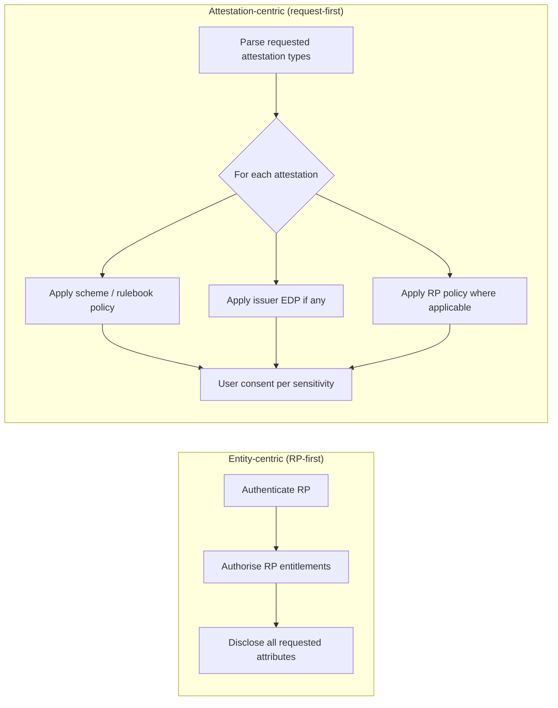

# Technical Report: Attestation-Centric Trust Evaluation in P2P and Proximity Flows

| Field | Value |
|-------|-------|
| **Status** | Draft technical report (non-normative) |
| **WP4 task** | Task 2 — Trust Framework |
| **Scope** | Shift from entity-centric to attestation-centric trust evaluation; P2P / proximity / wallet-to-wallet flows; multi-framework granularity; trust discovery implications |
| **Related WP4 docs** | [EUDI Wallet Trust and Entitlement Discovery](eudi-wallet-trust-and-entitlement-discovery.md), [Trusted List Extensions for Credential Issuers](../task3-x509-pki-etsi/trusted-list-extensions-credential-issuers.md), [Embedded Disclosure Policies](../task5-participants-policies/embedded-disclosure-policies-implementation.md), [Credential Catalogue](credential-catalogue.md), [Trusted List / Registration Trust Evaluation Matrix](trusted-list-registration-trust-evaluation-matrix.md) |
| **Primary normative sources** | EUDI ARF v2.9.0 (Topics 1, 6, 10, 12, 18, 24, 44, 52; Discussion Topic J), CIR (EU) 2024/2982, CIR (EU) 2025/848, CIR (EU) 2025/1569, ETSI TS 119 472-2, ETSI TS 119 475, ISO/IEC 18013-5 |

---

## 1. Purpose

This report develops and evidences a thesis about how **trust evaluation is moving away from a single “who is requesting?” decision** toward **per-attestation policy evaluation driven by what is being requested**.

The argument is especially visible in **peer-to-peer (P2P)**, **proximity**, and **wallet-to-wallet (W2W)** flows, where:

- the counterparty may not be a registered, federated Relying Party (RP);
- the sensitivity of the interaction depends on the **attestation type and attributes** requested, not only on the requester's identity;
- a single presentation can span **multiple attestation types** governed by **different trust frameworks**;
- wallets must evaluate **attestation-local policies** (issuer EDP, scheme rules, TL constraints) alongside — and sometimes instead of — RP registration artefacts (WRPAC / WRPRC).

This document is **informative**. Normative requirements remain in the cited specifications and in [EUDI Wallet Trust and Entitlement Discovery](eudi-wallet-trust-and-entitlement-discovery.md).

---

## 2. Executive summary

| Question | Short answer |
|----------|--------------|
| Is trust evaluation still “about the RP first”? | **Partially.** RP authentication (WRPAC) and registration (WRPRC / Registry) remain mandatory building blocks for **registered RPs**, but they are **not the only trust driver** and are **not always applicable** (W2W, optional WRPRC, uncovered attributes, offline proximity). |
| What triggers trust policy evaluation? | Increasingly, the **requested attestation type(s) and attributes** — each with its own rulebook, TL profile, issuer EDP, and scheme requirements. |
| Does age proof require a certified wallet or federated RP? | **Not for presentation to an RP in the general case.** WUA/KA are for **issuance** (`WUA_07`), not RP presentation. Low-stakes age attributes can be selectively disclosed from a PID; scheme-specific rules may relax RP registration requirements. |
| What changes for trust discovery? | Discovery becomes **multi-vector and attestation-indexed**: LoTL paths differ per credential class (PID, QEAA, PuB-EAA, non-qualified EAA); rulebook-defined anchors apply per scheme; EDP is stored **per attestation** for offline evaluation. |
| Main risk | Treating “known RP” as a universal gate produces **over-restriction** (blocking legitimate low-risk disclosures) or **under-protection** (assuming RP trust covers high-risk attestations). Both are implementation design failures. |

**Core thesis (informal):** *The object of the request precedes the subject of the request.* Trust is scoped to the **relationship implied by the attestation**, not only to the **identity of the requester**. If someone asks for a pencil, I may not trust them to return it; if they ask for “Hello”, I may answer without verifying who they are.

---

## 3. Conceptual shift: entity-centric vs attestation-centric

### 3.1 Entity-centric model (historical default)

In classical federated identity and early EUDIW trust documentation, the evaluation sequence is:

1. **Authenticate the requester** (WRPAC → Access CA LoTE).
2. **Authorise the requester** (WRPRC / Registry entitlements vs requested attributes — RPRC_21).
3. **Disclose attributes** if the user approves.

WP4 documents this as the primary holder-side flow in [§2.1 Discovery Sequence for Relying Party Interaction](eudi-wallet-trust-and-entitlement-discovery.md#21-discovery-sequence-for-relying-party-interaction) and UC-TE-04 ([Wallet Unit Evaluates Relying Party](../task1-use-cases/subtask1-2-trust-registry/wallet-unit-evaluates-relying-party.md)).

**Limitation:** Steps 1–2 evaluate **one counterparty identity** before considering **what** is asked. They assume a **registered RP audience** and a relatively uniform trust posture for all attributes in the request.

### 3.2 Attestation-centric model (emerging normative reality)

Normative requirements already **partition trust evaluation by attestation class**:

| Attestation class | Verifier trust mechanism | ARF reference |
| ----------------- | ------------------------ | ------------- |
| PID | PID Provider LoTE | OIA_12 / ISSU_07 |
| QEAA | National QTSP / QEAA TL (Art. 22 eIDAS) | OIA_13 / ISSU_08 |
| PuB-EAA | PuB-EAA Provider LoTE | OIA_14 / ISSU_09 |
| Non-qualified EAA | **Rulebook-defined mechanism(s)** | OIA_15 / ISSU_10, ARB_26 |

ARF explicitly notes that OIA_12–OIA_15 imply the verifier **must know the attestation type** and **store trust anchors per class** — verification is **keyed on the credential object**, not on a monolithic RP trust decision.

Additionally:

- **Embedded Disclosure Policies (EDP)** bind restrictions to **individual attestations** (EDP_06, EDP_10).
- **Catalogue of attestation schemes** (CIR 2025/1569 Art. 8) can specify **provider requirements per scheme**, including when WRPRC or equivalent issuer authorization applies — scheme-first, not RP-first ([§2.3.4](eudi-wallet-trust-and-entitlement-discovery.md#234-credential-catalogue-wrprc-policy-and-sector-authorities)).
- **Combined presentations** (ARF Topic 18) explicitly combine attributes from **separate attestations** in one transaction — forcing **parallel, per-type evaluation**.



---

## 4. Evidence catalogue

### 4.1 Normative: verification is attestation-type keyed

| ID | Evidence | Implication |
| -- | -------- | ----------- |
| **OIA_12–OIA_15** (note) | RP must distinguish PID / QEAA / PuB-EAA / non-qualified EAA and use **different trust anchors** at verification time | Verifier-side trust is **not one decision**; it is **N decisions** keyed on attestation type |
| **ISSU_07–ISSU_10** | Wallet validates received credentials using the matching LoTE / rulebook path per type | Holder-side issuance trust mirrors the same partition |
| **OIA_15 / ARB_26** | Non-qualified EAA trust anchors come from the **Attestation Rulebook**, not necessarily from EU RP federation | External / sector schemes can define **their own trust discovery** independent of WRPAC/WRPRC |
| **RPRC_23** | Wallet verifies attestation type is registered for provider (ISSU_24a / ISSU_34a) at **issuance** | Registration checks are **type-scoped**, not RP-scoped |
| **trusted-list-extensions** §Wallet and RP Behaviour | Validation reads **attestation type from credential**, then checks issuer ∈ TL and type ∈ `allowedAttestationType` | Trust chain resolution is **credential-driven** |

### 4.2 Normative: RP registration is optional and attribute-scoped

| ID | Evidence | Implication |
| -- | -------- | ----------- |
| **RPRC_09 / RPRC_13** | Registrar **MAY** issue WRPRC for RPs and providers | **Absence of WRPRC is legal**; wallet cannot assume registration artefacts exist |
| **RPRC_16** | User **chooses** whether wallet contacts Registrar (privacy trade-off) | RP identity verification is **user-configurable**, not always on |
| **RPRC_21** | When verified, requested attributes must be **in registered list** | When not verified, other paths apply (§4.3) |
| **§4.3.1 uncovered attributes** ([trust discovery doc](eudi-wallet-trust-and-entitlement-discovery.md#431-uncovered-attributes-and-user-autonomous-authorization)) | Attributes outside WRPRC → **user-autonomous** authorisation | **What** is requested can be disclosed **without RP registration coverage** if user explicitly approves |
| **§4.3.2 no WRPRC scenario** | Offline / no registry → **user default policy** applies to all requested attributes | Counterparty identity is **not resolved**; **request content** drives UX and defaults |

### 4.3 Normative: attestation-local disclosure policy (EDP)

| ID | Evidence | Implication |
| -- | -------- | ----------- |
| **EDP_06** | Wallet evaluates EDP **in conjunction with** RP information | Policy is **per attestation**, evaluated at presentation |
| **EDP_10** | EDP stored locally at issuance for **offline / proximity** evaluation | Trust policy travels **with the credential**, not with the RP federation |
| **EDP_02 / EDP_03** | Policies may restrict **which RP identifiers or trust roots** may receive **that attestation** | Issuer can override generic RP trust for **specific attestations** |
| **EDP_01** | EDP applies to QEAA / PuB-EAA / non-qualified EAA, **not PID** | Even within one presentation, **policy models differ per attestation** |

### 4.4 Legal / architectural: P2P and proximity

| Source | Evidence | Implication |
| ------ | -------- | ----------- |
| **[European Digital Identity Regulation](https://eur-lex.europa.eu/eli/reg/2024/1183/oj) Art. 5a(4)(c), 5a(5)(a)(vi)** | Wallets shall support **secure interaction between two wallets** | P2P is a **first-class** use case, not an RP special case |
| **CIR 2024/2982 Art. 5(5)** | Presentation-to-RP rules apply **mutatis mutandis** to **two wallet units in proximity** | Proximity P2P inherits presentation mechanics but **not necessarily full RP registration stack** |
| **ARF Topic J** ([Discussion Paper J](https://github.com/eu-digital-identity-wallet/eudi-doc-architecture-and-reference-framework/blob/main/docs/discussion-topics/j-wallet-to-wallet-interactions.md)) | Verifier is a **natural person** with a wallet; flow driven by **presentation offer / request**; Req 9–10 validate **peer wallet**, not Registrar | Counterparty is **not** a federated RP; **requested attestations** define the interaction |
| **Topic J §3.2 note** | Offline → revocation checks may fail; **flow continues** with user warning | Trust evaluation **degrades gracefully**; user judges risk from **what** is requested |
| **OIA_01** | Proximity + remote presentation flows supported | ISO 18013-5 proximity is in scope alongside OpenID4VP |
| **ARB_02** | Rulebooks **must** specify if proximity without internet is required | Some attestations are **designed for offline P2P** |

### 4.5 Wallet certification is not a universal presentation gate

| ID | Evidence | Implication |
| -- | -------- | ----------- |
| **WUA_07** | KA presented **only to PID / Attestation Providers at issuance**, **not to RPs** | **Certified wallet (WIA/KA) is not required** for RP or P2P **presentation** trust |
| **WUA_10a** | Non-device-bound attestations may **not require KA** at issuance | Further decouples “certified device” from many presentation scenarios |
| **ISSU_33b** | Wallet **SHALL support all** Attestation Providers (except optional SUA carve-out) | Ecosystem is **open** at issuance; protectionist wallet-side blocking is **non-compliant** |

### 4.6 WP4 issue resolutions (implementation landscape)

| Issue | Relevant finding |
| ----- | ---------------- |
| [#72](../task6-wallet-conformance-interop/issue-72-resolution.md) | WRPRC is **scheme-dependent**, not universal; catalogue defines when issuer authorization applies |
| [#75](../task6-wallet-conformance-interop/issue-75-resolution.md) | RP **accepted issuers** subset is **unspecified** — ecosystem TL validation is attestation-type keyed, not RP-configurable today |
| [#79](../task6-wallet-conformance-interop/issue-79-resolution.md) | Verifier trusts issuers via **TL + `allowedAttestationType`** — again **credential-object** evaluation |
| [#82](../task6-wallet-conformance-interop/issue-82-resolution.md) | Over-asking handled via **RPRC_21 additive** model; uncovered attributes fall to **user notification** |
| [#89](../task6-wallet-conformance-interop/issue-89-resolution.md) | EBW confidential access needs **per attestation × RP** matrices — granularity is **explicitly multi-dimensional** |

---

## 5. Worked example: age proof attestation

### 5.1 Scenario

A cinema door reader (possibly **not** a registered EUDIW RP — e.g. legacy ISO 18013 reader, foreign operator, or W2W verifier wallet) requests proof that the holder is over 18 before admitting them to a restricted screening.

### 5.2 What matters vs what does not

| Factor | Relevance to age proof | Evidence |
| ------ | ---------------------- | -------- |
| **Requested attribute** (`age_over_18`, `age_over_21`, …) | **Primary** — low sensitivity, selective disclosure | PID Rulebook PID_12; [§4.2 entitlement table](eudi-wallet-trust-and-entitlement-discovery.md#42-entitlement-to-attribute-mapping) lists Age Verification attributes |
| **Attestation type** (PID selective disclosure vs dedicated age EAA) | **Primary** — determines trust anchor path | OIA_12 vs OIA_15; different rulebooks / LoTEs |
| **RP WRPAC / WRPRC** | **Secondary or optional** — scheme may not require registration for this use | RPRC_09/13 optional; catalogue scheme requirements per §2.3.4 |
| **Certified wallet (WIA/KA)** | **Not required at presentation** | WUA_07 |
| **Federated RP in EUDIW registry** | **Not required** for user to disclose if they accept risk | §4.3.2 user default policy; Topic J offline note |
| **Issuer signature / device binding** | **Relevant** to verifier **if** they validate the credential — independent of RP federation | OIA_12 + OIA_17 device-binding verification |

### 5.3 Evaluation sequence (attestation-centric)

1. Wallet parses request → identifies **attestation type** (e.g. PID namespace attribute `age_over_18`).
2. Wallet classifies **sensitivity** (minimal personal data; no full identity).
3. If EDP exists on a dedicated age EAA → evaluate **attestation-local** policy (EDP_06).
4. If registered RP path applies → evaluate WRPAC/WRPRC **only for attributes where registration adds value** (RPRC_21 covered vs uncovered).
5. If counterparty is **W2W verifier** → apply Topic J checks (peer wallet validity, natural-person UX warnings) **without** full Registrar lookup.
6. User consent (RPA_07) with clear marking of **registration-based vs user-autonomous** attributes (§4.3.1 table).

**Conclusion for the example:** For age proof, **what is requested** (a boolean age threshold) activates a **low-friction trust policy**. **Who asks** (unknown reader, foreign RP, peer wallet) does not automatically block disclosure — regulation and ARF provide paths where **user judgment and attestation integrity** dominate over **RP federation membership**.

This matches the regulatory intent that wallets enable **everyday attribute sharing** (Art. 5a) including **between natural persons**, not only interactions with pre-registered legal entities.

---

## 6. Multi-attestation requests and multi-framework granularity

### 6.1 Combined presentations (Topic 18)

When one request combines, for example:

- `age_over_18` from a **PID** (EU PID LoTE path),
- a **QEAA** bank balance attestation (national QTSP TL),
- a **non-qualified EAA** membership card (rulebook-specific trust),

the wallet and verifier must run **independent trust evaluations** per item — different LoTE fetches, different rulebooks, different EDPs, potentially different WRPRC attribute coverage.

WP4 already models multi-step TL discovery in [§2.1 step 3](eudi-wallet-trust-and-entitlement-discovery.md#21-discovery-sequence-for-relying-party-interaction): *“Parse requested credential types from presentation request”* — plural **types**, before RP entitlement matching.

### 6.2 Granularity matrix

| Dimension | Example axes | Policy source |
| --------- | ------------ | ------------- |
| Attestation type | PID, QEAA, PuB-EAA, sector EAA | OIA_12–15, catalogues |
| Attribute / claim | `age_over_18` vs full PID vs IBAN | RPRC_21, user default, EBW confidential taxonomy ([#89](../task6-wallet-conformance-interop/issue-89-resolution.md)) |
| Issuer | Bank A vs Bank B | TL `allowedAttestationType`, EDP |
| Trust framework | EU LoTE vs national TL vs private rulebook | LoTL chaining, ARB_26 |
| Counterparty class | Registered RP vs intermediary vs W2W peer | WRPAC/WRPRC, RPI_07, Topic J |
| Connectivity | Online registry lookup vs offline proximity | EDP_10, §4.3.2, Topic J offline note |

**Implication:** A single “trust score” for the requester is **insufficient**. Implementations need an **attestation × attribute × framework × counterparty** evaluation tensor.

---

## 7. Implications for trust discovery patterns and vectors

This section addresses discovery architecture — including the **vectors** along which trust material is fetched (LoTL, Registrar, rulebook URI, in-band WRPRC, locally cached EDP, peer WUA). *Cross-reference: trust discovery pattern work in the WP4 / architecture stream (incl. @David Kelts).*

### 7.1 From single-vector to multi-vector discovery

**Legacy pattern (RP-vector dominant):**

```
Presentation Request → WRPAC → Access CA LoTE → WRPRC / Registry → User consent
```

**Emerging pattern (attestation-vector dominant):**

```
Presentation Request → parse {attestation_type[], attributes[]}
  For each attestation:
    → issuer TL / rulebook trust (OIA_12–15, ARB_26)
    → local EDP (EDP_10)
    → scheme catalogue constraints (CIR 2025/1569)
  Parallel RP-vector (when applicable):
    → WRPAC / WRPRC / Registry (RPRC_21)
  → merge results → user consent with per-attribute marking
```

### 7.2 Discovery vector catalogue

| Vector | What it resolves | When it dominates |
| ------ | ---------------- | ----------------- |
| **LoTL → role-specific LoTE** | Issuer trust for PID/QEAA/PuB-EAA | Verifier validates presented credential |
| **Rulebook trust URI (ARB_21/26)** | Non-qualified EAA issuer anchors | OIA_15 presentations; possibly **no EU RP federation** |
| **Registrar / Registry** | RP registered attributes & status | User opted in (RPRC_16) and online |
| **In-band WRPRC** | RP entitlements without live registry | Registered RP remote/proximity flows |
| **Embedded Disclosure Policy (cached)** | Issuer-mandated RP restrictions **per attestation** | Proximity / offline (EDP_10) |
| **Peer wallet attestation (WUA, Topic J)** | Counterparty is another wallet | W2W; **not** WRPAC-based RP auth |
| **User default policy** | Attributes when registration path absent | §4.3.2; low-trust / unknown requester |

### 7.3 Design principles (informative)

1. **Index discovery caches by attestation type and scheme**, not only by RP entity ID.
2. **Fetch RP-vector and attestation-vector in parallel**, merge with explicit precedence rules (avoid assuming RP trust implies issuer trust or vice versa).
3. **Pre-load attestation-local policies at issuance** (EDP_10) for offline-capable schemes (ARB_02).
4. **Expose per-attribute trust provenance in UX** (already required implicitly by §4.3.1 marking).
5. **Do not collapse multi-framework requests** into one TL lookup — OIA_12–15 forbid that on the verifier side.

---

## 8. P2P flow diagram (informative)

```mermaid
sequenceDiagram
    participant V as Verifier (person / reader / wallet)
    participant H as Holder Wallet
    participant P as Local policy store (EDP, defaults)

    V->>H: Presentation request (attestation types + attributes)
    Note over H: Parse request object (not RP profile first)
    H->>P: For each attestation: load scheme policy, EDP, sensitivity class
    alt Registered RP with WRPAC/WRPRC
        H->>H: RP-vector validation (parallel)
    else W2W / unknown / offline
        H->>H: Skip or degrade RP-vector; warn user
    end
    H->>H: Merge per-attestation decisions
    H->>V: Presentation (if user approves)
    Note over V: Verifier validates each credential via type-specific trust path (OIA_12–15)
```

---

## 9. Risks, threats, and anti-patterns

### 9.1 Open ecosystem hazards

As attestation types and rulebooks proliferate (catalogue growth, sector schemes, EBW, private EAAs), the wallet ecosystem becomes **composable and open by design** (ISSU_33b). That creates:

- **Policy implementation bugs** — wrong TL for attestation type, stale `allowedAttestationType`, missed EDP evaluation.
- **Conflicting precedence** — TL vs Registry vs rulebook (documented as unresolved in [trusted-list-extensions](../task3-x509-pki-etsi/trusted-list-extensions-credential-issuers.md) §Conflict Resolution).
- **UX consent fatigue** — users approving uncovered attributes without understanding framework boundaries.
- **Cross-framework correlation** — combined presentations (Topic 18) enabling linkage across contexts.

### 9.2 Protectionism as a design error

The following are ** inconsistent with the attestation-centric model** and likely to fail interoperability or regulation:

| Anti-pattern | Why it fails | Counter-evidence |
| ------------ | ------------ | ---------------- |
| Require certified wallet (WIA/KA) for all presentations | KA is issuance-only to providers | WUA_07 |
| Block presentation unless RP is in national registry | WRPRC optional; user-autonomous path exists | RPRC_09, §4.3.1 |
| Wallet accepts only “known RPs” for all attestation types | Ignores rulebook-scheme trust for non-qualified EAAs | OIA_15, ARB_26 |
| Single global issuer allow-list ignoring attestation type | Verifier must use type-specific anchors | OIA_12–15 note |
| Re-fetch EDP online during proximity presentation | Breaks offline requirement | EDP_10, ARB_02 |
| Treat W2W as full RP onboarding | Legal persons must not bypass RP rules via W2W abuse — but natural-person P2P is explicit scope | Topic J §3.3 |

**Protectionist shortcuts** (e.g. hard-coded RP allow-lists, wallet-vendor trust silos) may appear safer in year one but **encode the wrong abstraction**: they optimise for **who** at the expense of **what**, and break as soon as multi-scheme combined presentations arrive.

### 9.3 Legitimate controls (not protectionism)

- **Scheme-defined** RP requirements via catalogue (when legally specified).
- **Issuer EDP** restricting which RPs may receive **that attestation**.
- **User default deny** for high-sensitivity attributes when WRPRC absent.
- **Rate limits** on W2W (Topic J Req 12) to prevent RP masquerading.
- **Device-binding verification** (OIA_17) where attribute sensitivity warrants it.

---

## 10. Gaps and follow-up work (WP4)

| Gap | Suggested WP4 action |
| --- | -------------------- |
| No unified **attestation-centric evaluation profile** for wallets | Profile merging §2.1 RP sequence with per-attestation EDP / scheme / TL paths |
| **Precedence rules** when RP-vector and EDP conflict | Normative guidance beyond EDP_06 “in conjunction with” |
| **Combined presentation** trust UX | Extend Topic 18 analysis with multi-vector discovery worked examples |
| **W2W verifier trust** vs WRPAC model | Track ARF Topic J + presentation WUA discussions |
| **Sensitivity taxonomy** linking attributes → default policies | Connect PID age attributes, EBW confidential classes ([#89](../task6-wallet-conformance-interop/issue-89-resolution.md)), catalogue schemes |
| **Trust discovery pattern catalogue** | Document vectors (§7.2) as implementer checklist; align with architecture discovery work |

---

## 11. Conclusion

The EUDIW trust architecture **already embeds** an attestation-centric evaluation model:

- Verifiers **must** validate credentials **by type** (OIA_12–OIA_15).
- Wallets **must** support broad issuer access (ISSU_33b) with **type-specific** issuance trust.
- Issuers **may** attach **per-attestation** disclosure policies (EDP).
- RP registration artefacts are **optional**, **attribute-scoped**, and **user-gated**.
- P2P / proximity flows **explicitly** extend presentation rules without mandating a federated RP for every interaction.

What lags is **implementation mental model and discovery engineering**: many diagrams still show **one RP evaluation gate** before disclosure. Production wallets should treat **the presentation request’s attestation set** as the **primary input** to trust policy, with **RP identity as one parallel vector** whose weight depends on **attribute sensitivity, scheme rules, and counterparty class**.

As the catalogue grows, **trust discovery patterns must become attestation-indexed multi-vector pipelines** — or the ecosystem will oscillate between **unsafe over-sharing** and **protectionist non-interoperability**, both of which are avoidable design failures.

---

## 12. References

| Reference | Role |
| --------- | ---- |
| [EUDI ARF v2.9.0 — Topic 1 (OIA_*)](https://eudi.dev/2.9.0/annexes/annex-2/annex-2.02-high-level-requirements-by-topic/#a231-topic-1-accessing-online-services-with-a-wallet-unit) | Attestation-type keyed verifier validation |
| [EUDI ARF v2.9.0 — Topic 10 (ISSU_*)](https://eudi.dev/2.9.0/annexes/annex-2/annex-2.02-high-level-requirements-by-topic/#a2310-topic-10-issuing-a-pid-or-attestation-to-a-wallet-unit) | Wallet issuance validation; ISSU_33b openness |
| [EUDI ARF v2.9.0 — Topic 12 (ARB_*)](https://eudi.dev/2.9.0/annexes/annex-2/annex-2.02-high-level-requirements-by-topic/#a239-topic-12-attestation-rulebooks) | Rulebook trust mechanisms; proximity |
| [EUDI ARF v2.9.0 — Topic 18](https://eudi.dev/2.9.0/annexes/annex-2/annex-2.02-high-level-requirements-by-topic/#a2311-topic-18-combined-presentations-of-attributes) | Combined multi-attestation presentations |
| [EUDI ARF v2.9.0 — Topic 24](https://eudi.dev/2.9.0/annexes/annex-2/annex-2.02-high-level-requirements-by-topic/#a2314-topic-24-user-identification-in-proximity-scenarios) | Proximity identification |
| [EUDI ARF v2.9.0 — Topic 44 (RPRC_*)](https://eudi.dev/2.9.0/annexes/annex-2/annex-2.02-high-level-requirements-by-topic/#a2326-topic-44-registration-certificates-for-pid-providers-providers-of-qeaas-pub-eaas-and-non-qualified-eaas-and-relying-parties) | Optional WRPRC; RPRC_21 attribute allow-list |
| [EUDI ARF v2.9.0 — Topic 9 (WUA_*)](https://eudi.dev/2.9.0/annexes/annex-2/annex-2.02-high-level-requirements-by-topic/#a236-topic-9-wallet-unit-attestation-and-wallet-instance-attestation) | WIA/KA scope limited to issuance |
| [ARF Discussion Topic J — Wallet to Wallet](https://github.com/eu-digital-identity-wallet/eudi-doc-architecture-and-reference-framework/blob/main/docs/discussion-topics/j-wallet-to-wallet-interactions.md) | P2P flows, offline degradation |
| [CIR (EU) 2024/2982](https://eur-lex.europa.eu/legal-content/EN/TXT/?uri=CELEX:32024R2982) | W2W mutatis mutandis to proximity presentation |
| [CIR (EU) 2025/1569](https://eur-lex.europa.eu/legal-content/EN/TXT/?uri=OJ:L_2025001569) | Catalogues of attributes and schemes |
| [WP4 — EUDI Wallet Trust and Entitlement Discovery](eudi-wallet-trust-and-entitlement-discovery.md) | Holder-side discovery sequences, uncovered attributes |
| [WP4 — Trusted List Extensions for Credential Issuers](../task3-x509-pki-etsi/trusted-list-extensions-credential-issuers.md) | `allowedAttestationType`; validation steps |
| [WP4 — Embedded Disclosure Policies](../task5-participants-policies/embedded-disclosure-policies-implementation.md) | Per-attestation issuer policy |
| [WP4 — RPI Technical Report](rp-intermediary-openid4vp-technical-report.md) | Age verification RP example; dual identity evaluation |
