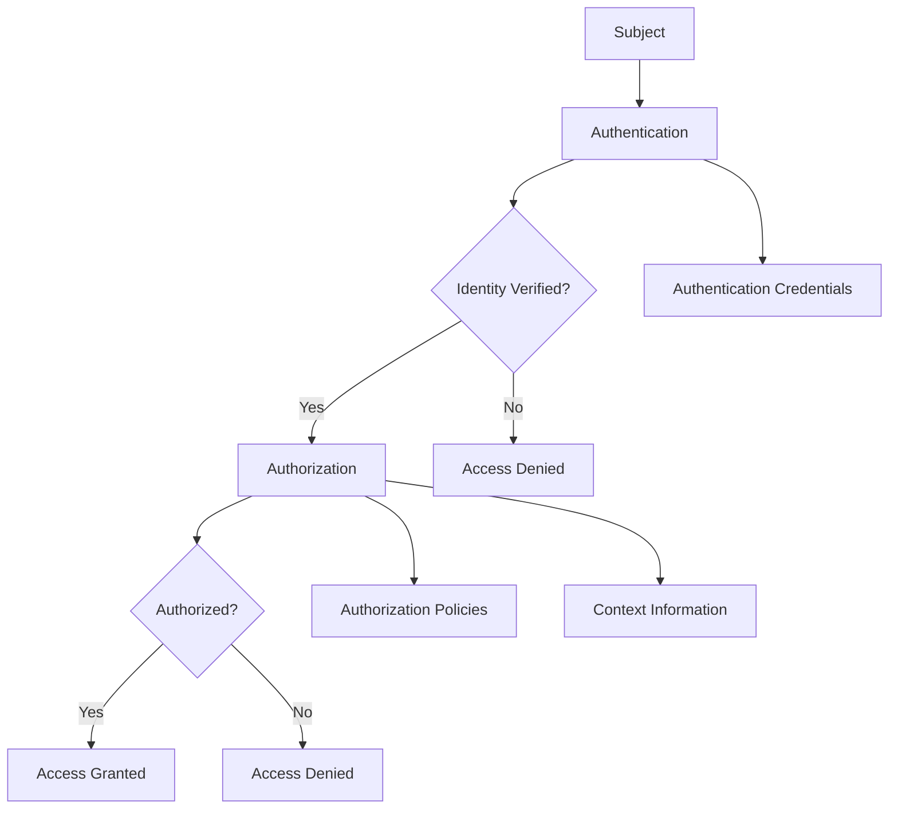

# Trust Framework: Authentication vs Authorization Policy Framework

## Executive Summary

This document aims to develop a framework for the distinction between authentication and authorization within general trust frameworks, explores the application of additive and subtractive policy principles in authorization mechanisms, and develops comprehensive use cases for trust participants (Credential Issuers, Wallet Solutions, and Relying Parties) in a general trust infrastructure context.

## Table of Contents

1. [Authentication vs Authorization Definitions](#authentication-vs-authorization-definitions)
2. [Policy Principles in Authorization](#policy-principles-in-authorization)
3. [Use Case Framework](#use-case-framework)
4. [Credential Issuer Use Cases](#credential-issuer-use-cases)
5. [Wallet Solution Use Cases](#Wallet-solution-use-cases)
6. [Relying Party Use Cases](#relying-party-use-cases)
7. [Policy Conflict Resolution](#policy-conflict-resolution)

## Authentication vs Authorization Definitions

### Authentication

**Definition**: The process of verifying the identity of a subject (User, system, or entity) to ensure they are who they claim to be within a trust framework.

**Key Characteristics**:
- **Identity Verification**: Confirms the subject's claimed identity
- **Trust Evidence Validation**: Validates authentication evidence (passwords, biometrics, trust assertions)
- **Trust Session Establishment**: Creates authenticated trust sessions
- **Trust Foundation**: Establishes the basis for subsequent authorization decisions

**Authentication Mechanisms in Trust Frameworks**:

- Knowledge-based (password, PIN, security questions)
- Possession-based (smart card, mobile device, hardware token)
- Inherence-based (fingerprint, face recognition, voice recognition)
- Trust-based (verifiable credential, trust assertion, federated identity)
- Blockchain-based (decentralized identity, self-sovereign identity, DID authentication)

### Authorization

**Definition**: The process of determining what actions a subject is permitted to perform or what resources they can access after successful authentication within a trust framework.

**Key Characteristics**:
- **Trust Permission Granting**: Determines what actions are allowed based on trust relationships
- **Resource Access Control**: Controls access to specific resources within the trust framework
- **Trust Policy Enforcement**: Applies trust rules and policies
- **Context-Aware Trust**: Considers trust context, purpose, and conditions

**Authorization Mechanisms in Trust Frameworks**:
- Trust-based access control (TBAC, trust level based, trust relationship based)
- Attribute-based access control (ABAC, trust attribute based, context aware)
- Federated access control (FAC, cross-domain trust, federated permissions)
- Policy-based access control (PBAC, trust policy enforcement, dynamic trust assessment)

### Relationship Between Authentication and Authorization

## Policy Principles in Authorization

### Additive Authorization Policy

#### Definition

**Additive Authorization**: Explicit allow-list model where permissions are granted only when explicitly authorized. Nothing is permitted unless explicitly allowed.

#### Characteristics

- **Default State**: Deny all access
- **Explicit Authorization**: Only explicitly granted permissions are allowed
- **Principle of Least Privilege**: Minimal necessary permissions
- **Security-First**: Conservative approach prioritizing security

#### Use Cases

- **High-Security Environments**: Government systems, financial services
- **Sensitive Data Handling**: Healthcare, personal data processing
- **Regulatory Compliance**: GDPR, EIDAS, PCI DSS environments
- **Zero-Trust Architectures**: Modern security frameworks

### Subtractive Authorization Policy

#### Definition

**Subtractive Authorization**: Explicit deny-list model where permissions are granted by default except for explicitly restricted items. Everything is permitted unless explicitly denied.

#### Characteristics

- **Default State**: Allow all access
- **Explicit Restrictions**: Only explicitly denied permissions are blocked
- **Flexibility-First**: Permissive approach prioritizing functionality
- **Exception-Based**: Focus on what is not allowed

#### Use Cases

- **Open Ecosystems**: Innovation platforms, research environments
- **Development Environments**: Testing, prototyping, sandbox environments
- **Collaborative Platforms**: Multi-tenant systems, shared resources
- **Rapid Deployment**: Agile development, quick iteration

## Use Case Framework

### Participant Authorization Semantics

#### Credential Issuer Authorization

Credential Issuer authorization defines semantics for credential types (VerifiableCredential, EUDIWalletCredential, OpenIDConnectCredential), credential purposes (authentication, identification, professional qualification), attribute groups, and scope restrictions (geographic, temporal, purpose).

#### Relying Party Authorization

Relying Party authorization defines semantics for purposes (authentication, authorization, service delivery, compliance), purpose classification (ATECO codes, business purpose), attribute requirements, and data processing scope (retention, processing purposes, consent requirements).

## Credential Issuer Use Cases

### Use Case 1: Additive Authorization for Credential Issuers

#### Scenario: Government Identity Credential Issuer

**Context**: A government agency authorized to issue national identity credentials using additive authorization policies. Authorization is configured for specific credential types (e.g., NationalIdentityCredential, ProfessionalQualificationCredential), authorized attribute groups, and scope restrictions (geographic, temporal, purpose).

#### Benefits of Additive Approach

1. **Collision Prevention**: Prevents bogus Credential Issuers from claiming authorization for credential types they're not authorized to issue
2. **Clear Authorization**: Explicit authorization for each credential type and attribute group
3. **Security**: Conservative approach minimizes unauthorized credential issuance
4. **Auditability**: Clear audit trail of what is authorized vs. what is requested

### Use Case 2: Subtractive Authorization for Credential Issuers

#### Scenario: Innovation Platform Credential Issuer

**Context**: An innovation platform that allows flexible credential issuance with subtractive authorization policies. Authorization restricts specific credential types (e.g., BiometricCredential, FinancialCredential, HealthCredential), restricted attribute groups, and defines compliance requirements and exceptions.

## Wallet Solution Use Cases

### Use Case 3: Wallet with Credential Offer Discovery

#### Scenario: EUDI Wallet with Embedded Discovery

**Context**: A Wallet solution that supports credential offer discovery and embedded discovery features. Authorization covers discovery methods (credential offer URI, embedded discovery, OpenID Connect discovery, well-known endpoints), authorized credential sources, and discovery validation requirements.

### Use Case 4: Wallet Holder with Credential Management

#### Scenario: Wallet Holder Managing Multiple Credentials

**Context**: A Wallet holder managing credentials from multiple issuers with different authorization policies. Holder authorization covers credential management actions, presentation control (selective disclosure, credential combination, presentation policy enforcement), and consent management (granular consent, consent withdrawal, consent audit trail).

## Relying Party Use Cases

### Use Case 5: Relying Party with ATECO Classification

#### Scenario: Software Development Company (ATECO 62.01.00)

**Context**: A software development company requesting User attributes for authentication and service delivery. Authorization includes business classification (ATECO 62.01.00), authorized purposes (user authentication, service delivery, customer support, billing), authorized attribute requests with retention and consent requirements, and data processing scope.

### Use Case 6: Healthcare Relying Party (ATECO 86.10.00)

#### Scenario: Healthcare Provider with Subtractive Authorization

**Context**: A healthcare provider with subtractive authorization policies for patient data access. Authorization includes business classification (ATECO 86.10.00), restricted purposes (marketing, profiling, automated decision making, commercial research), restricted attribute requests (biometric, genetic, mental health data) with exceptions, and compliance requirements.

## Policy Conflict Resolution

### Collision Prevention Mechanisms

#### Credential Type Collision Prevention

Collision prevention ensures each credential type is assigned to a single issuer. When a collision is detected (another issuer already holds the credential type), the request is denied. The trust registry maintains credential type assignments and supports revocation.

### Dispute Resolution Framework

The dispute resolution process includes: automated collision detection, stakeholder notification, mediation request, evidence collection, mediation decision, and appeal process. Resolution authorities include trust registry authority, federation mediation service, and regulatory authority. Evidence requirements cover authorization validation, policy compliance evidence, stakeholder consent, and regulatory approval.