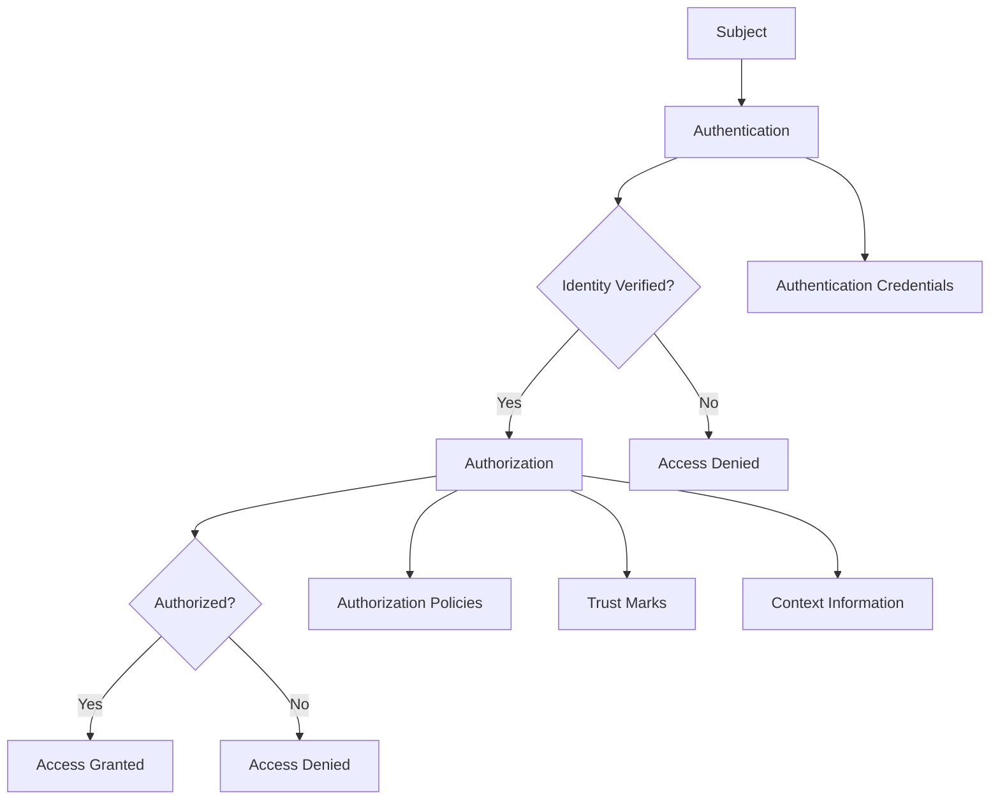
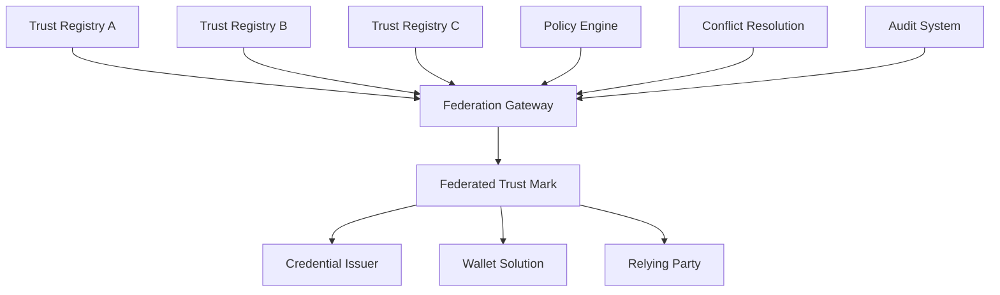

# Trust Framework: Authentication vs Authorization Policy Framework

## Executive Summary

This document defines the distinction between authentication and authorization within general trust frameworks, explores the application of additive and subtractive policy principles in authorization mechanisms, and develops comprehensive use cases for trust participants (Credential Issuers, Wallet Solutions, and Relying Parties) using federative trust marks in a general trust infrastructure context.

## Table of Contents

1. [Authentication vs Authorization Definitions](#authentication-vs-authorization-definitions)
2. [Policy Principles in Authorization](#policy-principles-in-authorization)
3. [Use Case Framework](#use-case-framework)
4. [Credential Issuer Use Cases](#credential-issuer-use-cases)
5. [Wallet Solution Use Cases](#wallet-solution-use-cases)
6. [Relying Party Use Cases](#relying-party-use-cases)
7. [Federative Trust Mark Implementation](#federative-trust-mark-implementation)
8. [Policy Conflict Resolution](#policy-conflict-resolution)

## Authentication vs Authorization Definitions

### Authentication
**Definition**: The process of verifying the identity of a subject (User, system, or entity) to ensure they are who they claim to be within a trust framework.

**Key Characteristics**:
- **Identity Verification**: Confirms the subject's claimed identity
- **Trust Evidence Validation**: Validates authentication evidence (passwords, biometrics, trust assertions)
- **Trust Session Establishment**: Creates authenticated trust sessions
- **Trust Foundation**: Establishes the basis for subsequent authorization decisions

**Authentication Mechanisms in Trust Frameworks**:
```json
{
  "authentication_methods": {
    "knowledge_based": ["password", "pin", "security_questions"],
    "possession_based": ["smart_card", "mobile_device", "hardware_token"],
    "inherence_based": ["fingerprint", "face_recognition", "voice_recognition"],
    "trust_based": ["verifiable_credential", "trust_assertion", "federated_identity"],
    "blockchain_based": ["decentralized_identity", "self_sovereign_identity", "did_authentication"]
  }
}
```

### Authorization
**Definition**: The process of determining what actions a subject is permitted to perform or what resources they can access after successful authentication within a trust framework.

**Key Characteristics**:
- **Trust Permission Granting**: Determines what actions are allowed based on trust relationships
- **Resource Access Control**: Controls access to specific resources within the trust framework
- **Trust Policy Enforcement**: Applies trust rules and policies
- **Context-Aware Trust**: Considers trust context, purpose, and conditions

**Authorization Mechanisms in Trust Frameworks**:
```json
{
  "authorization_models": {
    "trust_based_access_control": ["tbac", "trust_level_based", "trust_relationship_based"],
    "attribute_based_access_control": ["abac", "trust_attribute_based", "context_aware"],
    "federated_access_control": ["fac", "cross_domain_trust", "federated_permissions"],
    "policy_based_access_control": ["pbac", "trust_policy_enforcement", "dynamic_trust_assessment"]
  }
}
```

### Relationship Between Authentication and Authorization



## Policy Principles in Authorization

### Additive Authorization Policy

#### Definition
**Additive Authorization**: Explicit allow-list model where permissions are granted only when explicitly authorized. Nothing is permitted unless explicitly allowed.

#### Characteristics
- **Default State**: Deny all access
- **Explicit Authorization**: Only explicitly granted permissions are allowed
- **Principle of Least Privilege**: Minimal necessary permissions
- **Security-First**: Conservative approach prioritizing security

#### Implementation Pattern
```json
{
  "policy_type": "additive_authorization",
  "default_action": "deny",
  "authorized_actions": [
    {
      "action": "issue_credential",
      "credential_type": "VerifiableCredential",
      "subject": "credential_issuer_id",
      "conditions": {
        "trust_mark_required": true,
        "credential_schema_valid": true,
        "issuer_authorized": true
      },
      "scope_restrictions": {
        "credential_types": ["identity_credential", "professional_credential"],
        "attribute_groups": ["identity_attributes", "professional_attributes"],
        "purpose_scope": ["authentication", "identification"]
      }
    }
  ]
}
```

#### Use Cases
- **High-Security Environments**: Government systems, financial services
- **Sensitive Data Handling**: Healthcare, personal data processing
- **Regulatory Compliance**: GDPR, EIDAS, PCI DSS environments
- **Zero-Trust Architectures**: Modern security frameworks

### Subtractive Authorization Policy

#### Definition
**Subtractive Authorization**: Explicit deny-list model where permissions are granted by default except for explicitly restricted items. Everything is permitted unless explicitly denied.

#### Characteristics
- **Default State**: Allow all access
- **Explicit Restrictions**: Only explicitly denied permissions are blocked
- **Flexibility-First**: Permissive approach prioritizing functionality
- **Exception-Based**: Focus on what is not allowed

#### Implementation Pattern
```json
{
  "policy_type": "subtractive_authorization",
  "default_action": "allow",
  "restricted_actions": [
    {
      "action": "issue_credential",
      "credential_type": "BiometricCredential",
      "restriction_reason": "Privacy protection",
      "conditions": {
        "explicit_consent_required": true,
        "regulatory_approval_required": true,
        "data_protection_impact_assessment": true
      },
      "exceptions": ["law_enforcement", "national_security", "explicit_consent"]
    }
  ]
}
```

#### Use Cases
- **Open Ecosystems**: Innovation platforms, research environments
- **Development Environments**: Testing, prototyping, sandbox environments
- **Collaborative Platforms**: Multi-tenant systems, shared resources
- **Rapid Deployment**: Agile development, quick iteration

## Use Case Framework

### Trust Mark Semantics

#### Credential Issuer Trust Marks
```json
{
  "trust_mark_type": "credential_issuer_authorization",
  "semantics": {
    "credential_types": ["VerifiableCredential", "EUDIWalletCredential", "OpenIDConnectCredential"],
    "credential_purposes": ["authentication", "identification", "professional_qualification"],
    "attribute_groups": ["identity_attributes", "professional_attributes", "affiliation_attributes"],
    "scope_restrictions": {
      "geographic_scope": ["EU", "specific_countries"],
      "temporal_scope": "2024-01-01T00:00:00Z/2025-12-31T23:59:59Z",
      "purpose_scope": ["authentication", "identification", "service_delivery"]
    }
  }
}
```

#### Relying Party Trust Marks
```json
{
  "trust_mark_type": "relying_party_authorization",
  "semantics": {
    "purposes": ["authentication", "authorization", "service_delivery", "compliance"],
    "purpose_classification": {
      "ateco_code": "62.01.00",
      "ateco_description": "Computer programming activities",
      "business_purpose": "Software development and IT services"
    },
    "attribute_requirements": ["given_name", "email", "professional_qualification"],
    "data_processing_scope": {
      "retention_period": "30_days",
      "processing_purposes": ["user_authentication", "service_provision"],
      "consent_requirements": ["explicit_consent", "granular_consent"]
    }
  }
}
```

## Credential Issuer Use Cases

### Use Case 1: Additive Authorization for Credential Issuers

#### Scenario: Government Identity Credential Issuer
**Context**: A government agency authorized to issue national identity credentials using additive authorization policies.

**Trust Mark Configuration**:
```json
{
  "trust_mark_id": "gov_identity_issuer_additive_v1.0",
  "issuer": "https://trust-registry.gov.example.com",
  "subject": "https://identity-issuer.gov.example.com",
  "trust_mark_type": "credential_issuer_authorization",
  "policy_approach": "additive",
  "authorization_semantics": {
    "authorized_credential_types": [
      {
        "type": "NationalIdentityCredential",
        "schema": "https://schema.gov.example.com/national-identity",
        "purpose": "identity_verification",
        "attribute_groups": ["identity_attributes", "citizenship_attributes"]
      },
      {
        "type": "ProfessionalQualificationCredential",
        "schema": "https://schema.gov.example.com/professional-qualification",
        "purpose": "professional_verification",
        "attribute_groups": ["professional_attributes", "qualification_attributes"]
      }
    ],
    "authorized_attribute_groups": [
      "identity_attributes",
      "citizenship_attributes",
      "professional_attributes",
      "qualification_attributes"
    ],
    "scope_restrictions": {
      "geographic_scope": ["Italy"],
      "temporal_scope": "2024-01-01T00:00:00Z/2025-12-31T23:59:59Z",
      "purpose_scope": ["identity_verification", "professional_verification"]
    }
  },
  "conflict_resolution": {
    "collision_prevention": "unique_credential_type_authorization",
    "dispute_resolution": "trust_registry_mediation",
    "revocation_authority": "trust_registry_authority"
  }
}
```

**Policy Implementation**:
```python
class AdditiveCredentialIssuerPolicy:
    def __init__(self, trust_mark):
        self.trust_mark = trust_mark
        self.authorized_types = trust_mark["authorization_semantics"]["authorized_credential_types"]
        self.authorized_attributes = trust_mark["authorization_semantics"]["authorized_attribute_groups"]
    
    def evaluate_credential_issuance_request(self, request):
        # Check if credential type is explicitly authorized
        if not self.is_credential_type_authorized(request.credential_type):
            return {
                "decision": "deny",
                "reason": "Credential type not explicitly authorized",
                "required_authorization": "Add credential type to authorized_credential_types"
            }
        
        # Check if attribute groups are authorized
        if not self.are_attributes_authorized(request.attribute_groups):
            return {
                "decision": "deny",
                "reason": "Attribute groups not explicitly authorized",
                "required_authorization": "Add attribute groups to authorized_attribute_groups"
            }
        
        # Check scope restrictions
        if not self.is_within_scope(request):
            return {
                "decision": "deny",
                "reason": "Request outside authorized scope",
                "required_authorization": "Modify scope restrictions"
            }
        
        return {
            "decision": "allow",
            "reason": "All authorization requirements satisfied",
            "trust_mark_validation": "valid"
        }
    
    def is_credential_type_authorized(self, credential_type):
        return any(auth_type["type"] == credential_type for auth_type in self.authorized_types)
    
    def are_attributes_authorized(self, attribute_groups):
        return all(group in self.authorized_attributes for group in attribute_groups)
    
    def is_within_scope(self, request):
        scope = self.trust_mark["authorization_semantics"]["scope_restrictions"]
        return (
            request.geographic_scope in scope["geographic_scope"] and
            self.is_within_temporal_scope(request.timestamp, scope["temporal_scope"]) and
            request.purpose in scope["purpose_scope"]
        )
```

#### Benefits of Additive Approach
1. **Collision Prevention**: Prevents bogus credential issuers from claiming authorization for credential types they're not authorized to issue
2. **Clear Authorization**: Explicit authorization for each credential type and attribute group
3. **Security**: Conservative approach minimizes unauthorized credential issuance
4. **Auditability**: Clear audit trail of what is authorized vs. what is requested

### Use Case 2: Subtractive Authorization for Credential Issuers

#### Scenario: Innovation Platform Credential Issuer
**Context**: An innovation platform that allows flexible credential issuance with subtractive authorization policies.

**Trust Mark Configuration**:
```json
{
  "trust_mark_id": "innovation_platform_issuer_subtractive_v1.0",
  "issuer": "https://trust-registry.innovation.example.com",
  "subject": "https://credential-issuer.innovation.example.com",
  "trust_mark_type": "credential_issuer_authorization",
  "policy_approach": "subtractive",
  "authorization_semantics": {
    "restricted_credential_types": [
      {
        "type": "BiometricCredential",
        "restriction_reason": "Privacy protection",
        "exceptions": ["explicit_consent", "law_enforcement"]
      },
      {
        "type": "FinancialCredential",
        "restriction_reason": "Financial regulation compliance",
        "exceptions": ["licensed_financial_services"]
      },
      {
        "type": "HealthCredential",
        "restriction_reason": "Medical privacy protection",
        "exceptions": ["licensed_healthcare_providers"]
      }
    ],
    "restricted_attribute_groups": [
      "sensitive_personal_data",
      "special_category_data",
      "biometric_data"
    ],
    "compliance_requirements": [
      "explicit_consent_required",
      "data_protection_impact_assessment",
      "regulatory_approval_required"
    ]
  }
}
```

**Policy Implementation**:
```python
class SubtractiveCredentialIssuerPolicy:
    def __init__(self, trust_mark):
        self.trust_mark = trust_mark
        self.restricted_types = trust_mark["authorization_semantics"]["restricted_credential_types"]
        self.restricted_attributes = trust_mark["authorization_semantics"]["restricted_attribute_groups"]
    
    def evaluate_credential_issuance_request(self, request):
        # Check if credential type is explicitly restricted
        restriction = self.get_credential_type_restriction(request.credential_type)
        if restriction and not self.has_exception(request, restriction):
            return {
                "decision": "deny",
                "reason": f"Credential type restricted: {restriction['restriction_reason']}",
                "required_exception": restriction["exceptions"]
            }
        
        # Check if attribute groups are restricted
        restricted_attributes = self.get_restricted_attributes(request.attribute_groups)
        if restricted_attributes and not self.has_consent(request):
            return {
                "decision": "deny",
                "reason": "Restricted attribute groups require explicit consent",
                "required_consent": "explicit_consent_required"
            }
        
        return {
            "decision": "allow",
            "reason": "No restrictions violated",
            "trust_mark_validation": "valid"
        }
    
    def get_credential_type_restriction(self, credential_type):
        for restriction in self.restricted_types:
            if restriction["type"] == credential_type:
                return restriction
        return None
    
    def has_exception(self, request, restriction):
        return any(exception in request.exceptions for exception in restriction["exceptions"])
    
    def get_restricted_attributes(self, attribute_groups):
        return [group for group in attribute_groups if group in self.restricted_attributes]
    
    def has_consent(self, request):
        return request.consent and "explicit_consent" in request.consent
```

## Wallet Solution Use Cases

### Use Case 3: Wallet with Credential Offer Discovery

#### Scenario: EUDI Wallet with Embedded Discovery
**Context**: A wallet solution that supports credential offer discovery and embedded discovery features.

**Wallet Trust Mark Configuration**:
```json
{
  "trust_mark_id": "eudi_wallet_discovery_v1.0",
  "issuer": "https://trust-registry.wallet.example.com",
  "subject": "https://wallet.example.com",
  "trust_mark_type": "wallet_authorization",
  "policy_approach": "additive",
  "authorization_semantics": {
    "authorized_discovery_methods": [
      "credential_offer_uri",
      "embedded_discovery",
      "openid_connect_discovery",
      "well_known_endpoints"
    ],
    "authorized_credential_sources": [
      "trusted_credential_issuers",
      "federated_trust_registry",
      "verified_credential_networks"
    ],
    "authorized_credential_types": [
      "VerifiableCredential",
      "EUDIWalletCredential",
      "OpenIDConnectCredential"
    ],
    "discovery_validation": {
      "trust_mark_verification": true,
      "credential_issuer_verification": true,
      "schema_validation": true,
      "policy_compliance_check": true
    }
  }
}
```

**Discovery Implementation**:
```python
class WalletCredentialDiscovery:
    def __init__(self, trust_mark):
        self.trust_mark = trust_mark
        self.authorized_methods = trust_mark["authorization_semantics"]["authorized_discovery_methods"]
        self.authorized_sources = trust_mark["authorization_semantics"]["authorized_credential_sources"]
    
    def discover_credential_offers(self, discovery_request):
        # Validate discovery method is authorized
        if discovery_request.method not in self.authorized_methods:
            return {
                "decision": "deny",
                "reason": "Discovery method not authorized",
                "authorized_methods": self.authorized_methods
            }
        
        # Validate credential source is trusted
        if not self.is_credential_source_trusted(discovery_request.source):
            return {
                "decision": "deny",
                "reason": "Credential source not trusted",
                "authorized_sources": self.authorized_sources
            }
        
        # Perform discovery based on method
        if discovery_request.method == "credential_offer_uri":
            return self.discover_via_credential_offer_uri(discovery_request)
        elif discovery_request.method == "embedded_discovery":
            return self.discover_via_embedded_discovery(discovery_request)
        elif discovery_request.method == "openid_connect_discovery":
            return self.discover_via_openid_connect(discovery_request)
        
        return {
            "decision": "allow",
            "discovery_results": self.perform_discovery(discovery_request),
            "trust_validation": "passed"
        }
    
    def is_credential_source_trusted(self, source):
        return source in self.authorized_sources
    
    def discover_via_credential_offer_uri(self, request):
        # Implement credential offer URI discovery
        pass
    
    def discover_via_embedded_discovery(self, request):
        # Implement embedded discovery
        pass
    
    def discover_via_openid_connect(self, request):
        # Implement OpenID Connect discovery
        pass
```

### Use Case 4: Wallet Holder with Credential Management

#### Scenario: Wallet Holder Managing Multiple Credentials
**Context**: A wallet holder managing credentials from multiple issuers with different authorization policies.

**Holder Authorization Framework**:
```json
{
  "holder_authorization": {
    "credential_management": {
      "authorized_actions": [
        "store_credential",
        "present_credential",
        "revoke_credential",
        "update_credential_metadata"
      ],
      "authorized_credential_types": [
        "VerifiableCredential",
        "EUDIWalletCredential",
        "OpenIDConnectCredential"
      ]
    },
    "presentation_control": {
      "selective_disclosure": true,
      "credential_combination": true,
      "presentation_policy_enforcement": true
    },
    "consent_management": {
      "granular_consent": true,
      "consent_withdrawal": true,
      "consent_audit_trail": true
    }
  }
}
```

## Relying Party Use Cases

### Use Case 5: Relying Party with ATECO Classification

#### Scenario: Software Development Company (ATECO 62.01.00)
**Context**: A software development company requesting user attributes for authentication and service delivery.

**Relying Party Trust Mark Configuration**:
```json
{
  "trust_mark_id": "software_dev_rp_additive_v1.0",
  "issuer": "https://trust-registry.example.com",
  "subject": "https://software-dev.example.com",
  "trust_mark_type": "relying_party_authorization",
  "policy_approach": "additive",
  "authorization_semantics": {
    "business_classification": {
      "ateco_code": "62.01.00",
      "ateco_description": "Computer programming activities",
      "business_purpose": "Software development and IT services",
      "industry_sector": "Information Technology"
    },
    "authorized_purposes": [
      "user_authentication",
      "service_delivery",
      "customer_support",
      "billing_and_payments"
    ],
    "authorized_attribute_requests": [
      {
        "attribute_type": "given_name",
        "purpose": "user_authentication",
        "retention_period": "session_only",
        "consent_required": true
      },
      {
        "attribute_type": "email",
        "purpose": "service_delivery",
        "retention_period": "30_days",
        "consent_required": true
      },
      {
        "attribute_type": "professional_qualification",
        "purpose": "service_customization",
        "retention_period": "90_days",
        "consent_required": true
      }
    ],
    "data_processing_scope": {
      "processing_purposes": ["authentication", "service_provision", "customer_relationship"],
      "data_categories": ["identity_data", "contact_data", "professional_data"],
      "retention_policies": {
        "identity_data": "session_only",
        "contact_data": "30_days",
        "professional_data": "90_days"
      }
    }
  }
}
```

**Relying Party Policy Implementation**:
```python
class RelyingPartyAuthorizationPolicy:
    def __init__(self, trust_mark):
        self.trust_mark = trust_mark
        self.business_classification = trust_mark["authorization_semantics"]["business_classification"]
        self.authorized_purposes = trust_mark["authorization_semantics"]["authorized_purposes"]
        self.authorized_attributes = trust_mark["authorization_semantics"]["authorized_attribute_requests"]
    
    def evaluate_attribute_request(self, request):
        # Validate business purpose alignment
        if not self.is_purpose_authorized(request.purpose):
            return {
                "decision": "deny",
                "reason": "Purpose not authorized for this business classification",
                "authorized_purposes": self.authorized_purposes
            }
        
        # Validate attribute request
        attribute_authorization = self.get_attribute_authorization(request.attribute_type)
        if not attribute_authorization:
            return {
                "decision": "deny",
                "reason": "Attribute type not authorized",
                "authorized_attributes": [attr["attribute_type"] for attr in self.authorized_attributes]
            }
        
        # Validate purpose alignment
        if request.purpose not in attribute_authorization["purpose"]:
            return {
                "decision": "deny",
                "reason": "Attribute purpose not authorized",
                "authorized_purposes": attribute_authorization["purpose"]
            }
        
        # Validate consent requirements
        if attribute_authorization["consent_required"] and not request.consent:
            return {
                "decision": "deny",
                "reason": "Explicit consent required for this attribute",
                "consent_requirements": "explicit_consent_required"
            }
        
        return {
            "decision": "allow",
            "reason": "Attribute request authorized",
            "retention_period": attribute_authorization["retention_period"],
            "consent_validation": "passed"
        }
    
    def is_purpose_authorized(self, purpose):
        return purpose in self.authorized_purposes
    
    def get_attribute_authorization(self, attribute_type):
        for attr in self.authorized_attributes:
            if attr["attribute_type"] == attribute_type:
                return attr
        return None
```

### Use Case 6: Healthcare Relying Party (ATECO 86.10.00)

#### Scenario: Healthcare Provider with Subtractive Authorization
**Context**: A healthcare provider with subtractive authorization policies for patient data access.

**Healthcare Relying Party Trust Mark**:
```json
{
  "trust_mark_id": "healthcare_rp_subtractive_v1.0",
  "issuer": "https://trust-registry.healthcare.example.com",
  "subject": "https://healthcare-provider.example.com",
  "trust_mark_type": "relying_party_authorization",
  "policy_approach": "subtractive",
  "authorization_semantics": {
    "business_classification": {
      "ateco_code": "86.10.00",
      "ateco_description": "Hospital activities",
      "business_purpose": "Healthcare services and patient care",
      "industry_sector": "Healthcare"
    },
    "restricted_purposes": [
      "marketing",
      "profiling",
      "automated_decision_making",
      "commercial_research"
    ],
    "restricted_attribute_requests": [
      {
        "attribute_type": "biometric_data",
        "restriction_reason": "Medical privacy protection",
        "exceptions": ["medical_treatment", "emergency_care", "explicit_consent"]
      },
      {
        "attribute_type": "genetic_data",
        "restriction_reason": "Genetic privacy protection",
        "exceptions": ["genetic_counseling", "medical_research", "explicit_consent"]
      },
      {
        "attribute_type": "mental_health_data",
        "restriction_reason": "Mental health privacy protection",
        "exceptions": ["psychiatric_treatment", "counseling", "explicit_consent"]
      }
    ],
    "compliance_requirements": [
      "gdpr_compliance",
      "medical_privacy_protection",
      "explicit_consent_required",
      "data_protection_impact_assessment"
    ]
  }
}
```

## Federative Trust Mark Implementation

### Trust Mark Federation Architecture



### Federative Trust Mark Schema

```json
{
  "federative_trust_mark": {
    "trust_mark_id": "federative_credential_issuer_v1.0",
    "federation_identifier": "https://federation.trust.example.com",
    "participating_registries": [
      "https://trust-registry.eu.example.com",
      "https://trust-registry.us.example.com",
      "https://trust-registry.asia.example.com"
    ],
    "federation_policy": {
      "mutual_recognition": true,
      "cross_border_validity": true,
      "policy_harmonization": true,
      "dispute_resolution": "federation_mediation"
    },
    "credential_issuer_semantics": {
      "authorized_credential_types": [
        {
          "type": "VerifiableCredential",
          "federation_scope": "global",
          "local_restrictions": {
            "eu": ["identity_credential", "professional_credential"],
            "us": ["identity_credential", "education_credential"],
            "asia": ["identity_credential", "business_credential"]
          }
        }
      ],
      "attribute_groups": [
        "identity_attributes",
        "professional_attributes",
        "affiliation_attributes"
      ]
    },
    "relying_party_semantics": {
      "authorized_purposes": [
        "authentication",
        "authorization",
        "service_delivery"
      ],
      "ateco_classifications": [
        "62.01.00",
        "86.10.00",
        "70.21.00"
      ]
    }
  }
}
```

### Federation Policy Implementation

```python
class FederativeTrustMarkPolicy:
    def __init__(self, federative_trust_mark):
        self.federation_id = federative_trust_mark["federation_identifier"]
        self.participating_registries = federative_trust_mark["participating_registries"]
        self.federation_policy = federative_trust_mark["federation_policy"]
        self.credential_semantics = federative_trust_mark["credential_issuer_semantics"]
        self.rp_semantics = federative_trust_mark["relying_party_semantics"]
    
    def evaluate_federative_authorization(self, request, source_registry):
        # Validate source registry participation
        if source_registry not in self.participating_registries:
            return {
                "decision": "deny",
                "reason": "Source registry not participating in federation",
                "participating_registries": self.participating_registries
            }
        
        # Apply federation policy
        if request.type == "credential_issuance":
            return self.evaluate_credential_issuance_federation(request)
        elif request.type == "attribute_request":
            return self.evaluate_attribute_request_federation(request)
        
        return {
            "decision": "allow",
            "reason": "Federative authorization granted",
            "federation_validation": "passed"
        }
    
    def evaluate_credential_issuance_federation(self, request):
        # Check global authorization
        global_auth = self.check_global_authorization(request.credential_type)
        if not global_auth:
            return {
                "decision": "deny",
                "reason": "Credential type not authorized globally",
                "federation_scope": "global"
            }
        
        # Check local restrictions
        local_restrictions = self.get_local_restrictions(request.credential_type, request.region)
        if local_restrictions and request.credential_subtype not in local_restrictions:
            return {
                "decision": "deny",
                "reason": "Credential subtype not authorized in region",
                "region": request.region,
                "authorized_subtypes": local_restrictions
            }
        
        return {
            "decision": "allow",
            "reason": "Federative credential issuance authorized",
            "federation_scope": "global",
            "local_scope": request.region
        }
    
    def evaluate_attribute_request_federation(self, request):
        # Check purpose authorization
        if request.purpose not in self.rp_semantics["authorized_purposes"]:
            return {
                "decision": "deny",
                "reason": "Purpose not authorized in federation",
                "authorized_purposes": self.rp_semantics["authorized_purposes"]
            }
        
        # Check ATECO classification
        if request.ateco_code not in self.rp_semantics["ateco_classifications"]:
            return {
                "decision": "deny",
                "reason": "ATECO classification not authorized in federation",
                "authorized_classifications": self.rp_semantics["ateco_classifications"]
            }
        
        return {
            "decision": "allow",
            "reason": "Federative attribute request authorized",
            "federation_validation": "passed"
        }
```

## Policy Conflict Resolution

### Collision Prevention Mechanisms

#### Credential Type Collision Prevention
```python
class CredentialTypeCollisionResolver:
    def __init__(self, trust_registry):
        self.trust_registry = trust_registry
        self.credential_type_assignments = {}
    
    def resolve_credential_type_collision(self, credential_type, requesting_issuer):
        # Check if credential type is already assigned
        if credential_type in self.credential_type_assignments:
            assigned_issuer = self.credential_type_assignments[credential_type]
            if assigned_issuer != requesting_issuer:
                return {
                    "collision_detected": True,
                    "assigned_issuer": assigned_issuer,
                    "requesting_issuer": requesting_issuer,
                    "resolution": "deny_request",
                    "reason": "Credential type already assigned to another issuer"
                }
        
        # Assign credential type to requesting issuer
        self.credential_type_assignments[credential_type] = requesting_issuer
        return {
            "collision_detected": False,
            "assignment": "granted",
            "issuer": requesting_issuer,
            "credential_type": credential_type
        }
    
    def revoke_credential_type_assignment(self, credential_type, issuer):
        if credential_type in self.credential_type_assignments:
            if self.credential_type_assignments[credential_type] == issuer:
                del self.credential_type_assignments[credential_type]
                return {
                    "revocation": "successful",
                    "credential_type": credential_type,
                    "issuer": issuer
                }
        return {
            "revocation": "failed",
            "reason": "Credential type not assigned to issuer"
        }
```

### Dispute Resolution Framework

```json
{
  "dispute_resolution_framework": {
    "mediation_process": {
      "step_1": "automated_collision_detection",
      "step_2": "stakeholder_notification",
      "step_3": "mediation_request",
      "step_4": "evidence_collection",
      "step_5": "mediation_decision",
      "step_6": "appeal_process"
    },
    "resolution_authorities": [
      "trust_registry_authority",
      "federation_mediation_service",
      "regulatory_authority"
    ],
    "evidence_requirements": [
      "trust_mark_validation",
      "policy_compliance_evidence",
      "stakeholder_consent",
      "regulatory_approval"
    ]
  }
}
```

## Conclusion

This framework provides a comprehensive approach to authentication vs authorization, policy principles in authorization, and use cases for credential issuers, wallet solutions, and relying parties using federative trust marks. The key benefits include:

1. **Clear Distinction**: Clear separation between authentication and authorization
2. **Policy Flexibility**: Support for both additive and subtractive authorization approaches
3. **Use Case Coverage**: Comprehensive use cases for all major participants
4. **Federation Support**: Robust federative trust mark implementation
5. **Conflict Resolution**: Effective mechanisms for preventing and resolving policy conflicts

The framework ensures that bogus credential issuers cannot claim authorization for credential types they're not authorized to issue, while providing flexible policy management for different deployment scenarios.

## References

### Standards
- [EIDAS Regulation](https://eur-lex.europa.eu/eli/reg/2014/910/oj)
- [GDPR Regulation](https://eur-lex.europa.eu/eli/reg/2016/679/oj)
- [OpenID Federation 1.0](https://openid.net/specs/openid-federation-1_0.html)
- [W3C Verifiable Credentials](https://www.w3.org/TR/vc-data-model/)
- [ETSI EN 319 412-6](https://www.etsi.org/deliver/etsi_en/319400_319499/31941206/01.00.00_20/en_31941206v010000c.pdf)

### Related Documents
- [Policy Approaches Definition](policy-approaches-definition.md)
- [ETSI Policy Evaluation](etsi-policy-evaluation.md)
- [ETSI Policy Enumeration](etsi-policy-enumeration.md)
