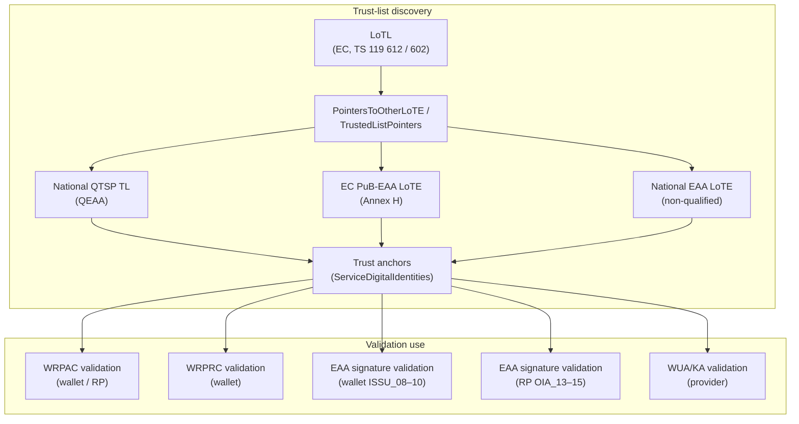
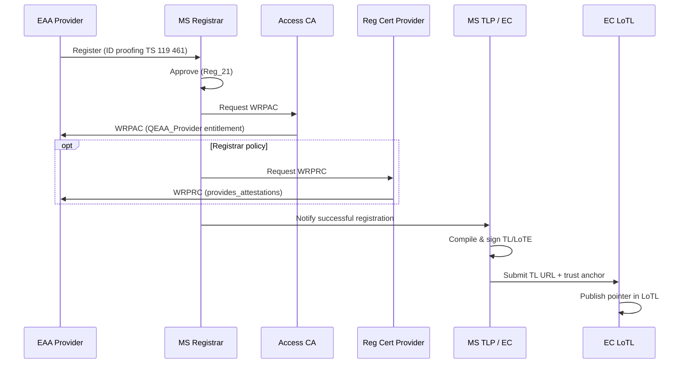
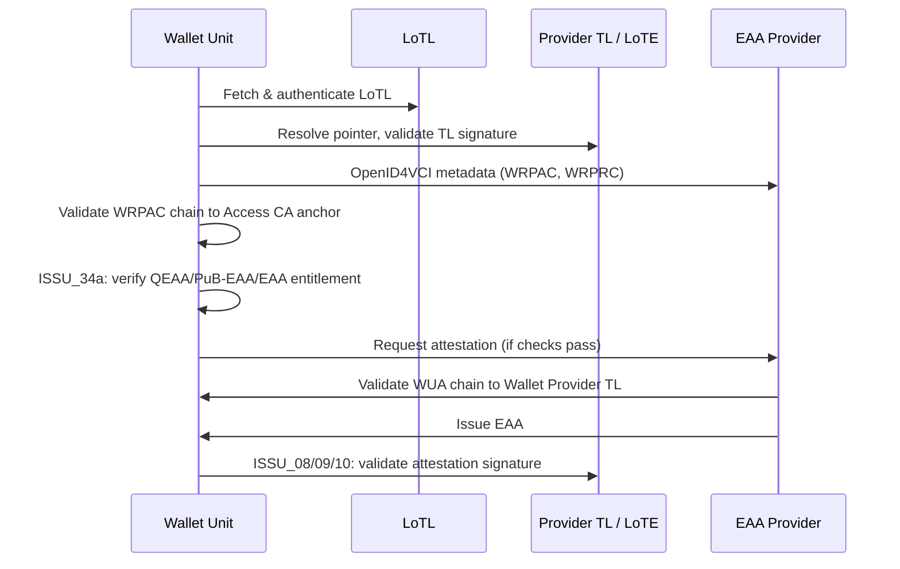
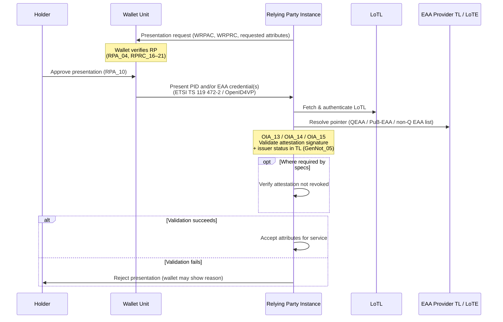

# EAA Provider Identity Verification Based on Chaining and LoTL

**Report date:** 29 May 2026  
**Sources:**

- Specifications corpus: `eidas-references-search-engine`
- Implementation profiles: `weBuild/wp4-trust-group` (WP4 Trust Group)

---

## Executive summary

In the European Digital Identity (EUDI) Wallet ecosystem, **electronic attestation of attributes (EAA)** providers must be trusted at several layers: legal registration, cryptographic credentials (access and registration certificates), publication in trusted lists, and—where applicable—qualified trust-service status under eIDAS.

This report synthesises normative material and WP4 profiles on **EAA provider identity verification** when it relies on **chaining** (trust-list discovery and X.509 path validation) and on the **List of Trusted Lists (LoTL)**—often referred to informally as “TLOL” in discussion, but **not** as an acronym in either repository (the canonical term is **LoTL**).

The central finding is that **“identity verification” is overloaded**: it can mean (1) verifying the **end-user** before issuing a QEAA, (2) verifying the **EAA provider’s entitlement** at registration, (3) verifying the **provider cryptographically** via certificate chains and trusted lists, (4) verifying the **wallet unit** before issuance, or (5) a **Relying Party (RP) inferring trust in the EAA issuer** from an attestation **presented by the wallet unit** (signature validation against the correct TL/LoTE via LoTL chaining). Chaining and LoTL primarily address layers (2), (3), and (5); certificate `x5c` chains and qualified-signature paths support layers (3), (4), and (5).

---

## 1. Terminology and scope

| Term | Meaning in this context |
|------|-------------------------|
| **EAA** | Electronic attestation of attributes — attestation in electronic form allowing attributes to be authenticated (eIDAS consolidated text). |
| **QEAA** | Qualified EAA, issued by a qualified TSP meeting Annex V. |
| **PuB-EAA** | EAA issued by or on behalf of a public-sector authentic source. |
| **EAA provider / Attestation Provider** | Entity issuing EAAs to wallet units; three entitlement classes in CIR (EU) 2025/848. |
| **LoTL** | **List of Trusted Lists** — EC-maintained aggregation of pointers to national and EU-level trusted lists (ETSI TS 119 612; ARF Topic 31). |
| **TLOL** | **Not used** as a normative acronym in either repository. This report treats **TLOL ≡ LoTL** where the topic is list-of-lists chaining. |
| **LoTE** | **List of Trusted Entities** (ETSI TS 119 602) — JSON/XML model for PuB-EAA and non-qualified EAA provider lists. |
| **Chaining** | Two distinct mechanisms: **(A) trust-list chaining** (LoTL → pointers → TLs → trust anchors) and **(B) certificate chaining** (`x5c` paths to a trust anchor per RFC 5280). |

---

## 2. EAA provider taxonomy

Three provider classes drive different trust paths:

| Class | Entitlement (ETSI TS 119 475) | Trusted-list basis | Compiler |
|-------|------------------------------|-------------------|----------|
| **QEAA Provider** | `QEAA_Provider` | Member State **national QTSP TL** (ETSI TS 119 612, eIDAS Art. 22) | Member State TLP |
| **Non-qualified EAA Provider** | `Non_Q_EAA_Provider` | National **LoTE** (TS 119 602 Annex H) where applicable; else MS registration policy | Member State TLP |
| **PuB-EAA Provider** | `PUB_EAA_Provider` | EC **PuB-EAA Providers LoTE** + Commission list (Art. 45f(3)) | European Commission |

WP4 maps LoTL pointer folders accordingly (`lotl/tl_entries/{tl_type}/`):

- `qeaa-provider` → TS 119 612 XML (`TSLType/EUgeneric`)
- `eaa-provider` → TS 119 602 Annex H (national non-qualified)
- `pub-eaa-provider` → TS 119 602 Annex H (`EUPubEAAProvidersList`)

**Important:** Annex H / `EUPubEAAProvidersList` does **not** replace national TS 119 612 lists for QEAA providers. QEAA trust anchors live on **Member State QTSP trusted lists**, not on the PuB-EAA LoTE profile.

---

## 3. Dimensions of “identity verification”

### 3.1 Subject identity at QEAA issuance (legal baseline)

When a **qualified TSP** issues a QEAA, it must verify the **natural or legal person** (and applicable attributes) — eIDAS **Article 24(1)**.

**Implementing Regulation (EU) 2025/1566** implements this for both qualified certificates and QEAAs, referencing **ETSI TS 119 461** (identity proofing).

This is **end-user** identity verification, not provider verification via LoTL.

### 3.2 Provider registration and vetting (operational identity)

Before an EAA provider participates:

1. **Register** with a Member State **Registrar** (ARF Topic 27; CIR 2025/848).
2. **Member State approval** per **Reg_21** (Attestation Providers) at a confidence level proportionate to risk (**Reg_22**).
3. **Identity proofing** at registration per **ETSI TS 119 461** (WP4: `eudi-wallet-trust-and-entitlement-discovery.md`).
4. Optional **registration certificate (WRPRC)** with entitlements and `provides_attestations[]` (ETSI TS 119 475).
5. **Access certificate (WRPAC)** from an Access Certificate Authority (ETSI TS 119 411-8).

ETSI TS 119 475 notes that identity proofing may already have been performed during registration, avoiding redundant steps when issuing WRPRCs to EAA providers.

### 3.3 Entitlement verification via trusted lists (CIR 2025/848 Annex III)

For **wallet-relying party registration**, documentary evidence for entitlements is:

| Entitlement | Verification source |
|-------------|---------------------|
| QEAA Provider (and other QTSP roles) | **National trusted lists** (eIDAS Art. 22) — Annex III point 1 |
| Non-qualified EAA Provider | National TL where applicable; else MS registration policies — point 2 |
| PuB-EAA Provider | **Commission list** (Art. 45f(3)) — point 4 |

This is the primary **legal hook** linking EAA **provider identity/entitlement** to **trusted-list chaining**.

### 3.4 Runtime verification by wallet units (ISSU_34 / ISSU_34a)

Before requesting attestation issuance, a wallet unit must:

- **ISSU_34:** Authenticate and validate the Attestation Provider **access certificate** against Access CA LoTE trust anchors.
- **ISSU_34a:** Confirm the provider is a registered **QEAA, PuB-EAA, or non-qualified EAA** provider via registration certificate, Registrar API, or metadata entitlements.

Post-issuance attestation trust uses separate requirements:

- **ISSU_08:** QEAA qualified signature + trust anchor from **QEAA Provider TL** (Art. 22).
- **ISSU_09:** PuB-EAA qualified signature + QTSP cert validation via Art. 22 TL + Art. 45f attributes.
- **ISSU_10:** Non-qualified EAA per applicable **Rulebook** (Topic 12).

### 3.5 Relying Party trust evaluation on presented EAAs (OIA_13–OIA_15)

After the holder approves a presentation, the **wallet unit** delivers PID and/or **EAA credentials** to the **Relying Party** (proximity or remote, per ETSI TS 119 472-2 / OpenID4VP). The RP does **not** re-run wallet-side issuer discovery (ISSU_34/34a); instead it **evaluates the presented credential itself** to establish trust in the **attestation issuer** (the EAA provider) and the integrity of the attributes.

| Attestation type | RP requirement | Trust anchor / list (via LoTL) |
|------------------|----------------|------------------------------|
| **QEAA** | Validate **qualified signature** per eIDAS Art. 32 (**OIA_13**) | Trust anchor from **QEAA Provider TL** (Member State QTSP TL, Art. 22) |
| **PuB-EAA** | Validate qualified signature per Art. 32; validate **QTSP certificate** via Art. 22 TL; verify **Art. 45f** certified attributes (**OIA_14**) | QTSP public key + national TL; PuB-EAA provider context on EC list / LoTE |
| **Non-qualified EAA** | Validate signature per mechanism in applicable **Rulebook** (**OIA_15**) | Rulebook-defined anchors: national **EAA LoTE** (via LoTL) **or** **OpenID Federation** trust marks, per applicable Rulebook (Topic 12) |

**Procedure (WP4 UC-TE-05):**

1. RP receives presented credential(s) from the wallet unit (presentation flow complete; user approved per RPA_10).
2. RP resolves the correct TL(s) through **LoTL chaining** (authenticate LoTL → follow pointer → validate TL signature → obtain trust anchors), per **ETSI TS 119 615**.
3. RP validates the **attestation signature** (and, for PuB-EAA, the **supporting QTSP certificate chain**) against those anchors.
4. RP checks **issuer entity status** in the TL (e.g. not `Invalid` after suspension/cancellation — **GenNot_05**).
5. Where specifications require it, RP verifies **attestation revocation** status.

At presentation time the RP trusts the **EAA provider as issuer** only indirectly: through the **cryptographic binding** between the presented credential and a **listed, qualified, and non-revoked** issuer on the appropriate trusted list—not through WRPAC/WRPRC of the EAA provider (those are used when the **wallet** evaluates the provider at **issuance**). Symmetrically, the wallet evaluates the **RP** (WRPAC/WRPRC, registry) before release; the RP evaluates the **credential issuer** after receipt.

**Presentation vs issuance — who validates what:**

| Phase | Evaluator | EAA-related check |
|-------|-----------|-------------------|
| **Issuance** (OpenID4VCI) | Wallet unit | ISSU_34/34a (provider access cert + registration); ISSU_08–10 (optional pre-storage validation) |
| **Presentation** (OpenID4VP / ISO 18013-5) | Wallet unit | RP authentication (WRPAC/WRPRC, RPRC_16–21) |
| **Presentation** (after delivery) | Relying Party | OIA_13–15 (attestation signature + TL anchor + revocation) |

See also: [UC-TE-05: Relying Party evaluates presented credentials](../task1-use-cases/subtask1-2-trust-registry/relying-party-evaluates-credentials.md), [Trust Infrastructure Schema §8](trust-infrastructure-schema.md#83-trust-evaluation-points).

---

## 4. Chaining mechanisms

### 4.1 Trust-list chaining (LoTL → TL → trust anchor)

**Consumption procedure** (normative): **ETSI TS 119 615** — authenticate LoTL, follow pointers, validate TL signatures using pointer-supplied `ServiceDigitalIdentities`, then use TL trust anchors for credential validation.

**WP4 LoTL producer** (`tools/lotl/`):

- Input: `lotl/tl_entries/{tl_type}/{participant_id}.json` with `tl_url`, `trust_anchor` (PEM), metadata.
- Output: LoTL JSON with `PointersToOtherLoTE` only (no inline entity list).
- Validation: `lote_validate.py` enforces pointer structure and whitelisted `LoTEType` URIs.

### 4.2 Certificate chaining (`x5c` → trust anchor)

Certificate chaining is **orthogonal** to LoTL chaining but converges at the **trust anchor**:

| Artifact | Chaining requirement | Anchor source |
|----------|---------------------|---------------|
| **WRPRC** (registration cert) | Validation data must allow building the **entire trust chain to the expected trust anchor** (CIR 2025/848 Annex IV) | Provider of registration certificates LoTE |
| **WRPAC** (access cert) | `x5c` in JAdES; path validation per RFC 5280 | Access CA LoTE |
| **WUA / KA** (wallet unit attestation) | Verify signing cert in `x5c` to anchor on **Wallet Provider TL** (ARF TS03) | EC Wallet Provider TL |
| **QEAA attestation** | Qualified signature path; issuer QTSP on national TL | Member State QTSP TL |
| **Presented EAA** (QEAA / PuB-EAA / non-Q) | RP validates attestation signature (and QTSP cert for PuB-EAA) on credential received from wallet | Same TL/LoTE as issuance-side validation (OIA_13–15) |

ARF TS02 additionally models provider notification with **X.509 certificate chains** and **service digital identities** per TS 119 612 clause 5.5.3.

For **presented** credentials, the attestation format (e.g. `dc+sd-jwt`, `mso_mdoc` per ETSI TS 119 472-2) embeds or references signature material; the RP builds the validation path from that material to the trust anchor discovered via LoTL, without contacting the EAA provider.

---

## 5. LoTL architecture for EAA providers

### 5.1 Publication responsibilities

From WP4 **Trust Infrastructure Schema**:

| Entity | Registration | TL publication | LoTL pointer |
|--------|-------------|----------------|--------------|
| QEAA Provider | MS Registrar | MS **QTSP TL** (TS 119 612) | `qeaa-provider` |
| Non-qualified EAA | MS Registrar | MS **EAA LoTE** (Annex H) | `eaa-provider` |
| PuB-EAA Provider | MS Registrar | EC **PuB-EAA LoTE** | `pub-eaa-provider` |

The **European Commission** maintains the LoTL with pointers to all published lists (ARF Topic 31; `trust-infrastructure-schema.md` §3).

### 5.2 ARF attestation catalogue trust model (TS11)

ARF Technical Specification 11 states:

> The trust model with providers of QEAAs, Pub-EAAs and PIDs is based on European Commission-managed **Lists of Trusted Lists** (ETSI TS 119 612), whereas **for non-qualified EAAs** the List of trusted entities (LoTE) data model (ETSI TS 119 602) **MAY** be used by EAA providers.

Catalogue metadata exposes `trustedAuthorities` / `isLoTE` so verifiers know whether to use LoTL (612) or LoTE (602).

### 5.3 Profile constraints (WP4 §7.3 — PuB-EAA / national EAA LoTE)

For Annex H lists (PuB-EAA and national non-qualified EAA):

- Mandatory `ServiceStatus` and `StatusStartingTime`
- `HistoricalInformationPeriod` = 65535
- Service types: `SvcType/PubEAA/Issuance`, `.../Revocation`
- Status: `SvcStatus/notified`, `SvcStatus/withdrawn`
- Max update interval: **6 months**
- Signatures: Compact JAdES B (JSON) or XAdES B (XML)

---

## 6. End-to-end flows

### 6.1 Onboarding → publication → discovery

### 6.2 Wallet issuance interaction

### 6.3 Relying Party presentation — trust in EAA via presented credential

After issuance and storage in the wallet, attributes are **released to an RP** only following user approval. The RP then validates the **presented** PID/EAA, establishing trust in the **EAA provider as issuer** through signature verification chained to LoTL-resolved trust anchors (not through a live call to the provider).

**Per attestation class (mirrors wallet ISSU_08–10, evaluator = RP):**

| Step | QEAA (OIA_13) | PuB-EAA (OIA_14) | Non-qualified EAA (OIA_15) |
|------|---------------|------------------|----------------------------|
| Trust discovery | National **QTSP TL** via LoTL (`qeaa-provider`) | **PuB-EAA LoTE** via LoTL + QTSP cert on **Art. 22 TL** | Per applicable **Rulebook** (Topic 12): **national EAA LoTE** via LoTL (`eaa-provider`) **or** **OpenID Federation** trust marks |
| Signature | Qualified signature per Art. 32 | Qualified signature + QTSP cert chain | Per Rulebook (Topic 12) |
| Extra checks | Issuer status; revocation if required | Art. 45f certified attributes; revocation if required | Issuer status where applicable; revocation per rulebook |

**Non-qualified EAA and LoTL:** A national non-qualified EAA provider **does not always** need to appear on the LoTL. ARF TS11 states that the LoTE data model **MAY** be used for non-qualified EAAs; the applicable **Attestation Rulebook** (Topic 12) defines which trust mechanism(s) apply. When the Rulebook specifies a **national EAA LoTE**, the Member State TLP publishes that list and submits its URL to the EC for inclusion in the LoTL (`eaa-provider` pointer) — the same LoTL-chaining procedure as for QEAA and PuB-EAA. When the Rulebook specifies another mechanism (e.g. **OpenID Federation**), verifiers resolve trust anchors through that mechanism instead of LoTL chaining.

**WP4 pilot — Rulebook mechanism:** In the pilot, both **LoTE** (discovered via LoTL) and **OpenID Federation** are supported as Rulebook-defined trust mechanisms for non-qualified EAAs. The LoTEs or Federations used in the pilot **must be provided by WP4 participants** that operate components of the trust infrastructure (e.g. MS TLPs, EC LoTL publication, or trust-registry / federation operators).

The **catalogue** (`trustedAuthorities` in ARF TS11) may be used by RPs or verifier components to select the correct LoTL pointer, federation trust mark, or trust scheme for a given attestation type before performing OIA_13–15 validation.

---

## 7. Normative reference map

### 7.1 Legal and implementing acts (`eidas-references-search-engine`)

| Instrument | Relevance |
|------------|-----------|
| eIDAS (EU) 910/2014 — Art. 22, 24, 32, 45f | Trusted lists; subject ID at QEAA issuance; qualified signature validation; PuB-EAA list |
| CIR (EU) 2025/848 | WRP registration; Annex III entitlement sources; trust chain for WRPRC |
| CIR (EU) 2025/1566 | Identity verification for QC/QEAA issuance (TS 119 461) |
| CIR (EU) 2025/1569 | EAA issuance to wallets; authentic-source checks |
| CIR (EU) 2024/2977 | EAA provider authentication (WRPAC); wallet unit verification before issuance |
| CIR (EU) 2024/2981 | Security requirement: wallet must verify QEAA from registered qualified TSP |
| Decision (EU) 2025/2164 | TL template update for QEAA as qualified service; TS 119 612 v2.4.1 |

### 7.2 ETSI and ARF standards

| Standard | Role |
|----------|------|
| ETSI TS 119 612 | XML trusted lists; LoTL structure; QTSP/QEAA |
| ETSI TS 119 602 | LoTE data model; Annex H PuB-EAA profile |
| ETSI TS 119 615 | LoTL/TL authentication and consumption procedures |
| ETSI TS 119 461 | Identity proofing at registration / QEAA issuance |
| ETSI TS 119 475 | WRPAC/WRPRC attributes and entitlements |
| ETSI TS 119 411-8 | Access certificate policy |
| ETSI TS 119 472-2 | EAA/PID **presentation** profiles (credential delivery to RP) |
| ETSI TS 119 472-3 | Credential issuer metadata (registration cert by value) |
| ARF TS03 | WUA/KA `x5c` chaining to Wallet Provider TL |
| ARF TS11 | Catalogue `trustedAuthorities`; LoTL vs LoTE per attestation type |

### 7.3 WP4 profiles (`wp4-trust-group`)

| Document | Role |
|----------|------|
| `task2-trust-framework/trust-infrastructure-schema.md` | Who publishes which TL; QEAA vs PuB-EAA vs non-Q split |
| `task2-trust-framework/trusted-list-registration-trust-evaluation-matrix.md` | ISSU_08–10, ISSU_34/34a, OIA_13–15 |
| `task3-x509-pki-etsi/etsi_trusted_lists_implementation_profile.md` | Unified TS 119 612/602/615 binding; §7.3 PuB-EAA |
| `task4-trust-infrastructure-api/lotl-automation-and-tl-integration.md` | LoTL automation, `tl_entries` layout |
| `task5-participants-certificates-policies/eaa_provider_*_certificate.md` | WRPAC/WRPRC examples for three entitlements |
| `task1-use-cases/.../pid_eaa_provider_onboarding.md` | Onboarding flows and trust-chain requirements |
| `task1-use-cases/subtask1-2-trust-registry/relying-party-evaluates-credentials.md` | UC-TE-05: RP validates presented EAA/PID (OIA_13–15) |
| `task2-trust-framework/eudi-wallet-trust-and-entitlement-discovery.md` | Presentation vs issuance discovery flows |

---

## 8. Gaps, ambiguities, and ARF–ETSI alignment notes

| Issue | Description |
|-------|-------------|
| **TLOL vs LoTL** | No normative “TLOL” string; use **LoTL** in implementations and documentation. |
| **Overloaded “identity verification”** | Legal, registration, cryptographic, end-user, **wallet-at-issuance**, and **RP-at-presentation** meanings coexist; implementers must map controls to the correct layer (see §3.4 vs §3.5). |
| **ARF vs ETSI on EAA registration** | ARF Topic 27 requires all attestation providers to register with a Registrar; **TS 119 602 does not define EAA/QEAA provider registration as attestation providers** — only PuB-EAA via Annex H. **TS 119 612** covers QEAA as trust services. WP4 documents this mismatch explicitly. |
| **Wallet QEAA validation algorithm** | CIR 2024/2981 states the security goal; step-by-step “registered to issue this attestation type” logic is distributed across ARF, OpenID4VP, and ETSI validation specs. |
| **ETSI TS 119 602 in spec corpus** | Referenced in ARF TS11 but not fully mirrored in `eidas-references-search-engine/referenced-standards/` (draft/issue link only). |
| **LoTL pilot coverage** | WP4 `lotl/tl_entries/` currently has only `wrpac-provider` populated; EAA/QEAA/PuB-EAA folders are defined but largely empty. |
| **Precedence TL vs WRPRC** | Proposed: TL canonical for RP presentation (OIA_12–15); registry/WRPRC for wallet issuance (ISSU_34a) — not fully harmonised in law. |

---

## 9. Conclusions

1. **EAA provider identity verification** in the EUDI Wallet is not a single check but a **stack**: MS registrar vetting and TS 119 461 proofing → publication of trust anchors in the correct TL/LoTE → LoTL-mediated discovery → runtime validation of WRPAC/WRPRC (wallet, at issuance) and **attestation signatures** (wallet at storage and **RP at presentation**) via **chained** trust material.

2. **LoTL chaining** answers: *Which signed list should I trust, and with which anchor?* It routes **wallet units and Relying Parties** to the correct national QTSP list (QEAA), EC PuB-EAA list, or — where the applicable Rulebook specifies LoTE — national non-qualified EAA LoTE. For non-qualified EAAs whose Rulebook defines **OpenID Federation** instead, trust discovery follows federation trust marks rather than LoTL pointers.

3. **Certificate chaining** answers: *Does this presented credential chain to an anchor I already trust from those lists?* It applies to WRPAC, WRPRC, WUA, and **QEAA/PuB-EAA/non-Q EAA signature validation**—including when the RP validates a credential **received from the wallet** after presentation (OIA_13–15).

4. **QEAA providers** are dual nature: they **register** as attestation providers (ARF) and appear on **national QTSP trusted lists** (eIDAS Art. 22), not on the PuB-EAA Annex H LoTE profile.

5. **Presentation is symmetric to issuance for trust lists**: the wallet uses TL/LoTE + registry to trust the **RP** before release; the RP uses the **same TL/LoTE ecosystem** to trust the **EAA issuer** on the presented credential after receipt—without re-using the EAA provider’s WRPAC/WRPRC in that step.

6. WP4 profiles operationalise the standards split (612 vs 602, LoTL automation, §7.3 Annex H) but pilots remain **partially populated** for EAA-specific LoTL entries.

---

## 10. Primary source pointers

### Specifications corpus (`eidas-references-search-engine`)

- `regulation/eidas-consolidated/eidas-consolidated.md` — definitions, Art. 22/24, Annex V
- `implementing-acts/2025-848/2025-848.md` — Annex III entitlements, trust chain for WRPRC
- `implementing-acts/2025-1566/2025-1566.md` — subject identity at QEAA issuance
- `implementing-acts/2025-1569/2025-1569.md` — EAA issuance procedures
- `referenced-standards/standards/ARF/TS11-V1.0.1/TS11-V1.0.1.md` — catalogue trust model
- `referenced-standards/standards/ARF/TS03-V1.5.1/TS03-V1.5.1.md` — WUA certificate chaining

### WP4 profiles (`wp4-trust-group`)

- `task2-trust-framework/trust-infrastructure-schema.md`
- `task2-trust-framework/trusted-list-registration-trust-evaluation-matrix.md`
- `task3-x509-pki-etsi/etsi_trusted_lists_implementation_profile.md` (§7.3)
- `task4-trust-infrastructure-api/lotl-automation-and-tl-integration.md`
- `task5-participants-certificates-policies/eaa_provider_access_certificate.md`
- `task5-participants-certificates-policies/eaa_provider_registration_certificate.md`
- `task1-use-cases/subtask1-2-trust-registry/relying-party-evaluates-credentials.md` — UC-TE-05 (OIA_13–15)

---

*This report is descriptive synthesis for engineering and compliance planning; it does not constitute legal advice.*
