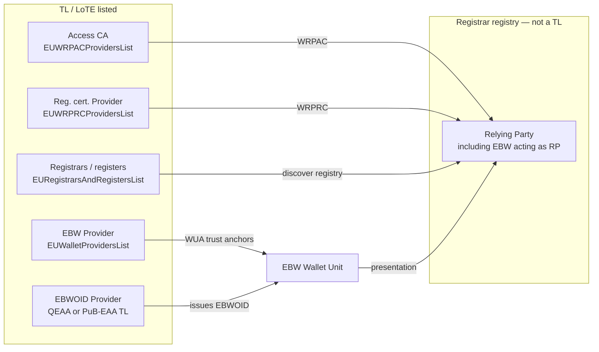

# European Business Wallet in the WP4 Trust Framework

This document is the WP4 Trust Group view of the **European Business Wallet (EBW)** for **trust framework, trust evaluation, Trusted Lists, and registration**. It does not specify wallet UX, QERDS transport, or mandate-management protocol. Those belong to the [WE BUILD Architecture Blueprint (D4.1)](https://webuild-consortium.github.io/wp4-architecture/blueprint/blueprint.html) and to implementing acts that do not yet exist.

Use cases that apply this model: **[UC-TE-07](../task1-use-cases/subtask1-2-trust-registry/european-business-wallet-trust-evaluation.md)**. Terms: **[Consolidated Terms and Entity Definitions](../task1-use-cases/terms-and-entities.md)**.

## Status of the legal instrument

The EBW is **not** an implementing act under eIDAS 2. It is a **separate proposed Regulation**:

| Instrument | Reference | Status (21 September 2026) |
|------------|-----------|----------------------------|
| Commission proposal | [COM(2025) 838 final](https://eur-lex.europa.eu/legal-content/EN/TXT/?uri=CELEX:52025PC0838), procedure **2025/0358(COD)** | Published 19 November 2025 |
| Annex (minimum functionalities / technical requirements) | COM(2025) 838 annex | Part of the proposal |
| Staff Working Document | [SWD(2025) 837](https://eur-lex.europa.eu/LexUriServ/LexUriServ.do?uri=SWD:2025:0837:FIN:EN:PDF) | Accompanying analysis (no full impact assessment) |
| Council general approach | [ST 7659/26](https://data.consilium.europa.eu/doc/document/ST-7659-2026-INIT/en/pdf) | Adopted **9 June 2026** |
| European Parliament | ITRE dossier 2025/0358(COD) | Awaiting committee decision (draft report + 614 amendments; IMCO/JURI opinions June 2026) |

Until the Regulation is adopted and implementing acts exist, **WP4 pilots EBW trust on the EUDI Wallet trust infrastructure** (same LoTE types, same WRPAC/WRPRC/Registry stack). Pilot listing of an “EBW solution” is a **Wallet Provider** listing, not a production EBW-provider notification under COM(2025) 838.

The [EUDI Wallet ARF](https://eudi.dev/3.0.0/architecture-and-reference-framework-main/) states that **Wallet Units for legal persons (and legal-person PID) were removed from the ARF** in view of a separate business wallet. WP4 therefore treats EBW as a **parallel holder type** that reuses EUDI trust artefacts, not as an ARF natural-person Wallet Unit.

## What the EBW is (trust-relevant subset)

An EBW is a digital solution for **economic operators and public sector bodies** to store, manage, and present **owner identification data** and electronic attestations of attributes, to create and delegate **mandates**, and to use qualified signatures, seals, timestamps, and qualified electronic registered delivery (QERDS).

| | **EUDI Wallet** | **European Business Wallet** |
|---|---|---|
| Holder | Natural person | Legal person / economic operator / public sector body |
| Core identity attestation | **PID** | **EBWOID** (owner identification data; predecessor term **LPID**) |
| Primary identifier | National unique identifier in PID | **EUID** where assigned (Company Law / AML); otherwise a designated **national register number** |
| Trust framework used in WP4 | ARF + CIR implementing acts | Same EUDI artefacts **until** EBW implementing acts exist |
| Listing of the wallet solution | `EUWalletProvidersList` | **Same LoTE** in WP4 (onboarding flag distinguishes the product) |
| Legal effect of wallet actions | eIDAS 2 | Proposed **principle of equivalence** (Council: national administrative requirements still apply) |

**WP4 in-scope functions** (trust evaluation can be specified today):

1. Listing and validating **EBW Wallet Providers**.
2. Issuing and validating **EBWOID** as a QEAA or PuB-EAA.
3. EBW **Wallet Unit** evaluating credential issuers and relying parties (WRPAC / WRPRC / Registry / LoTL).
4. Credential issuers evaluating the **EBW unit** (wallet unit attestation).
5. Relying parties (including another EBW) evaluating presented EBWOID and bound attestations.
6. Registrar / national-register **discovery** via `EURegistrarsAndRegistersList`.

**WP4 out of scope until architecture / implementing acts land**: European Digital Directory (EDD) as a trust source; QERDS addressing; legal-equivalence of seals/submissions; third-country EBW recognition; Commission risk assessment of EBW providers (Council Article 7/11 track).

## Terminology used in this repository

| Term | Meaning in WP4 |
|------|----------------|
| **EBW** | European Business Wallet (the wallet solution / unit for a legal person or economic operator). |
| **EBW Provider** | Wallet Provider whose listed solution is an EBW. **Not** a separate ETSI LoTE type in TS 119 602. |
| **EBWOID** | European Business Wallet Owner Identification Data — stable, minimal identity attributes for the organisation (legal name + EUID or national register code). Issued as an electronic attestation of attributes. WE BUILD Blueprint D4.1 replaces the earlier **LPID** concept with this term. |
| **EBWOID Provider** | Attestation provider (QEAA Provider or PuB-EAA Provider) that issues EBWOID from authentic sources (typically business registers). **Not** the LoTL folder `ebwoid-provider`. |
| **LPID** | Legal Person Identification Data — EWC/LSP predecessor of EBWOID. Schema id may remain `LPID` for compatibility ([EWC RFC 005](https://github.com/EWC-consortium/eudi-wallet-rfcs/blob/main/ewc-rfc005-issue-legal-person-identification-data.md), [EWC rb001](https://github.com/EWC-consortium/eudi-wallet-rulebooks-and-schemas/blob/main/rulebooks/rb001-legal-person-identification-data.md)). |
| **`ebwoid-provider` (folder)** | WE BUILD **pipeline name** for LoTL entries of type **`EURegistrarsAndRegistersList`** (ETSI TS 119 602 Annex I). It is **not** an EBWOID-issuer list and **not** an ETSI type `EBWOIDProvidersList` (that type does not exist). |

## Trust model: entities and listing paths

### Responsibilities (pilot vs production)

| Entity | WP4 MVP (pilot) | Production EUDI path (today) | Production EBW Regulation (proposed) |
|--------|-----------------|------------------------------|--------------------------------------|
| **EBW Provider** | Listed by WP4 as Wallet Provider ([UC-03](../task1-use-cases/subtask1-1-onboarding/wallet-provider-onboarding.md)); solution type = EBW | MS notifies Wallet Provider to Commission; **EUWalletProvidersList** (CIR 2025/849 unique reference) | Separate **trusted list of EBW providers** and notification under the EBW Regulation (not implemented in WP4) |
| **EBWOID Provider** | Onboarded as Attestation Provider ([UC-02](../task1-use-cases/subtask1-1-onboarding/pid_eaa_provider_onboarding.md)); attestation type = EBWOID/LPID | QEAA: national QTSP TL (eIDAS Art. 22). PuB-EAA: EC-compiled LoTE. Entitlement via Registry / registration certificate | Same authentic-source / QTSP model; Commission may issue owner ID for Union entities |
| **EBW as RP** | Raidiam / national register ([UC-01](../task1-use-cases/subtask1-1-onboarding/relying_party_onboarding.md)) | WRPAC + WRPRC; not TL-listed | Unchanged: EBW owners that request attributes are wallet-relying parties |
| **Registrar / register** | `lotl/tl_entries/ebwoid-provider/` (schema only; **no live entries on `main`**) | `EURegistrarsAndRegistersList` | EBW may add Directory pointers; not a WP4 LoTE type change |

Wallet Providers (including EBW Providers) **do not register with a Registrar**. They are **notified** and listed. EBWOID Providers **do** register (as attestation providers) and obtain access / registration certificates.

## Trust sources for EBW evaluation

Existing sources in [UC-TE-01](../task1-use-cases/subtask1-2-trust-registry/trust-evaluation-base.md) apply. EBW-specific use:

| Source | EBW use | Notes |
|--------|---------|-------|
| **Wallet Provider LoTE** (`EUWalletProvidersList`) | Validate WUA/WIA/KA of an EBW unit; confirm the listed solution is certified | Onboarding records EUDI vs EBW; **LoTE type is not split** ([issue #90](https://github.com/webuild-consortium/wp4-trust-group/issues/90)) |
| **QEAA / PuB-EAA / EAA TLs** | Validate **EBWOID** signature and issuer status | EBWOID is an attestation, not a PID. Do not look up EBWOID issuers in `ebwoid-provider/` |
| **Access CA LoTE** | Validate WRPAC of issuers and RPs interacting with the EBW | Same as EUDI |
| **Registration Certificate Provider LoTE** | Validate WRPRC / provider registration certificates | Same as EUDI |
| **National Register / TS5** | Entitlements, Services, suspension (Reg_09); ISSU_24a / ISSU_34a / RPRC_21 | EBW holder uses this before presenting confidential attributes ([issue #89](https://github.com/webuild-consortium/wp4-trust-group/issues/89)) |
| **`EURegistrarsAndRegistersList`** | Discover which registrar/register to query | Pipeline folder **`ebwoid-provider`** — name is WE BUILD only |
| **Catalogue of schemes (TS11)** | Canonical attestation-type id for EBWOID/LPID entitlement checks | **Not yet in** [credential-catalogue.md](credential-catalogue.md) |
| **European Digital Directory** | Contact / QERDS addressing of EBW owners | **Not a WP4 trust source** today |

## Trust evaluation points

These are the EBW analogues of [trust-evaluation-base](../task1-use-cases/subtask1-2-trust-registry/trust-evaluation-base.md#trust-evaluation-points-summary). Detailed steps: [UC-TE-07](../task1-use-cases/subtask1-2-trust-registry/european-business-wallet-trust-evaluation.md).

1. **Before EBWOID (or other attestation) issuance**
   - **EBW Unit → issuer**: access certificate, registration/entitlements for attestation type EBWOID (or other EAA), issuer TL status ([UC-TE-02](../task1-use-cases/subtask1-2-trust-registry/wallet-unit-evaluates-credential-issuer.md)).
   - **Issuer → EBW Unit**: organisational WUA / WIA / KA against Wallet Provider LoTE ([UC-TE-03](../task1-use-cases/subtask1-2-trust-registry/credential-issuer-evaluates-wallet-unit.md)). Pilot may still use EWC RFC 004 (individual WUA); organisational WUA is [EWC RFC 006](https://github.com/EWC-consortium/eudi-wallet-rfcs) and is **not yet profiled in WP4**.

2. **Before presentation from an EBW**
   - EBW Unit evaluates RP WRPAC + WRPRC in the request (RPRC_19, RPRC_21) ([UC-TE-04](../task1-use-cases/subtask1-2-trust-registry/wallet-unit-evaluates-relying-party.md)).
   - **Public** data (EBWOID, EU company certificate, voluntarily shared EAAs): WRPRC entitlement check is sufficient foundation.
   - **Confidential** data (UBO, IBAN, …): architecture [#137](https://github.com/webuild-consortium/wp4-architecture/issues/137) requires legitimate-interest control beyond WRPRC. WP4 has the Registrar path only ([issue #89](https://github.com/webuild-consortium/wp4-trust-group/issues/89)).

3. **After presentation (RP or another EBW as verifier)**
   - Validate EBWOID as QEAA/PuB-EAA ([UC-TE-05](../task1-use-cases/subtask1-2-trust-registry/relying-party-evaluates-credentials.md)).
   - Validate wallet binding / WUA if the rulebook requires it.
   - Validate other presented EAAs against the applicable issuer TLs and `allowedAttestationType` constraints.

4. **EBW deployer as verifier (accepted-issuer subset)**
   - Ecosystem TL validation ≠ a private allow-list of issuers. Open: [issue #75](https://github.com/webuild-consortium/wp4-trust-group/issues/75).

## LoTL / LoTE mapping (do not confuse the names)

| WP4 folder `lotl/tl_entries/` | ETSI LoTE type | EBW role | Status on `main` |
|-------------------------------|----------------|----------|------------------|
| `wallet-provider` | `EUWalletProvidersList` | **EBW Providers** (same list as EUDI Wallet Providers) | Active (e.g. idunion) |
| `qeaa-provider` / `pub-eaa-provider` / `eaa-provider` | QTSP TL / `EUPubEAAProvidersList` / national EAA TL | **EBWOID issuers** | Partial exemplars |
| `wrpac-provider` / `wrprc-provider` | Annex F / G | RPs (including EBW-as-RP) | Partial exemplars |
| `ebwoid-provider` | **`EURegistrarsAndRegistersList`** (Annex I) | Registrar/register discovery | **Schema only** — no live entries; folder name is **not** an EBWOID provider list |

A future **separate EBW-provider LoTE** was mentioned in [#90](https://github.com/webuild-consortium/wp4-trust-group/issues/90) discussion. It is **not** in TS 119 602 v1.1.1 and **not** implemented. Do not invent `EBWOIDProvidersList`.

`ServiceUniqueIdentifier` on the Wallet Provider LoTE is the CIR 2025/849 unique reference for the **wallet solution**. Provenance (onboarding file vs registry) is still open ([#90 Q3](https://github.com/webuild-consortium/wp4-trust-group/issues/90), [#69](https://github.com/webuild-consortium/wp4-trust-group/issues/69)).

## What this repository already covers

| Area | Where | Coverage |
|------|-------|----------|
| EBW vs EUDI onboarding field | [UC-03](../task1-use-cases/subtask1-1-onboarding/wallet-provider-onboarding.md) | Documented; no LoTE field for the flag |
| Shared Wallet Provider LoTE | [Implementation profile §7.2](../task3-x509-pki-etsi/etsi_trusted_lists_implementation_profile.md), [LoTL automation](../task4-trust-infrastructure-api/lotl-automation-and-tl-integration.md) | Active |
| Registrars list profile | Implementation profile “Registrars and Registers List (EBWOID)” | Profile; **misleading checklist label** |
| EBW as RP | WRPAC/WRPRC/TS5, [entitlement discovery](eudi-wallet-trust-and-entitlement-discovery.md) | Same as EUDI RP |
| Confidential-attribute access | [#89](../task6-wallet-conformance-interop/issue-89-resolution.md) | Foundation = WRPRC; EBW-specific attestation **open** |
| Deployer issuer subset | [#75](../task6-wallet-conformance-interop/issue-75-resolution.md) | **Open** |
| EUID in certificates | [ETSI identifier handling](../task3-x509-pki-etsi/etsi-identifier-handling.md) | RP/provider `organizationIdentifier`; **not** an EBWOID scheme |

## Gaps (trust layer)

1. **No EBWOID/LPID scheme** in the [credential catalogue](credential-catalogue.md) or TS11 pilot catalogue — entitlement checks (ISSU_34a) have no canonical attestation-type id.
2. **`ebwoid-provider` naming** — pipeline folder vs Annex I registrars list; document in Task 3/4 (see below).
3. **EUDI + EBW in one LoTE** — onboarding distinguishes; LoTE docs should say so explicitly until a separate EBW TL exists.
4. **Organisational WUA** — RFC 006 not referenced in Task 3/5; UC-TE-03 is written for natural-person WIA/KA.
5. **No live registrar LoTE entries**.
6. **Confidential vs public taxonomy** and provider-issued access-authorization credentials ([#89](https://github.com/webuild-consortium/wp4-trust-group/issues/89) / architecture [#137](https://github.com/webuild-consortium/wp4-architecture/issues/137)).
7. **Private accepted-issuer config** for an EBW deployer ([#75](https://github.com/webuild-consortium/wp4-trust-group/issues/75)).
8. **EBW-provider listing under COM(2025) 838** (and Council risk-assessment / supervisory timelines) — not modelled; pilot stays on CIR 2024/2981 + CIR 2025/849.
9. **European Digital Directory, QERDS unique digital address, mandate artefacts** — architecture / other WPs, not WP4 LoTL.

## Work by WP4 task (what else to do)

| Task | Role for EBW | Do now | Later (after Regulation / architecture 3.1.3) |
|------|----------------|--------|-----------------------------------------------|
| **1 Use cases** | Onboarding + evaluation flows | **[UC-TE-07](../task1-use-cases/subtask1-2-trust-registry/european-business-wallet-trust-evaluation.md)** overlay; keep EBW as a field on UC-03; EBWOID issuers stay on UC-02 | New UC only if EBW providers get a separate LoTE or Directory becomes a trust source |
| **2 Trust framework** | **This document** | Keep sources and LoTE mapping current (Council vs COM) | Add Directory / EBW-provider TL if the adopted text requires them |
| **3 X.509 / ETSI** | Profiles | Annotate `ebwoid-provider` ≠ EBWOID issuers; state EUDI+EBW share Annex E | Organisational WUA cert binding; optional separate EBW LoTE profile if ETSI adds one |
| **4 APIs / LoTL** | Publish and consume lists | First `ebwoid-provider` exemplar; `ServiceUniqueIdentifier` provenance ([#69](https://github.com/webuild-consortium/wp4-trust-group/issues/69)); catalogue entry for EBWOID | Directory API; registry-integrated TL generation |
| **5 Certificates / policies** | WRPAC/WRPRC, entitlements | Public vs confidential attribute classes; EBWOID as attestation type in entitlement data | Access-authorization attestation distinct from WRPRC ([#89](https://github.com/webuild-consortium/wp4-trust-group/issues/89)); deployer issuer-subset policy ([#75](https://github.com/webuild-consortium/wp4-trust-group/issues/75)) |
| **6 Conformance** | Track gaps | Issues [#90](https://github.com/webuild-consortium/wp4-trust-group/issues/90), [#89](https://github.com/webuild-consortium/wp4-trust-group/issues/89), [#75](https://github.com/webuild-consortium/wp4-trust-group/issues/75) | EBW-specific ITB checks (EBWOID issuance, organisational WUA, confidential disclosure) |
| **7 Testing** | Inspector / ITB | Consume Wallet Provider LoTE for EBW units the same as EUDI | Registrar-list and EBWOID-issuer fixtures |

**Task 1 is required**, but as **use cases**, not a second encyclopaedia. Duplicate legal background stays in this Task 2 document.

**Tasks 3–5** are where the remaining **normative** WP4 work lives (naming, catalogue, WUA, policies). **Tasks 6–7** consume that work. Architecture WP owns Directory, mandates, and legal equivalence ([architecture #36](https://github.com/webuild-consortium/wp4-architecture/issues/36), [#137](https://github.com/webuild-consortium/wp4-architecture/issues/137)).

## Sources considered by this document

### Legal (EBW)

- [COM(2025) 838 final](https://eur-lex.europa.eu/legal-content/EN/TXT/?uri=CELEX:52025PC0838) — proposal and annex (core functionalities, owner identification data, Directory, provider listing).
- [SWD(2025) 837](https://eur-lex.europa.eu/LexUriServ/LexUriServ.do?uri=SWD:2025:0837:FIN:EN:PDF).
- [Council general approach ST 7659/26](https://data.consilium.europa.eu/doc/document/ST-7659-2026-INIT/en/pdf) (9 June 2026) — limits on equivalence; provider risk assessment; Directory includes public bodies that are not EBW owners.
- [Procedure file 2025/0358(COD)](https://oeil.europarl.europa.eu/oeil/en/procedure-file?reference=2025/0358(COD)).
- Commission library landing page (also cited from UC-03): [Proposal for a Regulation on European Business Wallets](https://digital-strategy.ec.europa.eu/en/library/proposal-regulation-establishment-european-business-wallets).

### Legal (EUDI trust infrastructure reused by EBW)

- Regulation (EU) 910/2014 as amended by 2024/1183; CIR 2024/2981, CIR 2025/849, CIR 2025/848 as amended by 2026/1730; CIR 2025/1569.
- Company Law Directive (EU) 2017/1132 (EUID / BRIS) — identifier baseline for EBWOID, not a WP4 protocol.

### Technical

- [ARF v3.0.0](https://eudi.dev/3.0.0/architecture-and-reference-framework-main/) (legal-person Wallet Units removed).
- ETSI TS 119 602 v1.1.1 (Annex E Wallet Providers; Annex I Registrars and Registers) — [implementation profile](../task3-x509-pki-etsi/etsi_trusted_lists_implementation_profile.md).
- [EWC RFC 005](https://github.com/EWC-consortium/eudi-wallet-rfcs/blob/main/ewc-rfc005-issue-legal-person-identification-data.md) (LPID issuance), [RFC 006](https://github.com/EWC-consortium/eudi-wallet-rfcs) (organisational WUA), [rb001 LPID](https://github.com/EWC-consortium/eudi-wallet-rulebooks-and-schemas/blob/main/rulebooks/rb001-legal-person-identification-data.md).
- [WE BUILD Architecture Blueprint D4.1](https://webuild-consortium.github.io/wp4-architecture/blueprint/blueprint.html) §2.2.2 (LPID → EBWOID).
- WP4 issues [#90](https://github.com/webuild-consortium/wp4-trust-group/issues/90), [#89](https://github.com/webuild-consortium/wp4-trust-group/issues/89), [#75](https://github.com/webuild-consortium/wp4-trust-group/issues/75); architecture [#36](https://github.com/webuild-consortium/wp4-architecture/issues/36), [#137](https://github.com/webuild-consortium/wp4-architecture/issues/137).
