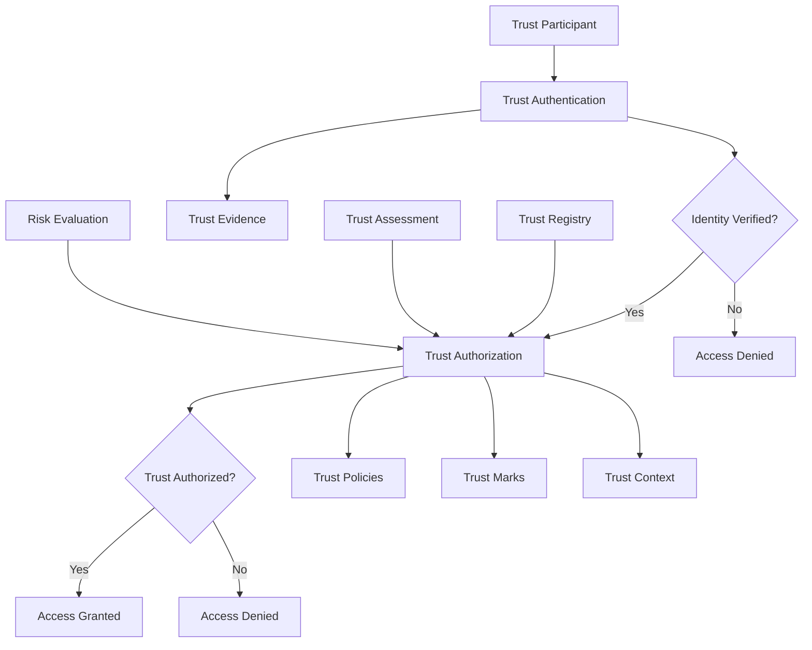
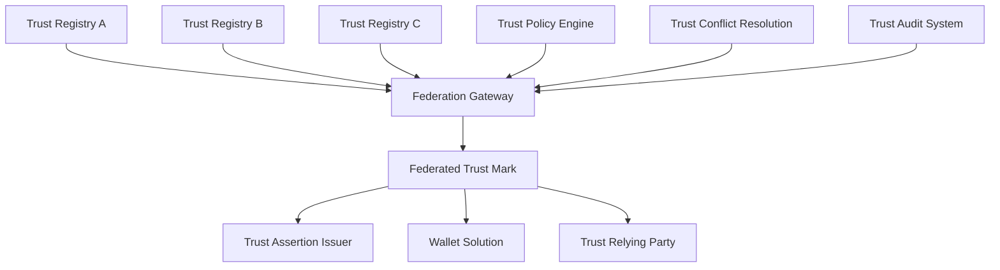

# General Trust Framework: Authentication vs Authorization Policy Framework

## Executive Summary

This document defines the distinction between authentication and authorization within general trust frameworks, explores the application of additive and subtractive policy principles in authorization mechanisms, and develops comprehensive use cases for trust participants using federative trust marks in a general trust infrastructure context.

## Table of Contents

1. [Trust Framework Overview](#trust-framework-overview)
2. [Authentication vs Authorization in Trust Frameworks](#authentication-vs-authorization-in-trust-frameworks)
3. [Policy Principles in Trust Authorization](#policy-principles-in-trust-authorization)
4. [Trust Participant Use Cases](#trust-participant-use-cases)
5. [Federative Trust Mark Implementation](#federative-trust-mark-implementation)
6. [Trust Policy Conflict Resolution](#trust-policy-conflict-resolution)

## Trust Framework Overview

### General Trust Framework Principles

A general trust framework provides the foundation for establishing, maintaining, and evaluating trust relationships between various participants in digital ecosystems. Unlike certificate-specific policies, this framework focuses on broader trust relationships and authorization mechanisms.

#### Core Trust Framework Components

```json
{
  "trust_framework_components": {
    "trust_establishment": {
      "identity_verification": "Verify participant identity",
      "trust_assessment": "Evaluate trustworthiness",
      "trust_registration": "Register in trust registry"
    },
    "trust_maintenance": {
      "trust_monitoring": "Continuous trust evaluation",
      "trust_updates": "Update trust status",
      "trust_renewal": "Renew trust relationships"
    },
    "trust_authorization": {
      "permission_granting": "Grant access permissions",
      "resource_control": "Control resource access",
      "policy_enforcement": "Enforce trust policies"
    },
    "trust_evaluation": {
      "trust_scoring": "Calculate trust scores",
      "risk_assessment": "Assess trust risks",
      "compliance_checking": "Verify compliance"
    }
  }
}
```

## Authentication vs Authorization in Trust Frameworks

### Authentication in Trust Frameworks

#### Definition
**Authentication** in trust frameworks is the process of verifying the identity of a trust participant (user, system, or entity) to establish their claimed identity within the trust ecosystem.

#### Trust-Based Authentication Characteristics
- **Identity Verification**: Confirms the participant's claimed identity
- **Trust Evidence Validation**: Validates authentication evidence using trust mechanisms
- **Trust Session Establishment**: Creates authenticated trust sessions
- **Trust Foundation**: Establishes the basis for subsequent authorization decisions

#### Trust Authentication Mechanisms
```json
{
  "trust_authentication_methods": {
    "traditional_methods": {
      "knowledge_based": ["password", "pin", "security_questions"],
      "possession_based": ["smart_card", "mobile_device", "hardware_token"],
      "inherence_based": ["fingerprint", "face_recognition", "voice_recognition"]
    },
    "trust_based_methods": {
      "verifiable_credentials": ["w3c_vc", "eudi_wallet_credential", "openid_connect"],
      "trust_assertions": ["saml_assertion", "jwt_token", "trust_mark"],
      "federated_identity": ["openid_connect", "saml_federation", "oauth2"]
    },
    "emerging_methods": {
      "decentralized_identity": ["did_authentication", "self_sovereign_identity"],
      "blockchain_based": ["cryptographic_proofs", "smart_contracts"],
      "biometric_advanced": ["behavioral_biometrics", "continuous_authentication"]
    }
  }
}
```

### Authorization in Trust Frameworks

#### Definition
**Authorization** in trust frameworks is the process of determining what actions a trust participant is permitted to perform or what resources they can access after successful authentication, based on trust relationships and policies.

#### Trust-Based Authorization Characteristics
- **Trust Permission Granting**: Determines actions based on trust relationships
- **Resource Access Control**: Controls access within the trust framework
- **Trust Policy Enforcement**: Applies trust rules and policies
- **Context-Aware Trust**: Considers trust context, purpose, and conditions

#### Trust Authorization Models
```json
{
  "trust_authorization_models": {
    "trust_based_access_control": {
      "tbac": "Trust-Based Access Control",
      "trust_level_based": "Authorization based on trust levels",
      "trust_relationship_based": "Authorization based on trust relationships"
    },
    "attribute_based_access_control": {
      "abac": "Attribute-Based Access Control",
      "trust_attribute_based": "Authorization based on trust attributes",
      "context_aware": "Context-aware authorization"
    },
    "federated_access_control": {
      "fac": "Federated Access Control",
      "cross_domain_trust": "Cross-domain trust authorization",
      "federated_permissions": "Federated permission management"
    },
    "policy_based_access_control": {
      "pbac": "Policy-Based Access Control",
      "trust_policy_enforcement": "Trust policy enforcement",
      "dynamic_trust_assessment": "Dynamic trust assessment"
    }
  }
}
```

### Trust Framework Authentication-Authorization Flow



## Policy Principles in Trust Authorization

### Additive Trust Authorization Policy

#### Definition
**Additive Trust Authorization**: Explicit allow-list model where trust permissions are granted only when explicitly authorized. Nothing is permitted unless explicitly allowed within the trust framework.

#### Characteristics
- **Default State**: Deny all trust requests
- **Explicit Authorization**: Only explicitly granted trust permissions are allowed
- **Principle of Least Privilege**: Minimal necessary trust permissions
- **Security-First**: Conservative approach prioritizing trust security

#### Implementation Pattern
```json
{
  "trust_policy_type": "additive_authorization",
  "default_action": "deny",
  "authorized_trust_actions": [
    {
      "action": "issue_trust_assertion",
      "assertion_type": "VerifiableCredential",
      "trust_conditions": {
        "issuer_trusted": true,
        "trust_schema_valid": true,
        "trust_level_sufficient": true
      },
      "trust_scope_restrictions": {
        "geographic_scope": ["EU"],
        "temporal_scope": "2024-01-01T00:00:00Z/2025-12-31T23:59:59Z",
        "purpose_scope": ["authentication", "identification"]
      }
    }
  ]
}
```

#### Use Cases for Additive Trust Authorization
- **High-Security Trust Environments**: Government systems, financial services
- **Sensitive Trust Data Handling**: Healthcare, personal data processing
- **Regulatory Compliance**: GDPR, EIDAS, PCI DSS environments
- **Zero-Trust Architectures**: Modern security frameworks

### Subtractive Trust Authorization Policy

#### Definition
**Subtractive Trust Authorization**: Explicit deny-list model where trust permissions are granted by default except for explicitly restricted items. Everything is permitted unless explicitly denied within the trust framework.

#### Characteristics
- **Default State**: Allow all trust requests
- **Explicit Restrictions**: Only explicitly denied trust permissions are blocked
- **Flexibility-First**: Permissive approach prioritizing trust functionality
- **Exception-Based**: Focus on what is not allowed

#### Implementation Pattern
```json
{
  "trust_policy_type": "subtractive_authorization",
  "default_action": "allow",
  "restricted_trust_actions": [
    {
      "action": "issue_trust_assertion",
      "assertion_type": "BiometricCredential",
      "restriction_reason": "Privacy protection",
      "trust_conditions": {
        "explicit_consent_required": true,
        "privacy_impact_assessment": true
      },
      "exceptions": ["law_enforcement", "national_security", "explicit_consent"]
    }
  ]
}
```

#### Use Cases for Subtractive Trust Authorization
- **Open Trust Ecosystems**: Innovation platforms, research environments
- **Development Environments**: Testing, prototyping, sandbox environments
- **Collaborative Platforms**: Multi-tenant systems, shared resources
- **Rapid Trust Deployment**: Agile development, quick iteration

## Trust Participant Use Cases

### Trust Assertion Issuers

#### Use Case 1: Government Trust Assertion Issuer (Additive Approach)

**Scenario**: A government agency authorized to issue national identity trust assertions using additive authorization policies.

**Trust Mark Configuration**:
```json
{
  "trust_mark_id": "gov_identity_issuer_additive_v1.0",
  "issuer": "https://trust-registry.gov.example.com",
  "subject": "https://identity-issuer.gov.example.com",
  "trust_mark_type": "trust_assertion_issuer_authorization",
  "policy_approach": "additive",
  "trust_semantics": {
    "authorized_assertion_types": [
      {
        "type": "NationalIdentityAssertion",
        "schema": "https://schema.gov.example.com/national-identity",
        "purpose": "identity_verification",
        "attribute_groups": ["identity_attributes", "citizenship_attributes"]
      },
      {
        "type": "ProfessionalQualificationAssertion",
        "schema": "https://schema.gov.example.com/professional-qualification",
        "purpose": "professional_verification",
        "attribute_groups": ["professional_attributes", "qualification_attributes"]
      }
    ],
    "authorized_attribute_groups": [
      "identity_attributes",
      "citizenship_attributes",
      "professional_attributes",
      "qualification_attributes"
    ],
    "trust_scope_restrictions": {
      "geographic_scope": ["Italy"],
      "temporal_scope": "2024-01-01T00:00:00Z/2025-12-31T23:59:59Z",
      "purpose_scope": ["identity_verification", "professional_verification"]
    }
  }
}
```

**Trust Policy Implementation**:
```python
class AdditiveTrustAssertionIssuerPolicy:
    def __init__(self, trust_mark):
        self.trust_mark = trust_mark
        self.authorized_types = trust_mark["trust_semantics"]["authorized_assertion_types"]
        self.authorized_attributes = trust_mark["trust_semantics"]["authorized_attribute_groups"]
    
    def evaluate_trust_assertion_request(self, request):
        # Check if assertion type is explicitly authorized
        if not self.is_assertion_type_authorized(request.assertion_type):
            return {
                "decision": "deny",
                "reason": "Assertion type not explicitly authorized",
                "required_authorization": "Add assertion type to authorized_assertion_types"
            }
        
        # Check if attribute groups are authorized
        if not self.are_attributes_authorized(request.attribute_groups):
            return {
                "decision": "deny",
                "reason": "Attribute groups not explicitly authorized",
                "required_authorization": "Add attribute groups to authorized_attribute_groups"
            }
        
        # Check trust scope restrictions
        if not self.is_within_trust_scope(request):
            return {
                "decision": "deny",
                "reason": "Request outside authorized trust scope",
                "required_authorization": "Modify trust scope restrictions"
            }
        
        return {
            "decision": "allow",
            "reason": "All trust authorization requirements satisfied",
            "trust_mark_validation": "valid"
        }
```

#### Use Case 2: Innovation Platform Trust Assertion Issuer (Subtractive Approach)

**Scenario**: An innovation platform that allows flexible trust assertion issuance with subtractive authorization policies.

**Trust Mark Configuration**:
```json
{
  "trust_mark_id": "innovation_platform_issuer_subtractive_v1.0",
  "issuer": "https://trust-registry.innovation.example.com",
  "subject": "https://trust-issuer.innovation.example.com",
  "trust_mark_type": "trust_assertion_issuer_authorization",
  "policy_approach": "subtractive",
  "trust_semantics": {
    "restricted_assertion_types": [
      {
        "type": "BiometricAssertion",
        "restriction_reason": "Privacy protection",
        "exceptions": ["explicit_consent", "law_enforcement"]
      },
      {
        "type": "FinancialAssertion",
        "restriction_reason": "Financial regulation compliance",
        "exceptions": ["licensed_financial_services"]
      }
    ],
    "restricted_attribute_groups": [
      "sensitive_personal_data",
      "special_category_data"
    ],
    "trust_compliance_requirements": [
      "explicit_consent_required",
      "data_protection_impact_assessment",
      "regulatory_approval_required"
    ]
  }
}
```

### Wallet Solutions

#### Use Case 3: EUDI Wallet with Trust Discovery

**Scenario**: A wallet solution that supports trust assertion discovery and embedded discovery features.

**Wallet Trust Mark Configuration**:
```json
{
  "trust_mark_id": "eudi_wallet_trust_discovery_v1.0",
  "issuer": "https://trust-registry.wallet.example.com",
  "subject": "https://wallet.example.com",
  "trust_mark_type": "wallet_trust_authorization",
  "policy_approach": "additive",
  "trust_semantics": {
    "authorized_discovery_methods": [
      "trust_assertion_offer_uri",
      "embedded_trust_discovery",
      "openid_connect_discovery",
      "well_known_trust_endpoints"
    ],
    "authorized_trust_sources": [
      "trusted_assertion_issuers",
      "federated_trust_registry",
      "verified_trust_networks"
    ],
    "authorized_assertion_types": [
      "VerifiableCredential",
      "EUDIWalletCredential",
      "OpenIDConnectCredential"
    ],
    "trust_discovery_validation": {
      "trust_mark_verification": true,
      "assertion_issuer_verification": true,
      "schema_validation": true,
      "trust_policy_compliance_check": true
    }
  }
}
```

### Trust Relying Parties

#### Use Case 4: Software Development Company (ATECO 62.01.00)

**Scenario**: A software development company requesting user attributes for authentication and service delivery.

**Relying Party Trust Mark Configuration**:
```json
{
  "trust_mark_id": "software_dev_rp_trust_v1.0",
  "issuer": "https://trust-registry.example.com",
  "subject": "https://software-dev.example.com",
  "trust_mark_type": "trust_relying_party_authorization",
  "policy_approach": "additive",
  "trust_semantics": {
    "business_classification": {
      "ateco_code": "62.01.00",
      "ateco_description": "Computer programming activities",
      "business_purpose": "Software development and IT services",
      "industry_sector": "Information Technology"
    },
    "authorized_trust_purposes": [
      "user_authentication",
      "service_delivery",
      "customer_support",
      "billing_and_payments"
    ],
    "authorized_trust_requests": [
      {
        "attribute_type": "given_name",
        "trust_purpose": "user_authentication",
        "retention_period": "session_only",
        "consent_required": true
      },
      {
        "attribute_type": "email",
        "trust_purpose": "service_delivery",
        "retention_period": "30_days",
        "consent_required": true
      }
    ],
    "trust_data_processing_scope": {
      "processing_purposes": ["authentication", "service_provision", "customer_relationship"],
      "data_categories": ["identity_data", "contact_data", "professional_data"],
      "retention_policies": {
        "identity_data": "session_only",
        "contact_data": "30_days",
        "professional_data": "90_days"
      }
    }
  }
}
```

## Federative Trust Mark Implementation

### Trust Mark Federation Architecture



### Federative Trust Mark Schema

```json
{
  "federative_trust_mark": {
    "trust_mark_id": "federative_trust_assertion_issuer_v1.0",
    "federation_identifier": "https://federation.trust.example.com",
    "participating_trust_registries": [
      "https://trust-registry.eu.example.com",
      "https://trust-registry.us.example.com",
      "https://trust-registry.asia.example.com"
    ],
    "federation_trust_policy": {
      "mutual_recognition": true,
      "cross_border_validity": true,
      "trust_policy_harmonization": true,
      "dispute_resolution": "federation_mediation"
    },
    "trust_assertion_issuer_semantics": {
      "authorized_assertion_types": [
        {
          "type": "VerifiableCredential",
          "federation_scope": "global",
          "local_restrictions": {
            "eu": ["identity_assertion", "professional_assertion"],
            "us": ["identity_assertion", "education_assertion"],
            "asia": ["identity_assertion", "business_assertion"]
          }
        }
      ],
      "attribute_groups": [
        "identity_attributes",
        "professional_attributes",
        "affiliation_attributes"
      ]
    },
    "trust_relying_party_semantics": {
      "authorized_trust_purposes": [
        "authentication",
        "authorization",
        "service_delivery"
      ],
      "ateco_classifications": [
        "62.01.00",
        "86.10.00",
        "70.21.00"
      ]
    }
  }
}
```

## Trust Policy Conflict Resolution

### Trust Collision Prevention Mechanisms

#### Trust Assertion Type Collision Prevention
```python
class TrustAssertionTypeCollisionResolver:
    def __init__(self, trust_registry):
        self.trust_registry = trust_registry
        self.assertion_type_assignments = {}
    
    def resolve_assertion_type_collision(self, assertion_type, requesting_issuer):
        # Check if assertion type is already assigned
        if assertion_type in self.assertion_type_assignments:
            assigned_issuer = self.assertion_type_assignments[assertion_type]
            if assigned_issuer != requesting_issuer:
                return {
                    "collision_detected": True,
                    "assigned_issuer": assigned_issuer,
                    "requesting_issuer": requesting_issuer,
                    "resolution": "deny_request",
                    "reason": "Assertion type already assigned to another issuer"
                }
        
        # Assign assertion type to requesting issuer
        self.assertion_type_assignments[assertion_type] = requesting_issuer
        return {
            "collision_detected": False,
            "assignment": "granted",
            "issuer": requesting_issuer,
            "assertion_type": assertion_type
        }
```

### Trust Dispute Resolution Framework

```json
{
  "trust_dispute_resolution_framework": {
    "mediation_process": {
      "step_1": "automated_trust_collision_detection",
      "step_2": "stakeholder_notification",
      "step_3": "trust_mediation_request",
      "step_4": "trust_evidence_collection",
      "step_5": "trust_mediation_decision",
      "step_6": "trust_appeal_process"
    },
    "trust_resolution_authorities": [
      "trust_registry_authority",
      "federation_trust_mediation_service",
      "regulatory_authority"
    ],
    "trust_evidence_requirements": [
      "trust_mark_validation",
      "trust_policy_compliance_evidence",
      "stakeholder_consent",
      "regulatory_approval"
    ]
  }
}
```

## Trust Framework Implementation

### Trust Policy Engine

```python
class TrustFrameworkPolicyEngine:
    def __init__(self, trust_registry):
        self.trust_registry = trust_registry
        self.assertion_type_registry = TrustAssertionTypeRegistry()
        self.ateco_authorization = ATECOBasedTrustAuthorization()
        self.collision_prevention = TrustAssertionCollisionPrevention(trust_registry)
    
    def process_trust_assertion_request(self, request):
        # Validate trust assertion issuer authorization
        issuer_validation = self.validate_trust_assertion_issuer(request.issuer_id, request.assertion_type)
        if not issuer_validation["authorized"]:
            return issuer_validation
        
        # Check for trust collisions
        collision_check = self.collision_prevention.validate_trust_assertion_request(
            request.issuer_id, request.assertion_type, request.purpose, request.attributes
        )
        if not collision_check["authorized"]:
            return collision_check
        
        # Validate attribute authorization
        attribute_validation = self.validate_trust_attribute_authorization(
            request.assertion_type, request.attributes, request.purpose
        )
        if not attribute_validation["authorized"]:
            return attribute_validation
        
        return {
            "authorized": True,
            "assertion_type": request.assertion_type,
            "issuer_id": request.issuer_id,
            "purpose": request.purpose,
            "attributes": request.attributes,
            "trust_mark_validation": "passed"
        }
    
    def process_trust_attribute_request(self, request):
        # Validate trust relying party authorization
        rp_validation = self.validate_trust_relying_party(request.rp_id, request.purpose, request.attribute_types)
        if not rp_validation["authorized"]:
            return rp_validation
        
        # Validate ATECO alignment
        ateco_validation = self.ateco_authorization.validate_trust_attribute_request(request)
        if not ateco_validation["authorized"]:
            return ateco_validation
        
        return {
            "authorized": True,
            "rp_id": request.rp_id,
            "purpose": request.purpose,
            "attribute_types": request.attribute_types,
            "ateco_code": ateco_validation["ateco_code"],
            "trust_mark_validation": "passed"
        }
```

## Conclusion

This general trust framework provides a comprehensive approach to authentication vs authorization, policy principles in trust authorization, and use cases for trust participants using federative trust marks. The key benefits include:

1. **Clear Trust Distinction**: Clear separation between trust authentication and authorization
2. **Trust Policy Flexibility**: Support for both additive and subtractive trust authorization approaches
3. **Comprehensive Use Cases**: Complete use cases for all major trust participants
4. **Federation Support**: Robust federative trust mark implementation
5. **Trust Conflict Resolution**: Effective mechanisms for preventing and resolving trust policy conflicts

The framework ensures that bogus trust assertion issuers cannot claim authorization for assertion types they're not authorized to issue, while providing flexible trust policy management for different deployment scenarios.

## References

### Standards
- [EIDAS Regulation](https://eur-lex.europa.eu/eli/reg/2014/910/oj)
- [GDPR Regulation](https://eur-lex.europa.eu/eli/reg/2016/679/oj)
- [OpenID Federation 1.0](https://openid.net/specs/openid-federation-1_0.html)
- [W3C Verifiable Credentials](https://www.w3.org/TR/vc-data-model/)
- [ETSI EN 319 412-6](https://www.etsi.org/deliver/etsi_en/319400_319499/31941206/01.00.00_20/en_31941206v010000c.pdf)

### Related Documents
- [Policy Approaches Definition](policy-approaches-definition.md)
- [ETSI Policy Evaluation](etsi-policy-evaluation.md)
- [ETSI Policy Enumeration](etsi-policy-enumeration.md)
