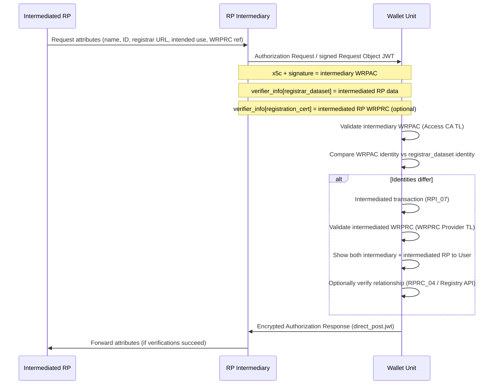

# Technical Report: Relying Party Intermediaries in OpenID4VP Remote Presentation Flows

| Field | Value |
|-------|-------|
| **Status** | Draft technical report (non-normative) |
| **WP4 task** | Task 2 — Trust Framework |
| **Scope** | EUDI Wallet remote presentation; Relying Party intermediaries; WRPAC / WRPRC trust evaluation |
| **Related WP4 docs** | [Entities Involved](entities-involved.md), [EUDI Wallet Trust and Entitlement Discovery](eudi-wallet-trust-and-entitlement-discovery.md), [Trust Infrastructure Schema](trust-infrastructure-schema.md), [Consolidated Terms — Intermediary](../task1-use-cases/terms-and-entities.md#316-intermediary) |
| **Primary normative sources** | OpenID4VP 1.0, OpenID4VC-HAIP, ETSI TS 119 472-2, ETSI TS 119 475, EUDI ARF (Topic 44, Topic 52, Topic X) |

---

## 1. Purpose

This report consolidates technical analysis on how a **Relying Party Intermediary** interacts with a Wallet Unit in remote OpenID4VP presentation flows within the WP4 trust framework context. It addresses:

1. How the Wallet detects an intermediated transaction.
2. Which party sends the presentation request.
3. Where those rules are stated in normative sources.
4. Where **WRPRC** (Wallet-Relying Party Registration Certificates) and **WRPAC** (Wallet-Relying Party Access Certificates) are exposed — intermediary vs intermediated Relying Party.
5. Implications for trust evaluation and discovery.
6. Non-normative JSON/JWT examples.

This document is **informative**. Normative requirements remain in the cited specifications and in [EUDI Wallet Trust and Entitlement Discovery](eudi-wallet-trust-and-entitlement-discovery.md).

---

## 2. Executive summary

| Question | Short answer |
|----------|--------------|
| How does the Wallet know the Verifier is an intermediary? | There is **no** dedicated `is_intermediary` flag. The Wallet infers intermediation when the **WRPAC** identity (intermediary) differs from the **registration data** in `verifier_info` (intermediated Relying Party). |
| Who sends the OpenID4VP request? | The **intermediary** signs and sends the Authorization Request / Request Object. The intermediated Relying Party does not connect to the Wallet directly. |
| What does the intermediary expose for authentication? | Its own **WRPAC** (JWT header `x5c`, `x509_hash` `client_id`). |
| What WRPRC is in `verifier_info`? | The **intermediated Relying Party's** certificate (if issued), not the intermediary's WRPRC in intermediated transactions. |
| Where is the intermediary's WRPRC exposed? | **Not** in intermediated transactions. Only when the intermediary acts **in its own capacity** as a direct Relying Party, or via public Registry data. |

---

## 3. Normative references

| Reference | Role |
|-----------|------|
| [OpenID4VP 1.0](https://openid.net/specs/openid-4-verifiable-presentations-1_0.html) | Base protocol; defines optional `verifier_info` (Section 5.11). Does **not** define intermediary semantics. |
| [OpenID4VC-HAIP](https://openid.net/specs/openid4vc-high-assurance-interoperability-profile-1_0-06.html) | High-assurance profile (`x509_hash`, `direct_post.jwt`, Request Object by reference). |
| [ETSI TS 119 472-2](https://www.etsi.org/deliver/etsi_ts/119400_119499/11947202/01.02.01_60/ts_11947202v010201p.pdf) | EUDI profile: mandatory `verifier_info` with `registrar_dataset` and optional `registration_cert`. |
| [ETSI TS 119 475](https://www.etsi.org/deliver/etsi_ts/119400_119499/119475/01.01.01_60/ts_119475v010101p.pdf) | WRPAC attributes supporting Wallet user authorisation decisions. |
| [ETSI TS 119 411-8](https://www.etsi.org/deliver/etsi_ts/119400_119499/11941108/01.01.01_60/ts_11941108v010101p.pdf) | WRPAC / WRPRC policy framework. |
| [CIR (EU) 2025/848](https://eur-lex.europa.eu/legal-content/EN/TXT/?uri=OJ:L_202500848) | Wallet-relying party registration; WRPAC/WRPRC issuance. |
| [EUDI ARF §6.6.5](https://github.com/eu-digital-identity-wallet/eudi-doc-architecture-and-reference-framework/blob/main/docs/architecture-and-reference-framework-main.md) | Narrative flow for presentation to an intermediary. |
| [ARF Topic 52 — Relying Party intermediaries](https://github.com/eu-digital-identity-wallet/eudi-doc-architecture-and-reference-framework/blob/main/docs/annexes/annex-2/annex-2.02-high-level-requirements-by-topic.md#a2330-topic-52-relying-party-intermediaries) | High-level requirements RPI_01–RPI_10. |
| [ARF Topic 44 — Registration certificates](https://github.com/eu-digital-identity-wallet/eudi-doc-architecture-and-reference-framework/blob/main/docs/annexes/annex-2/annex-2.02-high-level-requirements-by-topic.md#a2326-topic-44---registration-certificates-for-pid-providers-providers-of-qeaas-pub-eaas-and-non-qualified-eaas-and-relying-parties) | RPRC_04, RPRC_19, RPRC_19a, RPRC_20a. |
| [ARF Topic X — Relying Party registration (RR)](https://github.com/eu-digital-identity-wallet/eudi-doc-architecture-and-reference-framework/blob/main/docs/discussion-topics/x-rr-relying-party-registration.md) | Registry model, `usesIntermediary`, evolving Service identifiers. |

OpenID4VP 1.1 is expected to be non-breaking relative to 1.0; `verifier_info` is already present in 1.0 (renamed from `verifier_attestations` in late drafts).

---

## 4. Trust framework context

Within the WP4 trust model ([Entities Involved](entities-involved.md), [Trust Infrastructure Schema](trust-infrastructure-schema.md)):

| Entity | Intermediary role |
|--------|-------------------|
| **Intermediary** | Special class of Relying Party ([Terms — §3.16](../task1-use-cases/terms-and-entities.md#316-intermediary)); registers as RP; obtains WRPAC from a **WRPAC Authority** (Access CA); may obtain WRPRC from a **WRPRC Provider**. |
| **Intermediated RP** | Registered at a **Registrar**; registration data published in the **Registry**; may receive WRPRC per intended use. |
| **Wallet Unit** | Validates intermediary WRPAC against the **Access CA Trusted List**; validates intermediated RP WRPRC against the **WRPRC Provider Trusted List**; may query the Registry via `registryURI`. |

Relying Parties are **not** listed in Trusted Lists; trust is established through WRPAC chain validation and Registry / WRPRC verification — see [EUDI Wallet Trust and Entitlement Discovery](eudi-wallet-trust-and-entitlement-discovery.md).

In intermediated flows, the Wallet performs **two parallel identity evaluations**:

1. **Authentication** — WRPAC of the intermediary (who is calling).
2. **Authorisation / transparency** — registration data and WRPRC of the intermediated RP (on whose behalf attributes are requested).

---

## 5. Signalling an intermediary to the Wallet

### 5.1 OpenID4VP layer

OpenID4VP 1.0 / 1.1 provides a generic extension point only:

- **`verifier_info`**: optional array in the Authorization Request / Request Object JWT.
- Each element has `format` (ecosystem-specific type) and `data` (payload).
- Wallets MAY use it for policy, trust, and consent UI; they SHOULD ignore unknown formats.

OpenID4VP does **not** define intermediary-specific semantics or a boolean intermediary indicator.

### 5.2 ETSI TS 119 472-2 (EUDI OpenID4VP profile)

ETSI TS 119 472-2 makes `verifier_info` **mandatory** and defines EUDI-specific `format` values in the Request Object (see also [§3.1.2 WRPRC Sources](eudi-wallet-trust-and-entitlement-discovery.md#312-wrprc-sources)):

| `format` | Required? | Content |
|----------|-----------|---------|
| `registrar_dataset` | Yes | JSON object with Registrar-provided data for the Relying Party and intended use (RPRC_19a fields). |
| `registration_cert` | When available | Base64url-encoded serialized WRPRC (by value). |

**Intermediary detection (ETSI NOTE):** when an intermediary is involved, the `identifier` in `registrar_dataset` **differs** from the identifier in the intermediary's WRPAC (ETSI TS 119 472-2, clause 6.3.2.2, NOTE 2).

**Authentication binding:** the Request Object MUST be signed with the private key of the WRPAC in `x5c` (OIDFVP-HAIP-COMMON-REQ-RO-23). In intermediated flows that certificate belongs to the **intermediary**.

### 5.3 ARF Topic 52 (RPI_07)

Requirement **RPI_07** states explicitly:

- Intermediary trade names → from the **WRPAC**.
- Intermediated Relying Party trade names → from the **presentation request extension** (RPRC_19a / `verifier_info`) and WRPRC if available.
- If these identities **differ**, the Wallet knows the request is from an intermediary on behalf of an intermediated Relying Party.

### 5.4 ARF Topic X (registry model)

Topic X (revision round) describes the registration-side model:

- Intermediated Relying Party registry data include `usesIntermediary`.
- Intermediated RP WRPRCs contain the intermediary's RP identifier (RPRC_04).
- During a transaction, the intermediary sends its WRPAC plus the intermediated RP's WRPRC and identifier in the request.
- Evolution: with Relying Party Services, Service identifiers for both intermediary and intermediated RP may also be required.

---

## 6. Who sends the presentation request?

**The intermediary sends the request.** The intermediated Relying Party does not speak to the Wallet directly.

### 6.1 Roles

| Party | Role in the transaction |
|-------|-------------------------|
| **Intermediated Relying Party** | Instructs the intermediary which attributes to request; supplies registration metadata (name, identifier, Registrar URL, intended use, optional WRPRC reference). Does **not** need a WRPAC. |
| **Intermediary** | Builds, signs, and sends the OpenID4VP Request Object; authenticates with its WRPAC; receives the encrypted Authorization Response at its `response_uri`; forwards attributes to the intermediated RP after agreed verifications. |
| **Wallet Unit** | Authenticates the intermediary; displays **both** identities to the User; responds to the intermediary's `response_uri`. |

### 6.2 Normative evidence

**ARF §6.6.5:**

> *"When asked by an intermediated Relying Party, the intermediary will request a presentation of attributes from a Wallet Unit [...] the intermediary will use their own access certificate [...] and the registration certificate of the intermediated Relying Party"*

> *"an intermediated Relying Party using the services of an intermediary will not need an access certificate"*

**RPI_05:** intermediated RP *asks its intermediary* to request attributes and provides data for inclusion in the presentation request.

**RPI_06:** intermediary *SHALL request* presentation from the Wallet; request MUST include intermediary's WRPAC and intermediated RP registration data/WRPRC.

**RPI_07:** intermediary identity is in the WRPAC presented by the Relying Party Instance; intermediated RP identity is in the request extension.

**ETSI TS 119 472-2:** Request Object signed with intermediary WRPAC key; `verifier_info` carries intermediated RP data.

---

## 7. WRPAC and WRPRC: who exposes what?

### 7.1 Intermediated transaction (typical case)

| Artifact | Whose? | Where exposed |
|----------|--------|---------------|
| WRPAC | **Intermediary** | JWT header `x5c`; authenticated via `x509_hash` `client_id` |
| `registrar_dataset` | **Intermediated RP** | `verifier_info[]` |
| `registration_cert` (WRPRC) | **Intermediated RP** | `verifier_info[]` |
| Intermediary identity (association) | **Intermediary** (referenced) | Inside intermediated RP's WRPRC (RPRC_04), **not** as a separate intermediary WRPRC in the request |

**RPI_01, note b):** *"An intermediary may also obtain a registration certificate [...] but this certificate will not be used for intermediated transactions."*

The intermediary's own WRPRC is **not** sent to the Wallet in intermediated flows.

### 7.2 Intermediary acting in own capacity

**RPI_01, note c):** an entity registered as intermediary may also register as a Relying Party in its own capacity, receive WRPRCs for its intended uses, and **use one when interacting with a Wallet Unit** — i.e. a **direct** (non-intermediated) transaction where WRPAC and `verifier_info` refer to the same party.

### 7.3 Public Registry

Registration data (and WRPRC issuance policy) may be published via the Member State **Registrar** and **Registry** (TS5 API). That is separate from in-band presentation-request transport — see [Trust Infrastructure Schema](trust-infrastructure-schema.md) and [§2.4 WRPRC Discovery via Registry](eudi-wallet-trust-and-entitlement-discovery.md#24-wrprc-discovery-via-registry).

### 7.4 Summary table

| Scenario | Intermediary WRPRC sent to Wallet? |
|----------|-------------------------------------|
| Intermediary on behalf of RP X | **No** — intermediated RP WRPRC in `verifier_info`; intermediary auth via WRPAC |
| Intermediary as direct RP | **Yes** — standard RPRC_19 / `registration_cert` in `verifier_info` |
| Registry lookup | May exist online; not in-band in intermediated request |

---

## 8. Wallet processing and trust evaluation

When the Wallet detects an intermediated transaction (RPI_07), it MUST:

1. **Authenticate the intermediary** — validate WRPAC chain against the Access CA Trusted List ([§3.3](eudi-wallet-trust-and-entitlement-discovery.md#33-step-3-wrpac-validation-certificate-chain)).
2. **Evaluate intermediated RP registration** — parse `registrar_dataset`; if present, validate intermediated RP WRPRC against the WRPRC Provider Trusted List ([§3.4](eudi-wallet-trust-and-entitlement-discovery.md#34-step-4-wrprc-validation)).
3. **Display both identities** when requesting User approval (RPA_06, RPI_07).
4. **Verify intermediary–RP relationship** if the User requests it — via RPRC_04 in the intermediated WRPRC or Registrar API (`registryURI`) — RPI_07a.
5. **Send the Authorization Response** to the intermediary's `response_uri`.
6. **Log both parties** in the transaction record (DASH_03).

The intermediated Relying Party does not receive the VP token directly from the Wallet; the intermediary forwards attributes after agreed verifications (RPI_08, RPI_09) and must delete received credentials immediately (RPI_10).

---

## 9. End-to-end flow



---

## 10. Non-normative examples

All identifiers, endpoints, and certificate payloads below are **fictional**.

### 10.1 Direct presentation (no intermediary)

WRPAC and `verifier_info` refer to the **same** Relying Party.

```json
{
  "client_id": "x509_hash:sha-256:abc123...",
  "response_mode": "direct_post.jwt",
  "response_type": "vp_token",
  "response_uri": "https://rp.example.eu/oid4vp/response",
  "verifier_info": [
    {
      "format": "registrar_dataset",
      "data": {
        "identifier": "urn:eu:wrp:eu:12345678901:0001",
        "srvDescription": [
          { "lang": "en", "content": "Online authentication service — Example Municipality" }
        ],
        "registryURI": "https://registry.example.eu/api/v1",
        "intendedUseIdentifier": "urn:eu:wrp-intended-use:eu:municipality-login",
        "purpose": [
          { "lang": "en", "content": "User authentication for access to online municipal services" }
        ],
        "policyURI": "https://rp.example.eu/privacy/login"
      }
    },
    {
      "format": "registration_cert",
      "data": "eyJhbGciOiJFUzI1NiIsInR5cCI6IkpXVCJ9..."
    }
  ],
  "dcql_query": {
    "credentials": [
      {
        "id": "pid",
        "format": "dc+sd-jwt",
        "meta": { "vct_values": ["https://pid.issuer.example.eu/credentials/pid/1.0"] },
        "claims": [
          { "path": ["given_name"] },
          { "path": ["family_name"] }
        ]
      }
    ]
  },
  "nonce": "n-0Z3k9Qm7xP2vL8wR4tY6uI1oA5sD",
  "exp": 1744203600
}
```

JWT header `x5c` contains the WRPAC of **Example Municipality**; its identifier matches `verifier_info[0].data.identifier`.

### 10.2 Intermediated presentation

Intermediary authenticates with its WRPAC; `verifier_info` describes the **intermediated** Relying Party.

```json
{
  "client_id": "x509_hash:sha-256:def456...",
  "response_mode": "direct_post.jwt",
  "response_type": "vp_token",
  "response_uri": "https://intermediary.example.eu/oid4vp/response",
  "verifier_info": [
    {
      "format": "registrar_dataset",
      "data": {
        "identifier": "urn:eu:wrp:eu:98765432109:0001",
        "srvDescription": [
          { "lang": "en", "content": "Age verification — Example Cinema" }
        ],
        "registryURI": "https://registry.example.eu/api/v1",
        "intendedUseIdentifier": "urn:eu:wrp-intended-use:eu:cinema-age-check",
        "purpose": [
          { "lang": "en", "content": "Age limit verification for access to restricted content" }
        ],
        "policyURI": "https://cinema.example.eu/privacy/age-verification"
      }
    },
    {
      "format": "registration_cert",
      "data": "eyJhbGciOiJFUzI1NiIsInR5cCI6IkpXVCJ9..."
    }
  ],
  "dcql_query": {
    "credentials": [
      {
        "id": "pid",
        "format": "dc+sd-jwt",
        "meta": { "vct_values": ["https://pid.issuer.example.eu/credentials/pid/1.0"] },
        "claims": [
          { "path": ["birthdate"] }
        ]
      }
    ]
  },
  "nonce": "n-0Z3k9Qm7xP2vL8wR4tY6uI1oA5sD",
  "exp": 1744203600
}
```

- JWT `x5c`: WRPAC of **Example Intermediary Provider** (`urn:eu:wrp:eu:11111111111:0001`).
- `verifier_info[0].data.identifier`: **Example Cinema** (`urn:eu:wrp:eu:98765432109:0001`).
- Identity mismatch → Wallet treats this as intermediated (RPI_07).

### 10.3 Request Object JWT excerpt (intermediary)

```text
# JWT header (abbreviated)
{
  "alg": "ES256",
  "typ": "oauth-authz-req+jwt",
  "kid": "intermediary-key-2026",
  "x5c": ["MIIC...intermediary-wrpac..."]
}

# JWT payload (abbreviated)
{
  "iss": "x509_hash:sha-256:def456...",
  "client_id": "x509_hash:sha-256:def456...",
  "response_uri": "https://intermediary.example.eu/oid4vp/response",
  "verifier_info": [ "... see JSON example in §10.2 ..." ],
  "dcql_query": { "...": "..." },
  "nonce": "n-0Z3k9Qm7xP2vL8wR4tY6uI1oA5sD",
  "exp": 1744203600
}
```

### 10.4 Illustrative intermediated WRPRC content

The intermediated RP's WRPRC (carried in `verifier_info`, not shown decoded above) may include an association to the intermediary per **RPRC_04**:

```json
{
  "subject": {
    "identifier": "urn:eu:wrp:eu:98765432109:0001",
    "tradeName": "Example Cinema Ltd.",
    "intendedUse": "urn:eu:wrp-intended-use:eu:cinema-age-check"
  },
  "associationToIntermediary": {
    "identifier": "urn:eu:wrp:eu:11111111111:0001",
    "tradeName": "Example Intermediary Provider"
  }
}
```

This structure is illustrative; the exact encoding follows CIR 2025/848 and TS5.

### 10.5 Intermediary as direct Relying Party (own capacity)

When the intermediary interacts with the Wallet **for its own service** (RPI_01 note c), both `x5c` and `verifier_info` refer to the **same** intermediary identifier — same shape as §10.1, but all fields name the intermediary entity.

---

## 11. Key requirements index

| ID | Summary |
|----|---------|
| **RPI_01** | Intermediary registers as RP; obtains WRPAC; optional own WRPRC **not used** in intermediated transactions. |
| **RPI_03** | Intermediary registers each intermediated RP; may hold intermediated RP WRPRCs. |
| **RPI_05** | Intermediated RP instructs intermediary what to include in the request. |
| **RPI_06** | Intermediary sends request with own WRPAC + intermediated RP data/WRPRC. |
| **RPI_07** | Wallet detects intermediation via identity mismatch; displays both parties. |
| **RPI_07a** | Wallet verifies intermediary–RP relationship (WRPRC or Registrar). |
| **RPRC_04** | Intermediated RP WRPRC contains intermediary association. |
| **RPRC_19 / 19a** | Registration data and WRPRC included in presentation request extension. |
| **RPRC_20a** | OpenID4VP / ISO 18013-5 extension for RPRC_19a transport (`verifier_info`). |

---

## 12. Open points

| Item | Notes |
|------|-------|
| Proximity flow (`ISO 18013-5` `euWrpRegistrarInfo` / `euWrprc`) | Parallel extension model in ETSI TS 119 472-2 clause 5.3; not covered in this report. |
| Topic X RR — Relying Party Service identifiers | May extend `registrar_dataset` with Service IDs for both intermediary and intermediated RP. |
| IA vs ETSI field alignment | Implementing Act drafts reference `tradeName`; ETSI TS 119 472-2 v1.2.1 uses `srvDescription` — align when IA is final. |
| WEBUILD trust evaluation matrix | Intermediated flows may require additional matrix rows for dual-identity validation; see [Trusted List Registration Trust Evaluation Matrix](trusted-list-registration-trust-evaluation-matrix.md). |
| Embedded disclosure policies (EDP_02, EDP_03) | When RP is intermediary, Wallet compares authorised identifiers / roots of trust against **intermediated** RP data from the request or WRPRC, not the intermediary WRPAC. |

---

## 13. Document history

| Date | Change |
|------|--------|
| 2026-06-09 | Initial draft for WP4 Task 2 Trust Framework: RP intermediaries, OpenID4VP, ETSI TS 119 472-2, ARF Topics 44/52/X, WRPAC/WRPRC trust evaluation. |
