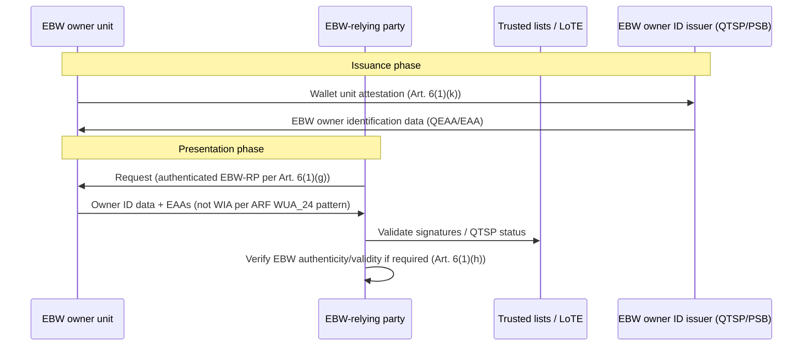

# Trust establishment: Verifiers, Wallet Instances, Wallet-to-Wallet, and European Business Wallets

**Document type:** Technical–legal evidence report  
**Sources:** [eudi-doc-architecture-and-reference-framework](https://github.com/eu-digital-identity-wallet/eudi-doc-architecture-and-reference-framework), [eidas-legal-tech-references](https://github.com/eu-digital-identity-wallet/eidas-legal-tech-references), Commission proposal **COM(2025) 838** (*Proposal EU Business Wallet.docx*)  
**Date:** 2026-05-28

---

## Table of contents

1. [Executive summary](#1-executive-summary)
2. [Terminology](#2-terminology)
3. [Trust model overview](#3-trust-model-overview)
4. [Normative evidence — EU law and CIR](#4-normative-evidence--eu-law-and-cir)
5. [ARF High-Level Requirements](#5-arf-high-level-requirements)
6. [Technical specifications and standards](#6-technical-specifications-and-standards)
7. [WIA must not be presented](#7-wia-must-not-be-presented)
8. [Wallet-to-wallet interactions](#8-wallet-to-wallet-interactions)
9. [European Business Wallets (EBW)](#9-european-business-wallets-ebw)
10. [Reference index](#10-reference-index)

---

## 1. Executive summary

Trust between verifiers (wallet-relying parties) and wallet instances is **directional** and **lifecycle-dependent**:

| Phase / interaction | Who trusts whom | Primary mechanism | WIA presented? |
|---------------------|-----------------|-------------------|----------------|
| **PID/EAA issuance** | PID/AP trusts Wallet Instance | WIA + KA + Wallet Provider LoTE | **Yes** (issuance only) |
| **WRP presentation** | Wallet trusts WRP; WRP trusts PID/EAA | Access/registration certificates (`RPA_*`); attestation validation (`OIA_12–15`) | **No** (`WUA_24`) |
| **Wallet-to-wallet** | Verifier validates Holder PID/EAA; Holder has weak Verifier assurance | `W2W_19` / `OIA_12–15`; no access cert; `STS9_30` | **No** (`WUA_24`, TS9) |
| **EBW (proposed)** | EBW-RP authentication + EBW validity verification | Art. 6 EBW proposal; eIDAS trusted lists; wallet unit attestation | **TBD** (implementing acts; likely aligned with ARF/WUA_24) |

**Key finding on WIA:** ARF **WUA_24** normatively limits **Wallet Instance Attestation (WIA)** presentation to PID Providers and Attestation Providers at issuance—not to relying parties, verifier wallet units, or other entities. W2W currently reinforces this via **STS9_30** (no `ReaderAuth`). CIR 2024/2982 Art. 3(2) and (8) create a broader legal duty on **wallet unit attestations** between wallet units that remains subject to specification harmonisation (Topic J RR).

---

## 2. Terminology

| Term | Layer | Meaning |
|------|-------|---------|
| **Wallet Instance** | ARF | Logical instance of a wallet on a device; attested by **WIA** |
| **WIA** | ARF / TS3 | Wallet Instance Attestation — integrity and revocation status of the Wallet Instance |
| **KA** | ARF / TS3 | Key Attestation — WSCD/keystore and public keys |
| **WUA** | ARF umbrella | Wallet Unit Attestation (includes WIA and KA) |
| **WRP** | EU law (CIR) | Wallet-relying party |
| **Verifier / Verifier Wallet Unit** | ARF Topic 30 | Natural person using a Wallet Unit in W2W **Verifier mode** |
| **EBW / EBW unit** | COM(2025) 838 (proposed) | European Business Wallet — B2G/B2B digital tool for economic operators |
| **EBW-relying party** | COM(2025) 838 Art. 3 | Entity relying upon European Business Wallets |

EU legal texts use **wallet unit attestation**, not the acronym WIA. WIA is specified in [ARF TS3](https://github.com/eu-digital-identity-wallet/eudi-doc-standards-and-technical-specifications/blob/main/docs/technical-specifications/ts3-wallet-unit-attestation.md).

---

## 3. Trust model overview

```mermaid
flowchart TB
  subgraph issuance["Issuance"]
    WU["Wallet Unit / Instance"]
    PID["PID / Attestation Provider"]
    WU -->|"WIA + KA"| PID
  end

  subgraph rp["WRP presentation"]
    HWU["Holder Wallet Unit"]
    WRP["WRP Instance"]
    WRP -->|"access + registration certs"| HWU
    HWU -->|"PID / EAA only"| WRP
    WRP -->|"validate via LoTE OIA_12-15"| HWU
  end

  subgraph w2w["Wallet-to-wallet"]
    H["Holder Wallet Unit"]
    V["Verifier Wallet Unit"]
    H -->|"PID / EAA"| V
    V -.->|"no access cert; no WIA"| H
    V -->|"OIA_12-15"| H
  end

  subgraph ebw["EBW proposed"]
    EBWU["EBW unit"]
    EBWRP["EBW-relying party"]
    EBWU <-->|"owner ID data + EAA"| EBWRP
    EUDI["EUDI Wallet"] <-->|"onboarding / sharing"| EBWU
  end
```

---

## 4. Normative evidence — EU law and CIR

### 4.1 Regulation (EU) No 910/2014 (eIDAS)

| Reference | Requirement | Link |
|-----------|-------------|------|
| **Art. 5a(4)(c)** | Securely authenticate another person's EUDI Wallet; share PID/EAA between two wallets | [ELI consolidated](https://data.europa.eu/eli/reg/2014/910/2024-10-18/oj/eng) |
| **Art. 5a(5)(c), (vi), (viii)** | WRP authentication; wallet-to-wallet protocols; verify wallet authenticity/validity | Same |
| **Art. 5b(7)–(9)** | MS common WRP mechanism; WRP identification; WRP validates PID/EAA | Same |
| **Art. 43** | Qualified electronic registered delivery (QERDS) — integrated in EBW proposal | Same |

**Local mirror:** `eidas-legal-tech-references/regulation/eidas-consolidated/eidas-consolidated.md`

### 4.2 CIR (EU) 2024/2982 — Protocols and interfaces

| Reference | Obligation |
|-----------|------------|
| **Recital (5)** | Mutual authentication: users trust WRPs; RPs receive assurances on wallet units |
| **Art. 3(1)** | Authenticate and validate **WRP access certificates** |
| **Art. 3(2)** | Authenticate and validate **wallet unit attestations of other wallet units** (W2W) |
| **Art. 3(3)** | Validate requests using WRP certs or peer WUAs |
| **Art. 3(8)** | **Present** wallet unit attestations to WRPs or wallet units that request them |
| **Art. 3(9)** | Gate presentation on user auth, policy processing, user approval |
| **Art. 5(5)** | Arts. 4–5 apply **mutatis mutandis** to two wallet units in proximity |

- **EUR-Lex:** https://data.europa.eu/eli/reg_impl/2024/2982/oj  
- **ARF mirror:** `eudi-doc-architecture-and-reference-framework/regulations/cir_2024_2982.md`  
- **Legal-tech mirror:** `eidas-legal-tech-references/implementing-acts/2024-2982/2024-2982.md`

### 4.3 CIR (EU) 2024/2977 — PID/EAA lifecycle

| Reference | Obligation |
|-----------|------------|
| **Art. 3(9)** | Before PID issuance: authenticate and validate **wallet unit attestation**; verify accepted wallet solution |

- https://data.europa.eu/eli/reg_impl/2024/2977/oj

### 4.4 CIR (EU) 2024/2979 — Integrity and core functions

| Reference | Obligation |
|-----------|------------|
| **Art. 6(1)–(2)** | Each wallet unit contains WUAs; public keys in WSCD |
| **Art. 10(2)–(3)** | Process embedded disclosure policies at presentation |
| **Art. 11** (via 2982 Art. 3(9)(b)) | Policy processing before presentation |

- https://data.europa.eu/eli/reg_impl/2024/2979/oj

### 4.5 CIR (EU) 2025/848 — WRP registration

| Reference | Obligation |
|-----------|------------|
| **Recital (8)** | WRP **access certificates**; assess Member State trust models |
| **Annex** | Certificate requirements; trusted-list-based entitlement checks |

- https://data.europa.eu/eli/reg_impl/2025/848/oj

### 4.6 CIR (EU) 2024/2980 — Trust framework notifications

Notifications include **authenticity and validity of wallet units**; RFC 3647 certificate profiles.

- https://data.europa.eu/eli/reg_impl/2024/2980/oj

### 4.7 CIR (EU) 2024/2981 — Certification risk register (examples)

| Threat ID | Topic |
|-----------|-------|
| **TR12–TR13** | PID issued to compromised/invalid wallet unit |
| **TR25–TR26** | Presentation without approval / to wrong RP |
| **TR36** | Linkability across WRP transactions |

---

## 5. ARF High-Level Requirements

**Source:** [Annex 2 — High-level requirements by topic](https://github.com/eu-digital-identity-wallet/eudi-doc-architecture-and-reference-framework/blob/main/docs/annexes/annex-2/annex-2.02-high-level-requirements-by-topic.md)

### 5.1 Topic 6 — Relying Party authentication (Holder trusts WRP)

| HLR | Summary |
|-----|---------|
| **RPA_01** | Wallet Unit and RP Instance SHALL implement RP authentication (identify/authenticate RP, anti-replay, access certificate per Topic 27) |
| **RPA_05–RPA_06** | UI on authentication failure/success |
| **RPA_07**, **RPA_07a**, **RPA_08** | User approval; user authentication before approval |

**Maps to:** CIR 2024/2982 Art. 3(1), (4); CIR 2025/848.

### 5.2 Topic 1 — Online identification (WRP/Verifier trusts Holder data)

| HLR | Summary |
|-----|---------|
| **OIA_12** | Validate PID signature via PID Provider LoTE |
| **OIA_13**–**OIA_14** | Validate QEAA / PuB-EAA via LoTE |
| **OIA_15** | Validate non-qualified EAA per Rulebook |
| **OIA_16** | Discard unique elements; no persistent communications |

### 5.3 Topic 9 — WIA and KA (issuance-time wallet trust)

| HLR | Summary |
|-----|---------|
| **WUA_07** | KA only to PID/AP at issuance — **not** to RP or any other entity |
| **WUA_22** | Wallet Provider ensures valid WIA for issuance |
| **WUA_24** | **WIA only to PID/AP at issuance — not to RP or any other entity** |
| **WUA_25–WUA_27** | PID/AP verify WIA (OpenID4VCI Appx E); authenticity, revocation, wallet solution info |
| **WUA_29–WUA_31** | Revocation chaining for PID validity |
| **ISSU_21**, **ISSU_30a** | PID/AP verify WIA/KA via Wallet Provider LoTE |

### 5.4 Topic 30 — Wallet-to-wallet

| HLR | Summary |
|-----|---------|
| **W2W_01–W2W_03** | Holder and Verifier Wallet Unit modes |
| **W2W_04** | Verifier mode: **SHALL NOT** comply with requirements in **other Topics** (excludes `RPA_*` for Verifier requests) |
| **W2W_02** | Holder mode: Topic 30 prevails on conflict; otherwise comply where not contradictory |
| **W2W_06** | Warn: natural persons only — not a Relying Party |
| **W2W_08** | Proximity only; ISO/IEC 18013-5 |
| **W2W_16** | Authenticate Verifier User before sending request |
| **W2W_17** | Rate-limit presentation requests |
| **W2W_19** | Verifier SHALL verify attestation per **OIA_12–OIA_15** |
| **W2W_21** | No persistent storage; **OIA_16** |
| **W2W_22** | SHOULD prevent screenshots in Verifier mode |

**Informative architecture (ARF main §6.6.4):** Verifier presentation requests contain **no access or registration certificate**; Holder cannot cryptographically identify Verifier or check reasonable need.

---

## 6. Technical specifications and standards

| Spec | Role | Link |
|------|------|------|
| **TS3** | WIA, KA, LoTE, revocation | [TS3](https://github.com/eu-digital-identity-wallet/eudi-doc-standards-and-technical-specifications/blob/main/docs/technical-specifications/ts3-wallet-unit-attestation.md) |
| **TS6** | RP registration; access/registration certificates | ARF stub → external |
| **TS9** | W2W; **STS9_30** prohibits `ReaderAuth` | [TS9](https://github.com/eu-digital-identity-wallet/eudi-doc-standards-and-technical-specifications/blob/main/docs/technical-specifications/ts9-wallet-to-wallet-interactions.md) |
| **ISO/IEC 18013-5:2021** | Proximity mdoc presentation | CIR 2024/2982 Annex |
| **ISO/IEC TS 18013-7:2024** | Remote presentation | Same |
| **OpenID4VCI** Appx E / F | WIA / KA verification | **WUA_25**, **WUA_11a** |
| **ETSI TS 119 412-6** | Certificates for signing WIAs/KAs | **WUA_10** |

**Catalogue:** `eidas-legal-tech-references/report/REFERENCES-REPORT.md`

---

## 7. WIA must not be presented

### 7.1 Normative ARF prohibition

| ID | Requirement |
|----|-------------|
| **WUA_24** | A Wallet Unit **SHALL present a WIA only to a PID Provider or Attestation Provider**, as part of the issuance process of a PID or an attestation, **and not to a Relying Party or any other entity**. |
| **WUA_07** | Same rule for **KA** (parallel prohibition). |

**Category ID:** AS-WP-09-031

**ARF main text (informative):**

> Similar to KAs, the Wallet Unit presents WIAs only to PID Providers and Attestation Providers, but not to Relying Parties.

([§6.5.3.5](https://github.com/eu-digital-identity-wallet/eudi-doc-architecture-and-reference-framework/blob/main/docs/architecture-and-reference-framework-main.md))

### 7.2 W2W — technical prohibition

| ID | Source | Rule |
|----|--------|------|
| **STS9_30** | TS9 | `ReaderAuth` **SHALL NOT** be included in mdoc W2W requests |
| **STS9_31**, **STS9_32** | TS9 | Rate limiting |
| **STS9_35**, **STS9_37** | TS9 | Non-persistence; no third-party relay of presentation |

**Discussion:** [j-rr-wallet-to-wallet-interactions.md](https://github.com/eu-digital-identity-wallet/eudi-doc-architecture-and-reference-framework/blob/main/docs/discussion-topics/j-rr-wallet-to-wallet-interactions.md) — optional future **WUAC** or `verifierWalletAttestation` field; **not** normative in Annex 2 today.

### 7.3 What is used instead of WIA at presentation

| Assurance | Mechanism |
|-------------|-----------|
| Holder credentials are genuine | PID/EAA signature + LoTE + revocation (**OIA_12–15**, **W2W_19**) |
| Verifier device is genuine (optional, weak) | Reversed PID flow (separate protocol run; not session-bound) |
| Verifier device in-session (proposed) | WUAC / WIA extension — Topic J RR, Member State discussion |

### 7.4 CIR vs ARF tension

| Layer | Position |
|-------|----------|
| **CIR 2982 Art. 3(8)** | Present **wallet unit attestations** to WRPs or wallet units that request them |
| **ARF WUA_24** | Present **WIA** only to PID/AP at issuance |
| **TS9 / W2W** | No `ReaderAuth`; no WIA in Verifier request |

**Practical reading:** Presentation-time trust is carried by **PID/EAA** (issued only after WIA-validated issuance). CIR Art. 3(2) peer validation may be satisfied without disclosing WIA JWT to the Verifier. Harmonisation is ongoing (Topic J RR).

---

## 8. Wallet-to-wallet interactions

### 8.1 Legal basis

| Reference | Content |
|-----------|---------|
| eIDAS **Art. 5a(4)(c), 5a(5)(vi)** | Authenticate peer wallet; W2W protocols |
| **CIR 2982 Art. 5(5)** | Proximity rules for two wallet units |
| **CIR 2979** | Log transactions with other wallet units |

### 8.2 Asymmetric trust (current ARF/TS9)

| Direction | Trust level | Evidence |
|-----------|-------------|----------|
| Holder → Verifier | Low | No access cert; **W2W_04**; **STS9_30**; ARF §6.6.4 |
| Verifier → Holder | High | **W2W_19**; **OIA_12–15** |
| Legal entity as Verifier | Not permitted | **W2W_06**; must use registered WRP process |

### 8.3 Operational controls

- Rate limiting: **W2W_17**, STS9_31/32  
- No persistence: **W2W_21**, **OIA_16**, STS9_35  
- Transaction logs: **DASH_02**, **DASH_03b** (metadata only)  
- Revocation checking: **VCR_11** (status lists — checking, not presenting WIA)

### 8.4 Open work — Topic J RR (2026)

Candidate HLRs (discussion only):

- Verifier SHALL include cryptographic proof in same session as presentation request  
- Holder SHALL verify genuine, non-revoked Verifier Wallet Unit before disclosure  

See: [j-rr-wallet-to-wallet-interactions.md](https://github.com/eu-digital-identity-wallet/eudi-doc-architecture-and-reference-framework/blob/main/docs/discussion-topics/j-rr-wallet-to-wallet-interactions.md)

---

## 9. European Business Wallets (EBW)

### 9.1 Source evaluated

| Item | Detail |
|------|--------|
| **Document** | `Proposal EU Business Wallet.docx` (user path: `/home/wert/Scaricati/`) |
| **Official reference** | **COM(2025) 838 final** — Proposal for a Regulation on the establishment of European Business Wallets |
| **Procedure** | 2025/0358 (COD) |
| **Date** | Brussels, 19 November 2025 |
| **Status** | **Proposal** — not yet adopted law |

### 9.2 Policy intent

EBW is positioned as the **principal Union-wide digital infrastructure for economic operators** (companies, public sector bodies, self-employed persons, sole traders), building on but **not replacing** the eIDAS/EUDI ecosystem:

- **Recital:** EBW builds on the European Digital Identity Framework; ARF and eIDAS CIRs apply, with **this Regulation taking precedence on inconsistency** (Recital on interoperability, ~line 21–25 of proposal).
- **Competitiveness Compass (COM/2025/30):** EBW as cornerstone for digital business with public administrations.
- **Amendment to eIDAS Art. 5a:** Mandatory EUDI Wallet issuance limited to **natural persons**; legal-person EUDI uncertainty removed in favour of EBW (**Art. 20** of proposal).

### 9.3 Definitions relevant to trust (Art. 3)

| Term | Trust relevance |
|------|-----------------|
| **European Business Wallet (EBW)** | Stores and presents **EBW owner identification data** and **EAAs** to **EBW-relying parties**, other EBW users, and **EUDI Wallets** |
| **European Business Wallet unit** | Unique configuration (front-end, back-end, WSCA, WSCD) — analogous to EUDI wallet unit |
| **Wallet unit attestation** | Data object describing/authenticating EBW unit components — **parallel to eIDAS WUA, not labelled “WIA” in law** |
| **European Business Wallet-relying party** | Natural person, economic operator, or public sector body relying on EBWs |
| **European Business Wallet owner identification data** | Identity dataset for economic operators (issued by QTSP, public sector, or Commission) |

### 9.4 Core functionalities (Art. 5) — presentation and trust services

Providers SHALL enable owners to:

| Point | Function | Trust implication |
|-------|----------|-----------------|
| **(a)–(b)** | Issue, store, selectively disclose **EBW owner ID data** and **EAAs** | Attribute presentation to EBW-RPs |
| **(c)** | Share ID data and EAAs with **EBWs, EUDI Wallets, and EBW-RPs** | **Cross-wallet trust bridge** (EUDI ↔ EBW) |
| **(d)–(e)** | Qualified e-signatures, e-seals, timestamps | eIDAS trust services |
| **(f)** | Linked attestation chains | Cryptographic binding across attestations |
| **(g)** | Authentication via qualified/non-qualified EAAs | Role/mandate-based access |
| **(h)** | QERDS for documents/notifications | Legally valid delivery channel |
| **(i)–(j)** | Multi-user mandates; RP authorisation management | Delegation traceability (**Art. 6(2)** requires verifiable, auditable role mappings) |
| **(k)–(l)** | Export, transaction logs, QERDS dashboard | Auditability |

### 9.5 Technical features (Art. 6) — direct mapping to EUDI trust patterns

Art. 6(1) requires common protocols for:

| Point | Requirement | EUDI / ARF analogue |
|-------|-------------|---------------------|
| **(a)** | Issuance of EBW owner ID data, EAAs, certificates | CIR 2977 issuance flows |
| **(b)** | EBW-RPs **request and validate** ID data and EAAs | **OIA_12–15** / WRP validation (Art. 5b(9) eIDAS) |
| **(c)** | Sharing and presenting to EBW-RPs | CIR 2982 presentation |
| **(f)** | Interaction **between EBWs** and **between EBW and EUDI Wallet** | **W2W** + **EBW↔EUDI** (broader than natural-person W2W) |
| **(g)** | **Authenticate EBW-relying parties** where authentication required | **RPA_01** / CIR 2982 Art. 3(1) |
| **(h)** | EBW-RPs **verify authenticity and validity of EBWs** where required | eIDAS Art. 5a(5)(viii); validation mechanisms |
| **(k)** | **Wallet unit attestations** to all EBW units; keys in WSCD | **WUA_22–27**, CIR 2979 Art. 6 — **issuance-time unit trust** |
| **(l)** | WSCA/WSCD; LoA substantial for eID means | CIR 2015/1502 |

Art. 6(2) additionally requires:

- Validation mechanisms for **authenticity and validity of EBWs**  
- Revocation mechanisms (owner request, compromise, cessation, provider delisting)  
- Notification to Commission of validation mechanisms (public, signed/sealed, machine-readable)

**Commission implementing acts** will specify standards (Art. 5(4), Art. 6(4)) — expected to **reuse ARF** (Recital ~line 59–60).

### 9.6 EBW owner identification data (Art. 8–9)

| Topic | Rule |
|-------|------|
| **Issuers** | QTSP, public sector body, or Commission |
| **Format** | CIR 2979 Annex II standards; as **QEAA**, PuB-EAA, or Commission attestation |
| **Attributes** | Official name; **EUID** or national unique identifier |
| **Authentic sources** | MS notify registers (BRIS, BORIS promoted in recitals) |
| **Attestation scheme** | Commission maintains scheme in catalogue (CIR 2025/1569) |

**Trust flow:** EBW-RP validates **EBW owner identification data** and EAAs via **eIDAS trusted lists and QTSP frameworks** — not via ad-hoc device assertions at presentation.

### 9.7 EBW vs EUDI Wallet — integration and trust boundaries

| Topic | EBW proposal | Implication for WIA / wallet instance trust |
|-------|--------------|---------------------------------------------|
| **Legal persons** | EBW is principal instrument; EUDI mandatory issuance → natural persons only | WIA lifecycle remains EUDI-wallet-centric; EBW has **own** wallet unit attestation |
| **Self-employed / sole traders** | May use **EUDI Wallet** + standalone QERDS from EBW provider | EUDI onboarding to EBW; **no separate business identity** required |
| **Cross-wallet sharing (Art. 5(1)(c), Art. 6(1)(f))** | EBW ↔ EUDI Wallet secure sharing | Trust established via **EAAs and owner ID data**, not necessarily WIA presentation to peer |
| **Trusted lists** | EBW trust framework builds on eIDAS structures (Recital ~42) | WP4 LoTL/TL work applies |
| **Supervision** | Same bodies as eIDAS Art. 46a/46b (Art. 13) | Unified oversight |
| **Cooperation Group** | Art. 14 extends eIDAS Cooperation Group to EBW | Alignment with ARF evolution |

### 9.8 EBW-relying party trust model (evaluated)

**Assessment:**

1. **EBW-RPs are not “Verifier Wallet Units”** — they are registered/economic entities with authentication obligations similar to **WRPs** (Art. 6(1)(g)), not natural-person W2W verifiers.
2. **Wallet unit attestation (Art. 6(1)(k))** supports **issuance and validity** of the EBW unit — analogous to **WIA at PID/EAA issuance**, not attribute presentation to RPs.
3. The proposal **does not explicitly require presenting WIA** to EBW-RPs; it inherits the eIDAS/ARF pattern where **presentation carries EBW owner ID data and EAAs**, while **unit attestations** underpin issuer trust.
4. **EBW-to-EBW** and **EBW-to-EUDI** interactions (Art. 6(1)(f)) will need implementing acts; expect **CIR 2982-style** mutual authentication, likely **without** exposing WIA JWTs to peers if ARF precedence is maintained.
5. **WP4 Track 2 relevance:** D1 (registrar runtime trust), D3 (B2B mutual auth), D5 (credential catalog), and LoTL profiles map directly to EBW Art. 6(1)(b), (g), (h) and Art. 8 attestation scheme.

### 9.9 Gaps and watch points (proposal stage)

| Gap | Risk | WP4 action |
|-----|------|------------|
| Annex technical requirements not in extracted doc | Unclear whether EBW copies **WUA_24** verbatim | Monitor implementing acts; contribute ARF alignment |
| EBW ↔ EUDI presentation protocol unspecified | Interop fragmentation | Profile cross-wallet flow in D3 |
| EBW-RP access certificate profile | May differ from CIR 2025/848 WRP certs | Extend TS5/TS6 profile to EBW-RP |
| Legal person EUDI wallets removed | Legacy pilots need migration path | Document transition in trust schema |
| Third-country equivalence (Art. 17) | Parallel trust frameworks | Track Commission implementing acts |

### 9.10 EBW — key article index (proposal COM(2025) 838)

| Article | Title |
|---------|-------|
| **Art. 3** | Definitions (EBW, EBW unit, wallet unit attestation, EBW-RP) |
| **Art. 5** | Core functionalities |
| **Art. 6** | Technical features (protocols, WUA, validation, revocation) |
| **Art. 7** | Provider obligations |
| **Art. 8–9** | EBW owner identification data; EUID |
| **Art. 10** | European Digital Directory |
| **Art. 11–12** | Notification; public provider list |
| **Art. 13–15** | Supervision; Cooperation Group |
| **Art. 16** | Public sector acceptance obligations |
| **Art. 17–18** | Third-country frameworks; EBW to non-EU operators |
| **Art. 20** | **Amendment:** eIDAS Art. 5a → natural persons only |

---

## 10. Reference index

### EU law

| Instrument | URL |
|------------|-----|
| eIDAS (EU) 910/2014 | https://data.europa.eu/eli/reg/2014/910/2024-10-18/oj/eng |
| CIR 2024/2977 | https://data.europa.eu/eli/reg_impl/2024/2977/oj |
| CIR 2024/2979 | https://data.europa.eu/eli/reg_impl/2024/2979/oj |
| CIR 2024/2980 | https://data.europa.eu/eli/reg_impl/2024/2980/oj |
| CIR 2024/2982 | https://data.europa.eu/eli/reg_impl/2024/2982/oj |
| CIR 2025/848 | https://data.europa.eu/eli/reg_impl/2025/848/oj |
| **EBW proposal COM(2025) 838** | https://eur-lex.europa.eu (search COM/2025/838) |

### ARF repository

| Document | Path |
|----------|------|
| Main architecture | `docs/architecture-and-reference-framework-main.md` |
| Annex 2 HLRs | `docs/annexes/annex-2/annex-2.02-high-level-requirements-by-topic.md` |
| WUA discussion | `docs/discussion-topics/c-wallet-unit-attestation.md` |
| W2W discussion | `docs/discussion-topics/j-wallet-to-wallet-interactions.md` |
| W2W Verifier auth RR | `docs/discussion-topics/j-rr-wallet-to-wallet-interactions.md` |

### eidas-legal-tech-references

| Document | Path |
|----------|------|
| eIDAS consolidated | `regulation/eidas-consolidated/eidas-consolidated.md` |
| CIR mirrors | `implementing-acts/2024-2982/`, `2024-2977/`, `2024-2979/`, `2025-848/` |
| Standards catalogue | `report/REFERENCES-REPORT.md` |

### WP4 trust group

| Document | Path |
|----------|------|
| Track 2 leadership brief | `docs/track2-leadership-brief-wp4-webuild-lsp.md` |
| Trust infrastructure schema | `task2-trust-framework/trust-infrastructure-schema.md` |

---

*End of report*
