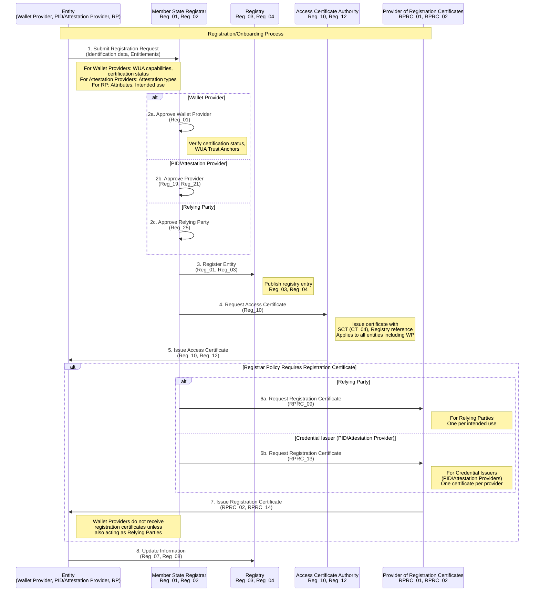
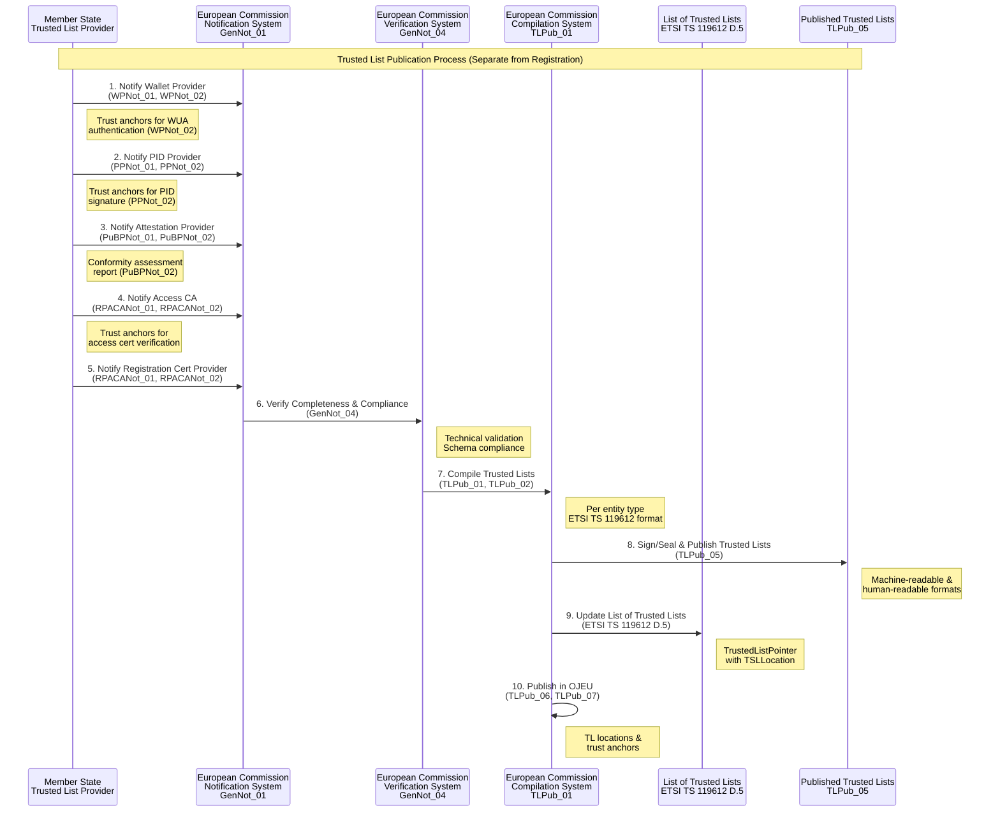
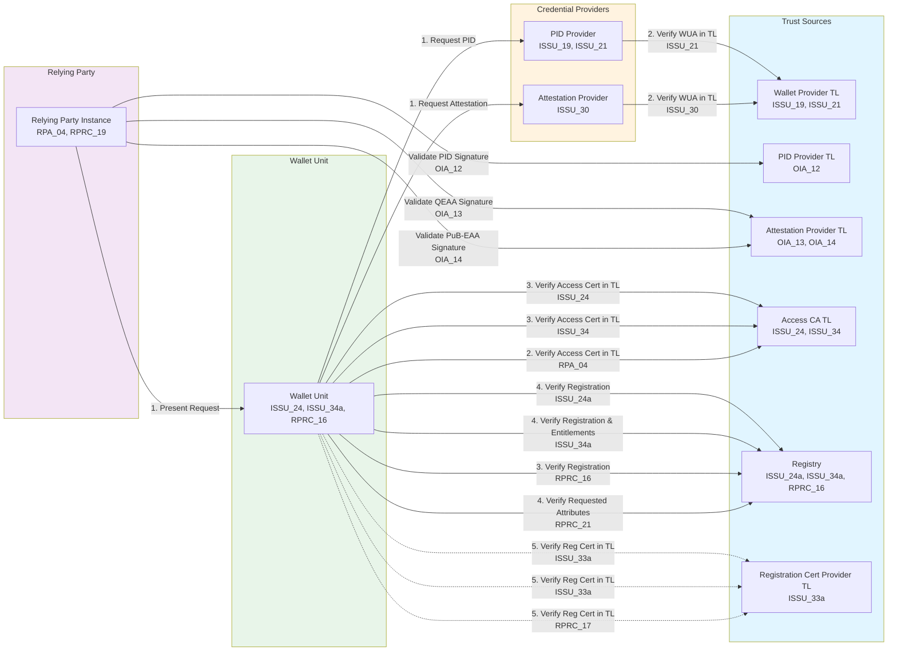
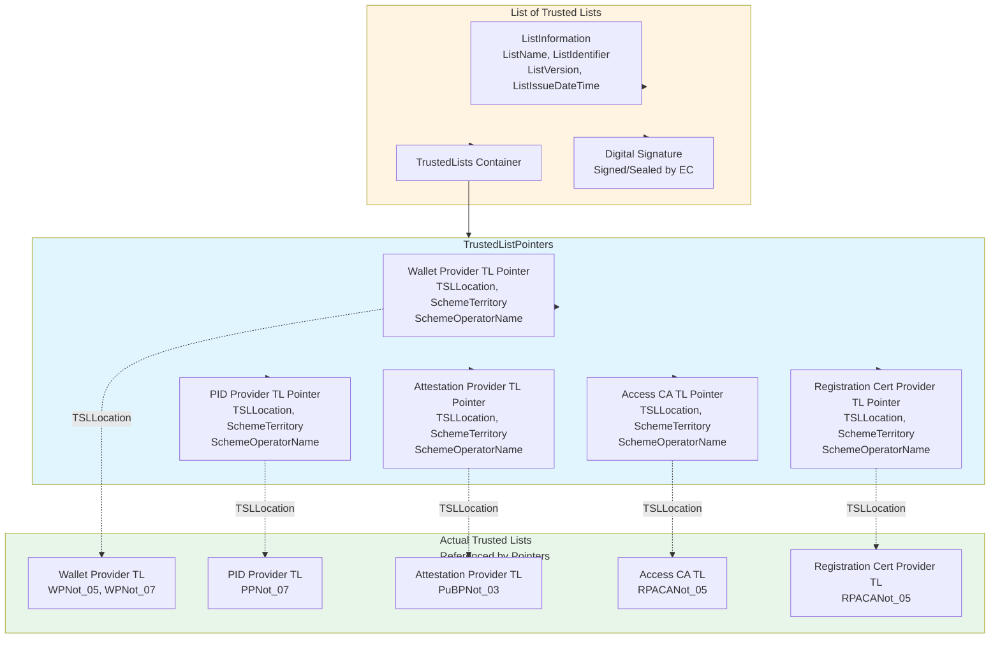

# Trust Infrastructure Schema: Onboarding and Trusted Lists

This document provides a comprehensive schema and graphical representation of the EUDI Wallet trust infrastructure, focusing on two main processes: **Onboarding** (Registration) and **Trusted List Publication**. These processes are separated to align with the Architecture and Reference Framework (ARF).

## Overview

The trust infrastructure consists of two distinct but related processes:

1. **Registration/Onboarding**: Entities register with Member State Registrars, providing identification data and entitlements
2. **Trusted List Publication**: Member States notify entities to the European Commission, which compiles and publishes Trusted Lists

Both processes are essential for establishing and maintaining trust in the EUDI Wallet ecosystem.

---

## 1. Trust Infrastructure Architecture

### 1.1 Core Components

The trust infrastructure involves the following key components:

- **Member State Registrar**: Manages registration of entities (Wallet Providers, PID Providers, Attestation Providers, Relying Parties)
- **Access Certificate Authority**: Issues access certificates to registered entities
- **Provider of Registration Certificates**: Optionally issues registration certificates detailing entitlements
- **Trusted List Provider (MS)**: Publishes Trusted Lists for entities in the Member State
- **European Commission**: Receives notifications, compiles Trusted Lists, and publishes the List of Trusted Lists (LoTL)

### 1.2 Entity Types

The following entities participate in the trust infrastructure:

- **Wallet Providers (WP)**: Provide certified Wallet Solutions
- **PID Providers**: Issue Person Identification Data
- **Attestation Providers**: QEAA Providers, PuB-EAA Providers, EAA Providers
- **Relying Parties (RP)**: Request attributes from Wallet Units
- **Access Certificate Authorities**: Issue access certificates
- **Providers of Registration Certificates**: Issue registration certificates

---

## 2. Registration/Onboarding Process

The registration process is managed by Member State Registrars and involves:

1. Entity registration with identification data and entitlements
2. Access certificate issuance by Access Certificate Authority
3. Optional registration certificate issuance by Provider of Registration Certificates
4. Registry publication for transparency and online relying party verification, as required in [ARF version 2.7.3](https://eudi.dev/2.7.3/architecture-and-reference-framework-main/#311-relying-parties-and-intermediaries) when registration certs are not issued.

### 2.1 Registration Flow

Entities must register with their Member State Registrar before participating in the ecosystem. The registration includes:

- **Identification data**: Name, country, business registration number
- **Entitlements**: 
  - For Wallet Providers: Wallet solution certification status, Wallet Instance Attestation (WUA) capabilities
  - For Attestation Providers: Types of attestations they can issue
  - For Relying Parties: Attributes they can request, intended use
- **Service supply points**: URLs where services are available

#### Wallet Provider Registration

Wallet Providers register with Member State Registrars according to **Reg_01**. The registration process for Wallet Providers includes:

- **Provider identification**: Company name, country, business registration number
- **Wallet solution information**: Certification status, compliance verification
- **Wallet Instance Attestation (WUA)**: Trust Anchors for WUA authentication (required for Trusted List notification per **WPNot_02**)
- **Security compliance**: Security compliance verification and attestation
- **Access certificate**: Issued by Access Certificate Authority per **Reg_10** (applies to all registered entities including Wallet Providers)

> **Note**: While Wallet Providers follow the same general registration process as other entities (per **Reg_01** and **Reg_10**), they have additional requirements for Trusted List notification (per **WPNot_01**, **WPNot_02**) that involve providing Trust Anchors for WUA authentication. The registration process enables Wallet Providers to participate in the ecosystem, while the Trusted List publication process (separate from registration) establishes cryptographic Trust Anchors for validation.

### 2.2 Access Certificate Issuance

After registration, the Access Certificate Authority issues access certificates to registered entities. These certificates:
- Enable authentication during service interactions
- Reference the registry for entitlement verification
- Include Signed Certificate Timestamps (SCT) for Certificate Transparency

### 2.3 Registration Certificate Issuance (Optional)

If the Registrar policy requires it, the Provider of Registration Certificates issues registration certificates that:
- Detail the entity's registration status
- Specify entitlements (attestation types for Credential Issuers, attributes for Relying Parties)
- Enable Wallet Units to verify entity entitlements

Registration certificates are issued per:
- **RPRC_09**: For Relying Parties (Registrar MAY decide to issue registration certificates to Relying Parties)
- **RPRC_13**: For Credential Issuers (PID Providers, Attestation Providers) (Registrar MAY decide to issue registration certificates to Providers)

> **Note**: Wallet Providers do not receive registration certificates unless they are also acting as Relying Parties. In that case, they would receive registration certificates per **RPRC_09** for their Relying Party role, not per **RPRC_13**.

---

## 3. Trusted List Publication Process

The Trusted List publication process is separate from registration and involves:

1. Member State notification to European Commission
2. Commission verification and compilation
3. Trusted List publication (signed/sealed)
4. List of Trusted Lists (LoTL) maintenance

### 3.1 Notification Process

Member States notify the following entities to the European Commission:
- Wallet Providers (with trust anchors for WUA authentication)
- PID Providers (with trust anchors for PID signature verification)
- Attestation Providers (PuB-EAA Providers with conformity assessment reports)
- Access Certificate Authorities (with trust anchors for access certificate verification)
- Providers of Registration Certificates (with trust anchors for registration certificate verification)

### 3.2 Trusted List Compilation

The European Commission:
- Verifies completeness and technical compliance of notified data
- Compiles Trusted Lists per entity type
- Signs/seals Trusted Lists
- Publishes Trusted Lists in machine-readable and human-readable formats

### 3.3 List of Trusted Lists (LoTL)

Per ETSI TS 119 612 clause D.5, the Commission maintains a List of Trusted Lists that:
- Contains pointers to all published Trusted Lists
- Enables cross-border trust establishment
- Provides centralized trusted list distribution
- Supports federation-level service discovery

---

## 4. Key Requirements References

Below is a list of the main requirements relating to the entity registration and Trusted List publication processes. 

### 4.1 Registration Requirements

The matrixes collects all the ARF HLRs about the registration phase.

| Requirement | Description | Source |
|------------|-------------|--------|
| **Reg_01** | Member States SHALL provide processes for entity registration | Topic 27 |
| **Reg_10** | Access Certificate Authority SHALL issue access certificates to all registered entities | Topic 27, Topic 31 |
| **Reg_19** | Member States SHALL approve PID Providers according to well-defined policy | Topic 27 |
| **Reg_21** | Member States SHALL approve Attestation Providers according to well-defined policy | Topic 27 |
| **Reg_25** | Member States SHALL identify Relying Parties at appropriate confidence level | Topic 27 |
| **RPRC_09** | Registrar MAY decide to issue registration certificates to Relying Parties | Topic 27, Topic 44 |
| **RPRC_13** | Registrar MAY decide to issue registration certificates to Providers | Topic 27, Topic 44 |

**Note**: **Reg_01** applies to all entities including Wallet Providers. **Reg_10** requires Access Certificates to be issued to "all registered entities", which includes Wallet Providers. **RPRC_13** applies to Registration Certificates for Credential Issuers (PID Providers, Attestation Providers), not Wallet Providers. Wallet Providers would only receive registration certificates if they are also acting as Relying Parties, in which case **RPRC_09** would apply.

### 4.2 Trusted List Requirements

| Requirement | Description | Source |
|------------|-------------|--------|
| **GenNot_01** | Member States SHALL notify entities to European Commission | Topic 31 |
| **GenNot_03** | Commission SHALL enable secure notification, verification, and publication | Topic 31 |
| **GenNot_04** | Commission SHALL verify completeness and technical compliance | Topic 31 |
| **WPNot_01** | Commission SHALL establish technical specifications for Wallet Provider information | Topic 31 |
| **PPNot_01** | Commission SHALL establish technical specifications for PID Provider information | Topic 31 |
| **PuBPNot_01** | Commission SHALL establish technical specifications for PuB-EAA Provider information | Topic 31 |
| **RPACANot_01** | Commission SHALL establish technical specifications for Access CA information | Topic 31 |
| **TLPub_01** | Commission SHALL establish technical specifications for Trusted List publication | Topic 31 |
| **TLPub_06** | Commission SHALL publish Trusted List locations in OJEU | Topic 31 |
| **TLPub_07** | Commission SHALL publish trust anchors in OJEU | Topic 31 |

### 4.3 Trust Evaluation Requirements

| Requirement | Description | Source |
|------------|-------------|--------|
| **ISSU_19** | PID Providers SHALL accept trust anchors in Wallet Provider Trusted Lists | Topic 10, Topic 31 |
| **ISSU_21** | PID Providers SHALL verify Wallet Provider presence in Trusted List | Topic 10, Topic 31 |
| **ISSU_24** | Wallet Units SHALL authenticate and validate access certificates using Access CA Trusted Lists | Topic 10, Topic 27 |
| **ISSU_24a** | Wallet Units SHALL verify PID Provider registration before PID issuance | Topic 10, Topic 27, Topic 44 |
| **ISSU_34a** | Wallet Units SHALL verify Attestation Provider registration before attestation issuance | Topic 10, Topic 27, Topic 44 |
| **RPA_04** | Wallet Units SHALL accept trust anchors in Relying Party Access CA Trusted Lists | Topic 6 |
| **RPRC_16** | Wallet Units SHALL offer Users possibility to verify Relying Party registration | Topic 44 |
| **RPRC_21** | Wallet Units SHALL verify requested attributes are registered | Topic 44 |

---

## 5. Trust Infrastructure Diagrams

The following Mermaid diagrams illustrate the trust infrastructure architecture and processes.

### 5.1 Overall Trust Infrastructure Architecture

```mermaid
graph TB
    subgraph MS["Member State"]
        Registrar[Registrar<br/>Reg_01, Reg_02]
        AccessCA[Access Certificate Authority<br/>Reg_10, Reg_11]
        RegCertProv[Provider of Registration Certificates<br/>RPRC_01, RPRC_02]
        TLProvider[Trusted List Provider<br/>MS Component]
        Registry[Registry<br/>Reg_03, Reg_04]
    end

    subgraph EC["European Commission"]
        ECNotify[Notification System<br/>GenNot_01, GenNot_02]
        ECVerify[Verification System<br/>GenNot_04]
        ECCompile[Trusted List Compilation<br/>TLPub_01, TLPub_02]
        LoTL[List of Trusted Lists<br/>ETSI TS 119612 D.5]
    end

    subgraph Entities["Registered Entities"]
        WP[Wallet Provider<br/>WPNot_02]
        PID[PID Provider<br/>PPNot_02]
        AP[Attestation Provider<br/>PuBPNot_02]
        RP[Relying Party<br/>Reg_25]
    end

    subgraph TL["Published Trusted Lists"]
        WPTL[Wallet Provider TL<br/>WPNot_05]
        PIDTL[PID Provider TL<br/>PPNot_07]
        APTL[Attestation Provider TL<br/>PuBPNot_03]
        ACATL[Access CA TL<br/>RPACANot_05]
        RegCertTL[Registration Cert Provider TL<br/>RPACANot_05]
    end

    %% Registration Flow
    Entities -->|Register with identification & entitlements<br/>Reg_01 (all entities), Reg_19, Reg_21, Reg_25| Registrar
    Registrar -->|Approve & Register<br/>Reg_19, Reg_21| Registry
    Registrar -->|Request Access Cert<br/>Reg_10| AccessCA
    AccessCA -->|Issue Access Certificate<br/>Reg_10, Reg_12| Entities
    Registrar -.->|Optional: Request Reg Cert<br/>RPRC_09, RPRC_13| RegCertProv
    RegCertProv -.->|Issue Registration Certificate<br/>RPRC_02| Entities

    %% Notification Flow
    MS -->|Notify entities<br/>GenNot_01| ECNotify
    ECNotify -->|Verify completeness<br/>GenNot_04| ECVerify
    ECVerify -->|Compile Trusted Lists<br/>TLPub_01| ECCompile
    ECCompile -->|Publish Trusted Lists<br/>TLPub_05| TL
    ECCompile -->|Maintain List of Trusted Lists<br/>ETSI TS 119612 D.5| LoTL

    style MS fill:#e1f5ff
    style EC fill:#fff4e1
    style Entities fill:#e8f5e9
    style TL fill:#f3e5f5
```

### 5.2 Registration/Onboarding Process Flow



### 5.3 Trusted List Publication Process Flow



---



### 5.4 List of Trusted Lists Structure (ETSI TS 119612 D.5)



### 5.5 Entity Registration and Trusted List Relationship

```mermaid
graph TB
    subgraph Registration["Registration Process<br/>Managed by MS Registrar"]
        RegStep1[1. Entity Registration<br/>Reg_01 (all entities), Reg_19, Reg_21, Reg_25]
        RegStep2[2. Access Certificate Issuance<br/>Reg_10, Reg_12<br/>(all registered entities including WP)]
        RegStep3[3. Optional Registration Certificate<br/>RPRC_09 (RP), RPRC_13 (Credential Issuers)<br/>(WP only if also acting as RP)]
        RegStep4[4. Registry Publication<br/>Reg_03, Reg_04]
    end

    subgraph Notification["Notification Process<br/>MS to EC"]
        NotifStep1[1. MS Notification<br/>GenNot_01]
        NotifStep2[2. EC Verification<br/>GenNot_04]
        NotifStep3[3. EC Compilation<br/>TLPub_01, TLPub_02]
        NotifStep4[4. TL Publication<br/>TLPub_05]
    end

    subgraph Entities["Entities"]
        WP[Wallet Provider]
        PID[PID Provider]
        AP[Attestation Provider]
        RP[Relying Party]
        ACA[Access CA]
        RegCertProv[Registration Cert Provider]
    end

    subgraph TrustedLists["Published Trusted Lists"]
        WPTL[Wallet Provider TL<br/>WPNot_05]
        PIDTL[PID Provider TL<br/>PPNot_07]
        APTL[Attestation Provider TL<br/>PuBPNot_03]
        ACATL[Access CA TL<br/>RPACANot_05]
        RegCertTL[Registration Cert Provider TL<br/>RPACANot_05]
    end

    %% Registration Flow
    Entities -->|Register| RegStep1
    RegStep1 --> RegStep2
    RegStep2 --> RegStep3
    RegStep3 --> RegStep4

    %% Notification Flow (Separate Process)
    WP -.->|Notify| NotifStep1
    PID -.->|Notify| NotifStep1
    AP -.->|Notify| NotifStep1
    ACA -.->|Notify| NotifStep1
    RegCertProv -.->|Notify| NotifStep1

    NotifStep1 --> NotifStep2
    NotifStep2 --> NotifStep3
    NotifStep3 --> NotifStep4

    NotifStep4 --> TrustedLists

    %% Note: Registration and Notification are separate processes
    RegStep4 -.->|Registry data used for<br/>trust evaluation| TrustedLists

    style Registration fill:#e8f5e9
    style Notification fill:#fff4e1
    style Entities fill:#f3e5f5
    style TrustedLists fill:#e1f5ff
```

---

## 6. Key Distinctions

### 6.1 Registration vs. Trusted List Publication

| Aspect | Registration | Trusted List Publication |
|--------|-------------|---------------------------|
| **Purpose** | Enable entity participation in ecosystem | Establish trust anchors for validation |
| **Managed By** | Member State Registrar | Member State → European Commission |
| **Scope** | All registered entities (Wallet Providers, PID Providers, Attestation Providers, Relying Parties) | Selected entities (Wallet Providers, PID Providers, Attestation Providers, Access CAs) |
| **Output** | Registry entries, Access Certificates, Registration Certificates | Trusted Lists (signed/sealed), List of Trusted Lists |
| **Used For** | Entitlement verification, service access | Cryptographic trust validation |
| **Requirements** | Reg_01, Reg_10, RPRC_09, RPRC_13 | GenNot_01, TLPub_01, TLPub_05 |

---

## 7. Trust Evaluation

This section describes how trust is evaluated in the ecosystem using the registration data and Trusted Lists established through the onboarding and Trusted List publication processes.

### 7.1 Trust Evaluation Requirements

| Requirement | Description | Source |
|------------|-------------|--------|
| **ISSU_19** | PID Providers SHALL accept trust anchors in Wallet Provider Trusted Lists | Topic 31 |
| **ISSU_21** | PID Providers SHALL verify Wallet Provider presence in Trusted List | Topic 31 |
| **ISSU_24** | Wallet Units SHALL authenticate and validate access certificates using Access CA Trusted Lists | Topic 27 |
| **ISSU_24a** | Wallet Units SHALL verify PID Provider registration before PID issuance | Topic 27, Topic 44 |
| **ISSU_34a** | Wallet Units SHALL verify Attestation Provider registration before attestation issuance | Topic 27, Topic 44 |
| **RPA_04** | Wallet Units SHALL accept trust anchors in Relying Party Access CA Trusted Lists | Topic 31 |
| **RPRC_16** | Wallet Units SHALL offer Users possibility to verify Relying Party registration | Topic 44 |
| **RPRC_21** | Wallet Units SHALL verify requested attributes are registered | Topic 44 |

### 7.2 Trust Evaluation Flow


### 7.3 Trust Evaluation Points

Trust evaluation occurs at multiple points using different trust sources:

1. **During Credential Issuance**:
   - Wallet Units verify Provider registration (Registry) - **ISSU_24a, ISSU_34a**
   - Providers verify Wallet Provider in Trusted List - **ISSU_21, ISSU_30**

2. **During Presentation**:
   - Wallet Units verify Relying Party registration (Registry) - **RPRC_16, RPRC_21**
   - Wallet Units verify Access Certificates using Trusted Lists - **ISSU_24, ISSU_34, RPA_04**

3. **During Signature Validation**:
   - Relying Parties validate PID signatures using PID Provider TL - **OIA_12**
   - Relying Parties validate attestation signatures using Attestation Provider TL - **OIA_13, OIA_14**

---

## 8. Summary

The trust infrastructure operates through two distinct but complementary processes:

1. **Registration/Onboarding**: Managed at Member State level, enables entities to participate and defines their entitlements
2. **Trusted List Publication**: Managed at EU level, establishes cryptographic trust anchors for validation

Both processes are essential for the trust ecosystem:
- **Registration** provides operational authorization and entitlement management
- **Trusted Lists** provide cryptographic trust anchors for signature and certificate validation

The separation of these processes aligns with the ARF and allows for:
- Independent lifecycle management
- Different trust models (operational vs. cryptographic)
- Scalable cross-border trust establishment
- Clear separation of concerns between MS and EU levels

