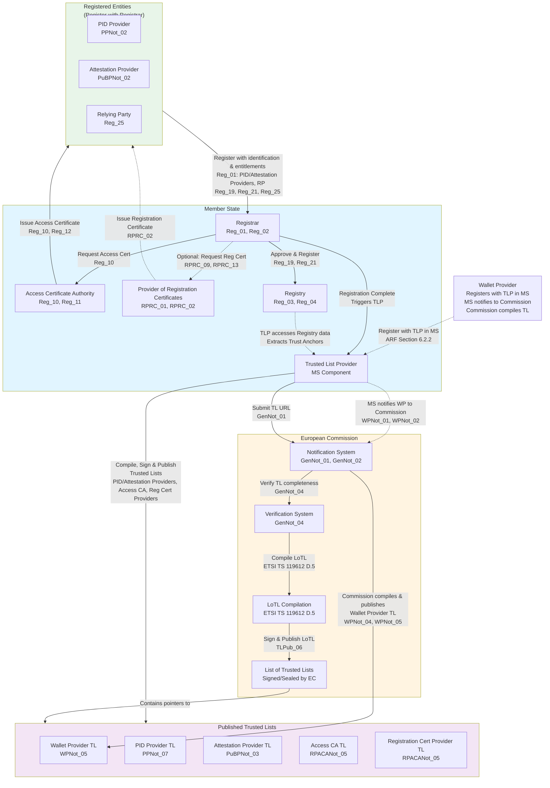
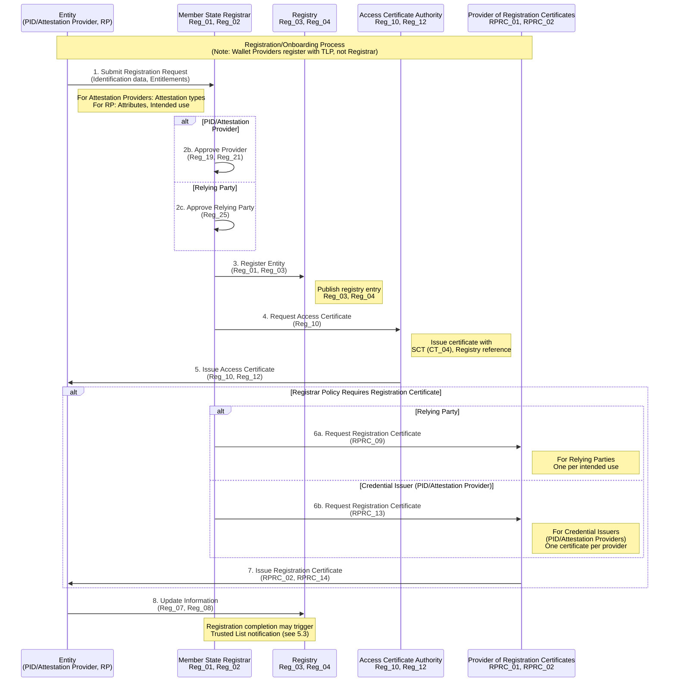
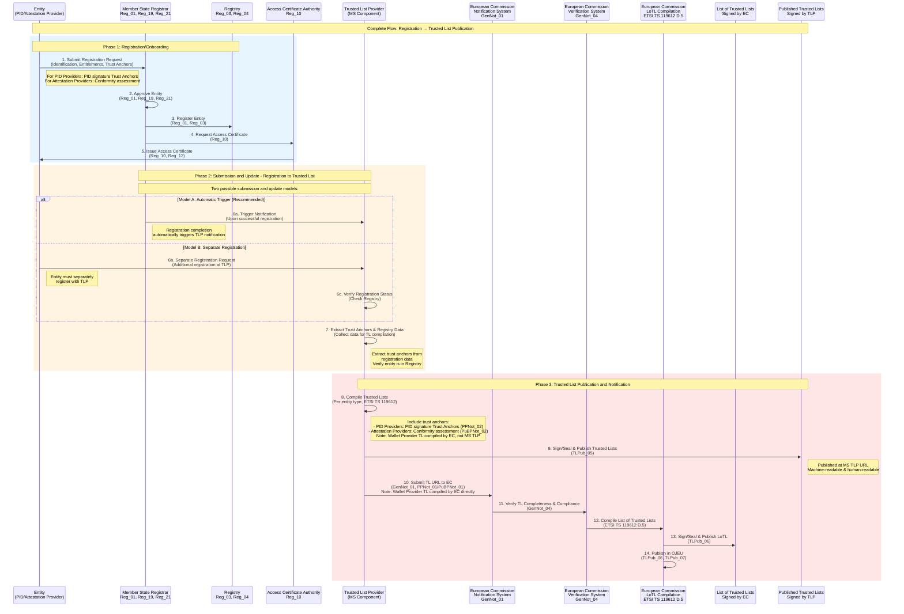
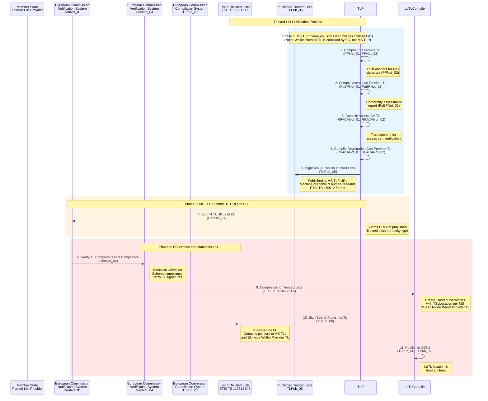
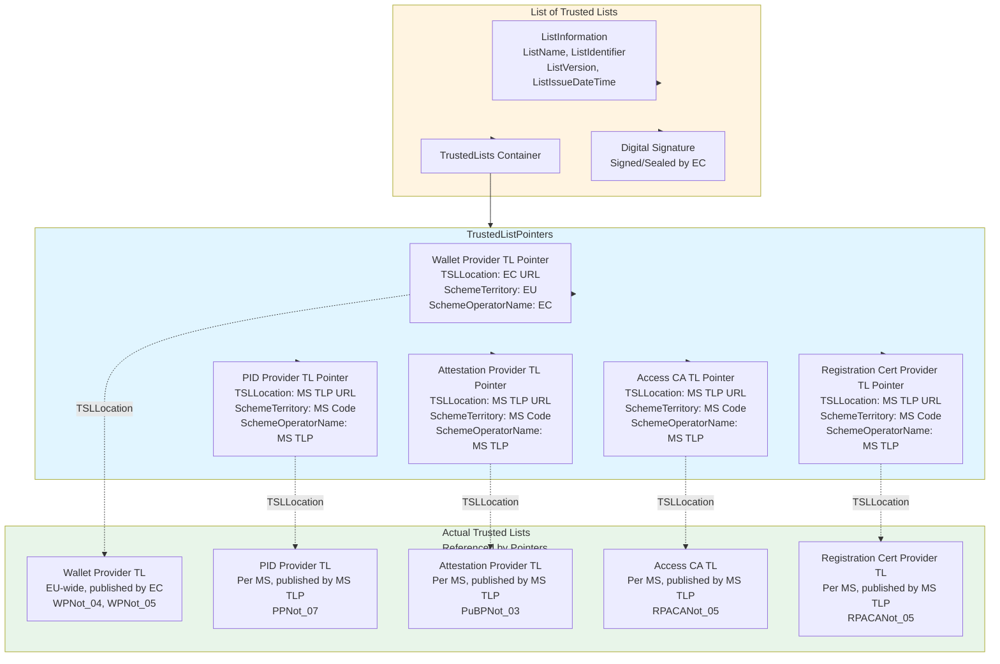
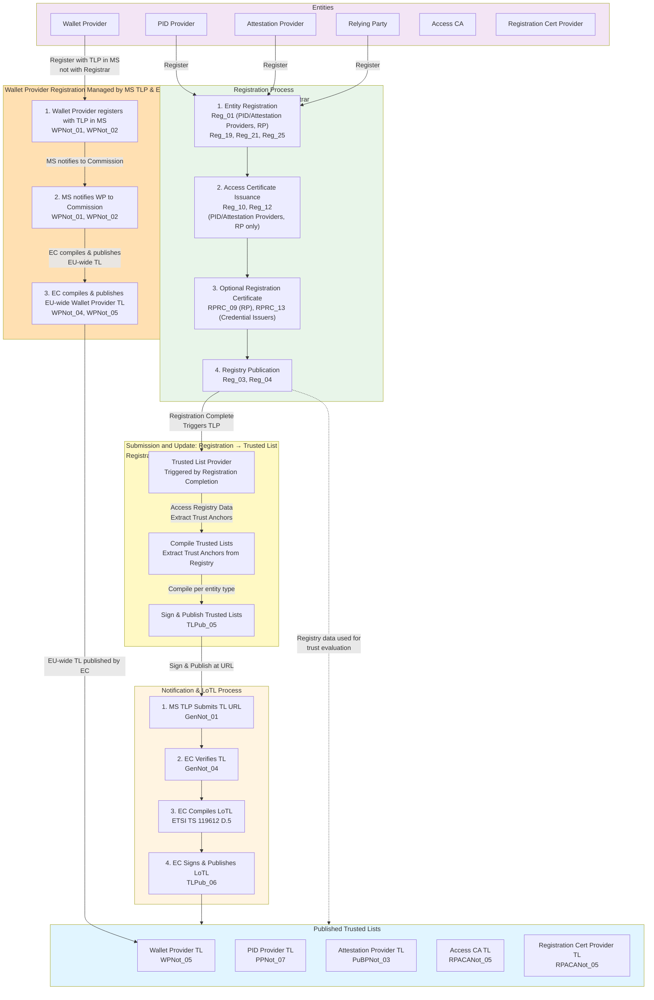
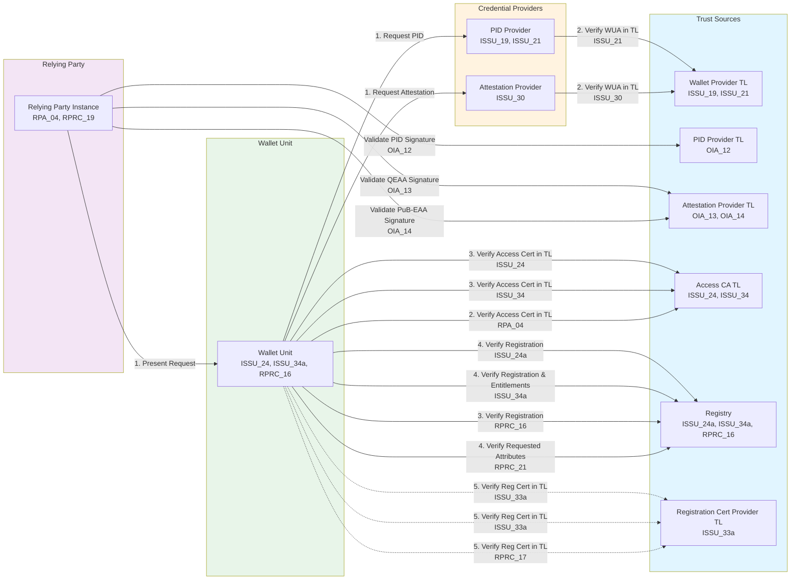

# Trust Infrastructure Schema: Onboarding and Trusted Lists

This document provides a comprehensive schema and graphical representation of the EUDI Wallet trust infrastructure, focusing on two main processes: **Onboarding** (Registration) and **Trusted List Publication**. These processes are separated to align with the Architecture and Reference Framework (ARF).

## Overview

The trust infrastructure consists of two distinct but related processes:

1. **Registration/Onboarding**: Entities register with Registrars, providing identification data and entitlements. According to the ARF (Section 3.17), entities (PID Providers, Attestation Providers, Relying Parties) are registered by a Registrar in the Member State where they reside. The ARF states that "Member States establish and oversee Registrars" and that "the process and terms and conditions for registering will be determined by each Member State." While the ARF consistently refers to "Member State Registrars" and does not explicitly mention sector-specific or European Commission-level Registrars, it does not explicitly rule them out either. **Note**: Wallet Providers register with a Trusted List Provider (TLP), not with a Registrar (per ARF Section 6.2.2).
2. **Trusted List Publication**: Member State Trusted List Providers (TLPs) compile, sign, and publish Trusted Lists per Member State for PID Providers, Attestation Providers, Access CAs, and Registration Cert Providers, then submit Trusted List URLs to the European Commission. For Wallet Providers, Member States notify Wallet Providers to the Commission, and the Commission compiles, signs/seals, and publishes a single EU-wide Wallet Provider Trusted List. The Commission maintains the List of Trusted Lists (LoTL) containing pointers to all published Trusted Lists. While the ARF does not explicitly specify the organizational level of Trusted List Providers, the notification requirements (GenNot_01) indicate that Member States notify entities to the Commission, suggesting TLPs operate at Member State level.

Both processes are required to establish the trust infrastructure in the EUDI Wallet ecosystem.

**Submission and Update Process**: The relationship between Registration and Trusted List Publication operates through the submission and update process between the Member State Registrar and the Trusted List Provider (TLP). Upon successful registration, the Registrar triggers the TLP to compile, sign, and publish Trusted Lists (for PID Providers, Attestation Providers, Access CAs, Registration Cert Providers). The TLP then submits the Trusted List URL to the European Commission. **Note**: Wallet Providers register directly with the TLP in their Member State, the Member State notifies Wallet Providers to the Commission, and the Commission compiles and publishes the EU-wide Wallet Provider Trusted List directly (no URL submission by TLP). See [Section 5.3.1](#531-submission-and-update-models-registration-to-trusted-list) for detailed submission and update models.

## 1. Trust Infrastructure Architecture

### 1.1 Trust Infrastructure Authorities

The trust infrastructure is operated by the following authorities and entities:

- **Registrar**: Manages registration of entities (PID Providers, Attestation Providers, Relying Parties). According to the ARF (Section 3.17), entities are registered by a Registrar in the Member State where they reside. The ARF states that "Member States establish and oversee Registrars" and that "the process and terms and conditions for registering will be determined by each Member State." While the ARF consistently refers to Member State-level Registrars, it does not explicitly specify whether Registrars can be sector-specific or established at European Commission level. Note: Wallet Providers register with a Trusted List Provider, not with a Registrar (per ARF Section 6.2.2).
- **Access Certificate Authority**: Issues access certificates to registered entities (PID Providers, Attestation Providers, Relying Parties). Note: Wallet Providers do not receive access certificates as they register with TLP, not with Registrar.
- **Provider of Registration Certificates**: Optionally issues registration certificates detailing entitlements.
- **Trusted List Provider (TLP)**: Compiles, signs, and publishes Trusted Lists for entities (PID Providers, Attestation Providers, Access CAs, Registration Cert Providers) per Member State, and submits Trusted List URLs to the European Commission. The ARF does not explicitly specify whether the TLP must be a Member State entity, a sector-specific body, or the European Commission itself. However, the notification process (GenNot_01) requires Member States to notify entities to the Commission, suggesting the TLP operates at Member State level. **Note**: Wallet Provider Trusted Lists are compiled and published by the European Commission, not by Member State TLPs.
- **European Commission**: Receives Trusted List URL notifications from Member State TLPs (for PID Providers, Attestation Providers, Access CAs, Registration Cert Providers), verifies Trusted Lists, compiles and publishes the Wallet Provider Trusted List (EU-wide), and compiles, signs, and publishes the List of Trusted Lists (LoTL).

### 1.2 Registered Entities

The following entities register with Registrars and participate in the trust infrastructure:

- **PID Providers**: Issue Person Identification Data. PID Providers must be approved by Member States according to a well-defined policy before registration (per **Reg_19**, [Topic 27](https://eudi.dev/2.7.3/annexes/annex-2/annex-2.02-high-level-requirements-by-topic/#a2316-topic-27---registration-of-pid-providers-providers-of-qeaas-pub-eaas-and-non-qualified-eaas-and-relying-parties)). Member States define specific vetting processes and rules of acceptance for inclusion in the PID Provider Registry. This is a policy-based approval process, not a technical certification like Wallet Solutions.
- **Attestation Providers**: QEAA Providers, PuB-EAA Providers, EAA Providers.
- **Relying Parties (RP)**: Request attributes from Wallet Units.

**Note**: Wallet Providers register with a Trusted List Provider (TLP), not with a Registrar (per [ARF Section 6.2.2](https://eudi.dev/2.7.3/architecture-and-reference-framework-main/#622-wallet-provider-registration-and-notification)). Wallet Solutions must be certified by Conformity Assessment Bodies (CABs) according to [Commission Implementing Regulation (EU) 2024/2981](https://eur-lex.europa.eu/eli/reg_impl/2024/2981/oj) (per [ARF Chapter 7](https://eudi.dev/2.7.3/architecture-and-reference-framework-main/#7-certification-and-risk-management)). Certification is performed against national certification schemes (transitory) and eventually a harmonized scheme under the [Cybersecurity Act (CSA)](https://eur-lex.europa.eu/eli/reg/2019/881/oj) (Regulation (EU) 2019/881), at assurance level High. See [Section 2.1.1](#211-wallet-provider-registration) for details.

## 2. Registration/Onboarding Process

The registration process is managed by Member State Registrars and involves (for PID Providers, Attestation Providers, and Relying Parties):

1. Entity registration with identification data and entitlements.
2. Access certificate issuance by Access Certificate Authority.
3. Optional registration certificate issuance by Provider of Registration Certificates.
4. Registry publication for transparency and online verification (per **Reg_03**, **Reg_04**). The registry is always published for all registered entities (PID Providers, Attestation Providers, Relying Parties) and serves as an alternative source when registration certificates are not available. Member States SHALL support the common API specified in [Technical Specification 5](https://github.com/eu-digital-identity-wallet/eudi-doc-standards-and-technical-specifications/blob/main/docs/technical-specifications/ts5-common-formats-and-api-for-rp-registration-information.md) for automated retrieval of registry entries (per **Reg_06**, Topic 27). The API uses a secure channel and does not require authentication. Wallet Units use the Registrar's online service URL to verify:
   - PID Provider registration (per **ISSU_24a**).
   - Attestation Provider registration and attestation types (per **ISSU_34a**).
   - Relying Party registration and requested attributes (per **RPRC_18**).

### 2.1 Registration Flow

Entities register with their Member State Registrar before participating in the ecosystem. The common set of data to be registered is specified in [ARF Section 6.3.2.2](https://eudi.dev/2.7.3/architecture-and-reference-framework-main/#6322-data-about-the-pid-provider-or-attestation-provider-is-included-in-the-registry) and [Section 6.4.2](https://eudi.dev/2.7.3/architecture-and-reference-framework-main/#642-relying-party-registration), and detailed in [Technical Specification 6](https://github.com/eu-digital-identity-wallet/eudi-doc-standards-and-technical-specifications/blob/main/docs/technical-specifications/ts6-common-set-of-rp-information-to-be-registered.md) per requirement **Reg_01a** (Topic 27).

The registration data includes:

- **Identification data**: Name, country, business registration number (as applicable).
- **Entitlements**:
  - **For PID Providers**: Attestation type(s) that the Provider intends to issue to Wallet Units (e.g., national PID).
  - **For QEAA Providers**: Attestation type(s) that the Provider intends to issue to Wallet Units (e.g., diplomas, professional qualifications).
  - **For PuB-EAA Providers**: Attestation type(s) that the Provider intends to issue to Wallet Units (e.g., mDLs, vehicle registration cards).
  - **For non-qualified EAA Providers**: Attestation type(s) that the Provider intends to issue to Wallet Units.
  - **For Relying Parties**: Attributes that the Relying Party intends to request from Wallet Units, and for what purpose (intended use). The Registrar also registers if the Relying Party intends to use the services of an intermediary, and if so, which one.
- **Service supply points**: URLs where services are available (e.g., PID issuance endpoint, attestation issuance endpoint, presentation request endpoint).

#### 2.1.1 Wallet Provider Registration

Wallet Providers register with a Trusted List Provider (TLP) in their Member State, not with a Registrar (per [ARF Section 6.2.2](https://eudi.dev/2.7.3/architecture-and-reference-framework-main/#622-wallet-provider-registration-and-notification)). The information to be notified about Wallet Providers is specified in **WPNot_01** and **WPNot_02** (Topic 31). The notification includes:

- **Identification data**: Member State/Country of establishment, name as registered in an official record, business registration number (where applicable).
- **Wallet Provider trust anchors**: Public keys and name supporting the authentication of Wallet Unit Attestations (WUA) issued by the Wallet Provider (per **WPNot_02**).

Note: Wallet Providers do not receive access certificates or registration certificates, as they do not register with a Registrar. The Wallet Solution provided by the Wallet Provider must be certified as described in [ARF Chapter 7](https://eudi.dev/2.7.3/architecture-and-reference-framework-main/#7-certification-and-risk-management).

> **Note**: Wallet Providers follow a different registration process than other entities. They register with a Trusted List Provider (TLP), not with a Registrar, and do not receive access certificates or registration certificates. The notification process (per **WPNot_01**, **WPNot_02**) involves providing Trust Anchors for WUA authentication, which are published in the Wallet Provider Trusted List.

### 2.2 Access Certificate Issuance

After registration, the Access Certificate Authority issues access certificates to registered entities (PID Providers, Attestation Providers, Relying Parties). Note: Wallet Providers do not receive access certificates as they register with TLP, not with Registrar. These certificates:
- Enable authentication during service interactions.
- Reference the registry for entitlement verification.
- Include Signed Certificate Timestamps (SCT) for Certificate Transparency.

### 2.3 Registration Certificate Issuance (Optional)

If the Registrar policy requires it, the Provider of Registration Certificates issues registration certificates that:
- Detail the entity's registration status.
- Specify entitlements (attestation types for Credential Issuers, attributes for Relying Parties).
- Enable Wallet Units to verify entity entitlements.

Registration certificates are issued per:
- **RPRC_09**: For Relying Parties (Registrar MAY decide to issue registration certificates to Relying Parties).
- **RPRC_13**: For Credential Issuers (PID Providers, Attestation Providers) (Registrar MAY decide to issue registration certificates to Providers).

> **Note**: Wallet Providers do not receive registration certificates unless they are also acting as Relying Parties. In that case, they would receive registration certificates per **RPRC_09** for their Relying Party role, not per **RPRC_13**.

## 3. Trusted List Publication Process

The Trusted List publication process is separate from registration and involves:

1. **For PID Providers, Attestation Providers, Access CAs, Registration Cert Providers**: Member State Trusted List Provider (TLP) compiles, signs, and publishes Trusted Lists per Member State, then submits Trusted List URL to European Commission.
2. **For Wallet Providers**: Member States notify Wallet Providers to the European Commission, and the Commission compiles, signs/seals, and publishes a single EU-wide Wallet Provider Trusted List.
3. Commission verifies and maintains the List of Trusted Lists (LoTL) containing pointers to all published Trusted Lists.
4. Commission signs and publishes the LoTL.

### 3.1 Trusted List Publication by Trusted List Provider

> **Note on Trusted List Provider Organizational Level**: The ARF ([Section 3.5](https://eudi.dev/2.7.3/architecture-and-reference-framework-main/#35-trusted-list-provider)) defines a Trusted List Provider (TLP) as "a body responsible for maintaining, managing, and publishing a Trusted List" but does not explicitly specify whether the TLP must be a Member State entity, a sector-specific body, or the European Commission itself. However, the notification requirements (GenNot_01) state that "Member States SHALL notify" entities to the Commission, and [Section 3.5](https://eudi.dev/2.7.3/architecture-and-reference-framework-main/#35-trusted-list-provider) states that "relevant entities must be notified to the Commission by a Member State." This suggests that TLPs operate at Member State level, though the ARF does not explicitly rule out other organizational models. There is also an inconsistency in the ARF itself ([Section 6.3.2](https://eudi.dev/2.7.3/architecture-and-reference-framework-main/#632-pid-provider-or-attestation-provider-registration-and-notification)) where line 2838 states that "A PID Provider or an Attestation Provider is registered by a Trusted List Provider" while line 2851 states that entities "register itself with a Registrar," regarding whether entities are registered by a TLP or by a Registrar.

The Trusted List Provider (TLP) is responsible for:

1. **Compiling Trusted Lists**: The TLP compiles Trusted Lists per entity type from registered entities:
   - PID Providers (with trust anchors for PID signature verification)
   - Attestation Providers (PuB-EAA Providers with conformity assessment reports)
   - Access Certificate Authorities (with trust anchors for access certificate verification)
   - Providers of Registration Certificates (with trust anchors for registration certificate verification)

**Note**: Wallet Provider Trusted Lists are compiled and published by the European Commission, not by Member State TLPs. Member States notify Wallet Providers to the Commission (per **WPNot_01**, **WPNot_02**), and the Commission compiles, signs/seals, and publishes a single EU-wide Wallet Provider Trusted List (per **WPNot_04**, **WPNot_05**). Per [ETSI TS 119 602 Annex E](https://www.etsi.org/deliver/etsi_ts/119600_119699/119602/01.01.01_60/ts_119602v010101p.pdf), the Scheme Territory for the Wallet Provider Trusted List is "EU", indicating it is a single EU-wide list containing all Wallet Providers from all Member States, not separate lists per Member State. This is different from other Trusted Lists (PID Provider, Attestation Provider, Access CA, Registration Cert Provider) where Member State TLPs compile, sign, and publish separate Trusted Lists per Member State, then submit TL URLs to the Commission.

2. **Signing Trusted Lists**: The TLP signs/seals the Trusted Lists using its signing key (for PID Providers, Attestation Providers, Access CAs, and Registration Cert Providers). **Note**: Wallet Provider Trusted Lists are signed/sealed by the European Commission, not by Member State TLPs.

3. **Publishing Trusted Lists**: The TLP publishes the signed Trusted Lists in machine-readable and human-readable formats at a publicly accessible URL (for PID Providers, Attestation Providers, Access CAs, and Registration Cert Providers). **Note**: Wallet Provider Trusted Lists are published by the European Commission, not by Member State TLPs. Per [ETSI TS 119 602 V1.1.1](https://www.etsi.org/deliver/etsi_ts/119600_119699/119602/01.01.01_60/ts_119602v010101p.pdf) (Data model for Lists of Trusted Entities), the format requirements are:
   - **Wallet Provider Trusted Lists** (Annex E, published by EC): Must be published in **JSON format with compact JAdES Baseline B signature** (per ETSI TS 119 182-1).
   - **PID Provider Trusted Lists** (Annex D, published by MS TLP): Must be published in **JSON format with compact JAdES Baseline B signature** (per ETSI TS 119 182-1).
   - **Access CA Trusted Lists** (Annex F - WRPAC Providers, published by MS TLP): Must be published in **JSON format with compact JAdES Baseline B signature** (per ETSI TS 119 182-1).
   - **Registration Cert Provider Trusted Lists** (Annex G - WRPRC Providers, published by MS TLP): Must be published in **JSON format with compact JAdES Baseline B signature** (per ETSI TS 119 182-1).
   - **Pub-EAA Provider Trusted Lists** (Annex H, published by MS TLP): May be published in either **JSON format with compact JAdES Baseline B signature** OR **XML format with XAdES Baseline B signature** (per ETSI EN 319 132-1). When XML is used, it must be an enveloped digital signature.

All Trusted Lists must comply with ETSI TS 119 602 data model and the specific profiles defined in the annexes, or with ETSI TS 119 612 v2.1.1 or a suitable profile derived from ETSI TS 102 231 (per **WPNot_05**, **PPNot_07**, **PuBPNot_03**, **RPACANot_05**).

4. **Submitting to European Commission**: The TLP submits the published Trusted List URL to the European Commission (for PID Providers, Attestation Providers, Access CAs, and Registration Cert Providers). **Note**: For Wallet Providers, Member States notify Wallet Providers to the Commission, and the Commission compiles and publishes the Wallet Provider Trusted List directly (no URL submission by TLP).

The process is triggered by successful registration with the Member State Registrar (for PID Providers, Attestation Providers, Access CAs, and Registration Cert Providers). The TLP:
- Receives notification of successful registration from the Registrar (or accesses Registry data).
- Extracts trust anchors and relevant data from the Registry.
- Compiles Trusted Lists according to ETSI TS 119 612 specifications.
- Signs and publishes Trusted Lists.
- Submits the Trusted List URL to the European Commission.

> **Note**: The TLP extracts trust anchors that were provided during registration (e.g., PID signature Trust Anchors for PID Providers) and includes them in the Trusted Lists. **Note on Wallet Providers**: Wallet Providers register with a TLP in their Member State, and the Member State notifies Wallet Providers to the European Commission (per ARF Section 6.2.2). The European Commission then compiles, signs/seals, and publishes the Wallet Provider Trusted List (per **WPNot_04**), not the Member State TLP. See [Section 5.3.1](#531-submission-and-update-models-registration-to-trusted-list) for details on submission and update models.

### 3.2 European Commission Verification and LoTL Maintenance

The European Commission:
- **For Wallet Providers**: Compiles, signs/seals, and publishes the Wallet Provider Trusted List directly (per **WPNot_04**, **WPNot_05**). Member States notify Wallet Providers to the Commission, and the Commission compiles the Trusted List.
- **For other entities**: Receives Trusted List URL notifications from Member State TLPs, verifies completeness and technical compliance of published Trusted Lists.
- Maintains the List of Trusted Lists (LoTL) containing pointers to all published Trusted Lists.
- Signs/seals the LoTL.
- Publishes the LoTL in machine-readable and human-readable formats.

### 3.3 List of Trusted Lists (LoTL)

Per ETSI TS 119 612 clause D.5, the European Commission maintains a List of Trusted Lists (LoTL) that:
- Contains pointers (TrustedListPointers) to all published Trusted Lists:
  - Trusted Lists published by Member State TLPs (PID Provider TLs, Attestation Provider TLs, Access CA TLs, Registration Cert Provider TLs) - one pointer per Member State per entity type.
  - The single EU-wide Wallet Provider Trusted List published by the European Commission.
- Each pointer includes the Trusted List location (TSLLocation), scheme territory, and scheme operator name.
- Facilitates cross-border trust establishment.
- Centralizes trusted list distribution.
- Supports federation-level service discovery.

The European Commission:
- Compiles the LoTL from:
  - Trusted List URL notifications received from Member State TLPs (for PID Providers, Attestation Providers, Access CAs, Registration Cert Providers).
  - The directly published Wallet Provider Trusted List (compiled and published by the Commission itself).
- Signs/seals the LoTL using the Commission's signing key.
- Publishes the LoTL in machine-readable and human-readable formats.
- Publishes LoTL location and trust anchors in the Official Journal of the European Union (OJEU).

## 4. Key Requirements References

Below is a list of the main requirements relating to the entity registration and Trusted List publication processes. 

### 4.1 Registration Requirements

The matrixes collects all the ARF HLRs about the registration phase.

| Requirement | Description | Source |
|------------|-------------|--------|
| **Reg_01** | Member States SHALL provide processes for entity registration | Topic 27 |
| **Reg_10** | Access Certificate Authority SHALL issue access certificates to all registered entities (PID Providers, Attestation Providers, Relying Parties). Note: Wallet Providers do not receive access certificates. | Topic 27, Topic 31 |
| **Reg_19** | Member States SHALL approve PID Providers according to well-defined policy | Topic 27 |
| **Reg_21** | Member States SHALL approve Attestation Providers according to well-defined policy | Topic 27 |
| **Reg_25** | Member States SHALL identify Relying Parties at appropriate confidence level | Topic 27 |
| **RPRC_09** | Registrar MAY decide to issue registration certificates to Relying Parties | Topic 27, Topic 44 |
| **RPRC_13** | Registrar MAY decide to issue registration certificates to Providers | Topic 27, Topic 44 |

**Note**: **Reg_01** applies to PID Providers, Attestation Providers, and Relying Parties. Wallet Providers register with a Trusted List Provider, not with a Registrar (per ARF Section 6.2.2). **Reg_10** requires Access Certificates to be issued to all registered entities (PID Providers, Attestation Providers, Relying Parties). **RPRC_13** applies to Registration Certificates for Credential Issuers (PID Providers, Attestation Providers). Wallet Providers do not receive access certificates or registration certificates, as they do not register with a Registrar.

### 4.2 Trusted List Requirements

| Requirement | Description | Source |
|------------|-------------|--------|
| **GenNot_01** | Member States SHALL notify entities to European Commission | Topic 31 |
| **GenNot_03** | Commission SHALL enable secure notification, verification, and publication | Topic 31 |
| **GenNot_04** | Commission SHALL verify completeness and technical compliance | Topic 31 |
| **WPNot_01** | Commission SHALL establish technical specifications for Wallet Provider information | Topic 31 |
| **PPNot_01** | Commission SHALL establish technical specifications for PID Provider information | Topic 31 |
| **PuBPNot_01** | Commission SHALL establish technical specifications for PuB-EAA Provider information | Topic 31 |
| **RPACANot_01** | Commission SHALL establish technical specifications for Access CA information | Topic 31 |
| **TLPub_01** | Commission SHALL establish technical specifications for Trusted List publication | Topic 31 |
| **TLPub_06** | Commission SHALL publish Trusted List locations in OJEU | Topic 31 |
| **TLPub_07** | Commission SHALL publish trust anchors in OJEU | Topic 31 |

## 5. Trust Infrastructure Diagrams

The following Mermaid diagrams illustrate the trust infrastructure architecture and processes.

### 5.1 Overall Trust Infrastructure Architecture

### 5.2 Registration/Onboarding Process Flow

### 5.3 Complete Registration to Trusted List Publication Flow

This diagram shows the complete end-to-end process from entity registration through to Trusted List publication, including the submission and update process between Registrar and Trusted List Provider.

### 5.3.1 Submission and Update Models: Registration to Trusted List

The relationship between Registrar and Trusted List Provider (TLP) can be implemented in two ways, as referenced in [ARF section 6.3.2](https://eudi.dev/2.5.0/architecture-and-reference-framework-main/#632-pid-provider-or-attestation-provider-registration-and-notification):

#### Model A: Automatic Trigger (Recommended)

In this model, successful registration with the Registrar automatically triggers the Trusted List Provider to prepare and submit the Trusted List URL to the European Commission.

**Process:**
1. Entity registers with Registrar (per **Reg_01**, **Reg_19**, **Reg_21**)
2. Registrar completes registration and publishes to Registry
3. Registrar automatically notifies TLP of successful registration
4. TLP extracts trust anchors and registry data
5. TLP prepares and submits Trusted List URL to European Commission

**Advantages:**
- Single registration point for entities.
- Reduced administrative burden.
- Maintains consistency between Registry and Trusted Lists.
- Automatic synchronization.

**Requirements:**
- Registrar and TLP must have integration mechanisms for submission and update.
- TLP must have access to Registry data.
- Clear definition of when registration is "complete" and triggers notification.

#### Model B: Separate Registration

In this model, entities must separately register with both the Registrar and the Trusted List Provider.

**Process:**
1. Entity registers with Registrar (per **Reg_01**, **Reg_19**, **Reg_21**)
2. Registrar completes registration and publishes to Registry
3. Entity separately registers with TLP (or TLP initiates based on Registry data)
4. TLP verifies entity is registered in Registry
5. TLP prepares and submits Trusted List URL to European Commission

**Advantages:**
- Clear separation of concerns.
- Independent lifecycle management.
- Permits different approval criteria.

**Disadvantages:**
- Requires entities to manage two registration processes.
- Potential for inconsistency between Registry and Trusted Lists.
- Additional administrative overhead.

#### Recommendation

**Model A (Automatic Trigger)** is recommended for logical coherence and operational efficiency. The Registrar, upon successful registration, should automatically trigger the TLP to compile, sign, and publish Trusted Lists. This results in:

- Automatic processing of all registered entities (PID Providers, Attestation Providers) that require Trusted List inclusion. Note: Wallet Providers register directly with TLP.
- Synchronized Registry and Trusted Lists.
- Single point of registration for entities.
- Process managed by the Registrar, with TLP acting as the Trusted List publisher.

The TLP's role in this model is to:
- Receive registration completion notifications from Registrar (for PID Providers, Attestation Providers, Access CAs, Registration Cert Providers).
- Extract trust anchors and relevant data from Registry.
- Compile Trusted Lists per entity type according to ETSI TS 119 612 specifications (for PID Providers, Attestation Providers, Access CAs, Registration Cert Providers).
- Sign/seal and publish Trusted Lists at publicly accessible URLs (per Member State).
- Submit Trusted List URLs to European Commission.

**Note on Wallet Providers**: Wallet Providers follow a different process. They register with TLP in their Member State, the Member State notifies Wallet Providers to the Commission, and the Commission compiles, signs/seals, and publishes the EU-wide Wallet Provider Trusted List directly. The TLP does not compile or publish Wallet Provider Trusted Lists.

### 5.3.2 Trusted List Publication Process Flow (Notification Only)

This diagram focuses solely on the notification process, as referenced in the original document structure.

### 5.4 List of Trusted Lists Structure (ETSI TS 119612 D.5)

### 5.5 Entity Registration and Trusted List Relationship

## 6. Key Distinctions

### 6.1 Registration vs. Trusted List Publication

| Aspect | Registration | Trusted List Publication |
|--------|-------------|---------------------------|
| **Purpose** | Enable entity participation in ecosystem | Establish trust anchors for validation |
| **Managed By** | Member State Registrar | Member State TLP compiles, signs & publishes TLs per MS (PID/Attestation Providers, Access CAs, Reg Cert Providers); EC compiles & publishes EU-wide Wallet Provider TL; EC maintains LoTL |
| **Scope** | PID Providers, Attestation Providers, Relying Parties (register with Registrar). Wallet Providers register separately with TLP. | Selected entities: Wallet Providers (EU-wide TL published by EC), PID Providers (per MS TL published by MS TLP), Attestation Providers (per MS TL published by MS TLP), Access CAs (per MS TL published by MS TLP) |
| **Output** | Registry entries, Access Certificates, Registration Certificates | Trusted Lists: Wallet Provider TL (EU-wide, signed/sealed by EC), other TLs (per MS, signed/sealed by MS TLP); List of Trusted Lists (signed/sealed by EC) |
| **Used For** | Entitlement verification, service access | Cryptographic trust validation |
| **Requirements** | Reg_01, Reg_10, RPRC_09, RPRC_13 | GenNot_01, TLPub_01, TLPub_05, TLPub_06 |
| **Submission and Update** | Managed by Registrar | For PID/Attestation Providers, Access CAs, Reg Cert Providers: Triggered by Registrar registration completion; TLP compiles, signs & publishes TLs per MS, then submits TL URL to EC. For Wallet Providers: MS notifies WP to EC, EC compiles & publishes EU-wide TL directly. |

## 8. Summary

The trust infrastructure operates through two distinct but complementary processes:

1. **Registration/Onboarding**: Managed at Member State level, entities (PID Providers, Attestation Providers, Relying Parties) register with Registrars and entitlements are defined. Wallet Providers register with Trusted List Providers (TLPs) in their Member State, not with Registrars.
2. **Trusted List Publication**: 
   - **For PID Providers, Attestation Providers, Access CAs, Registration Cert Providers**: Managed at Member State level - MS TLPs compile, sign, and publish Trusted Lists per Member State, then submit TL URLs to the European Commission.
   - **For Wallet Providers**: Managed at EU level - Member States notify Wallet Providers to the Commission, and the Commission compiles, signs/seals, and publishes a single EU-wide Wallet Provider Trusted List.

Both processes are required for the trust ecosystem:
- **Registration**: Defines operational authorization and entitlement management.
- **Trusted Lists**: Contain cryptographic trust anchors for signature and certificate validation.

The separation of these processes aligns with the ARF and enables:
- Independent lifecycle management.
- Different trust models (operational vs. cryptographic).
- Scalable cross-border trust establishment.
- Clear separation of concerns between MS and EU levels.
- EU-wide Wallet Provider Trusted List for consistent Wallet Provider recognition across all Member States.

## 7. Trust Evaluation

> **Note**: This section describes trust evaluation processes that use the registration data and Trusted Lists established through the onboarding and Trusted List publication processes described in the main document. As the focus of this document is on **Onboarding (Registration)** and **Trusted List Publication** processes, this section is provided for reference but could be moved to a separate document in the future.

This section describes how trust is evaluated in the ecosystem using the registration data and Trusted Lists established through the onboarding and Trusted List publication processes.

### 7.1 Trust Evaluation Requirements

| Requirement | Description | Source |
|------------|-------------|--------|
| **ISSU_19** | PID Providers SHALL accept trust anchors in Wallet Provider Trusted Lists | Topic 31 |
| **ISSU_21** | PID Providers SHALL verify Wallet Provider presence in Trusted List | Topic 31 |
| **ISSU_24** | Wallet Units SHALL authenticate and validate access certificates using Access CA Trusted Lists | Topic 27 |
| **ISSU_24a** | Wallet Units SHALL verify PID Provider registration before PID issuance | Topic 27, Topic 44 |
| **ISSU_34a** | Wallet Units SHALL verify Attestation Provider registration before attestation issuance | Topic 27, Topic 44 |
| **RPA_04** | Wallet Units SHALL accept trust anchors in Relying Party Access CA Trusted Lists | Topic 31 |
| **RPRC_16** | Wallet Units SHALL offer Users possibility to verify Relying Party registration | Topic 44 |
| **RPRC_21** | Wallet Units SHALL verify requested attributes are registered | Topic 44 |

### 7.2 Trust Evaluation Flow

### 7.3 Trust Evaluation Points

Trust evaluation occurs at multiple points using different trust sources:

1. **During Credential Issuance**:
   - Wallet Units verify Provider registration (Registry) - **ISSU_24a, ISSU_34a**
   - Providers verify Wallet Provider in Trusted List - **ISSU_21, ISSU_30**

2. **During Presentation**:
   - Wallet Units verify Relying Party registration (Registry) - **RPRC_16, RPRC_21**
   - Wallet Units verify Access Certificates using Trusted Lists - **ISSU_24, ISSU_34, RPA_04**

3. **During Signature Validation**:
   - Relying Parties validate PID signatures using PID Provider TL - **OIA_12**
   - Relying Parties validate attestation signatures using Attestation Provider TL - **OIA_13, OIA_14**

