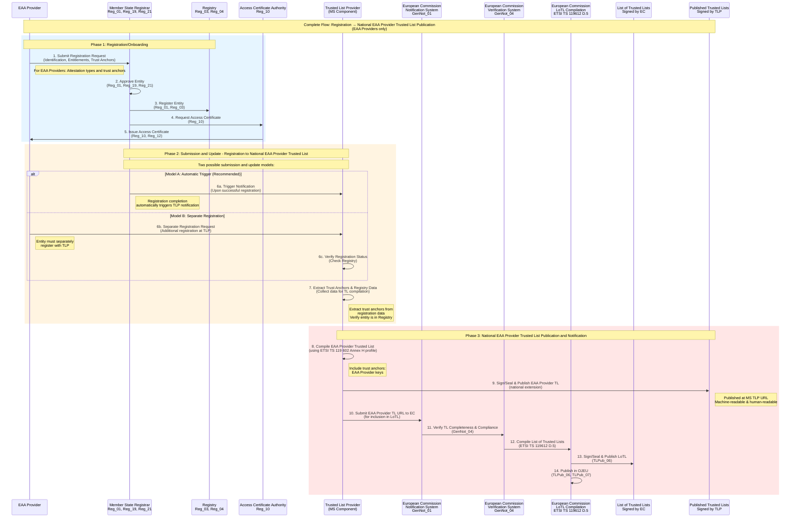
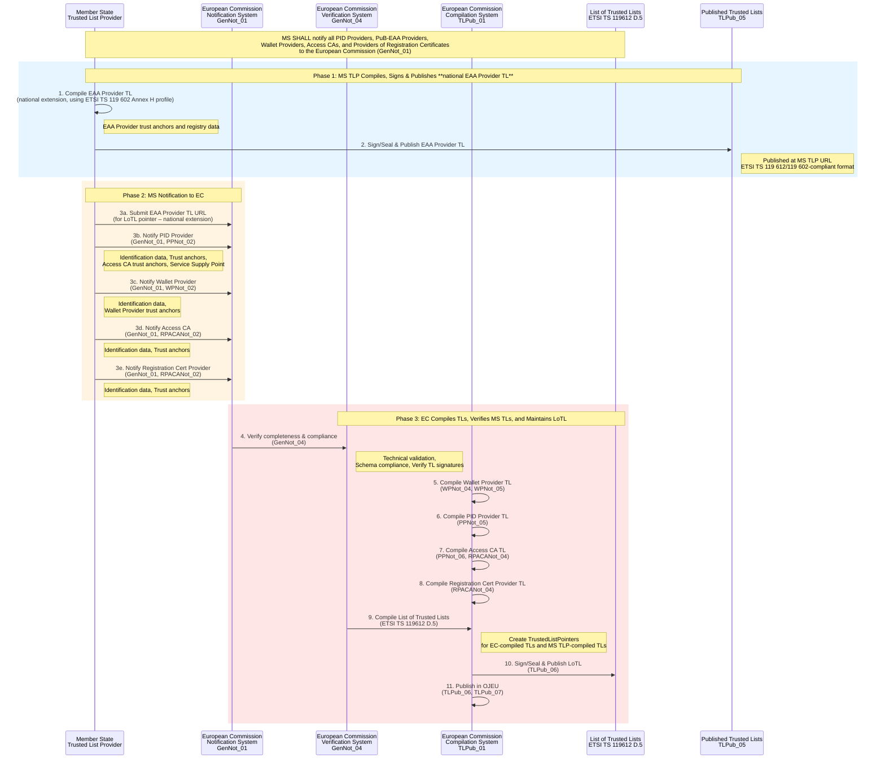

# Trust Infrastructure Schema: Onboarding and Trusted Lists

This document outlines the schema and graphical representation of the EUDI Wallet trust infrastructure. It focuses on three closely related processes: **Registration/Onboarding**, **Notification**, and **Trusted List Publication**, which are separated to align with the Architecture and Reference Framework (ARF).

## Overview

The trust infrastructure relies on three distinct but complementary processes:

1.  **Registration/Onboarding**: Entities (PID Providers, Attestation Providers, Relying Parties) register with Member State Registrars to define operational authorization and entitlements (ARF Section 3.17).
2.  **Notification**: Member States notify the European Commission of **Wallet Providers**, **Access Certificate Authorities (Access CAs)**, and **Providers of Registration Certificates** for inclusion in the relevant Trusted Lists.
3.  **Trusted List Publication**: Publication of cryptographic trust anchors for validation purposes, based on registration data and Member State notifications.

### Responsibilities Matrix

The following table summarizes the registration requirement and the authority responsible for compiling the Trusted List (TL) for each entity type:

| Entity Type | Registration Process | Trusted List Compilation (EC / MS TLP) | Member State TLP Role |
| :--- | :--- | :--- | :--- |
| **PID Provider** | **Register with MS Registrar** | **European Commission** (EU-level TL for PID Providers) | None (no national TL for PID Providers) |
| **Attestation Provider** | **Register with MS Registrar** | **Member State / MS TLP** (national QTSP TL for qualified EAA Providers (QEAA); national TL for EAA Providers) | Compiles, signs, and publishes **national Trusted Lists for qualified and EAA Providers** (QTSP TL for QEAA Providers per Article 22; EAA Provider TL per Section 3). |
| **Relying Party (RP)** | **Register with MS Registrar** | N/A (Uses Access Certificates/Registry) | None (not listed in TLs) |
| **Wallet Provider** | *Notification only* (by MS to EC) | **European Commission** (EU-level TL for Wallet Providers) | Not applicable in pilot (notification from MS to EC only) |
| **Access CA** | *Notification only* (by MS to EC) | **European Commission** (EU-level TL for Access CAs) | Not applicable in pilot (notification from MS to EC only) |
| **Reg. Cert. Provider** | *Notification only* (by MS to EC) | **European Commission** (EU-level TL for Reg. Cert. Providers) | Not applicable in pilot (notification from MS to EC only) |

> **Key Distinction**: **Wallet Providers**, **Access CAs**, and **Providers of Registration Certificates** do **not** register with Registrars. They are notified directly by Member States to the European Commission.

## 1. Trust Infrastructure Architecture

### 1.1 Trust Infrastructure Authorities

*   **Registrar**: Established by Member States to manage the registration and operational authorization of **PID Providers**, **Attestation Providers**, and **Relying Parties**.
*   **European Commission**:
    *   Compiles, signs/seals, and publishes Trusted Lists for Wallet Providers, PID Providers, Access CAs, and Registration Cert Providers (per **WPNot_04**, **WPNot_05**, **PPNot_05**, **PPNot_06**, **RPACANot_04**).
    *   Maintains and publishes the **List of Trusted Lists (LoTL)** containing pointers to all published Trusted Lists.
*   **Member State TLP**: Compiles, signs, and publishes **national Trusted Lists for EAA Providers** and submits the EAA Provider TL URL to the Commission for inclusion in the LoTL. **QEAA Providers are included in Member State QTSP Trusted Lists** published by Member States per **Article 22 of eIDAS Regulation (EU) No 910/2014**. **PuB-EAA Providers** are notified to and published by the European Commission according to **ARF Topic 31**.
*   **Access Certificate Authority (CA)**: Issues access certificates to registered entities. Notified by MS to the Commission; does not interact with Registrars.
*   **Provider of Registration Certificates**: Optionally issues certificates detailing entitlements. Notified by MS to the Commission.

### 1.2 Registered Entities

The following entities must undergo the registration process with a Registrar (ARF Topic 27):

*   **PID Providers**: Issue Person Identification Data. Approved via MS-defined policy.
*   **Attestation Providers**: Issue attestations (QEAA, PuB-EAA, EAA).
*   **Relying Parties (RP)**: Request attributes from Wallet Units.

## 2. Registration/Onboarding Process

The registration process is managed by Member State Registrars and involves (for PID Providers, Attestation Providers, and Relying Parties):

1. Entity registration with identification data and entitlements.
2. Access certificate issuance by Access Certificate Authority.
3. Optional registration certificate issuance by Provider of Registration Certificates.
4. Registry publication for transparency and online verification (per **Reg_03**, **Reg_04**). The registry is always published for all registered entities (PID Providers, Attestation Providers, Relying Parties) and serves as an alternative source when registration certificates are not available. Member States SHALL support the common API specified in [Technical Specification 5](https://github.com/eu-digital-identity-wallet/eudi-doc-standards-and-technical-specifications/blob/main/docs/technical-specifications/ts5-common-formats-and-api-for-rp-registration-information.md) for automated retrieval of registry entries (per **Reg_06**, Topic 27). The API uses a secure channel and does not require authentication. Wallet Units use the Registrar's online service URL to verify:
   - PID Provider registration (per **ISSU_24a**).
   - Attestation Provider registration and attestation types (per **ISSU_34a**).
   - Relying Party registration and requested attributes (per **RPRC_18**).

### 2.1 Registration Data and Requirements

Entities register with their Member State Registrar before participating in the ecosystem. The common set of data to be registered is specified in [ARF Section 6.3.2.2](https://eudi.dev/2.7.3/architecture-and-reference-framework-main/#6322-data-about-the-pid-provider-or-attestation-provider-is-included-in-the-registry) and [Section 6.4.2](https://eudi.dev/2.7.3/architecture-and-reference-framework-main/#642-relying-party-registration), and detailed in [Technical Specification 6](https://github.com/eu-digital-identity-wallet/eudi-doc-standards-and-technical-specifications/blob/main/docs/technical-specifications/ts6-common-set-of-rp-information-to-be-registered.md) per requirement **Reg_01a** (Topic 27).

The registration data includes:

- **Identification data**: Name, country, business registration number (as applicable).
- **Entitlements**:
  - **For PID Providers**: Attestation type(s) that the Provider intends to issue to Wallet Units (e.g., national PID).
  - **For QEAA Providers**: Attestation type(s) that the Provider intends to issue to Wallet Units (e.g., diplomas, professional qualifications).
  - **For PuB-EAA Providers**: Attestation type(s) that the Provider intends to issue to Wallet Units (e.g., mDLs, vehicle registration cards).
  - **For EAA Providers**: Attestation type(s) that the Provider intends to issue to Wallet Units.
  - **For Relying Parties**: Attributes that the Relying Party intends to request from Wallet Units, and for what purpose (intended use). The Registrar also registers if the Relying Party intends to use the services of an intermediary, and if so, which one.
- **Service supply points**: URLs where services are available (e.g., PID issuance endpoint, attestation issuance endpoint, presentation request endpoint).

> **Note**: Wallet Providers do not register with Registrars. They are notified by Member States to the European Commission for Trusted List inclusion (see [Section 3.1.1](#311-wallet-provider-notification)). Wallet Providers do not receive access certificates or registration certificates, as they are not registered with Registrars. The Wallet Solution provided by the Wallet Provider must be certified by Conformity Assessment Bodies (CABs) as described in [ARF Chapter 7](https://eudi.dev/2.7.3/architecture-and-reference-framework-main/#7-certification-and-risk-management).

> **Disambiguation – QEAA Providers and Registration**  
> In this document, **QEAA Providers are treated as a specific type of Attestation Provider**. As such, they **MUST register with a Member State Registrar** together with other Attestation Providers, in line with **ARF Section 3.17 (Registrars)** and **Topic 27 (Reg_01, Reg_21)**. The registration data for QEAA Providers – including identification data, attestation types they intend to issue, and service supply points – is part of the **common registration dataset** described in [ARF Section 6.3.2.2](https://eudi.dev/2.7.3/architecture-and-reference-framework-main/#6322-data-about-the-pid-provider-or-attestation-provider-is-included-in-the-registry) and referenced in this section.  
> **QEAA Providers are Qualified Trust Service Providers (QTSPs)**. After successful registration and approval at Member State level, QEAA Providers are included in **Member State Trusted Lists for QTSPs**, which are published by **Member States** in accordance with **Article 22 of the eIDAS Regulation (EU) No 910/2014)**. Trust anchors for QEAA Providers are published in these Member State QTSP Trusted Lists, as referenced in ARF requirements **OIA_13** and **ISSU_08** (see [COMPREHENSIVE-CATALOGUE-EAA-QEAA-REFERENCES.md](https://github.com/eu-digital-identity-wallet/eudi-doc-architecture-and-reference-framework/blob/main/docs/development-issues/COMPREHENSIVE-CATALOGUE-EAA-QEAA-REFERENCES.md#registration-and-trusted-lists)). The European Commission maintains the **List of Trusted Lists (LoTL)** that references all Member State Trusted Lists, including QTSP Trusted Lists.

> **Article 22 – Trusted Lists (eIDAS Regulation (EU) No 910/2014)**  
> 1. Each Member State shall establish, maintain and publish trusted lists, including information related to the qualified trust service providers for which it is responsible, together with information related to the qualified trust services provided by them.  
> 2. Member States shall establish, maintain and publish, in a secured manner, the electronically signed or sealed trusted lists referred to in paragraph 1 in a form suitable for automated processing.  
> 3. Member States shall notify to the Commission, without undue delay, information on the body responsible for establishing, maintaining and publishing national trusted lists, and details of where such lists are published, the certificates used to sign or seal the trusted lists and any changes thereto.  
> 4. The Commission shall make available to the public, through a secure channel, the information referred to in paragraph 3 in electronically signed or sealed form suitable for automated processing.

### 2.2 Access Certificate Issuance

After registration of entities (PID Providers, Attestation Providers, Relying Parties) the Access CA issues certificates that:
- Authenticate entities during service interactions.
- Reference the registry for entitlement verification.
- Include Signed Certificate Timestamps (SCT) for Certificate Transparency.

### 2.3 Registration Certificate Issuance (Optional)

If the Registrar policy requires it, the provider of Registration Certificates issues registration certificates that:
- Detail the entity's registration status.
- Specify entitlements for the specific entity, including available attestation types from Credential Issuers and attributes requested by Relying Parties.
- Enable Wallet Units to verify entity entitlements.

Registration certificates are issued per:
- **RPRC_09**: For Relying Parties (Registrar MAY decide to issue registration certificates to Relying Parties).
- **RPRC_13**: For Credential Issuers (PID Providers, Attestation Providers) (Registrar MAY decide to issue registration certificates to Providers).

## 3. Trusted List Publication Process

The Trusted List publication process is separate from registration. See [Overview](#overview) for Trusted List compilation responsibilities. In this document we distinguish between:

1. **EU-level Trusted Lists**, compiled and published by the **European Commission** for **PID Providers, PuB-EAA Providers, Wallet Providers, Access CAs, and Registration Cert Providers** (per Topic 31).
2. **National EAA Provider Trusted Lists**, compiled and published by **Member State TLPs** for **EAA Providers only** (a national extension beyond Topic 31).
3. **Member State QTSP Trusted Lists**, compiled and published by **Member States** per **Article 22 of eIDAS Regulation (EU) No 910/2014** for **QEAA Providers** (as QTSPs).
4. Member State TLPs submit **EAA Provider TL URLs** to the European Commission so they can be referenced from the List of Trusted Lists (LoTL).
4. The Commission verifies Trusted Lists and maintains the LoTL containing pointers to all published Trusted Lists, and signs and publishes the LoTL.

### 3.1 Trusted List Publication by Trusted List Provider

> **Note on Trusted List Provider Organizational Level**: The ARF ([Section 3.5](https://eudi.dev/2.7.3/architecture-and-reference-framework-main/#35-trusted-list-provider)) defines a Trusted List Provider (TLP) as "a body responsible for maintaining, managing, and publishing a Trusted List." Both Member State TLPs and the European Commission act as TLPs with distinct scopes (see [Responsibilities Matrix](#overview)). The ARF does not explicitly specify whether Member State TLPs must be Member State entities, sector-specific bodies, or the European Commission itself. However, the notification requirements (GenNot_01) state that "Member States SHALL notify" entities to the Commission, and [Section 3.5](https://eudi.dev/2.7.3/architecture-and-reference-framework-main/#35-trusted-list-provider) states that "relevant entities must be notified to the Commission by a Member State." This suggests that Member State TLPs operate at Member State level, though the ARF does not explicitly rule out other organizational models. There is also an inconsistency in the ARF itself ([Section 6.3.2](https://eudi.dev/2.7.3/architecture-and-reference-framework-main/#632-pid-provider-or-attestation-provider-registration-and-notification)) where line 2838 states that "A PID Provider or an Attestation Provider is registered by a Trusted List Provider" while line 2851 states that entities "register itself with a Registrar," regarding whether entities are registered by a TLP or by a Registrar.

The Member State Trusted List Provider (MS TLP) is responsible **for EAA Providers only**:

1. **Compiling Trusted Lists**: The MS TLP compiles **national Trusted Lists for EAA Providers** (EAA Providers).

2. **Signing Trusted Lists**: The MS TLP signs/seals the EAA Provider Trusted Lists using its signing key.

3. **Publishing Trusted Lists**: The MS TLP publishes the signed **EAA Provider Trusted Lists** in machine-readable and human-readable formats at a publicly accessible URL. Per [ETSI TS 119 602 V1.1.1](https://www.etsi.org/deliver/etsi_ts/119600_119699/119602/01.01.01_60/ts_119602v010101p.pdf) (Data model for Lists of Trusted Entities), **Attestation Provider Trusted Lists** (ETSI TS 119 602 Annex H, published by an MS TLP) may be used as the profile for these national EAA Provider TLs and may be published in either **JSON format with compact JAdES Baseline B signature** OR **XML format with XAdES Baseline B signature** (per ETSI EN 319 132-1). When XML is used, it must be an enveloped digital signature.

All Trusted Lists must comply with ETSI TS 119 602 data model and the specific profiles defined in the annexes, or with ETSI TS 119 612 v2.1.1 or a suitable profile derived from ETSI TS 102 231 (per **WPNot_05**, **PPNot_07**, **PuBPNot_03**, **RPACANot_05**).

4. **Submitting to European Commission**: The MS TLP submits the published **EAA Provider Trusted List URL** to the European Commission so it can be referenced from the LoTL.

The national EAA Provider TL process is triggered by successful registration with the Member State Registrar. The MS TLP:
- Receives notification of successful registration from the Registrar (or accesses Registry data).
- Extracts trust anchors and relevant data from the Registry.
- Compiles Trusted Lists according to ETSI TS 119 612 specifications.
- Signs and publishes Trusted Lists.
- Submits the Trusted List URL to the European Commission.

> **Note**: For **EAA Providers**, the TLP extracts trust anchors that were provided during registration and includes them in the national EAA Provider Trusted Lists. See [Overview](#overview) for Trusted List compilation responsibilities and [Section 5.3.1](#531-submission-and-update-models-registration-to-trusted-list) for details on submission and update models.

### 3.1.1 Member State Notification to European Commission

Member States SHALL notify all PID Providers, PuB-EAA Providers, Wallet Providers, Access Certificate Authorities, and Providers of Registration Certificates to the European Commission (per **GenNot_01**). The information notified varies by entity type:

- **PID Providers** (per **PPNot_02**): Identification data, PID Provider trust anchors, Access Certificate Authority trust anchors for PID Providers, Service Supply Point (URL).
- **Wallet Providers** (per **WPNot_02**): Identification data, Wallet Provider trust anchors.
- **PuB-EAA Providers** (per **PuBPNot_02**): Identification data (including conformity assessment report), Service Supply Point (URL).
- **Access Certificate Authorities and Providers of Registration Certificates** (per **RPACANot_02**): Identification data, Trust anchors.

> **Note**: Wallet Providers are notified by Member States to the European Commission (per **GenNot_01**, **WPNot_01**, **WPNot_02**), and are not registered with Registrars. The European Commission compiles, signs/seals, and publishes Trusted Lists for Wallet Providers (per **WPNot_04**, **WPNot_05**), PID Providers (per **PPNot_05**), Access CAs (per **PPNot_06**, **RPACANot_04**), and Registration Cert Providers (per **RPACANot_04**).

### 3.2 European Commission Verification and LoTL Maintenance

The European Commission:
- Compiles, signs/seals, and publishes Trusted Lists (see [Overview](#overview) for details).
- Receives Trusted List URL notifications from Member State TLPs (for EAA Providers only), verifies completeness and technical compliance of published Trusted Lists.
- Maintains the List of Trusted Lists (LoTL) containing pointers to all published Trusted Lists.
- Signs/seals and publishes the LoTL in machine-readable and human-readable formats.

### 3.3 List of Trusted Lists (LoTL)

Per ETSI TS 119 612 clause D.5, the European Commission maintains a List of Trusted Lists (LoTL) that:
- Contains pointers (TrustedListPointers) to all published Trusted Lists:
  - **Trusted Lists** compiled and published by Member State TLPs (one separate list per Member State for each entity type).

- Each pointer includes the Trusted List location (TSLLocation), scheme territory, and scheme operator name.
- Facilitates cross-border trust establishment.
- Centralizes trusted list distribution.
- Supports federation-level service discovery.

The European Commission:
- Compiles the LoTL from:
  - The directly compiled and published Trusted Lists (Wallet Provider TL, PID Provider TL, Access CA TL, Registration Cert Provider TL).
  - Trusted List URL notifications received from Member State TLPs (for EAA Providers only).
- Signs/seals the LoTL using the Commission's signing key.
- Publishes the LoTL in machine-readable and human-readable formats.
- Publishes LoTL location and trust anchors in the Official Journal of the European Union (OJEU).

## 4. Key Requirements References

Below is a list of the main requirements relating to the entity registration and Trusted List publication processes. 

### 4.1 Registration Requirements

The matrix collects all the ARF HLRs about the registration phase.

| Requirement | Description | Source |
|------------|-------------|--------|
| **Reg_01** | Member States SHALL provide processes for entity registration | Topic 27 |
| **Reg_10** | Access Certificate Authority SHALL issue access certificates to all registered entities (PID Providers, Attestation Providers, Relying Parties). | Topic 27, Topic 31 |
| **Reg_19** | Member States SHALL approve PID Providers according to well-defined policy | Topic 27 |
| **Reg_21** | Member States SHALL approve Attestation Providers according to well-defined policy | Topic 27 |
| **Reg_25** | Member States SHALL identify Relying Parties at appropriate confidence level | Topic 27 |
| **RPRC_09** | Registrar MAY decide to issue registration certificates to Relying Parties | Topic 27, Topic 44 |
| **RPRC_13** | Registrar MAY decide to issue registration certificates to Providers | Topic 27, Topic 44 |

**Note**: **Reg_01** applies to PID Providers, Attestation Providers, and Relying Parties. **Reg_10** requires Access Certificates to be issued to all registered entities (PID Providers, Attestation Providers, Relying Parties). **RPRC_13** applies to Registration Certificates for Credential Issuers (PID Providers, Attestation Providers). See [Overview](#overview) for entity registration responsibilities.

### 4.2 Trusted List Requirements

| Requirement | Description | Source |
|------------|-------------|--------|
| **GenNot_01** | Member States SHALL notify entities to European Commission | Topic 31 |
| **GenNot_03** | Commission SHALL enable secure notification, verification, and publication | Topic 31 |
| **GenNot_04** | Commission SHALL verify completeness and technical compliance | Topic 31 |
| **WPNot_01** | Commission SHALL establish technical specifications for Wallet Provider information | Topic 31 |
| **PPNot_01** | Commission SHALL establish technical specifications for PID Provider information | Topic 31 |
| **PuBPNot_01** | Commission SHALL establish technical specifications for PuB-EAA Provider information | Topic 31 |
| **RPACANot_01** | Commission SHALL establish technical specifications for Access CA information | Topic 31 |
| **TLPub_01** | Commission SHALL establish technical specifications for Trusted List publication | Topic 31 |
| **TLPub_06** | Commission SHALL publish Trusted List locations in OJEU | Topic 31 |
| **TLPub_07** | Commission SHALL publish trust anchors in OJEU | Topic 31 |

## 5. Trust Infrastructure Diagrams

The following Mermaid diagrams illustrate the trust infrastructure architecture and processes.

### 5.1 Overall Trust Infrastructure Architecture

```mermaid
%%{init: {"flowchart": {"defaultRenderer": "elk"}} }%%
graph TB
    %% --- CLASSES ---
    classDef titleBox fill:none,stroke:none,font-weight:bold,font-size:16px,color:black;    

    subgraph MS["Member State"]
        Registrar[Registrar<br/>Reg_01, Reg_02]
        AccessCA[Access Certificate Authority<br/>Reg_10, Reg_11]
        RegCertProv[Provider of Registration Certificates<br/>RPRC_01, RPRC_02]
        TLProvider[Trusted List Provider<br/>MS Component]
        Registry[Registry<br/>Reg_03, Reg_04]
        WP[Wallet Provider<br/>Notified by MS to Commission<br/>Not registered with Registrar]
        Registry ~~~ WP
    end

    subgraph EC["European Commission"]
        ECNotify[Notification System<br/>GenNot_01, GenNot_02]
        ECVerify[Verification System<br/>GenNot_04]
        LoTLCompile[LoTL Compilation<br/>ETSI TS 119612 D.5]
        LoTL[List of Trusted Lists<br/>Signed/Sealed by EC]
    end

    subgraph EntitiesScope[ ]
        %% inserted title to fix visibility
        EntitiesTitle["Registered Entities<br/>(Register with Registrar)"]:::titleBox
        
        PID[PID Provider<br/>Registers with Registrar<br/>Also notified to Commission<br/>PPNot_02]
        AP[EAA Provider<br/>Registers with Registrar<br/>Reg_21]
        RP[Relying Party<br/>Reg_25]
        
        %% Force vertical layout
        EntitiesTitle ~~~ PID
        EntitiesTitle ~~~ AP
        EntitiesTitle ~~~ RP
    end

    subgraph TL["Published Trusted Lists"]
        WPTL[Wallet Provider TL<br/>Compiled by EC<br/>WPNot_04, WPNot_05]
        PIDTL[PID Provider TL<br/>Compiled by EC<br/>PPNot_05]
        APTL[EAA Provider TL (national)<br/>Per MS, compiled by MS TLP<br/>QEAA Providers in MS QTSP TL per Article 22]
        ACATL[Access CA TL<br/>Compiled by EC<br/>PPNot_06, RPACANot_04]
        RegCertTL[Registration Cert Provider TL<br/>Compiled by EC<br/>RPACANot_04]
    end

    %% Registration Flow
    PID -->|Register with identification & entitlements<br/>Reg_01, Reg_19| Registrar
    AP -->|Register with identification & entitlements<br/>Reg_01, Reg_21| Registrar
    RP -->|Register with identification & entitlements<br/>Reg_01, Reg_25| Registrar
    
    %% Notification Flow (entities notified to Commission)
    WP -.->|MS notifies WP to Commission<br/>GenNot_01, WPNot_01, WPNot_02| ECNotify
    PID -.->|After registration, MS notifies PID Provider to Commission<br/>GenNot_01, PPNot_01, PPNot_02| ECNotify
    AccessCA -.->|MS notifies Access CA to Commission<br/>GenNot_01, RPACANot_01, RPACANot_02| ECNotify
    RegCertProv -.->|MS notifies Registration Cert Provider to Commission<br/>GenNot_01, RPACANot_01, RPACANot_02| ECNotify
    
    Registrar -->|Approve & Register<br/>Reg_19, Reg_21| Registry
    Registrar -->|Request Access Cert<br/>Reg_10| AccessCA
    AccessCA -->|Issue Access Certificate<br/>Reg_10, Reg_12| EntitiesScope
    Registrar -.->|Optional: Request Reg Cert<br/>RPRC_09, RPRC_13| RegCertProv
    RegCertProv -.->|Issue Registration Certificate<br/>RPRC_02| EntitiesScope
    
    %% Submission and Update: Registration triggers Trusted List publication (Attestation Providers only)
    Registrar -->|Registration Complete<br/>Triggers TLP for Attestation Providers| TLProvider
    Registry -.->|TLP accesses Registry data<br/>Extracts Trust Anchors for Attestation Providers| TLProvider
    
    %% Trusted List Publication Flow
    TLProvider -->|Compile, Sign & Publish<br/>Attestation Provider TL only<br/>PuBPNot_03| APTL
    TLProvider -->|Submit TL URL<br/>GenNot_01| ECNotify
    ECNotify -->|Commission compiles & publishes<br/>Wallet Provider TL<br/>WPNot_04, WPNot_05| WPTL
    ECNotify -->|Commission compiles & publishes<br/>PID Provider TL<br/>PPNot_05| PIDTL
    ECNotify -->|Commission compiles & publishes<br/>Access CA TL<br/>PPNot_06, RPACANot_04| ACATL
    ECNotify -->|Commission compiles & publishes<br/>Registration Cert Provider TL<br/>RPACANot_04| RegCertTL
    ECNotify -->|Verify TL completeness<br/>GenNot_04| ECVerify
    ECVerify -->|Compile LoTL<br/>ETSI TS 119612 D.5| LoTLCompile
    LoTLCompile -->|Sign & Publish LoTL<br/>TLPub_06| LoTL
    LoTL -->|Contains pointers to| TL

    style MS fill:#e1f5ff
    style EC fill:#fff4e1
    style EntitiesScope fill:#e8f5e9
    style TL fill:#f3e5f5
```

### 5.2 Registration/Onboarding Process Flow


### 5.3 Complete Registration to National EAA Provider Trusted List Publication Flow

This diagram shows the complete end-to-end process from entity registration through to **national EAA Provider Trusted List** publication and LoTL pointer creation for **EAA Providers**. **QEAA Providers are included in Member State QTSP Trusted Lists** per Article 22 of eIDAS Regulation (EU) No 910/2014. For PID Providers and PuB-EAA Providers, after registration with the Registrar, Member States notify them to the Commission for inclusion in **Commission-compiled Trusted Lists** (per Topic 31). For Wallet Providers, Access CAs, and Registration Cert Providers, see [Section 3.1.1](#311-member-state-notification-to-european-commission) and [Overview](#overview).



### 5.3.1 Submission and Update Models: Registration to Trusted List

The relationship between Registrar and Trusted List Provider (TLP) can be implemented in two ways (illustrated in Diagram 5.3). Note: The ARF ([Section 6.3.2](https://eudi.dev/2.5.0/architecture-and-reference-framework-main/#632-pid-provider-or-attestation-provider-registration-and-notification)) describes the registration and notification processes but does not explicitly specify these two implementation models. The models presented here are implementation approaches based on the ARF requirements:

#### Model A: Automatic Trigger (Recommended)

In this model, successful registration with the Registrar automatically triggers the Trusted List Provider to prepare and submit the Trusted List URL to the European Commission.

**Process:**
1. Entity registers with Registrar (per **Reg_01**, **Reg_19**, **Reg_21**)
2. Registrar completes registration and publishes to Registry
3. Registrar automatically notifies TLP of successful registration
4. TLP extracts trust anchors and registry data
5. TLP prepares and submits Trusted List URL to European Commission

**Advantages:**
- Single registration point for entities.
- Reduced administrative burden.
- Maintains consistency between Registry and Trusted Lists.
- Automatic synchronization.

**Requirements:**
- Registrar and TLP must have integration mechanisms for submission and update.
- TLP must have access to Registry data.
- Clear definition of when registration is "complete" and triggers notification.

#### Model B: Separate Registration

In this model, entities must separately register with both the Registrar and the Trusted List Provider.

**Process:**
1. Entity registers with Registrar (per **Reg_01**, **Reg_19**, **Reg_21**)
2. Registrar completes registration and publishes to Registry
3. Entity separately registers with TLP (or TLP initiates based on Registry data)
4. TLP verifies entity is registered in Registry
5. TLP prepares and submits Trusted List URL to European Commission

**Advantages:**
- Clear separation of concerns.
- Independent lifecycle management.
- Permits different approval criteria.

**Disadvantages:**
- Requires entities to manage two registration processes.
- Potential for inconsistency between Registry and Trusted Lists.
- Additional administrative overhead.

#### Recommendation

**Model A (Automatic Trigger)** is recommended for logical coherence and operational efficiency. The Registrar, upon successful registration, should automatically trigger the TLP to compile, sign, and publish Trusted Lists (for Attestation Providers only). This results in:

- Automatic processing of registered Attestation Providers that require Trusted List inclusion.
- Synchronized Registry and Trusted Lists for Attestation Providers.
- Single point of registration for entities.
- Process managed by the Registrar, with TLP acting as the Trusted List publisher for Attestation Providers.

The TLP's role in this model is to:
- Receive registration completion notifications from Registrar for EAA Providers.
- Extract trust anchors and relevant data from Registry.
- Compile EAA Provider Trusted Lists according to ETSI TS 119 612 specifications.
- Sign/seal and publish Trusted Lists at publicly accessible URLs (per Member State).
- Submit Trusted List URLs to European Commission.

See [Overview](#overview) for Commission-compiled Trusted Lists process.

### 5.3.2 Trusted List Publication Process Flow (Notification Only)

This diagram focuses solely on the notification process, as referenced in the original document structure.



### 5.4 List of Trusted Lists Structure (ETSI TS 119612 D.5)

```mermaid
graph TB
    subgraph LoTL["List of Trusted Lists<br/>ETSI TS 119612 D.5"]
        ListInfo[ListInformation<br/>ListName, ListIdentifier<br/>ListVersion, ListIssueDateTime]
        TrustedLists[TrustedLists Container]
        Signature[Digital Signature<br/>Signed/Sealed by EC]
    end

    subgraph TLPointers["TrustedListPointers"]
        WPTLPointer[Wallet Provider TL Pointer<br/>TSLLocation: EC URL<br/>SchemeTerritory: EU<br/>SchemeOperatorName: EC]
        PIDTLPointer[PID Provider TL Pointer<br/>TSLLocation: EC URL<br/>SchemeTerritory: EU<br/>SchemeOperatorName: EC]
        APTLPointer[EAA Provider TL Pointer (national)<br/>TSLLocation: MS TLP URL<br/>SchemeTerritory: MS Code<br/>SchemeOperatorName: MS TLP]
        ACATLPointer[Access CA TL Pointer<br/>TSLLocation: EC URL<br/>SchemeTerritory: EU<br/>SchemeOperatorName: EC]
        RegCertTLPointer[Registration Cert Provider TL Pointer<br/>TSLLocation: EC URL<br/>SchemeTerritory: EU<br/>SchemeOperatorName: EC]
    end

    subgraph ActualTL["Actual Trusted Lists<br/>Referenced by Pointers"]
        WPTL[Wallet Provider TL<br/>WPNot_05, WPNot_07]
        PIDTL[PID Provider TL<br/>PPNot_07]
        APTL[EAA Provider TL (national)]
        ACATL[Access CA TL<br/>RPACANot_05]
        RegCertTL[Registration Cert Provider TL<br/>RPACANot_05]
    end

    LoTL --> ListInfo
    LoTL --> TrustedLists
    LoTL --> Signature

    TrustedLists --> TLPointers

    TLPointers --> WPTLPointer
    TLPointers --> PIDTLPointer
    TLPointers --> APTLPointer
    TLPointers --> ACATLPointer
    TLPointers --> RegCertTLPointer

    WPTLPointer -.->|TSLLocation| WPTL
    PIDTLPointer -.->|TSLLocation| PIDTL
    APTLPointer -.->|TSLLocation| APTL
    ACATLPointer -.->|TSLLocation| ACATL
    RegCertTLPointer -.->|TSLLocation| RegCertTL

    style LoTL fill:#fff4e1
    style TLPointers fill:#e1f5ff
    style ActualTL fill:#e8f5e9
```

### 5.5 Entity Registration and Trusted List Relationship

```mermaid
graph TB
    subgraph Registration["Registration Process<br/>Managed by MS Registrar"]
        RegStep1["1. Entity Registration<br/>Reg_01 (PID/Attestation Providers, RP)<br/>Reg_19, Reg_21, Reg_25"]
        RegStep2["2. Access Certificate Issuance<br/>Reg_10, Reg_12<br/>(PID/Attestation Providers, RP only)"]
        RegStep3["3. Optional Registration Certificate<br/>RPRC_09 (RP), RPRC_13 (Credential Issuers)"]
        RegStep4[4. Registry Publication<br/>Reg_03, Reg_04]
    end

    subgraph SubmissionUpdate["EAA Provider TL Publication (national)<br/>MS TLP"]
        TLPTrigger[MS TLP Triggered by Registration Completion]
        TLPCompile[Compile EAA Provider TL<br/>Extract Trust Anchors from Registry]
        TLPPublish[Sign & Publish EAA Provider TL]
    end

    subgraph Notification["MS Notification to EC<br/>GenNot_01"]
        NotifWP[MS notifies Wallet Provider<br/>WPNot_01, WPNot_02]
        NotifPID[MS notifies PID Provider<br/>PPNot_01, PPNot_02]
        NotifACA[MS notifies Access CA<br/>RPACANot_01, RPACANot_02]
        NotifRegCert[MS notifies Registration Cert Provider<br/>RPACANot_01, RPACANot_02]
        NotifAPTL[MS TLP submits EAA Provider TL URL<br/>GenNot_01]
    end

    subgraph ECCompilation["EC Verification & LoTL Maintenance"]
        ECVerify[EC verifies all Trusted Lists<br/>GenNot_04]
        ECCompileLoTL[EC compiles LoTL<br/>ETSI TS 119612 D.5]
        ECPublishLoTL[EC signs & publishes LoTL<br/>TLPub_06]
    end

    subgraph Entities["Entities"]
        WP[Wallet Provider]
        PID[PID Provider]
        AP[Attestation Provider]
        RP[Relying Party]
        ACA[Access CA]
        RegCertProv[Registration Cert Provider]
    end

    subgraph TrustedLists["Published Trusted Lists"]
        WPTL[Wallet Provider TL<br/>Compiled by EC]
        PIDTL[PID Provider TL<br/>Compiled by EC]
        APTL[EAA Provider TL (national)<br/>Compiled by MS TLP]
        ACATL[Access CA TL<br/>Compiled by EC]
        RegCertTL[Registration Cert Provider TL<br/>Compiled by EC]
    end

    %% Registration Flow (PID/Attestation Providers, RP)
    PID -->|Register| RegStep1
    AP -->|Register| RegStep1
    RP -->|Register| RegStep1
    RegStep1 --> RegStep2
    RegStep2 --> RegStep3
    RegStep3 --> RegStep4

    %% EAA Provider TL Publication Flow
    RegStep4 -->|Registration Complete<br/>Triggers MS TLP| TLPTrigger
    TLPTrigger -->|Access Registry Data<br/>Extract Trust Anchors| TLPCompile
    TLPCompile -->|Compile EAA Provider TL| TLPPublish
    TLPPublish -->|Sign & Publish at URL| NotifAPTL
    TLPPublish --> APTL

    %% Notification Flows (all entities notified to EC)
    WP -->|MS notifies| NotifWP
    PID -->|After registration, MS notifies| NotifPID
    ACA -->|MS notifies| NotifACA
    RegCertProv -->|MS notifies| NotifRegCert

    %% EC Compilation Flows
    NotifWP --> ECCompileWP
    NotifPID --> ECCompilePID
    NotifACA --> ECCompileACA
    NotifRegCert --> ECCompileRegCert
    NotifAPTL --> ECVerify

    ECCompileWP --> WPTL
    ECCompilePID --> PIDTL
    ECCompileACA --> ACATL
    ECCompileRegCert --> RegCertTL
    ECVerify --> ECCompileLoTL

    %% LoTL Compilation
    ECCompileWP --> ECCompileLoTL
    ECCompilePID --> ECCompileLoTL
    ECCompileACA --> ECCompileLoTL
    ECCompileRegCert --> ECCompileLoTL
    ECCompileLoTL --> ECPublishLoTL
    ECPublishLoTL --> TrustedLists

    %% Note: Registration data feeds into Trusted Lists
    RegStep4 -.->|Registry data used for<br/>trust evaluation| TrustedLists

    style Registration fill:#e8f5e9
    style SubmissionUpdate fill:#fff9c4
    style Notification fill:#ffe0b2
    style ECCompilation fill:#fff4e1
    style Entities fill:#f3e5f5
    style TrustedLists fill:#e1f5ff
```

## 6. Key Distinctions

### 6.1 Registration vs. Trusted List Publication

| Aspect | Registration | Trusted List Publication |
|--------|-------------|---------------------------|
| **Purpose** | Enable entity participation in ecosystem | Establish trust anchors for validation |
| **Managed By** | Member State Registrar | EC compiles & publishes TLs: Wallet Provider, PID Provider, Access CA, Registration Cert Provider; MS TLP compiles & publishes Attestation Provider TL per MS; EC maintains LoTL |
| **Scope** | PID Providers, Attestation Providers, Relying Parties. (PID Providers are subsequently notified to Commission). | Selected entities: Wallet Providers (TL compiled by EC), PID Providers (TL compiled by EC), Attestation Providers (per MS TL compiled by MS TLP), Access CAs (TL compiled by EC), Registration Cert Providers (TL compiled by EC) |
| **Output** | Registry entries, Access Certificates, Registration Certificates | Trusted Lists: Wallet Provider TL (compiled by EC), PID Provider TL (compiled by EC), Attestation Provider TL (per MS, compiled by MS TLP), Access CA TL (compiled by EC), Registration Cert Provider TL (compiled by EC); List of Trusted Lists (compiled by EC) |
| **Used For** | Entitlement verification, service access | Cryptographic trust validation |
| **Requirements** | Reg_01, Reg_10, RPRC_09, RPRC_13 | GenNot_01, TLPub_01, TLPub_05, TLPub_06 |
| **Submission and Update** | Managed by Registrar | Varies by entity type (see [Overview](#overview) and [Section 5.3](#53-complete-registration-to-trusted-list-publication-flow)). |

## 9. Summary

The trust infrastructure operates through two distinct but complementary processes:

1. **Registration/Onboarding**: Managed at Member State level, entities (PID Providers, Attestation Providers, Relying Parties) register with Registrars and entitlements are defined. PID Providers are also notified by Member States to the Commission for Trusted List inclusion. See [Overview](#overview) for entity registration responsibilities.
2. **Trusted List Publication**: The European Commission compiles Trusted Lists for Wallet Providers, PID Providers, Access CAs, and Registration Cert Providers. Member State TLPs compile Trusted Lists per Member State for Attestation Providers. See [Overview](#overview) for Trusted List compilation responsibilities.

Both processes are required for the trust ecosystem:
- **Registration**: Defines operational authorization and entitlement management.
- **Trusted Lists**: Contain cryptographic trust anchors for signature and certificate validation.

The separation of these processes aligns with the ARF and enables:
- Independent lifecycle management.
- Different trust models (operational vs. cryptographic).
- Scalable cross-border trust establishment.
- Clear separation of concerns between MS and EU levels.
- Trusted Lists compiled by the European Commission (Wallet Provider, PID Provider, Access CA, Registration Cert Provider) for consistent recognition across all Member States.
- Member State-level Trusted Lists (Attestation Provider) for Member State-specific management.

## 7. Implementation Considerations

### 7.1 Member State Autonomous Trusted Lists

Member States may publish additional Trusted Lists within their own perimeter for internal or national purposes, beyond the eIDAS Trusted Lists published by the European Commission. These Member State-specific Trusted Lists are not normative or usable by other Member States, as only the eIDAS Trusted Lists published by the European Commission (for Wallet Providers, PID Providers, Access CAs, and Registration Cert Providers) and the Attestation Provider Trusted Lists published by Member State TLPs (which are included in the Commission's List of Trusted Lists) are recognized for cross-border trust establishment in the EUDI Wallet ecosystem.

## 8. Trust Evaluation

> **Note**: This section describes trust evaluation processes that use the registration data and Trusted Lists established through the onboarding and Trusted List publication processes described in the main document. As the focus of this document is on **Onboarding (Registration)** and **Trusted List Publication** processes, this section is provided for reference but could be moved to a separate document in the future.

This section describes how trust is evaluated in the ecosystem using the registration data and Trusted Lists established through the onboarding and Trusted List publication processes.

### 8.1 Trust Evaluation Requirements

| Requirement | Description | Source |
|------------|-------------|--------|
| **ISSU_19** | PID Providers SHALL accept trust anchors in Wallet Provider Trusted Lists | Topic 31 |
| **ISSU_21** | PID Providers SHALL verify Wallet Provider presence in Trusted List | Topic 31 |
| **ISSU_24** | Wallet Units SHALL authenticate and validate access certificates using Access CA Trusted Lists | Topic 27 |
| **ISSU_24a** | Wallet Units SHALL verify PID Provider registration before PID issuance | Topic 27, Topic 44 |
| **ISSU_34a** | Wallet Units SHALL verify Attestation Provider registration before attestation issuance | Topic 27, Topic 44 |
| **RPA_04** | Wallet Units SHALL accept trust anchors in Relying Party Access CA Trusted Lists | Topic 31 |
| **RPRC_16** | Wallet Units SHALL offer Users possibility to verify Relying Party registration | Topic 44 |
| **RPRC_21** | Wallet Units SHALL verify requested attributes are registered | Topic 44 |

### 8.2 Trust Evaluation Flow

> ⚠️ **Warning**: The content of this section is temporary and will be removed or replaced as it is updated using reference material under development in [https://github.com/webuild-consortium/wp4-trust-group/pull/33](https://github.com/webuild-consortium/wp4-trust-group/pull/33).


### 8.3 Trust Evaluation Points

Trust evaluation occurs at multiple points using different trust sources:

1. **During Credential Issuance**:
   - Wallet Units verify Provider registration (Registry) - **ISSU_24a, ISSU_34a**
   - Providers verify Wallet Provider in Trusted List - **ISSU_21, ISSU_30**

2. **During Presentation**:
   - Wallet Units verify Relying Party registration (Registry) - **RPRC_16, RPRC_21**
   - Wallet Units verify Access Certificates using Trusted Lists - **ISSU_24, ISSU_34, RPA_04**
   - Relying Parties validate PID signatures using PID Provider TL - **OIA_12**
   - Relying Parties validate attestation signatures using Attestation Provider TL - **OIA_13, OIA_14**

