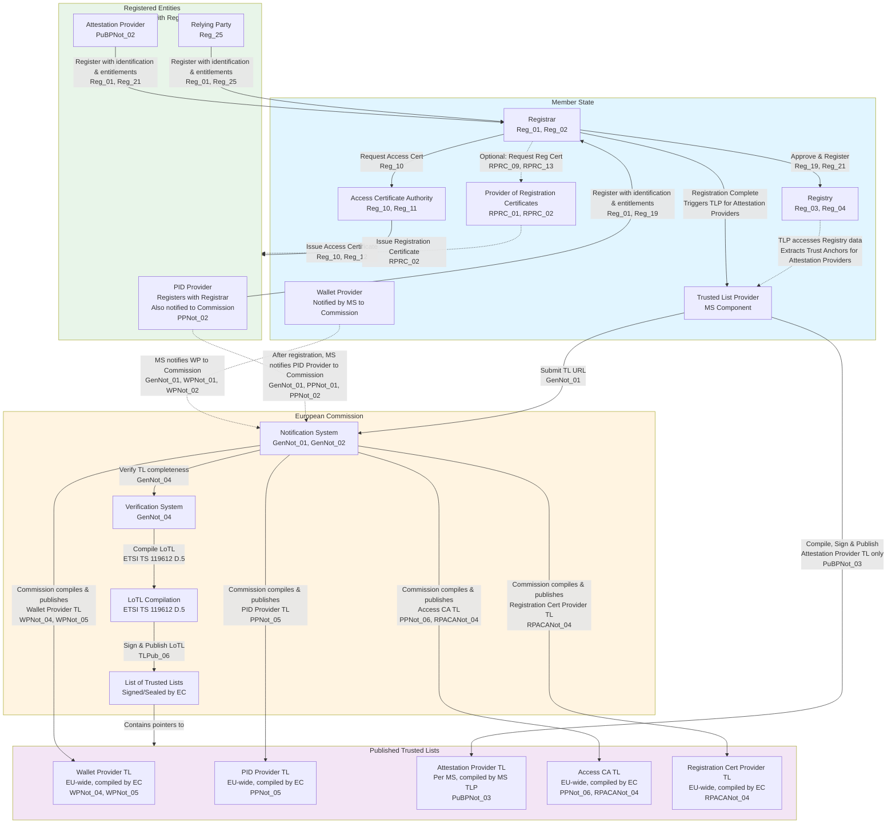
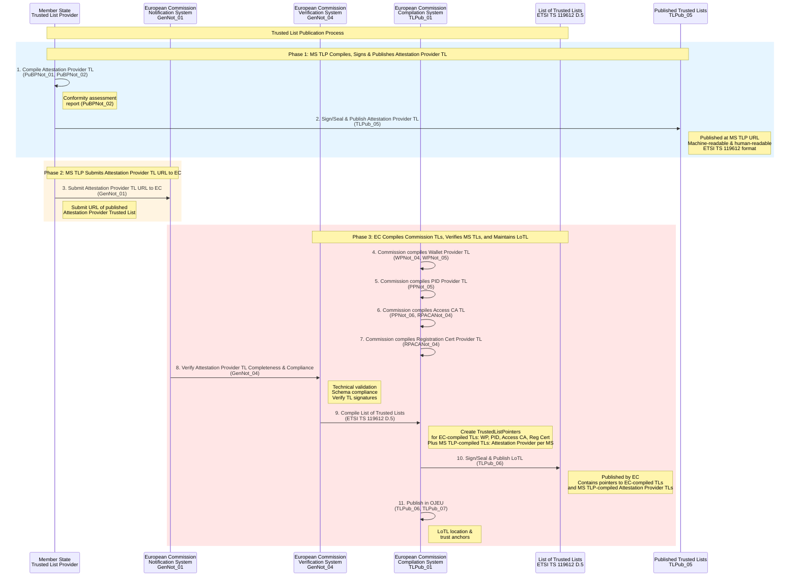
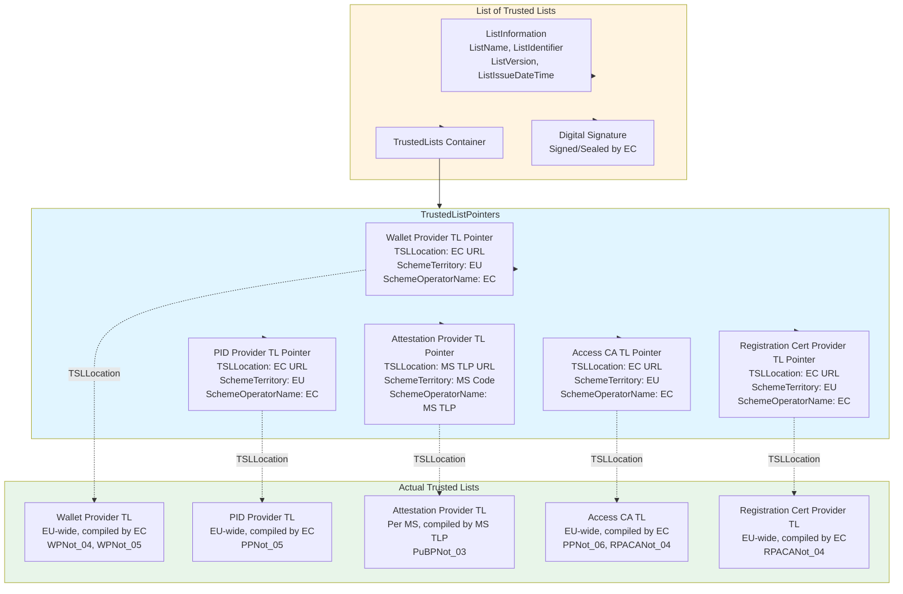
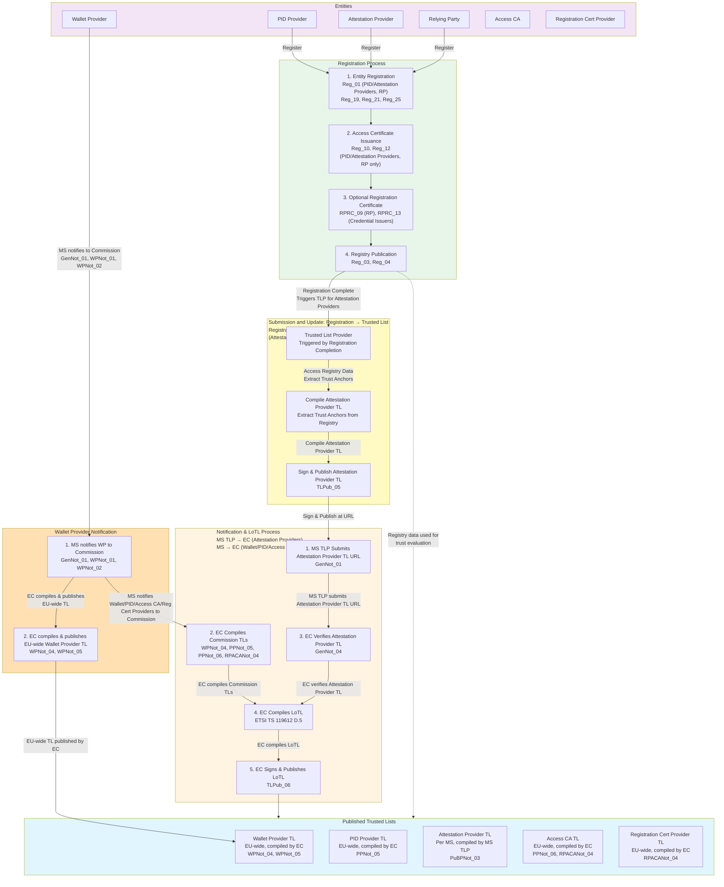

# Trust Infrastructure Schema: Onboarding and Trusted Lists

This document outlines the schema and graphical representation of the EUDI Wallet trust infrastructure. It focuses on two primary processes: **Onboarding** (Registration) and **Trusted List Publication**, which are separated to align with the Architecture and Reference Framework (ARF).

## Overview

The trust infrastructure relies on two distinct but complementary processes:

1.  **Registration/Onboarding**: Entities (PID Providers, Attestation Providers, Relying Parties) register with Member State Registrars to define operational authorization and entitlements (ARF Section 3.17).
2.  **Trusted List Publication**: Publication of cryptographic trust anchors for validation purposes.

### Responsibilities Matrix

The following table summarizes the registration requirement and the authority responsible for compiling the Trusted List (TL) for each entity type:

| Entity Type | Registration Process | Trusted List Compilation |
| :--- | :--- | :--- |
| **PID Provider** | **Register with MS Registrar** | **European Commission** (EU-wide TL) |
| **Attestation Provider** | **Register with MS Registrar** | **Member State TLP** (National TL) |
| **Relying Party (RP)** | **Register with MS Registrar** | N/A (Uses Access Certificates/Registry) |
| **Wallet Provider** | *Notification only* (by MS to EC) | **European Commission** (EU-wide TL) |
| **Access CA** | *Notification only* (by MS to EC) | **European Commission** (EU-wide TL) |
| **Reg. Cert. Provider** | *Notification only* (by MS to EC) | **European Commission** (EU-wide TL) |

> **Key Distinction**: **Wallet Providers**, **Access CAs**, and **Providers of Registration Certificates** do **not** register with Registrars. They are notified directly by Member States to the European Commission.

## 1. Trust Infrastructure Architecture

### 1.1 Trust Infrastructure Authorities

*   **Registrar**: Established by Member States to manage the registration and operational authorization of **PID Providers**, **Attestation Providers**, and **Relying Parties**.
*   **European Commission**:
    *   Acts as **Trusted List Provider (TLP)** for EU-wide lists (see Responsibilities Matrix).
    *   Maintains and publishes the **List of Trusted Lists (LoTL)**.
*   **Member State TLP**: Compiles, signs, and publishes the National Trusted List specifically for **Attestation Providers** (PuB-EAA) and submits the URL to the Commission.
*   **Access Certificate Authority (CA)**: Issues access certificates to registered entities. Notified by MS to the Commission; does not interact with Registrars.
*   **Provider of Registration Certificates**: Optionally issues certificates detailing entitlements. Notified by MS to the Commission.

### 1.2 Registered Entities

The following entities must undergo the registration process with a Registrar (ARF Topic 27):

*   **PID Providers**: Issue Person Identification Data. Approved via MS-defined policy.
*   **Attestation Providers**: Issue attestations (QEAA, PuB-EAA, EAA).
*   **Relying Parties (RP)**: Request attributes from Wallet Units.

## 2. Registration/Onboarding Process

The registration process is managed by Member State Registrars and involves (for PID Providers, Attestation Providers, and Relying Parties):

1. Entity registration with identification data and entitlements.
2. Access certificate issuance by Access Certificate Authority.
3. Optional registration certificate issuance by Provider of Registration Certificates.
4. Registry publication for transparency and online verification (per **Reg_03**, **Reg_04**). The registry is always published for all registered entities (PID Providers, Attestation Providers, Relying Parties) and serves as an alternative source when registration certificates are not available. Member States SHALL support the common API specified in [Technical Specification 5](https://github.com/eu-digital-identity-wallet/eudi-doc-standards-and-technical-specifications/blob/main/docs/technical-specifications/ts5-common-formats-and-api-for-rp-registration-information.md) for automated retrieval of registry entries (per **Reg_06**, Topic 27). The API uses a secure channel and does not require authentication. Wallet Units use the Registrar's online service URL to verify:
   - PID Provider registration (per **ISSU_24a**).
   - Attestation Provider registration and attestation types (per **ISSU_34a**).
   - Relying Party registration and requested attributes (per **RPRC_18**).

### 2.1 Registration Data and Requirements

Entities register with their Member State Registrar before participating in the ecosystem. The common set of data to be registered is specified in [ARF Section 6.3.2.2](https://eudi.dev/2.7.3/architecture-and-reference-framework-main/#6322-data-about-the-pid-provider-or-attestation-provider-is-included-in-the-registry) and [Section 6.4.2](https://eudi.dev/2.7.3/architecture-and-reference-framework-main/#642-relying-party-registration), and detailed in [Technical Specification 6](https://github.com/eu-digital-identity-wallet/eudi-doc-standards-and-technical-specifications/blob/main/docs/technical-specifications/ts6-common-set-of-rp-information-to-be-registered.md) per requirement **Reg_01a** (Topic 27).

The registration data includes:

- **Identification data**: Name, country, business registration number (as applicable).
- **Entitlements**:
  - **For PID Providers**: Attestation type(s) that the Provider intends to issue to Wallet Units (e.g., national PID).
  - **For QEAA Providers**: Attestation type(s) that the Provider intends to issue to Wallet Units (e.g., diplomas, professional qualifications).
  - **For PuB-EAA Providers**: Attestation type(s) that the Provider intends to issue to Wallet Units (e.g., mDLs, vehicle registration cards).
  - **For non-qualified EAA Providers**: Attestation type(s) that the Provider intends to issue to Wallet Units.
  - **For Relying Parties**: Attributes that the Relying Party intends to request from Wallet Units, and for what purpose (intended use). The Registrar also registers if the Relying Party intends to use the services of an intermediary, and if so, which one.
- **Service supply points**: URLs where services are available (e.g., PID issuance endpoint, attestation issuance endpoint, presentation request endpoint).

#### 2.1.1 Wallet Provider Notification

Wallet Providers are notified by Member States to the European Commission (per **GenNot_01**, **WPNot_01**, **WPNot_02**). The process involves:

1. **Member State Notification**: Member States notify Wallet Providers to the European Commission, providing the information specified in **WPNot_01** and **WPNot_02** (Topic 31):
   - **Identification data**: Member State/Country of establishment, name as registered in an official record, business registration number (where applicable).
   - **Wallet Provider trust anchors**: Public keys and name supporting the authentication of Wallet Unit Attestations (WUA) issued by the Wallet Provider (per **WPNot_02**).

2. **Commission Compilation**: The European Commission compiles, signs/seals, and publishes the EU-wide Wallet Provider Trusted List (per **WPNot_04**, **WPNot_05**).

**Note**: The Wallet Solution provided by the Wallet Provider must be certified by Conformity Assessment Bodies (CABs) as described in [ARF Chapter 7](https://eudi.dev/2.7.3/architecture-and-reference-framework-main/#7-certification-and-risk-management).

### 2.2 Access Certificate Issuance

After registration of entities (PID Providers, Attestation Providers, Relying Parties) the Access CA issues certificates that:
- Authenticate entities during service interactions.
- Reference the registry for entitlement verification.
- Include Signed Certificate Timestamps (SCT) for Certificate Transparency.

### 2.3 Registration Certificate Issuance (Optional)

If the Registrar policy requires it, the provider of Registration Certificates issues registration certificates that:
- Detail the entity's registration status.
- Specify entitlements for the specific entity, including available attestation types from Credential Issuers and attributes requested by Relying Parties.
- Enable Wallet Units to verify entity entitlements.

Registration certificates are issued per:
- **RPRC_09**: For Relying Parties (Registrar MAY decide to issue registration certificates to Relying Parties).
- **RPRC_13**: For Credential Issuers (PID Providers, Attestation Providers) (Registrar MAY decide to issue registration certificates to Providers).

## 3. Trusted List Publication Process

The Trusted List publication process is separate from registration. See [Overview](#overview) for Trusted List compilation responsibilities. The process involves:

1. Competent authorities (European Commission or Member State TLPs) compile Trusted Lists based on the entity type.
2. European Commission compiles EU-wide Trusted Lists or receives TL URLs from Member State TLPs.
3. Commission verifies and maintains the List of Trusted Lists (LoTL) containing pointers to all published Trusted Lists.
4. Commission signs and publishes the LoTL.

### 3.1 Trusted List Publication by Trusted List Provider

> **Note on Trusted List Provider Organizational Level**: The ARF ([Section 3.5](https://eudi.dev/2.7.3/architecture-and-reference-framework-main/#35-trusted-list-provider)) defines a Trusted List Provider (TLP) as "a body responsible for maintaining, managing, and publishing a Trusted List." Both Member State TLPs and the European Commission act as TLPs with distinct scopes (see [Responsibilities Matrix](#overview)). The ARF does not explicitly specify whether Member State TLPs must be Member State entities, sector-specific bodies, or the European Commission itself. However, the notification requirements (GenNot_01) state that "Member States SHALL notify" entities to the Commission, and [Section 3.5](https://eudi.dev/2.7.3/architecture-and-reference-framework-main/#35-trusted-list-provider) states that "relevant entities must be notified to the Commission by a Member State." This suggests that Member State TLPs operate at Member State level, though the ARF does not explicitly rule out other organizational models. There is also an inconsistency in the ARF itself ([Section 6.3.2](https://eudi.dev/2.7.3/architecture-and-reference-framework-main/#632-pid-provider-or-attestation-provider-registration-and-notification)) where line 2838 states that "A PID Provider or an Attestation Provider is registered by a Trusted List Provider" while line 2851 states that entities "register itself with a Registrar," regarding whether entities are registered by a TLP or by a Registrar.

The Member State Trusted List Provider (MS TLP) is responsible for (for Attestation Providers only):

1. **Compiling Trusted Lists**: The MS TLP compiles Trusted Lists for Attestation Providers (PuB-EAA Providers with conformity assessment reports).

2. **Signing Trusted Lists**: The MS TLP signs/seals the Trusted Lists using its signing key (for Attestation Providers only).

3. **Publishing Trusted Lists**: The MS TLP publishes the signed Trusted Lists in machine-readable and human-readable formats at a publicly accessible URL (for Attestation Providers only). Per [ETSI TS 119 602 V1.1.1](https://www.etsi.org/deliver/etsi_ts/119600_119699/119602/01.01.01_60/ts_119602v010101p.pdf) (Data model for Lists of Trusted Entities), the format requirements are:
   - **Commission-compiled Trusted Lists** (Wallet Provider TL - Annex E, PID Provider TL - Annex D, Access CA TL - Annex F, Registration Cert Provider TL - Annex G): Must be published in **JSON format with compact JAdES Baseline B signature** (per ETSI TS 119 182-1).
   - **Attestation Provider Trusted Lists** (Annex H, published by MS TLP): May be published in either **JSON format with compact JAdES Baseline B signature** OR **XML format with XAdES Baseline B signature** (per ETSI EN 319 132-1). When XML is used, it must be an enveloped digital signature.

All Trusted Lists must comply with ETSI TS 119 602 data model and the specific profiles defined in the annexes, or with ETSI TS 119 612 v2.1.1 or a suitable profile derived from ETSI TS 102 231 (per **WPNot_05**, **PPNot_07**, **PuBPNot_03**, **RPACANot_05**).

4. **Submitting to European Commission**: The MS TLP submits the published Trusted List URL to the European Commission (for Attestation Providers only).

The process is triggered by successful registration with the Member State Registrar (for Attestation Providers only). The MS TLP:
- Receives notification of successful registration from the Registrar (or accesses Registry data).
- Extracts trust anchors and relevant data from the Registry.
- Compiles Trusted Lists according to ETSI TS 119 612 specifications.
- Signs and publishes Trusted Lists.
- Submits the Trusted List URL to the European Commission.

> **Note**: For Attestation Providers, the TLP extracts trust anchors that were provided during registration and includes them in the Trusted Lists. See [Overview](#overview) for Trusted List compilation responsibilities and [Section 5.3.1](#531-submission-and-update-models-registration-to-trusted-list) for details on submission and update models.

### 3.2 European Commission Verification and LoTL Maintenance

The European Commission:
- Compiles, signs/seals, and publishes EU-wide Trusted Lists (see [Overview](#overview) for details).
- Receives Trusted List URL notifications from Member State TLPs (for Attestation Providers only), verifies completeness and technical compliance of published Trusted Lists.
- Maintains the List of Trusted Lists (LoTL) containing pointers to all published Trusted Lists.
- Signs/seals and publishes the LoTL in machine-readable and human-readable formats.

### 3.3 List of Trusted Lists (LoTL)

Per ETSI TS 119 612 clause D.5, the European Commission maintains a List of Trusted Lists (LoTL) that:
- Contains pointers (TrustedListPointers) to all published Trusted Lists:
  - **EU-wide Trusted Lists** compiled and published by the European Commission (single lists covering all Member States).
  - **Member State Trusted Lists** published by Member State TLPs (one separate list per Member State).

- Each pointer includes the Trusted List location (TSLLocation), scheme territory, and scheme operator name.
- Facilitates cross-border trust establishment.
- Centralizes trusted list distribution.
- Supports federation-level service discovery.

The European Commission:
- Compiles the LoTL from:
  - The directly compiled and published EU-wide Trusted Lists.
  - Trusted List URL notifications received from Member State TLPs (for Attestation Providers only).
- Signs/seals the LoTL using the Commission's signing key.
- Publishes the LoTL in machine-readable and human-readable formats.
- Publishes LoTL location and trust anchors in the Official Journal of the European Union (OJEU).

## 4. Key Requirements References

Below is a list of the main requirements relating to the entity registration and Trusted List publication processes. 

### 4.1 Registration Requirements

The matrix collects all the ARF HLRs about the registration phase.

| Requirement | Description | Source |
|------------|-------------|--------|
| **Reg_01** | Member States SHALL provide processes for entity registration | Topic 27 |
| **Reg_10** | Access Certificate Authority SHALL issue access certificates to all registered entities (PID Providers, Attestation Providers, Relying Parties). | Topic 27, Topic 31 |
| **Reg_19** | Member States SHALL approve PID Providers according to well-defined policy | Topic 27 |
| **Reg_21** | Member States SHALL approve Attestation Providers according to well-defined policy | Topic 27 |
| **Reg_25** | Member States SHALL identify Relying Parties at appropriate confidence level | Topic 27 |
| **RPRC_09** | Registrar MAY decide to issue registration certificates to Relying Parties | Topic 27, Topic 44 |
| **RPRC_13** | Registrar MAY decide to issue registration certificates to Providers | Topic 27, Topic 44 |

**Note**: **Reg_01** applies to PID Providers, Attestation Providers, and Relying Parties. **Reg_10** requires Access Certificates to be issued to all registered entities (PID Providers, Attestation Providers, Relying Parties). **RPRC_13** applies to Registration Certificates for Credential Issuers (PID Providers, Attestation Providers). See [Overview](#overview) for entity registration responsibilities.

### 4.2 Trusted List Requirements

| Requirement | Description | Source |
|------------|-------------|--------|
| **GenNot_01** | Member States SHALL notify entities to European Commission | Topic 31 |
| **GenNot_03** | Commission SHALL enable secure notification, verification, and publication | Topic 31 |
| **GenNot_04** | Commission SHALL verify completeness and technical compliance | Topic 31 |
| **WPNot_01** | Commission SHALL establish technical specifications for Wallet Provider information | Topic 31 |
| **PPNot_01** | Commission SHALL establish technical specifications for PID Provider information | Topic 31 |
| **PuBPNot_01** | Commission SHALL establish technical specifications for PuB-EAA Provider information | Topic 31 |
| **RPACANot_01** | Commission SHALL establish technical specifications for Access CA information | Topic 31 |
| **TLPub_01** | Commission SHALL establish technical specifications for Trusted List publication | Topic 31 |
| **TLPub_06** | Commission SHALL publish Trusted List locations in OJEU | Topic 31 |
| **TLPub_07** | Commission SHALL publish trust anchors in OJEU | Topic 31 |

## 5. Trust Infrastructure Diagrams

The following Mermaid diagrams illustrate the trust infrastructure architecture and processes.

### 5.1 Overall Trust Infrastructure Architecture

### 5.2 Registration/Onboarding Process Flow

### 5.3 Complete Registration to Trusted List Publication Flow

This diagram shows the complete end-to-end process from entity registration through to Trusted List publication for **Attestation Providers only**. For PID Providers, after registration with Registrar, Member States notify them to the Commission for Trusted List inclusion. For Wallet Providers, Access CAs, and Registration Cert Providers, see [Section 2.1.1](#211-wallet-provider-notification) and [Overview](#overview).

### 5.3.1 Submission and Update Models: Registration to Trusted List

The relationship between Registrar and Trusted List Provider (TLP) can be implemented in two ways (illustrated in Diagram 5.3), as referenced in [ARF section 6.3.2](https://eudi.dev/2.5.0/architecture-and-reference-framework-main/#632-pid-provider-or-attestation-provider-registration-and-notification):

#### Model A: Automatic Trigger (Recommended)

In this model, successful registration with the Registrar automatically triggers the Trusted List Provider to prepare and submit the Trusted List URL to the European Commission.

**Process:**
1. Entity registers with Registrar (per **Reg_01**, **Reg_19**, **Reg_21**)
2. Registrar completes registration and publishes to Registry
3. Registrar automatically notifies TLP of successful registration
4. TLP extracts trust anchors and registry data
5. TLP prepares and submits Trusted List URL to European Commission

**Advantages:**
- Single registration point for entities.
- Reduced administrative burden.
- Maintains consistency between Registry and Trusted Lists.
- Automatic synchronization.

**Requirements:**
- Registrar and TLP must have integration mechanisms for submission and update.
- TLP must have access to Registry data.
- Clear definition of when registration is "complete" and triggers notification.

#### Model B: Separate Registration

In this model, entities must separately register with both the Registrar and the Trusted List Provider.

**Process:**
1. Entity registers with Registrar (per **Reg_01**, **Reg_19**, **Reg_21**)
2. Registrar completes registration and publishes to Registry
3. Entity separately registers with TLP (or TLP initiates based on Registry data)
4. TLP verifies entity is registered in Registry
5. TLP prepares and submits Trusted List URL to European Commission

**Advantages:**
- Clear separation of concerns.
- Independent lifecycle management.
- Permits different approval criteria.

**Disadvantages:**
- Requires entities to manage two registration processes.
- Potential for inconsistency between Registry and Trusted Lists.
- Additional administrative overhead.

#### Recommendation

**Model A (Automatic Trigger)** is recommended for logical coherence and operational efficiency. The Registrar, upon successful registration, should automatically trigger the TLP to compile, sign, and publish Trusted Lists (for Attestation Providers only). This results in:

- Automatic processing of registered Attestation Providers that require Trusted List inclusion.
- Synchronized Registry and Trusted Lists for Attestation Providers.
- Single point of registration for entities.
- Process managed by the Registrar, with TLP acting as the Trusted List publisher for Attestation Providers.

The TLP's role in this model is to:
- Receive registration completion notifications from Registrar (for Attestation Providers only).
- Extract trust anchors and relevant data from Registry.
- Compile Attestation Provider Trusted Lists according to ETSI TS 119 612 specifications.
- Sign/seal and publish Trusted Lists at publicly accessible URLs (per Member State).
- Submit Trusted List URLs to European Commission.

See [Overview](#overview) for Commission-compiled Trusted Lists process.

### 5.3.2 Trusted List Publication Process Flow (Notification Only)

This diagram focuses solely on the notification process, as referenced in the original document structure.

### 5.4 List of Trusted Lists Structure (ETSI TS 119612 D.5)

### 5.5 Entity Registration and Trusted List Relationship

## 6. Key Distinctions

### 6.1 Registration vs. Trusted List Publication

| Aspect | Registration | Trusted List Publication |
|--------|-------------|---------------------------|
| **Purpose** | Enable entity participation in ecosystem | Establish trust anchors for validation |
| **Managed By** | Member State Registrar | EC (EU-wide TLs) and MS TLP (National TLs); EC maintains LoTL |
| **Scope** | PID Providers, Attestation Providers, Relying Parties. (PID Providers are subsequently notified to Commisson). | Wallet Providers, PID Providers, Attestation Providers, Access CAs, Registration Cert Providers. |
| **Output** | Registry entries, Access Certificates, Registration Certificates | Trusted Lists tailored to entity type (see Responsibilities Matrix); List of Trusted Lists (compiled by EC) |
| **Used For** | Entitlement verification, service access | Cryptographic trust validation |
| **Requirements** | Reg_01, Reg_10, RPRC_09, RPRC_13 | GenNot_01, TLPub_01, TLPub_05, TLPub_06 |
| **Submission and Update** | Managed by Registrar | Varies by entity type (see [Overview](#overview) and [Section 5.3](#53-complete-registration-to-trusted-list-publication-flow)). |

## 9. Summary

The trust infrastructure operates through two distinct but complementary processes:

1. **Registration/Onboarding**: Managed at Member State level, entities (PID Providers, Attestation Providers, Relying Parties) register with Registrars and entitlements are defined. PID Providers are also notified by Member States to the Commission for Trusted List inclusion. See [Overview](#overview) for entity registration responsibilities.
2. **Trusted List Publication**: The European Commission compiles EU-wide Trusted Lists, while Member State TLPs compile National Trusted Lists (see [Overview](#overview) for specific responsibilities).

Both processes are required for the trust ecosystem:
- **Registration**: Defines operational authorization and entitlement management.
- **Trusted Lists**: Contain cryptographic trust anchors for signature and certificate validation.

The separation of these processes aligns with the ARF and enables:
- Independent lifecycle management.
- Different trust models (operational vs. cryptographic).
- Scalable cross-border trust establishment.
- Clear separation of concerns between MS and EU levels.
- EU-wide Trusted Lists (Wallet Provider, PID Provider, Access CA, Registration Cert Provider) for consistent recognition across all Member States.
- Member State-level Trusted Lists (Attestation Provider) for Member State-specific management.

## 7. Implementation Considerations

### 7.1 Member State Autonomous Trusted Lists

Member States may publish additional Trusted Lists within their own perimeter for internal or national purposes, beyond the eIDAS Trusted Lists published by the European Commission. These Member State-specific Trusted Lists are not normative or usable by other Member States, as only the official **EU-wide Trusted Lists** and **Member State Attestation Provider Trusted Lists** (referenced in the LoTL) are recognized for cross-border trust establishment in the EUDI Wallet ecosystem.

## 8. Trust Evaluation

> **Note**: This section describes trust evaluation processes that use the registration data and Trusted Lists established through the onboarding and Trusted List publication processes described in the main document. As the focus of this document is on **Onboarding (Registration)** and **Trusted List Publication** processes, this section is provided for reference but could be moved to a separate document in the future.

This section describes how trust is evaluated in the ecosystem using the registration data and Trusted Lists established through the onboarding and Trusted List publication processes.

### 8.1 Trust Evaluation Requirements

| Requirement | Description | Source |
|------------|-------------|--------|
| **ISSU_19** | PID Providers SHALL accept trust anchors in Wallet Provider Trusted Lists | Topic 31 |
| **ISSU_21** | PID Providers SHALL verify Wallet Provider presence in Trusted List | Topic 31 |
| **ISSU_24** | Wallet Units SHALL authenticate and validate access certificates using Access CA Trusted Lists | Topic 27 |
| **ISSU_24a** | Wallet Units SHALL verify PID Provider registration before PID issuance | Topic 27, Topic 44 |
| **ISSU_34a** | Wallet Units SHALL verify Attestation Provider registration before attestation issuance | Topic 27, Topic 44 |
| **RPA_04** | Wallet Units SHALL accept trust anchors in Relying Party Access CA Trusted Lists | Topic 31 |
| **RPRC_16** | Wallet Units SHALL offer Users possibility to verify Relying Party registration | Topic 44 |
| **RPRC_21** | Wallet Units SHALL verify requested attributes are registered | Topic 44 |

### 8.2 Trust Evaluation Flow

> ⚠️ **Warning**: The content of this section is temporary and will be removed or replaced as it is updated using reference material under development in [https://github.com/webuild-consortium/wp4-trust-group/pull/33](https://github.com/webuild-consortium/wp4-trust-group/pull/33).

### 8.3 Trust Evaluation Points

Trust evaluation occurs at multiple points using different trust sources:

1. **During Credential Issuance**:
   - Wallet Units verify Provider registration (Registry) - **ISSU_24a, ISSU_34a**
   - Providers verify Wallet Provider in Trusted List - **ISSU_21, ISSU_30**

2. **During Presentation**:
   - Wallet Units verify Relying Party registration (Registry) - **RPRC_16, RPRC_21**
   - Wallet Units verify Access Certificates using Trusted Lists - **ISSU_24, ISSU_34, RPA_04**
   - Relying Parties validate PID signatures using PID Provider TL - **OIA_12**
   - Relying Parties validate attestation signatures using Attestation Provider TL - **OIA_13, OIA_14**

