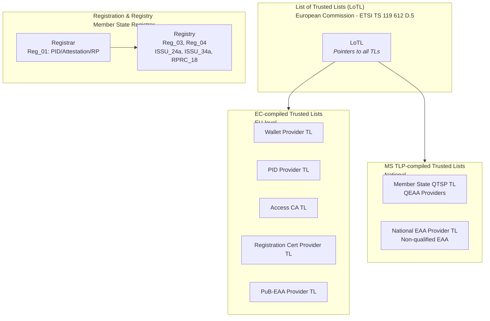
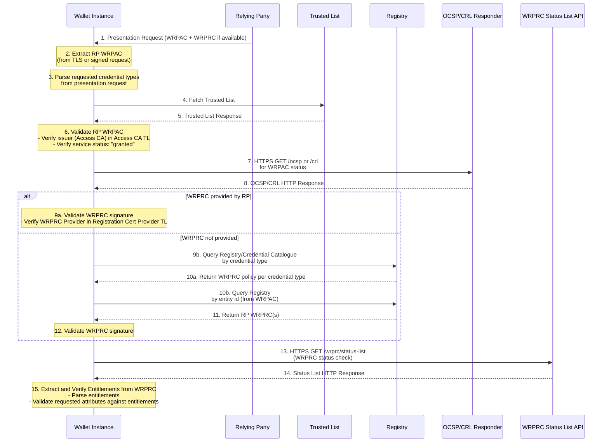
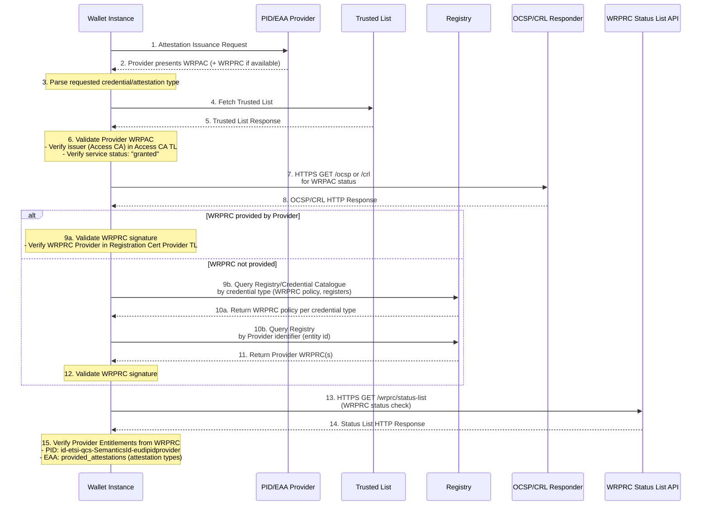
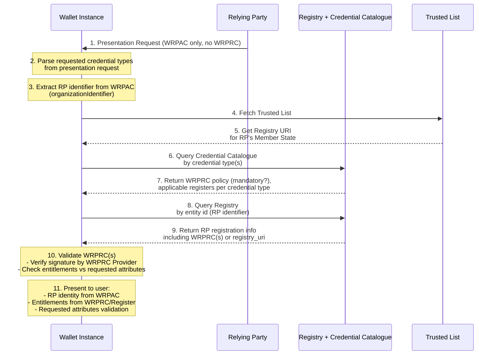
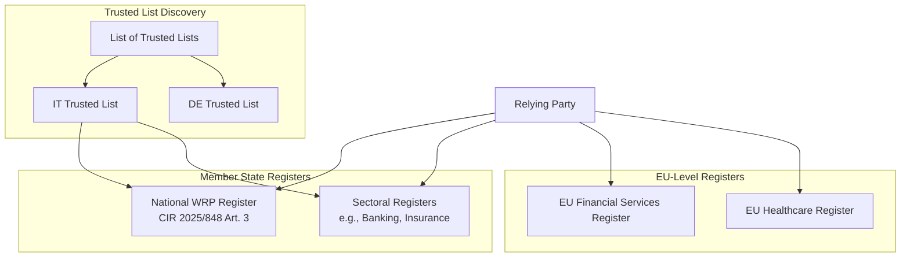
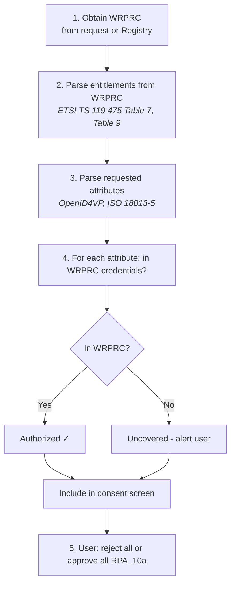
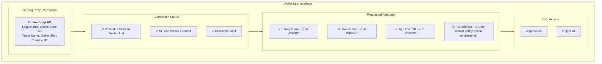

# EUDI Wallet Policy Discovery and Trust Verification

This document describes the policy discovery process performed by an EUDI Wallet Instance (holder) when interacting with **Relying Parties (RPs)** and **Attestation Providers** (PID Providers, QEAA Providers, PuB-EAA Providers, non-qualified EAA Providers). The discovery mechanism enables the wallet to verify the trustworthiness and entitlements of counterparties before disclosing user attributes.

## Abbreviations

See [Terms and Entities](../task1-use-cases/terms-and-entities.md#1-acronyms).

## Normative References

For official document links and extended references (including TS 119 615, TS 119 472-2), see [README References](../README.md#references).

| Reference | Document |
|-----------|----------|
| ETSI TS 119 612 v2.4.1 | Electronic Signatures and Trust Infrastructures; Trusted Lists |
| ETSI TS 119 602 v1.1.1 | Electronic Signatures and Trust Infrastructures; Lists of Trusted Entities (LoTE) |
| ETSI TS 119 411-8 v1.1.1 | Policy and security requirements for TSPs issuing certificates; Part 8: Access Certificate Policy for EUDI Wallet Relying Parties |
| ETSI TS 119 475 v1.1.1 | Relying party attributes supporting EUDI Wallet user's authorization decisions |
| ETSI EN 319 412-1 | Certificate Profiles; Part 1: Overview and common data structures |
| ETSI TS 119 412-6 v1.1.1 | Certificate profile requirements for PID, Wallet, EAA, QEAA, and PSBEAA providers |
| ETSI EN 319 401 | General Policy Requirements for Trust Service Providers |
| ETSI EN 319 411-1 | Policy and security requirements for TSPs issuing certificates; Part 1: General requirements |
| ETSI EN 319 411-2 | Policy and security requirements for TSPs issuing certificates; Part 2: Requirements for Qualified Certificate Issuers |
| CIR (EU) 2025/848 | Commission Implementing Regulation on the registration of wallet-relying parties |

---

## 1. Trust Infrastructure Architecture

For the full trust infrastructure model, responsibilities matrix, and registration/notification processes, see [Trust Infrastructure Schema](trust-infrastructure-schema.md).

### 1.1 Trust List Hierarchy

The EUDI Wallet ecosystem uses a hierarchical trust infrastructure based on ETSI TS 119 612. The **European Commission** maintains the **List of Trusted Lists (LoTL)**, which contains pointers to all published Trusted Lists. Per the [Trust Infrastructure Schema](trust-infrastructure-schema.md#overview):

- **EC-compiled Trusted Lists** (EU-level): Wallet Provider TL, PID Provider TL, WRPAC Provider (Access CA) TL, WRPRC Provider (Registration Cert Provider) TL, PuB-EAA Provider TL.
- **MS TLP-compiled Trusted Lists** (national): Member State QTSP TL for QEAA Providers; national EAA Provider TL for non-qualified EAA Providers.
- **Relying Parties** are **not** listed in Trusted Lists; they are validated via Access Certificates (issuer in Access CA TL) and **Registry**.



### 1.2 Service Type Identifiers

| Entity Type | Service Type URI | Reference |
|-------------|------------------|-----------|
| PID Provider | `http://uri.etsi.org/TrstSvc/Svctype/PID_Provider` | ETSI TS 119 612 clause 5.5.1 |
| Qualified EAA Provider | `http://uri.etsi.org/TrstSvc/Svctype/QEAA_Provider` | ETSI TS 119 612 clause 5.5.1 |
| Non-Qualified EAA Provider | `http://uri.etsi.org/TrstSvc/Svctype/Non_Q_EAA_Provider` | ETSI TS 119 612 clause 5.5.1 |
| Public Sector EAA Provider | `http://uri.etsi.org/TrstSvc/Svctype/PUB_EAA_Provider` | ETSI TS 119 612 clause 5.5.1 |
| Individual Wallet Provider | `http://uri.etsi.org/TrstSvc/Svctype/IndividualWalletProvider` | ETSI TS 119 612 clause 5.5.1 |
| Legal Person Wallet Provider | `http://uri.etsi.org/TrstSvc/Svctype/LegalPersonWalletProvider` | ETSI TS 119 612 clause 5.5.1 |
| Relying Party | `http://uri.etsi.org/TrstSvc/Svctype/RelyingParty` | ETSI TS 119 612 clause 5.5.1 |
| Relying Party Intermediary | `http://uri.etsi.org/TrstSvc/Svctype/RelyingPartyIntermediary` | ETSI TS 119 612 clause 5.5.1 |
| WRPAC Provider (Access Certificate CA) | `http://uri.etsi.org/TrstSvc/Svctype/CA/PKC` | ETSI TS 119 612 clause 5.5.1; ETSI TS 119 411-8 |
| WRPRC Provider (Registration Certificate Provider) | `http://uri.etsi.org/19602/SvcType/WRPRC/Issuance`<br/>`http://uri.etsi.org/19602/SvcType/WRPRC/Revocation` | ETSI TS 119 602 clause 3.4.1; ETSI TS 119 475 clause 3.1, 6 |

> **Note:** WRPRC Provider URIs per ETSI TS 119 602. WRPAC/WRPRC Providers are notified by MS to EC (not registered). Registrar manages PID/Attestation/RP registration. See [Trust Infrastructure Schema](trust-infrastructure-schema.md#overview).

---

## 2. Policy Discovery Flow

### 2.1 Discovery Sequence for Relying Party Interaction



> **Uncovered attributes:** When WRPRC(s) do not cover all requested attributes, authorization for uncovered ones shifts to user-autonomous. See [§4.3.1](#431-uncovered-attributes-and-user-autonomous-authorization).

### 2.2 Discovery Sequence for Attestation Provider Interaction



### 2.3 WRPRC Provider and Registration Certificate Issuance

Per ETSI TS 119 475 clause 4.6, Member States may authorize **Providers of Registration Certificates (WRPRC Providers)** to issue WRPRCs. Per the [Trust Infrastructure Schema](trust-infrastructure-schema.md#overview), these are distinct:
- **Member State Registrar** – manages registration of PID Providers, Attestation Providers, and Relying Parties; publishes Registry (CIR 2025/848 Art. 3 for WRPs)
- **WRPAC Provider (Access Certificate Authority)** – issues X.509 access certificates (ETSI TS 119 411-8); notified by MS to EC; does not register with Registrar

```mermaid
sequenceDiagram
    participant RP as Relying Party
    participant REG as Member State Registrar
    participant WRPRC_P as WRPRC Provider
    participant TL as Trusted List
    participant W as Wallet Instance

    Note over RP,REG: Registration Phase (Reg_01, Reg_25; CIR 2025/848 Art. 6)
    RP->>REG: 1. Registration Request
    REG->>REG: 2. Identity proofing<br/>(ETSI TS 119 461)
    REG-->>RP: 3. Registered; published in Registry

    Note over RP,WRPRC_P: Certificate Issuance (ETSI TS 119 475 clause 6)
    RP->>WRPRC_P: 4. WRPRC Request
    WRPRC_P->>REG: 5. Verify RP in register<br/>(REG-6.2.2.2-02)
    WRPRC_P->>WRPRC_P: 6. Verify RP holds valid WRPAC<br/>(REG-6.2.2.2-03)
    WRPRC_P-->>RP: 7. Issue WRPRC (JWT/CWT)<br/>signed by WRPRC Provider

    Note over RP,W: Presentation Phase
    RP->>W: 8. Presentation Request + WRPRC
    W->>TL: 9. Fetch Trusted List
    TL-->>W: 10. Trusted List Response
    Note over W: 11. Validate WRPRC Provider<br/>- Find Provider in Registration Cert Provider TL (EC-compiled)<br/>- Verify status: "granted"
    Note over W: 12. Validate WRPRC signature<br/>using Provider's public key (x5c)
    Note over W: 13. Extract entitlements<br/>& validate against request
```

#### 2.3.1 WRPRC Issuance Models (ETSI TS 119 475 Annex D)

| Model | Description | Reference |
|-------|-------------|-----------|
| Integrated | Registrar and WRPRC provider are same entity | ETSI TS 119 475 Annex D.1 |
| Registrar-initiated | Registrar instructs provider to issue | ETSI TS 119 475 Annex D.2 |
| RP-initiated | RP contacts provider after registration | ETSI TS 119 475 Annex D.3 |
| Provider-assisted | Provider acts as proxy to registrar | ETSI TS 119 475 Annex D.4 |

#### 2.3.2 WRPRC Provider Trust Validation

When a wallet receives a WRPRC, it validates the issuing WRPRC Provider:

| Validation Step | Description | Reference |
|-----------------|-------------|-----------|
| Provider in Trusted List | Verify WRPRC Provider is listed in Trusted List for WRPRC Providers (EC-compiled) | ETSI TS 119 612 clause 5.5.3; [Trust Infrastructure Schema](trust-infrastructure-schema.md#overview) |
| Service Status | Verify `ServiceCurrentStatus` is `granted` in Registration Cert Provider TL | ETSI TS 119 612 clause 5.5.4 |
| Signature Validation | Verify WRPRC signature using `x5c` (JWT) or `x5chain` (CWT) | ETSI TS 119 475 clause 5.2.2, 5.2.3 |
| WRPRC Validity | Check `iat` timestamp, `status` claim | ETSI TS 119 475 Table 7 |
| Policy ID | Verify `policy_id` matches expected policy OIDs | ETSI TS 119 475 clause 6.1.3 |

#### 2.3.4 Credential Catalogue, WRPRC Policy, and Sector Authorities

The **catalogue of attributes** and **catalogue of attestation schemes** are established by the Commission (CIR 2025/1569 Art. 7–8, ARF 5.5). Per ARF RPRC_09 and RPRC_13, registration certificates (WRPRC) are **optional**—the Registrar MAY decide to issue them. When a WRPRC exists, future Relying Parties rely on **issuer authorization** to trust credential content; this is not solely a user decision. The catalogue of schemes (CIR 2025/1569 Art. 8) can specify "requirements concerning providers"; sector- or scheme-specific rules may impose when WRPRC or equivalent issuer authorization is required. For definitions, data model, scope, and maintenance, see [Credential Catalogue](credential-catalogue.md) and ETSI TS 119 475.

#### 2.3.5 WRPAC vs WRPRC

| Aspect | WRPAC (Access Certificate) | WRPRC (Registration Certificate) |
|--------|---------------------------|----------------------------------|
| Format | X.509 Certificate | JWT or CWT |
| Issuer | WRPAC Provider (CA) | WRPRC Provider (TSP) |
| Policy | ETSI TS 119 411-8 | ETSI TS 119 475 clause 6 |
| Usage | TLS client authentication | Signed presentation requests |
| Entitlements | In `qcStatements` extension | In `entitlements` claim |
| Validation | Certificate chain to Access CA in Access CA TL (EC-compiled) | Signature by WRPRC Provider in Registration Cert Provider TL (EC-compiled) |
| Header | N/A | `typ`: `rc-wrp+jwt` or `rc-wrp+cwt` |

### 2.4 WRPRC Discovery via Registry

When an RP presents only a WRPAC without a WRPRC, the wallet discovers the RP's registration information and WRPRCs through the **Registry** and **Credential Catalogue** (per Reg_03, Reg_04; CIR 2025/848 Art. 3(5)). The Registry is published by the Member State Registrar; the Credential Catalogue (managed by registers) indicates per credential type whether WRPRC is mandatory and which sectoral registers apply. See [§2.3.4 Credential Catalogue, WRPRC Policy, and Sector Authorities](#234-credential-catalogue-wrprc-policy-and-sector-authorities).

**Query order:** The wallet SHALL query by **credential type first** (to obtain WRPRC policy and applicable registers), then by **entity id** (to obtain WRPRC(s) for the specific RP or Provider).



#### 2.4.1 Discovery Methods

| Method | Description | Reference |
|--------|-------------|-----------|
| **WRPRC in Request** | RP includes WRPRC(s) in presentation request | ETSI TS 119 475 clause 4.5 |
| **Credential Catalogue Query** | Wallet queries Credential Catalogue by **credential type** first: WRPRC mandatory?, applicable registers? | [§2.3.4](#234-credential-catalogue-wrprc-policy-and-sector-authorities); [credential-catalogue.md](credential-catalogue.md) |
| **Registry Query** | Wallet queries Registry by **entity id** (RP/Provider identifier from WRPAC) after credential type | Reg_06; CIR 2025/848 Art. 3(5) |
| **Sectoral Register Query** | Wallet queries sector-specific register (e.g., financial, healthcare) | Sector-specific regulations |
| **Cross-Border Register Query** | Wallet queries EU-level or foreign registers | ETSI TS 119 612 LOTL |
| **registry_uri in WRPRC** | WRPRC contains URL to issuing registry API | ETSI TS 119 475 Table 7, Annex B.2.1 |

#### 2.4.2 Multiple Register Architecture

An RP may be registered in multiple registers at different levels, each issuing WRPRCs for different scopes:



| Register Level | Scope | Example | WRPRC Entitlements |
|----------------|-------|---------|-------------------|
| **National** | General WRP registration | IT National Register | General service provider entitlements |
| **Sectoral (National)** | Sector-specific within MS | IT Banking Register | PSD2, financial data access |
| **Sectoral (EU)** | EU-wide sector regulation | EU Financial Services | Cross-border financial services |
| **Cross-Border** | Foreign MS registers | DE Register for IT-based RP | Services in foreign MS |

#### 2.4.3 Register Discovery via Trusted List

The wallet discovers available registers through the Trusted List infrastructure. The query order is **credential type first**, then **entity id**:

1. **LOTL Query** - Fetch List of Trusted Lists (EC-maintained) to discover pointers to EC-compiled TLs and MS TLP-compiled TLs (per [Trust Infrastructure Schema](trust-infrastructure-schema.md#33-list-of-trusted-lists-lotl))
2. **TSL Query** - Each Trusted List may list:
   - National WRP Register endpoints
   - Sectoral register endpoints  
   - WRPRC Provider services
3. **Credential Catalogue Query** - Query by **credential type** to obtain WRPRC policy (mandatory/optional) and applicable registers for that credential type
4. **Register Query** - Query each relevant register by **entity id** (RP or Provider identifier)

#### 2.4.4 Multiple WRPRC Aggregation

When an RP has WRPRCs from multiple registers, the wallet aggregates entitlements:

```mermaid
flowchart TD
    A[RP presents WRPAC] --> B{WRPRC in request?}
    B -->|Yes| C[Validate provided WRPRC]
    B -->|No| D[Parse requested credential types]
    D --> E[Query Credential Catalogue<br/>by credential type]
    E --> F[Get WRPRC policy, applicable registers]
    F --> G[Query Registry by entity id]
    
    G --> H{Entity found?}
    H -->|Yes| I[Fetch WRPRC(s)]
    H -->|No| J[Check Sectoral Registers<br/>from catalogue by entity id]
    
    C --> K{Additional registers<br/>applicable?}
    I --> K
    J --> K
    
    K -->|Yes| L[Query additional registers<br/>by credential type, then entity id]
    K -->|No| M[Use available WRPRCs]
    M --> N[Validate entitlements]
    L --> N
    
    N --> O[Present combined entitlements<br/>to user with source indication]
```

| Scenario | Wallet Behavior | User Display |
|----------|-----------------|--------------|
| Single WRPRC | Use single WRPRC entitlements | "Registered in: [Register Name]" |
| Multiple WRPRCs, same scope | Union of entitlements | "Registered in: [Register 1], [Register 2]" |
| Multiple WRPRCs, different scopes | Show entitlements per scope | "General: [entitlements], Financial: [entitlements]" |
| Conflicting entitlements | Most restrictive applies, warn user | "⚠ Entitlement conflict detected" |
| No WRPRC found | Warn user, limited trust | "⚠ No registration certificate found" |

#### 2.4.5 WRPRC Issuer Identification

Each WRPRC identifies its issuing register/provider:

| WRPRC Field | Purpose | Reference |
|-------------|---------|-----------|
| `registry_uri` | URL to the issuing registry API | ETSI TS 119 475 Table 7 |
| `policy_id` | Policy OID identifying the register's policy | ETSI TS 119 475 clause 6.1.3 |
| `x5c` / `x5chain` | Certificate chain of WRPRC Provider | ETSI TS 119 475 clause 5.2.2, 5.2.3 |

The wallet validates each WRPRC Provider against the **Registration Cert Provider Trusted List** (EC-compiled) based on the provider's certificate chain (per [Trust Infrastructure Schema](trust-infrastructure-schema.md#overview)).

> **Note:** The availability and API specification of registers may vary. CIR 2025/848 mandates national registers, but sectoral and cross-border registers depend on sector-specific regulations and bilateral/multilateral agreements.

---

## 3. Policy Verification Steps

### 3.1 Step 1: Obtain Counterparty Certificates (WRPAC and WRPRC)

The wallet obtains the counterparty's certificates:

#### 3.1.1 WRPAC Sources

| Source | Description | Reference |
|--------|-------------|-----------|
| TLS Handshake | X.509 client certificate for authentication | ETSI TS 119 411-8 clause 5 |
| Signed Request | Certificate embedded in signed presentation request | ETSI TS 119 475 clause 4.3 |

#### 3.1.2 WRPRC Sources

| Source | Description | Reference |
|--------|-------------|-----------|
| Included in Request | RP/Provider includes WRPRC in presentation request | ETSI TS 119 475 clause 4.5 |
| Registry API | Wallet queries Registry using identifier from WRPAC | Reg_06, Reg_03, Reg_04; CIR 2025/848 Art. 3(5) |
| OpenID4VP Request | JWT/CWT WRPRC embedded in request | ETSI TS 119 475 clause 6.2, 6.3 |

> **Note:** If WRPRC is not provided by the counterparty, the wallet SHALL first query the **Credential Catalogue** by **credential type** (to obtain WRPRC policy and applicable registers), then query the **Registry** by **entity id** from the WRPAC (`organizationIdentifier` for legal persons, `serialNumber` for natural persons), per **RPRC_18** and [Trust Infrastructure Schema](trust-infrastructure-schema.md) Reg_03, Reg_04. See [§2.4 WRPRC Discovery via Registry](#24-wrprc-discovery-via-registry).

### 3.2 Step 2: Trusted List Lookup

The wallet performs the following lookups:

```xml
<!-- Reference: ETSI TS 119 612 v2.4.1 -->

<!-- Step 2a: Fetch LOTL -->
<ListOfTrustedLists>
  <TrustedLists>
    <TrustedListPointer>
      <TSLLocation>https://trust.wallet.gov.it/tsl/tsl.xml</TSLLocation>
      <TSLType>http://uri.etsi.org/TrstSvc/TrustedList/TSLType/EUgeneric</TSLType>
      <SchemeTerritory>IT</SchemeTerritory>
    </TrustedListPointer>
  </TrustedLists>
</ListOfTrustedLists>

<!-- Step 2b: Fetch Access CA Trusted List (EC-compiled) or relevant TL per entity type -->
<TrustServiceStatusList>
  <TrustServiceProviderList>
    <TrustServiceProvider>
      <TSPServices>
        <ServiceInformation>
          <ServiceTypeIdentifier>http://uri.etsi.org/TrstSvc/Svctype/CA/PKC</ServiceTypeIdentifier>
          <ServiceDigitalIdentity>
            <X509Certificate><!-- Issuer CA Certificate --></X509Certificate>
          </ServiceDigitalIdentity>
          <ServiceCurrentStatus>http://uri.etsi.org/TrstSvc/TrustedList/Svcstatus/granted</ServiceCurrentStatus>
        </ServiceInformation>
      </TSPServices>
    </TrustServiceProvider>
  </TrustServiceProviderList>
</TrustServiceStatusList>
```

### 3.3 Step 3: WRPAC Validation (Certificate Chain)

| Validation Step | Description | Reference |
|-----------------|-------------|-----------|
| Issuer Match | Verify WRPAC issuer (Access CA) is listed in Access CA Trusted List (EC-compiled) | ETSI TS 119 612 clause 5.5.3; [Trust Infrastructure Schema](trust-infrastructure-schema.md#overview) |
| Service Status | Verify `ServiceCurrentStatus` is `granted` in Access CA TL | ETSI TS 119 612 clause 5.5.4 |
| Certificate Path | Build and validate certificate chain to trust anchor | IETF RFC 5280 clause 6 |
| Validity Period | Check `Not Before` and `Not After` dates | IETF RFC 5280 clause 4.1.2.5 |
| Revocation Status | Check OCSP or CRL for WRPAC | ETSI TS 119 411-8 GEN-6.6.1-08 |

### 3.4 Step 4: WRPRC Validation

#### 3.4.1 Obtaining WRPRC

| Scenario | Action | Reference |
|----------|--------|-----------|
| WRPRC provided in request | Use provided WRPRC | ETSI TS 119 475 clause 4.5 |
| WRPRC not provided | 1) Query Credential Catalogue by credential type; 2) Query Registry by entity id from WRPAC | Reg_03, Reg_04; CIR 2025/848 Art. 3(5); [§2.4](#24-wrprc-discovery-via-registry) |

#### 3.4.2 WRPRC Signature Validation

| Validation Step | Description | Reference |
|-----------------|-------------|-----------|
| WRPRC Provider in Trusted List | Verify WRPRC Provider is listed in Registration Cert Provider Trusted List (EC-compiled) | ETSI TS 119 612 clause 5.5.3; [Trust Infrastructure Schema](trust-infrastructure-schema.md#overview) |
| Provider Status | Verify `ServiceCurrentStatus` is `granted` in Registration Cert Provider TL | ETSI TS 119 612 clause 5.5.4 |
| Signature Verification | Verify WRPRC signature using `x5c` (JWT) or `x5chain` (CWT) | ETSI TS 119 475 clause 5.2.2, 5.2.3 |
| WRPRC Validity | Check `iat` timestamp and `status` claim | ETSI TS 119 475 Table 7 |
| Identifier Match | Verify WRPRC `sub.id` matches WRPAC `organizationIdentifier` | ETSI TS 119 475 GEN-5.1.1-02 |

### 3.5 Step 5: Entitlement Verification

#### 3.5.1 For Relying Parties

Extract and verify entitlements from WRPRC:

| Entitlement Source | Field | Reference |
|--------------------|-------|-----------|
| WRPRC (JWT) | `entitlements` claim | ETSI TS 119 475 clause 6.2, Table 7 |
| WRPRC (CWT) | `entitlements` claim | ETSI TS 119 475 clause 6.3 |
| WRPRC (JWT/CWT) | `credentials` claim (for service providers) | ETSI TS 119 475 Table 9 |

**Entitlement Structure (ETSI TS 119 475 Annex A):**

```
entitlements ::= SEQUENCE OF Entitlement

Entitlement ::= SEQUENCE {
    entitlementType   OBJECT IDENTIFIER,  -- OID or URI
    entitlementValue  ANY DEFINED BY entitlementType OPTIONAL
}
```

**Common Entitlement OIDs:**

| Entitlement | OID/URI | Reference |
|-------------|---------|-----------|
| PID Provider | `id-etsi-qcs-SemanticsId-eudipidprovider` | ETSI TS 119 475 Annex A.1 |
| Qualified EAA Provider | `id-etsi-qcs-SemanticsId-eudiqeaaprovider` | ETSI TS 119 475 Annex A.2 |
| Non-Qualified EAA Provider | `id-etsi-qcs-SemanticsId-eudinqeaaprovider` | ETSI TS 119 475 Annex A.3 |
| Public Sector EAA Provider | `id-etsi-qcs-SemanticsId-eudipubeaaprovider` | ETSI TS 119 475 Annex A.4 |
| General Relying Party (Service Provider) | `id-etsi-qcs-SemanticsId-eudirp` | ETSI TS 119 475 Annex A.5 |

#### 3.5.2 For Attestation Providers

Attestation providers (PID/EAA) must have their entitlements verified from the WRPRC:

| Provider Type | Required Entitlement in WRPRC | Additional WRPRC Field | Reference |
|---------------|------------------------------|------------------------|-----------|
| PID Provider | `id-etsi-qcs-SemanticsId-eudipidprovider` | - | ETSI TS 119 475 Annex A.1 |
| Qualified EAA Provider | `id-etsi-qcs-SemanticsId-eudiqeaaprovider` | `provided_attestations` | ETSI TS 119 475 Table 8 |
| Non-Qualified EAA Provider | `id-etsi-qcs-SemanticsId-eudinqeaaprovider` | `provided_attestations` | ETSI TS 119 475 Table 8 |
| Public Sector EAA Provider | `id-etsi-qcs-SemanticsId-eudipubeaaprovider` | `provided_attestations` | ETSI TS 119 475 Table 8 |

The `provided_attestations` field in the WRPRC specifies the attestation types the provider is authorized to issue (format, meta, claim). The wallet verifies that the attestation being issued matches the provider's authorized attestation types.

---

## 4. Attribute Request Validation

### 4.0 Default Policy Approach in EUDIW

The ARF and ETSI standards do **not** use the terms "additive" or "subtractive." The default policy approach in EUDIW is implied by the validation mechanism, not explicitly named.

**Evidence:** ARF **RPRC_21** (Topic 44 – Registration certificates for Relying Parties) states:

> *"If the User indicated that they want to verify the information registered about a Relying Party and the Wallet Unit retrieved this information … it SHALL verify that **all attributes requested in the presentation request are included in the list of attributes registered by the Registrar**. If the outcome of the verification is negative, the Wallet Unit SHALL … **notify the User about the requested attributes that the Relying Party did not register**."*

This defines an **allow-list** model: requested attributes must be **in** the RP's registered entitlements. Attributes **not** in the list → verification fails, user is notified. There is no provision for a deny-list or "restrictions with exceptions."

| Aspect | EUDIW (per ARF) |
|--------|-----------------|
| Validation rule | Requested attributes must be **included in** registered list |
| Attributes not in list | Verification negative; notify user |
| Equivalent (conceptual) | Allow-list; deny-by-default for unregistered attributes |

*Source: [ARF Annex 2.02 – RPRC_21](https://eu-digital-identity-wallet.github.io/eudi-doc-architecture-and-reference-framework/2.8.0/annexes/annex-2/annex-2.02-high-level-requirements-by-topic/), Topic 44.*

### 4.1 Matching Requested Attributes to Entitlements

Per RPRC_21, the wallet verifies that requested attributes are included in the RP's registered entitlements (WRPRC `credentials` claim). Attributes not in WRPRC are uncovered; see [§4.3.1](#431-uncovered-attributes-and-user-autonomous-authorization).



### 4.2 Entitlement-to-Attribute Mapping

The WRPRC `credentials` claim (for service providers) specifies which attestations and attributes the RP is authorized to request:

| WRPRC Field | Description | Reference |
|-------------|-------------|-----------|
| `entitlements` | List of entitlement URIs/OIDs | ETSI TS 119 475 Table 7 |
| `credentials` | Requestable attestations with format, meta, claim | ETSI TS 119 475 Table 9 |
| `purpose` | Purpose descriptions for data processing | ETSI TS 119 475 Table 9 |

| Entitlement | Authorized Attributes | Reference |
|-------------|----------------------|-----------|
| `id-etsi-qcs-SemanticsId-eudirp` | As specified in `credentials` claim of WRPRC | ETSI TS 119 475 Table 9 |
| Age Verification | `age_over_18`, `age_over_21`, `birth_date` | CIR 2025/848 Annex II |
| KYC/AML | Full PID attributes | National regulations |
| Healthcare | Healthcare-specific EAAs | ETSI TS 119 475 Annex B |

### 4.3 Attribute Validation Scenarios

#### 4.3.1 Uncovered Attributes and User-Autonomous Authorization

When an RP requests attributes and the WRPRC(s) from the RP or Registry do not cover all requested attributes, some attributes are **uncovered** (no corresponding entitlement in any WRPRC). In this situation:

1. **Authorization source:** For covered attributes, authorization comes from the WRPRC/Registry (registration-based). For uncovered attributes, authorization can be provided **autonomously by the user** via explicit wallet interaction.

2. **Wallet behaviour:**
   - Clearly distinguish on the consent screen: attributes **authorized by WRPRC** vs attributes **not in any registered entitlement** (uncovered).
   - For uncovered attributes, SHALL NOT disclose unless the user explicitly approves after being informed.
   - Present the user with an all-or-nothing choice: reject all requested attributes, or approve all requested attributes (including any uncovered ones the user chooses to disclose). Per RPA_10a, the wallet SHOULD NOT allow partial approval (e.g., approving only covered attributes while rejecting uncovered), since partial disclosure would violate the user's privacy.

3. **User responsibility:** When the user explicitly approves disclosure of uncovered attributes, the user assumes responsibility for sharing data outside the RP's registered scope. The wallet SHALL record that such disclosure was user-initiated.

| Scenario | Authorization Source | Wallet Action |
|----------|----------------------|---------------|
| Attribute in WRPRC `credentials` | WRPRC/Registry | Include in consent screen; user may approve or reject |
| Attribute not in any WRPRC (uncovered) | User-autonomous | Alert user; require explicit approval to disclose; do not disclose by default |

#### 4.3.2 No WRPRC Scenario and User Default Policy

When the wallet does **not** query a policy repository (Registry/Registrar)—e.g., offline, user has chosen not to verify (RPRC_16), or WRPRC is unavailable—the wallet has only the attribute request. In that case:

1. **Responsibility:** There is no WRPRC to validate against; the responsibility for deciding what to disclose falls entirely on the user.
2. **Wallet behaviour:** The wallet SHALL present all requested attributes for user consent, applying the user's **default policy** configured in the wallet instance.

**UX protection through attribute marking:** To support informed consent, the wallet SHALL visually distinguish on the consent screen:

| Mark | Meaning |
|------|---------|
| Explicitly in WRPRC | Attribute is in the RP's registered entitlements; authorization is registration-based |
| Not in WRPRC (or WRPRC unavailable) | Attribute follows the **user default policy** defined in the wallet instance |

The **user default policy** is a wallet configuration that determines how to present and pre-dispose attributes that are not in WRPRC (or when WRPRC is unavailable). Examples:

- **Deny by default** — treat as uncovered; require explicit user approval before disclosure
- **Allow by default** — pre-select for presentation; user may deselect
- **Ask every time** — no pre-selection; user must explicitly approve or reject each

When WRPRC is available, attributes in WRPRC are marked as authorized-by-registration; uncovered attributes are marked according to the user default policy. When WRPRC is unavailable, all requested attributes are marked according to the user default policy.

#### 4.3.3 Same-Entity Issuer-Consumer

In many use cases—travel (boarding pass), access (building key), membership (club card)—the credential **issuer** and the **Relying Party** (consumer) are the **same entity**. The user receives a credential from Entity X and later presents it to Entity X for verification.

This pattern may warrant a distinct default policy consideration:

- **Rationale:** The user has already entrusted the entity with the credential; the entity is requesting back what it issued.
- **Wallet behaviour:** The wallet MAY offer a configurable default for same-entity scenarios (e.g., reduced scrutiny, different UX treatment, or a separate user preference).
- **Compliance:** Any such default SHALL still respect RPA_07 (user approval required) and applicable data protection requirements. The default affects presentation and UX, not the requirement to obtain user consent.

---

## 5. Trust List Caching and Update

### 5.1 Caching Strategy

| Parameter | Value | Reference |
|-----------|-------|-----------|
| Cache Duration | Until `NextUpdate` field | ETSI TS 119 612 clause 5.3.9 |
| Refresh Trigger | `NextUpdate` reached or manual | ETSI TS 119 612 clause 5.3.9 |
| Fallback | Use cached list if fetch fails | Implementation-specific |

### 5.2 Trust List Update Monitoring

```xml
<!-- Reference: ETSI TS 119 612 v2.4.1 -->
<SchemeInformation>
  <ListIssueDateTime>2024-01-01T00:00:00Z</ListIssueDateTime>
  <NextUpdate>2024-01-02T00:00:00Z</NextUpdate>
  <DistributionPoints>
    <DistributionPoint>
      <URI>https://trust.wallet.gov.it/tsl/tsl.xml</URI>
    </DistributionPoint>
  </DistributionPoints>
</SchemeInformation>
```

---

## 6. Error Handling and User Notification

### 6.1 Validation Failure Scenarios

| Scenario | Wallet Action | User Notification |
|----------|---------------|-------------------|
| Access CA not in Access CA TL | Reject interaction | "Unrecognized service provider" |
| Service status `withdrawn` | Reject interaction | "Service provider authorization revoked" |
| Service status `suspended` | Warn user | "Service provider temporarily suspended" |
| Certificate revoked | Reject interaction | "Service provider certificate invalid" |
| Entitlement mismatch (uncovered attributes) | Alert user; offer explicit approval for user-autonomous disclosure | "Requested attributes not in RP's registered entitlements. Approve anyway?" |
| WRPRC unavailable / no Registry query | Apply user default policy; user bears full responsibility | "RP registration not verified. Proceed based on your default settings?" |
| Certificate expired | Reject interaction | "Service provider certificate expired" |
| WRPRC signature invalid | Reject interaction | "Registration certificate signature verification failed" |
| WRPRC Provider not in Registration Cert Provider TL | Reject interaction | "Registration certificate issuer not recognized" |

### 6.2 User Consent Flow



> **Note:** Marking per [§4.3.2](#432-no-wrprc-scenario-and-user-default-policy). Same-entity cases per [§4.3.3](#433-same-entity-issuer-consumer).

---

## 7. Implementation Considerations

### 7.1 Performance Optimization

| Optimization | Description | Reference |
|--------------|-------------|-----------|
| LOTL Caching | Cache List of Trusted Lists locally | ETSI TS 119 612 clause D.5 |
| TSL Prefetching | Prefetch commonly used Member State TSLs | Implementation-specific |
| OCSP Stapling | Accept stapled OCSP responses | IETF RFC 6961 |
| Delta Updates | Support incremental TSL updates | ETSI TS 119 612 clause 5.3 |

### 7.2 Offline Scenarios

| Scenario | Wallet Behavior |
|----------|-----------------|
| No network, cached TSL valid | Use cached TSL |
| No network, cached TSL expired | Warn user, allow limited interaction |
| No network, no cached TSL | Reject interaction |

### 7.3 Cross-Border Discovery

For cross-border interactions, the wallet:

1. Fetches LOTL to discover foreign Member State TSLs
2. Fetches relevant foreign TSL based on counterparty's country
3. Validates counterparty against foreign TSL
4. Applies same entitlement verification logic

---

## 8. Security Considerations

| Consideration | Mitigation | Reference |
|---------------|------------|-----------|
| TSL Tampering | Verify TSL digital signature | ETSI TS 119 612 clause 5.7 |
| Man-in-the-Middle | Use HTTPS for all TSL fetches | ETSI TS 119 612 clause 6.1 |
| Replay Attacks | Check `ListIssueDateTime` freshness | ETSI TS 119 612 clause 5.3.8 |
| Certificate Substitution | Bind certificate to TLS session | Implementation-specific |

---

## References

ETSI standards, EU regulations, and document links: see [Normative References](#normative-references) above and [README References](../README.md#references).

### IETF Standards

- IETF RFC 5280 - Internet X.509 PKI Certificate and CRL Profile
- IETF RFC 6961 - TLS Multiple Certificate Status Request Extension

### Related Documents

- Trust Infrastructure Schema: Onboarding and Trusted Lists ([trust-infrastructure-schema.md](trust-infrastructure-schema.md))
- ETSI Policy Application Mechanisms (task5-participants-certificates-policies/etsi-policy-enumeration.md)
- ETSI Policy Evaluation (task5-participants-certificates-policies/etsi-policy-evaluation.md)

