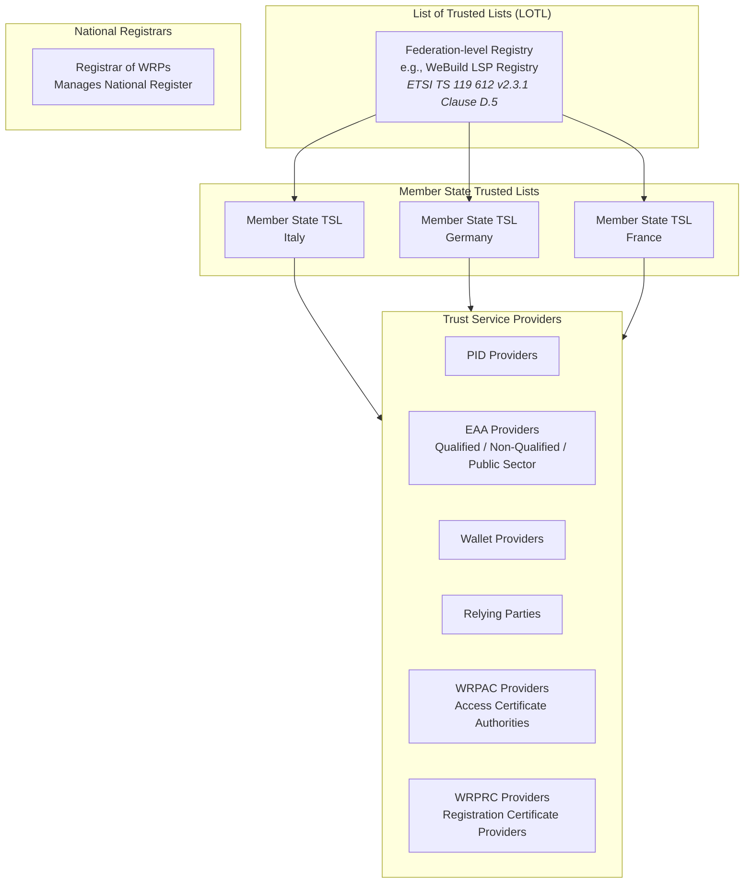
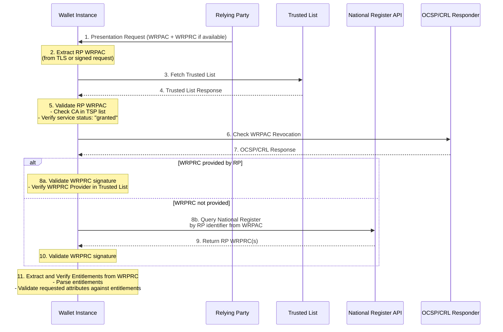
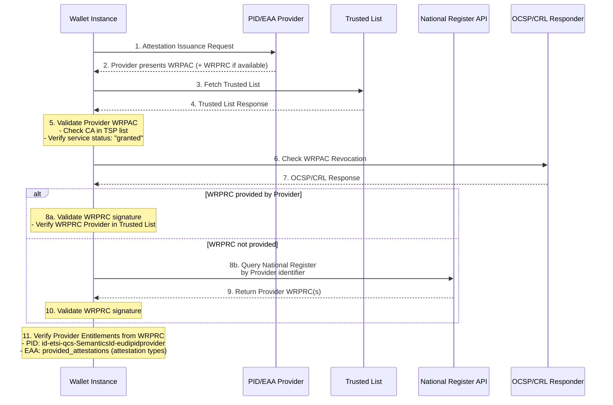
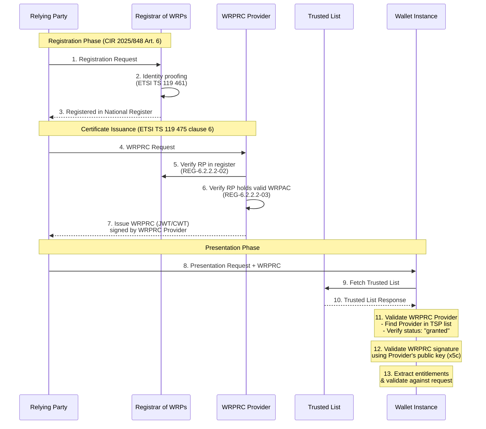
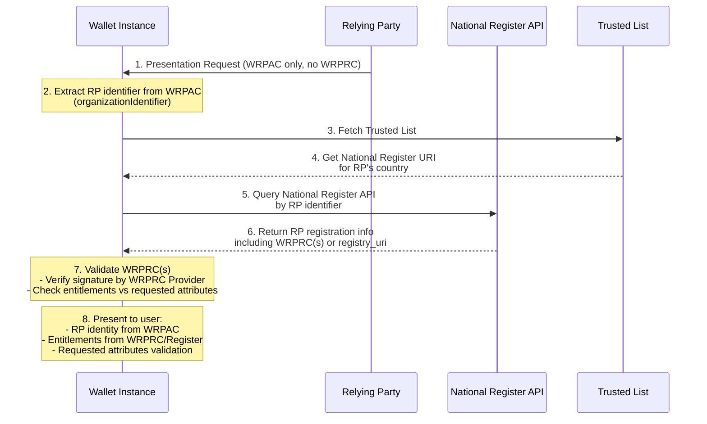
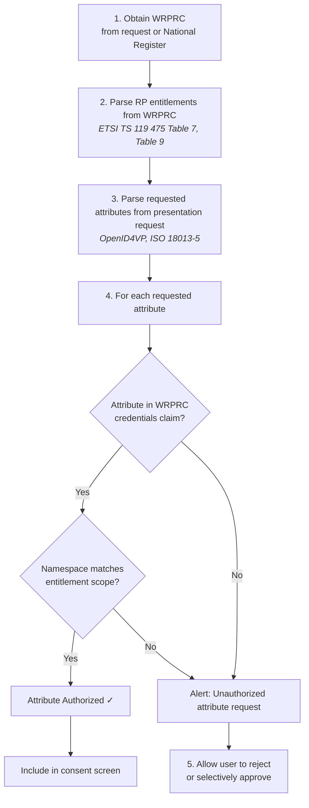
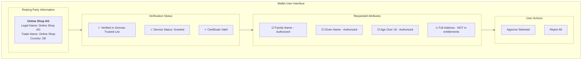

# Wallet Instance Policy Discovery

## Overview

This document describes the policy discovery process performed by an EUDI Wallet Instance (holder) when interacting with Relying Parties (RPs) and Attestation Providers (PID Providers and EAA Providers). The discovery mechanism enables the wallet to verify the trustworthiness and entitlements of counterparties before disclosing user attributes.

## Abbreviations

| Abbreviation | Definition |
|--------------|------------|
| CA | Certificate Authority |
| CIR | Commission Implementing Regulation |
| CWT | CBOR Web Token |
| EAA | Electronic Attestation of Attributes |
| EUDIW | European Digital Identity Wallet |
| JWT | JSON Web Token |
| LOTL | List of Trusted Lists |
| OCSP | Online Certificate Status Protocol |
| PID | Person Identification Data |
| RP | Relying Party |
| TSL | Trusted Service List |
| TSP | Trust Service Provider |
| WRP | Wallet-Relying Party |
| WRPAC | Wallet-Relying Party Access Certificate |
| WRPRC | Wallet-Relying Party Registration Certificate |

## Normative References

| Reference | Document |
|-----------|----------|
| ETSI TS 119 612 v2.3.1 | Electronic Signatures and Trust Infrastructures; Trusted Lists |
| ETSI TS 119 411-8 | Policy and security requirements for TSPs issuing certificates; Part 8: Access Certificate Policy for EUDI Wallet Relying Parties |
| ETSI TS 119 475 | Relying party attributes supporting EUDI Wallet user's authorization decisions |
| ETSI EN 319 412-1 | Certificate Profiles; Part 1: Overview and common data structures |
| CIR (EU) 2025/848 | Commission Implementing Regulation on the registration of wallet-relying parties |

---

## 1. Trust Infrastructure Architecture

### 1.1 Trust List Hierarchy

The EUDI Wallet ecosystem uses a hierarchical trust infrastructure based on ETSI TS 119 612:



### 1.2 Service Type Identifiers

| Entity Type | Service Type URI | Reference |
|-------------|------------------|-----------|
| PID Provider | `http://uri.etsi.org/TrstSvc/Svctype/CredentialIssuer` | ETSI TS 119 612 clause 5.5.1 |
| EAA Provider | `http://uri.etsi.org/TrstSvc/Svctype/CredentialIssuer` | ETSI TS 119 612 clause 5.5.1 |
| Wallet Provider | `http://uri.etsi.org/TrstSvc/Svctype/WalletProvider` | ETSI TS 119 612 clause 5.5.1 |
| Relying Party | `http://uri.etsi.org/TrstSvc/Svctype/RelyingParty` | ETSI TS 119 612 clause 5.5.1 |
| WRPAC Provider (Access Certificate CA) | `http://uri.etsi.org/TrstSvc/Svctype/CA/PKC` | ETSI TS 119 612 clause 5.5.1; ETSI TS 119 411-8 |
| WRPRC Provider (Registration Certificate Provider) | *TSP - service type TBD* | ETSI TS 119 475 clause 3.1, 6 |

> **Note:** ETSI TS 119 475 clause 3.1 defines the "provider of wallet-relying party registration certificates" as a TSP, but no specific ETSI service type URI has been standardized yet. The Registrar of WRPs (CIR 2025/848 Art. 3) manages the national register but is distinct from certificate providers.

---

## 2. Policy Discovery Flow

### 2.1 Discovery Sequence for Relying Party Interaction



### 2.2 Discovery Sequence for Attestation Provider Interaction



### 2.3 WRPRC Provider and Registration Certificate Issuance

Per ETSI TS 119 475 clause 4.6, Member States may authorize **providers of wallet-relying party registration certificates (WRPRC providers)** to issue WRPRCs. These are distinct from:
- **Registrars of WRPs** - manage the national register (CIR 2025/848 Art. 3)
- **WRPAC Providers** - issue X.509 access certificates (ETSI TS 119 411-8)



#### 2.3.1 WRPRC Issuance Models (ETSI TS 119 475 Annex D)

| Model | Description | Reference |
|-------|-------------|-----------|
| Integrated | Registrar and WRPRC provider are same entity | ETSI TS 119 475 Annex D.1 |
| Registrar-initiated | Registrar instructs provider to issue | ETSI TS 119 475 Annex D.2 |
| RP-initiated | RP contacts provider after registration | ETSI TS 119 475 Annex D.3 |
| Provider-assisted | Provider acts as proxy to registrar | ETSI TS 119 475 Annex D.4 |

#### 2.3.2 WRPRC Provider Trust Validation

When a wallet receives a WRPRC, it validates the issuing WRPRC Provider:

| Validation Step | Description | Reference |
|-----------------|-------------|-----------|
| Provider in Trusted List | Verify WRPRC Provider is listed in Member State Trusted List | ETSI TS 119 612 clause 5.5.3 |
| Service Status | Verify `ServiceCurrentStatus` is `granted` | ETSI TS 119 612 clause 5.5.4 |
| Signature Validation | Verify WRPRC signature using `x5c` (JWT) or `x5chain` (CWT) | ETSI TS 119 475 clause 5.2.2, 5.2.3 |
| WRPRC Validity | Check `iat` timestamp, `status` claim | ETSI TS 119 475 Table 7 |
| Policy ID | Verify `policy_id` matches expected policy OIDs | ETSI TS 119 475 clause 6.1.3 |

#### 2.3.3 WRPAC vs WRPRC

| Aspect | WRPAC (Access Certificate) | WRPRC (Registration Certificate) |
|--------|---------------------------|----------------------------------|
| Format | X.509 Certificate | JWT or CWT |
| Issuer | WRPAC Provider (CA) | WRPRC Provider (TSP) |
| Policy | ETSI TS 119 411-8 | ETSI TS 119 475 clause 6 |
| Usage | TLS client authentication | Signed presentation requests |
| Entitlements | In `qcStatements` extension | In `entitlements` claim |
| Validation | Certificate chain to CA in Trusted List | Signature by WRPRC Provider in Trusted List |
| Header | N/A | `typ`: `rc-wrp+jwt` or `rc-wrp+cwt` |

### 2.4 WRPRC Discovery via National Register

When an RP presents only a WRPAC without a WRPRC, the wallet can discover the RP's registration information and WRPRCs through the **National Register of Wallet-Relying Parties** (CIR 2025/848 Article 3(5)).



#### 2.4.1 Discovery Methods

| Method | Description | Reference |
|--------|-------------|-----------|
| **WRPRC in Request** | RP includes WRPRC in presentation request | ETSI TS 119 475 clause 4.5 |
| **National Register Query** | Wallet queries register using RP identifier from WRPAC | CIR 2025/848 Art. 3(5) |
| **registry_uri in WRPRC** | WRPRC contains URL to national registry API | ETSI TS 119 475 Table 7, Annex B.2.1 |

#### 2.4.2 National Register API

Per CIR 2025/848 Article 3(5), each Member State maintains a publicly accessible National Register with an API endpoint. The wallet can:

1. **Extract RP identifier** from WRPAC (`organizationIdentifier` or `serialNumber`)
2. **Determine country** from WRPAC (`countryName`) or TSL
3. **Lookup National Register URI** from Trusted List or well-known location
4. **Query the register** using the RP identifier
5. **Retrieve registration data** including:
   - RP entitlements
   - Intended use declarations
   - WRPRC(s) issued to the RP
   - Privacy policy URL
   - Supervisory authority

#### 2.4.3 Handling Missing WRPRC

| Scenario | Wallet Behavior | User Notification |
|----------|-----------------|-------------------|
| WRPRC provided in request | Use provided WRPRC | Show verified entitlements |
| WRPRC not provided, register available | Fetch from National Register | Show entitlements from register |
| WRPRC not provided, register unavailable | Use WRPAC entitlements only (if present) | Warn: "Limited entitlement info" |
| RP not in register | Reject or warn | "RP registration not verified" |
| Multiple WRPRCs for RP | Present all applicable entitlements | Show combined entitlements |

> **Note:** The availability and API specification of National Registers may vary by Member State. CIR 2025/848 mandates public availability but implementation details are Member State-specific.

---

## 3. Policy Verification Steps

### 3.1 Step 1: Obtain Counterparty Certificates (WRPAC and WRPRC)

The wallet obtains the counterparty's certificates:

#### 3.1.1 WRPAC Sources

| Source | Description | Reference |
|--------|-------------|-----------|
| TLS Handshake | X.509 client certificate for authentication | ETSI TS 119 411-8 clause 5 |
| Signed Request | Certificate embedded in signed presentation request | ETSI TS 119 475 clause 4.3 |

#### 3.1.2 WRPRC Sources

| Source | Description | Reference |
|--------|-------------|-----------|
| Included in Request | RP/Provider includes WRPRC in presentation request | ETSI TS 119 475 clause 4.5 |
| National Register API | Wallet queries register using identifier from WRPAC | CIR 2025/848 Art. 3(5) |
| OpenID4VP Request | JWT/CWT WRPRC embedded in request | ETSI TS 119 475 clause 6.2, 6.3 |

> **Note:** If WRPRC is not provided by the counterparty, the wallet should query the National Register using the identifier extracted from the WRPAC (`organizationIdentifier` for legal persons, `serialNumber` for natural persons).

### 3.2 Step 2: Trusted List Lookup

The wallet performs the following lookups:

```xml
<!-- Reference: ETSI TS 119 612 v2.3.1 -->

<!-- Step 2a: Fetch LOTL -->
<ListOfTrustedLists>
  <TrustedLists>
    <TrustedListPointer>
      <TSLLocation>https://trust.wallet.gov.it/tsl/tsl.xml</TSLLocation>
      <TSLType>http://uri.etsi.org/TrstSvc/TrustedList/TSLType/EUgeneric</TSLType>
      <SchemeTerritory>IT</SchemeTerritory>
    </TrustedListPointer>
  </TrustedLists>
</ListOfTrustedLists>

<!-- Step 2b: Fetch Member State TSL -->
<TrustServiceStatusList>
  <TrustServiceProviderList>
    <TrustServiceProvider>
      <TSPServices>
        <ServiceInformation>
          <ServiceTypeIdentifier>http://uri.etsi.org/TrstSvc/Svctype/CA/PKC</ServiceTypeIdentifier>
          <ServiceDigitalIdentity>
            <X509Certificate><!-- Issuer CA Certificate --></X509Certificate>
          </ServiceDigitalIdentity>
          <ServiceCurrentStatus>http://uri.etsi.org/TrstSvc/TrustedList/Svcstatus/granted</ServiceCurrentStatus>
        </ServiceInformation>
      </TSPServices>
    </TrustServiceProvider>
  </TrustServiceProviderList>
</TrustServiceStatusList>
```

### 3.3 Step 3: WRPAC Validation (Certificate Chain)

| Validation Step | Description | Reference |
|-----------------|-------------|-----------|
| Issuer Match | Verify WRPAC issuer (CA) matches TSP in Trusted List | ETSI TS 119 612 clause 5.5.3 |
| Service Status | Verify `ServiceCurrentStatus` is `granted` | ETSI TS 119 612 clause 5.5.4 |
| Certificate Path | Build and validate certificate chain to trust anchor | IETF RFC 5280 clause 6 |
| Validity Period | Check `Not Before` and `Not After` dates | IETF RFC 5280 clause 4.1.2.5 |
| Revocation Status | Check OCSP or CRL for WRPAC | ETSI TS 119 411-8 GEN-6.6.1-08 |

### 3.4 Step 4: WRPRC Validation

#### 3.4.1 Obtaining WRPRC

| Scenario | Action | Reference |
|----------|--------|-----------|
| WRPRC provided in request | Use provided WRPRC | ETSI TS 119 475 clause 4.5 |
| WRPRC not provided | Query National Register using identifier from WRPAC | CIR 2025/848 Art. 3(5) |

#### 3.4.2 WRPRC Signature Validation

| Validation Step | Description | Reference |
|-----------------|-------------|-----------|
| WRPRC Provider in Trusted List | Verify WRPRC Provider is listed in Trusted List | ETSI TS 119 612 clause 5.5.3 |
| Provider Status | Verify `ServiceCurrentStatus` is `granted` | ETSI TS 119 612 clause 5.5.4 |
| Signature Verification | Verify WRPRC signature using `x5c` (JWT) or `x5chain` (CWT) | ETSI TS 119 475 clause 5.2.2, 5.2.3 |
| WRPRC Validity | Check `iat` timestamp and `status` claim | ETSI TS 119 475 Table 7 |
| Identifier Match | Verify WRPRC `sub.id` matches WRPAC `organizationIdentifier` | ETSI TS 119 475 GEN-5.1.1-02 |

### 3.5 Step 5: Entitlement Verification

#### 3.5.1 For Relying Parties

Extract and verify entitlements from WRPRC:

| Entitlement Source | Field | Reference |
|--------------------|-------|-----------|
| WRPRC (JWT) | `entitlements` claim | ETSI TS 119 475 clause 6.2, Table 7 |
| WRPRC (CWT) | `entitlements` claim | ETSI TS 119 475 clause 6.3 |
| WRPRC (JWT/CWT) | `credentials` claim (for service providers) | ETSI TS 119 475 Table 9 |

**Entitlement Structure (ETSI TS 119 475 Annex A):**

```
entitlements ::= SEQUENCE OF Entitlement

Entitlement ::= SEQUENCE {
    entitlementType   OBJECT IDENTIFIER,  -- OID or URI
    entitlementValue  ANY DEFINED BY entitlementType OPTIONAL
}
```

**Common Entitlement OIDs:**

| Entitlement | OID/URI | Reference |
|-------------|---------|-----------|
| PID Provider | `id-etsi-qcs-SemanticsId-eudipidprovider` | ETSI TS 119 475 Annex A.1 |
| Qualified EAA Provider | `id-etsi-qcs-SemanticsId-eudiqeaaprovider` | ETSI TS 119 475 Annex A.2 |
| Non-Qualified EAA Provider | `id-etsi-qcs-SemanticsId-eudinqeaaprovider` | ETSI TS 119 475 Annex A.3 |
| Public Sector EAA Provider | `id-etsi-qcs-SemanticsId-eudipubeaaprovider` | ETSI TS 119 475 Annex A.4 |
| General Relying Party (Service Provider) | `id-etsi-qcs-SemanticsId-eudirp` | ETSI TS 119 475 Annex A.5 |

#### 3.5.2 For Attestation Providers

Attestation providers (PID/EAA) must have their entitlements verified from the WRPRC:

| Provider Type | Required Entitlement in WRPRC | Additional WRPRC Field | Reference |
|---------------|------------------------------|------------------------|-----------|
| PID Provider | `id-etsi-qcs-SemanticsId-eudipidprovider` | - | ETSI TS 119 475 Annex A.1 |
| Qualified EAA Provider | `id-etsi-qcs-SemanticsId-eudiqeaaprovider` | `provided_attestations` | ETSI TS 119 475 Table 8 |
| Non-Qualified EAA Provider | `id-etsi-qcs-SemanticsId-eudinqeaaprovider` | `provided_attestations` | ETSI TS 119 475 Table 8 |
| Public Sector EAA Provider | `id-etsi-qcs-SemanticsId-eudipubeaaprovider` | `provided_attestations` | ETSI TS 119 475 Table 8 |

The `provided_attestations` field in the WRPRC specifies the attestation types the provider is authorized to issue (format, meta, claim). The wallet verifies that the attestation being issued matches the provider's authorized attestation types.

---

## 4. Attribute Request Validation

### 4.1 Matching Requested Attributes to Entitlements

When a Relying Party requests attributes, the wallet validates using the WRPRC:



### 4.2 Entitlement-to-Attribute Mapping

The WRPRC `credentials` claim (for service providers) specifies which attestations and attributes the RP is authorized to request:

| WRPRC Field | Description | Reference |
|-------------|-------------|-----------|
| `entitlements` | List of entitlement URIs/OIDs | ETSI TS 119 475 Table 7 |
| `credentials` | Requestable attestations with format, meta, claim | ETSI TS 119 475 Table 9 |
| `purpose` | Purpose descriptions for data processing | ETSI TS 119 475 Table 9 |

| Entitlement | Authorized Attributes | Reference |
|-------------|----------------------|-----------|
| `id-etsi-qcs-SemanticsId-eudirp` | As specified in `credentials` claim of WRPRC | ETSI TS 119 475 Table 9 |
| Age Verification | `age_over_18`, `age_over_21`, `birth_date` | CIR 2025/848 Annex II |
| KYC/AML | Full PID attributes | National regulations |
| Healthcare | Healthcare-specific EAAs | ETSI TS 119 475 Annex B |

---

## 5. Trust List Caching and Update

### 5.1 Caching Strategy

| Parameter | Value | Reference |
|-----------|-------|-----------|
| Cache Duration | Until `NextUpdate` field | ETSI TS 119 612 clause 5.3.9 |
| Refresh Trigger | `NextUpdate` reached or manual | ETSI TS 119 612 clause 5.3.9 |
| Fallback | Use cached list if fetch fails | Implementation-specific |

### 5.2 Trust List Update Monitoring

```xml
<!-- Reference: ETSI TS 119 612 v2.3.1 -->
<SchemeInformation>
  <ListIssueDateTime>2024-01-01T00:00:00Z</ListIssueDateTime>
  <NextUpdate>2024-01-02T00:00:00Z</NextUpdate>
  <DistributionPoints>
    <DistributionPoint>
      <URI>https://trust.wallet.gov.it/tsl/tsl.xml</URI>
    </DistributionPoint>
  </DistributionPoints>
</SchemeInformation>
```

---

## 6. Error Handling and User Notification

### 6.1 Validation Failure Scenarios

| Scenario | Wallet Action | User Notification |
|----------|---------------|-------------------|
| CA not in Trusted List | Reject interaction | "Unrecognized service provider" |
| Service status `withdrawn` | Reject interaction | "Service provider authorization revoked" |
| Service status `suspended` | Warn user | "Service provider temporarily suspended" |
| Certificate revoked | Reject interaction | "Service provider certificate invalid" |
| Entitlement mismatch | Alert user | "Requested attributes exceed authorization" |
| Certificate expired | Reject interaction | "Service provider certificate expired" |

### 6.2 User Consent Flow



---

## 7. Implementation Considerations

### 7.1 Performance Optimization

| Optimization | Description | Reference |
|--------------|-------------|-----------|
| LOTL Caching | Cache List of Trusted Lists locally | ETSI TS 119 612 clause D.5 |
| TSL Prefetching | Prefetch commonly used Member State TSLs | Implementation-specific |
| OCSP Stapling | Accept stapled OCSP responses | IETF RFC 6961 |
| Delta Updates | Support incremental TSL updates | ETSI TS 119 612 clause 5.3 |

### 7.2 Offline Scenarios

| Scenario | Wallet Behavior |
|----------|-----------------|
| No network, cached TSL valid | Use cached TSL |
| No network, cached TSL expired | Warn user, allow limited interaction |
| No network, no cached TSL | Reject interaction |

### 7.3 Cross-Border Discovery

For cross-border interactions, the wallet:

1. Fetches LOTL to discover foreign Member State TSLs
2. Fetches relevant foreign TSL based on counterparty's country
3. Validates counterparty against foreign TSL
4. Applies same entitlement verification logic

---

## 8. Security Considerations

| Consideration | Mitigation | Reference |
|---------------|------------|-----------|
| TSL Tampering | Verify TSL digital signature | ETSI TS 119 612 clause 5.7 |
| Man-in-the-Middle | Use HTTPS for all TSL fetches | ETSI TS 119 612 clause 6.1 |
| Replay Attacks | Check `ListIssueDateTime` freshness | ETSI TS 119 612 clause 5.3.8 |
| Certificate Substitution | Bind certificate to TLS session | Implementation-specific |

---

## References

- ETSI TS 119 612 v2.3.1 - Trusted Lists
- ETSI TS 119 411-8 - Access Certificate Policy for EUDI Wallet Relying Parties
- ETSI TS 119 475 - Relying party attributes supporting EUDI Wallet user's authorization decisions
- ETSI EN 319 412-1 - Certificate Profiles; Part 1: Overview and common data structures
- CIR (EU) 2025/848 - Registration of wallet-relying parties
- IETF RFC 5280 - Internet X.509 PKI Certificate and CRL Profile
- IETF RFC 6961 - TLS Multiple Certificate Status Request Extension

---

**Document Version**: 1.0  
**Last Updated**: 2025-11-25

