# Wallet Ecosystem Policy Discovery Mechanisms

According to the Wallet Instance's perspective.

## Overview

This document describes the policy discovery process performed by an EUDI Wallet Instance (holder) when interacting with Relying Parties (RPs) and Attestation Providers (PID Providers and EAA Providers). The discovery mechanism enables the wallet to verify the trustworthiness and entitlements of counterparties before disclosing user attributes.

## Abbreviations

| Abbreviation | Definition |
|--------------|------------|
| CA | Certificate Authority |
| CIR | Commission Implementing Regulation |
| CWT | CBOR Web Token |
| EAA | Electronic Attestation of Attributes |
| EUDIW | European Digital Identity Wallet |
| JWT | JSON Web Token |
| LOTL | List of Trusted Lists |
| OCSP | Online Certificate Status Protocol |
| PID | Person Identification Data |
| RP | Relying Party |
| TSL | Trusted Service List |
| TSP | Trust Service Provider |
| WRP | Wallet-Relying Party |
| WRPAC | Wallet-Relying Party Access Certificate |
| WRPRC | Wallet-Relying Party Registration Certificate |

## Normative References

| Reference | Document |
|-----------|----------|
| ETSI TS 119 612 v2.4.1 | Electronic Signatures and Trust Infrastructures; Trusted Lists |
| ETSI TS 119 602 v1.1.1 | Electronic Signatures and Trust Infrastructures; Lists of Trusted Entities (LoTE) |
| ETSI TS 119 411-8 | Policy and security requirements for TSPs issuing certificates; Part 8: Access Certificate Policy for EUDI Wallet Relying Parties |
| ETSI TS 119 475 | Relying party attributes supporting EUDI Wallet user's authorization decisions |
| ETSI EN 319 412-1 | Certificate Profiles; Part 1: Overview and common data structures |
| ETSI EN 319 412-6 | Certificate Profile for EUDI Wallet Providers |
| ETSI EN 319 401 | General Policy Requirements for Trust Service Providers |
| ETSI EN 319 411-1 | Policy and security requirements for TSPs issuing certificates; Part 1: General requirements |
| ETSI EN 319 411-2 | Policy and security requirements for TSPs issuing certificates; Part 2: Requirements for Qualified Certificate Issuers |
| CIR (EU) 2025/848 | Commission Implementing Regulation on the registration of wallet-relying parties |

---

## 1. Trust Infrastructure Architecture

### 1.1 Trust List Hierarchy

The EUDI Wallet ecosystem uses a hierarchical trust infrastructure based on ETSI TS 119 612:

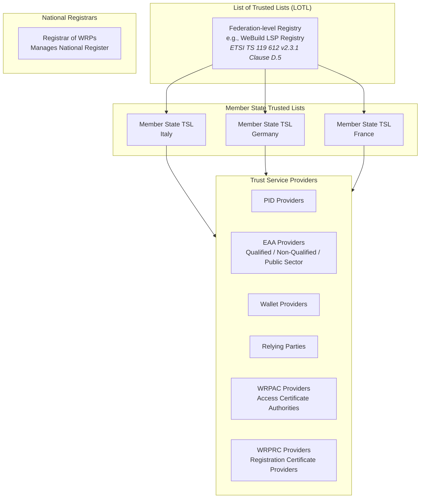

### 1.2 Service Type Identifiers

| Entity Type | Service Type URI | Reference |
|-------------|------------------|-----------|
| PID Provider | `http://uri.etsi.org/19602/SvcType/PID/Issuance` | ETSI TS 119 602 Table D.3 |
| Qualified EAA Provider | `http://uri.etsi.org/TrstSvc/Svctype/QEAA_Provider` | ETSI TS 119 612 clause 5.5.1 |
| Non-Qualified EAA Provider | `http://uri.etsi.org/TrstSvc/Svctype/Non_Q_EAA_Provider` | ETSI TS 119 612 clause 5.5.1 |
| Public Sector EAA Provider | `http://uri.etsi.org/TrstSvc/Svctype/PUB_EAA_Provider` | ETSI TS 119 612 clause 5.5.1 |
| Individual Wallet Provider | `http://uri.etsi.org/TrstSvc/Svctype/IndividualWalletProvider` | ETSI TS 119 612 clause 5.5.1 |
| Legal Person Wallet Provider | `http://uri.etsi.org/TrstSvc/Svctype/LegalPersonWalletProvider` | ETSI TS 119 612 clause 5.5.1 |
| Relying Party | `http://uri.etsi.org/TrstSvc/Svctype/RelyingParty` | ETSI TS 119 612 clause 5.5.1 |
| Relying Party Intermediary | `http://uri.etsi.org/TrstSvc/Svctype/RelyingPartyIntermediary` | ETSI TS 119 612 clause 5.5.1 |
| WRPAC Provider (Access Certificate CA) | `http://uri.etsi.org/TrstSvc/Svctype/CA/PKC` | ETSI TS 119 612 clause 5.5.1; ETSI TS 119 411-8 |
| WRPRC Provider (Registration Certificate Provider) | `http://uri.etsi.org/19602/SvcType/WRPRC/Issuance`<br/>`http://uri.etsi.org/19602/SvcType/WRPRC/Revocation` | ETSI TS 119 602 clause 3.4.1; ETSI TS 119 475 clause 3.1, 6 |

> **Note:** ETSI TS 119 602 defines service type URIs for WRPRC Providers in the Lists of Trusted Entities (LoTE) format. The service types `WRPRC/Issuance` and `WRPRC/Revocation` are used to identify WRPRC Provider services in trusted lists. The Registrar of WRPs (CIR 2025/848 Art. 3) manages the national register but is distinct from certificate providers.

---

## 2. Policy Discovery Flow

### 2.1 Discovery Sequence for Relying Party Interaction

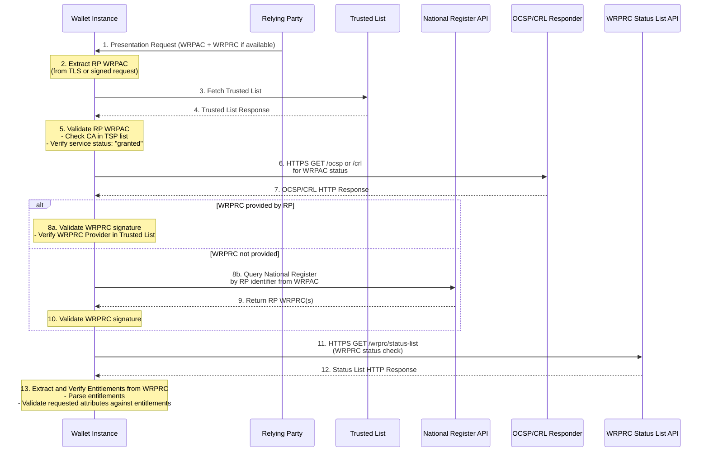

### 2.2 Discovery Sequence for Attestation Provider Interaction

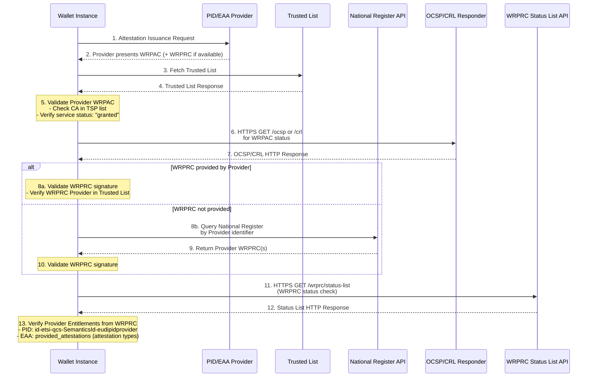

### 2.3 WRPRC Provider and Registration Certificate Issuance

Per ETSI TS 119 475 clause 4.6, Member States may authorize **providers of wallet-relying party registration certificates (WRPRC providers)** to issue WRPRCs. These are distinct from:
- **Registrars of WRPs** - manage the national register (CIR 2025/848 Art. 3)
- **WRPAC Providers** - issue X.509 access certificates (ETSI TS 119 411-8)

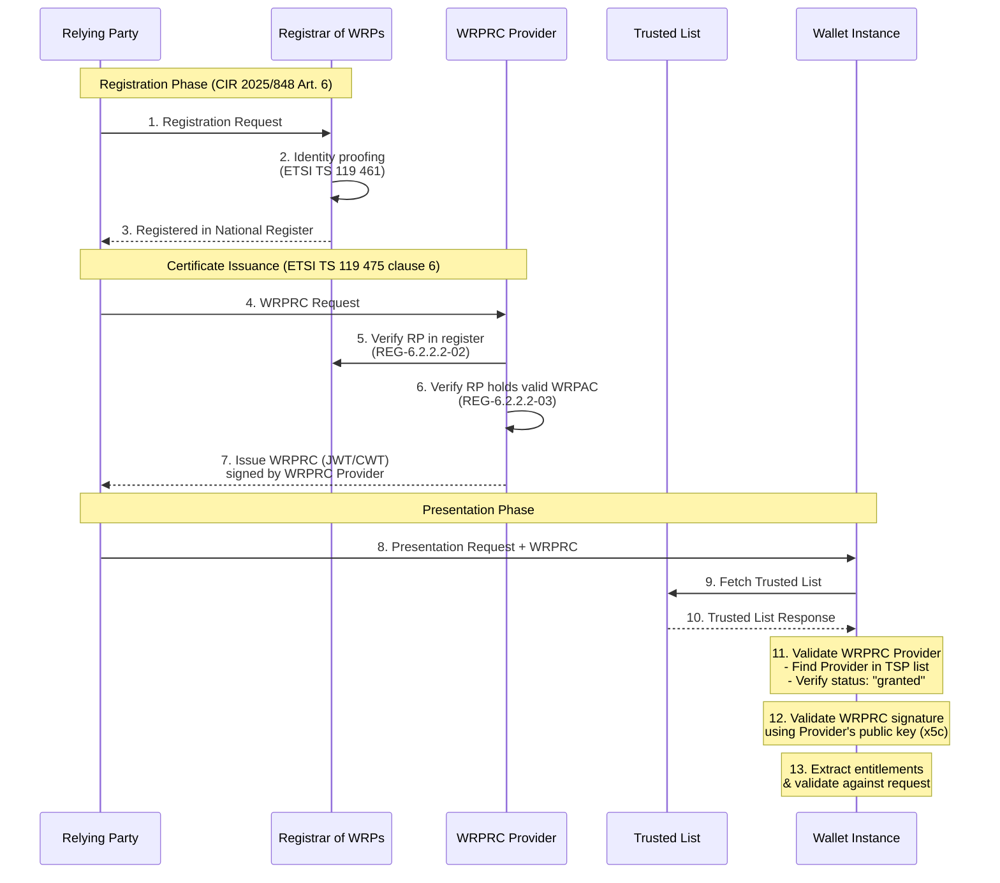

#### 2.3.1 WRPRC Issuance Models (ETSI TS 119 475 Annex D)

| Model | Description | Reference |
|-------|-------------|-----------|
| Integrated | Registrar and WRPRC provider are same entity | ETSI TS 119 475 Annex D.1 |
| Registrar-initiated | Registrar instructs provider to issue | ETSI TS 119 475 Annex D.2 |
| RP-initiated | RP contacts provider after registration | ETSI TS 119 475 Annex D.3 |
| Provider-assisted | Provider acts as proxy to registrar | ETSI TS 119 475 Annex D.4 |

#### 2.3.2 WRPRC Provider Trust Validation

When a wallet receives a WRPRC, it validates the issuing WRPRC Provider:

| Validation Step | Description | Reference |
|-----------------|-------------|-----------|
| Provider in Trusted List | Verify WRPRC Provider is listed in Member State Trusted List | ETSI TS 119 612 clause 5.5.3 |
| Service Status | Verify `ServiceCurrentStatus` is `granted` | ETSI TS 119 612 clause 5.5.4 |
| Signature Validation | Verify WRPRC signature using `x5c` (JWT) or `x5chain` (CWT) | ETSI TS 119 475 clause 5.2.2, 5.2.3 |
| WRPRC Validity | Check `iat` timestamp, `status` claim | ETSI TS 119 475 Table 7 |
| Policy ID | Verify `policy_id` matches expected policy OIDs | ETSI TS 119 475 clause 6.1.3 |

#### 2.3.3 WRPAC vs WRPRC

| Aspect | WRPAC (Access Certificate) | WRPRC (Registration Certificate) |
|--------|---------------------------|----------------------------------|
| Format | X.509 Certificate | JWT or CWT |
| Issuer | WRPAC Provider (CA) | WRPRC Provider (TSP) |
| Policy | ETSI TS 119 411-8 | ETSI TS 119 475 clause 6 |
| Usage | TLS client authentication | Signed presentation requests |
| Entitlements | In `qcStatements` extension | In `entitlements` claim |
| Validation | Certificate chain to CA in Trusted List | Signature by WRPRC Provider in Trusted List |
| Header | N/A | `typ`: `rc-wrp+jwt` or `rc-wrp+cwt` |

### 2.4 WRPRC Discovery via National Register

When an RP presents only a WRPAC without a WRPRC, the wallet can discover the RP's registration information and WRPRCs through the **National Register of Wallet-Relying Parties** (CIR 2025/848 Article 3(5)).

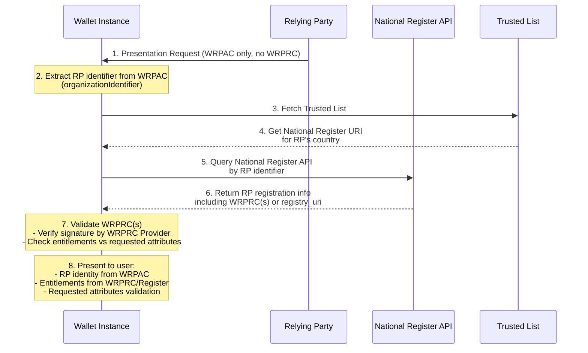

#### 2.4.1 Discovery Methods

| Method | Description | Reference |
|--------|-------------|-----------|
| **WRPRC in Request** | RP includes WRPRC(s) in presentation request | ETSI TS 119 475 clause 4.5 |
| **National Register Query** | Wallet queries national register using RP identifier from WRPAC | CIR 2025/848 Art. 3(5) |
| **Sectoral Register Query** | Wallet queries sector-specific register (e.g., financial, healthcare) | Sector-specific regulations |
| **Cross-Border Register Query** | Wallet queries EU-level or foreign registers | ETSI TS 119 612 LOTL |
| **registry_uri in WRPRC** | WRPRC contains URL to issuing registry API | ETSI TS 119 475 Table 7, Annex B.2.1 |

#### 2.4.2 Multiple Register Architecture

An RP may be registered in multiple registers at different levels, each issuing WRPRCs for different scopes:

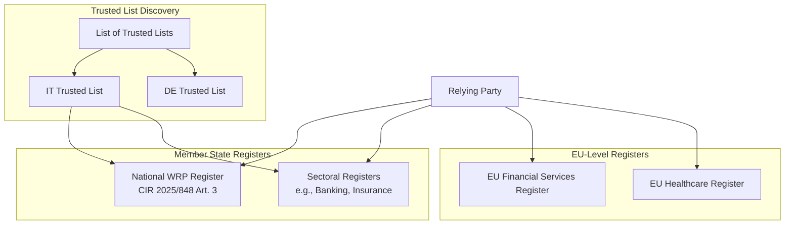

| Register Level | Scope | Example | WRPRC Entitlements |
|----------------|-------|---------|-------------------|
| **National** | General WRP registration | IT National Register | General service provider entitlements |
| **Sectoral (National)** | Sector-specific within MS | IT Banking Register | PSD2, financial data access |
| **Sectoral (EU)** | EU-wide sector regulation | EU Financial Services | Cross-border financial services |
| **Cross-Border** | Foreign MS registers | DE Register for IT-based RP | Services in foreign MS |

#### 2.4.3 Register Discovery via Trusted List

The wallet discovers available registers through the Trusted List infrastructure:

1. **LOTL Query** - Fetch List of Trusted Lists to discover all Member State TSLs
2. **TSL Query** - Each TSL may list:
   - National WRP Register endpoints
   - Sectoral register endpoints  
   - WRPRC Provider services
3. **Register Query** - Query each relevant register by RP identifier

#### 2.4.4 Multiple WRPRC Aggregation

When an RP has WRPRCs from multiple registers, the wallet aggregates entitlements:

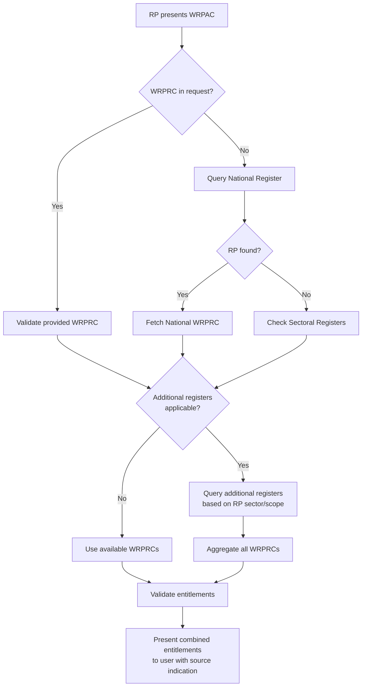

| Scenario | Wallet Behavior | User Display |
|----------|-----------------|--------------|
| Single WRPRC | Use single WRPRC entitlements | "Registered in: [Register Name]" |
| Multiple WRPRCs, same scope | Union of entitlements | "Registered in: [Register 1], [Register 2]" |
| Multiple WRPRCs, different scopes | Show entitlements per scope | "General: [entitlements], Financial: [entitlements]" |
| Conflicting entitlements | Most restrictive applies, warn user | "⚠ Entitlement conflict detected" |
| No WRPRC found | Warn user, limited trust | "⚠ No registration certificate found" |

#### 2.4.5 WRPRC Issuer Identification

Each WRPRC identifies its issuing register/provider:

| WRPRC Field | Purpose | Reference |
|-------------|---------|-----------|
| `registry_uri` | URL to the issuing registry API | ETSI TS 119 475 Table 7 |
| `policy_id` | Policy OID identifying the register's policy | ETSI TS 119 475 clause 6.1.3 |
| `x5c` / `x5chain` | Certificate chain of WRPRC Provider | ETSI TS 119 475 clause 5.2.2, 5.2.3 |

The wallet validates each WRPRC Provider against the appropriate Trusted List based on the provider's certificate chain.

> **Note:** The availability and API specification of registers may vary. CIR 2025/848 mandates national registers, but sectoral and cross-border registers depend on sector-specific regulations and bilateral/multilateral agreements.

---

## 3. Policy Verification Steps

### 3.1 Step 1: Obtain Counterparty Certificates (WRPAC and WRPRC)

The wallet obtains the counterparty's certificates:

#### 3.1.1 WRPAC Sources

| Source | Description | Reference |
|--------|-------------|-----------|
| TLS Handshake | X.509 client certificate for authentication | ETSI TS 119 411-8 clause 5 |
| Signed Request | Certificate embedded in signed presentation request | ETSI TS 119 475 clause 4.3 |

#### 3.1.2 WRPRC Sources

| Source | Description | Reference |
|--------|-------------|-----------|
| Included in Request | RP/Provider includes WRPRC in presentation request | ETSI TS 119 475 clause 4.5 |
| National Register API | Wallet queries register using identifier from WRPAC | CIR 2025/848 Art. 3(5) |
| OpenID4VP Request | JWT/CWT WRPRC embedded in request | ETSI TS 119 475 clause 6.2, 6.3 |

> **Note:** If WRPRC is not provided by the counterparty, the wallet should query the National Register using the identifier extracted from the WRPAC (`organizationIdentifier` for legal persons, `serialNumber` for natural persons).

### 3.2 Step 2: Trusted List Lookup

The wallet performs the following lookups:

```xml
<!-- Reference: ETSI TS 119 612 v2.4.1 -->

<!-- Step 2a: Fetch LOTL -->
<ListOfTrustedLists>
  <TrustedLists>
    <TrustedListPointer>
      <TSLLocation>https://trust.wallet.gov.it/tsl/tsl.xml</TSLLocation>
      <TSLType>http://uri.etsi.org/TrstSvc/TrustedList/TSLType/EUgeneric</TSLType>
      <SchemeTerritory>IT</SchemeTerritory>
    </TrustedListPointer>
  </TrustedLists>
</ListOfTrustedLists>

<!-- Step 2b: Fetch Member State TSL -->
<TrustServiceStatusList>
  <TrustServiceProviderList>
    <TrustServiceProvider>
      <TSPServices>
        <ServiceInformation>
          <ServiceTypeIdentifier>http://uri.etsi.org/TrstSvc/Svctype/CA/PKC</ServiceTypeIdentifier>
          <ServiceDigitalIdentity>
            <X509Certificate><!-- Issuer CA Certificate --></X509Certificate>
          </ServiceDigitalIdentity>
          <ServiceCurrentStatus>http://uri.etsi.org/TrstSvc/TrustedList/Svcstatus/granted</ServiceCurrentStatus>
        </ServiceInformation>
      </TSPServices>
    </TrustServiceProvider>
  </TrustServiceProviderList>
</TrustServiceStatusList>
```

### 3.3 Step 3: WRPAC Validation (Certificate Chain)

| Validation Step | Description | Reference |
|-----------------|-------------|-----------|
| Issuer Match | Verify WRPAC issuer (CA) matches TSP in Trusted List | ETSI TS 119 612 clause 5.5.3 |
| Service Status | Verify `ServiceCurrentStatus` is `granted` | ETSI TS 119 612 clause 5.5.4 |
| Certificate Path | Build and validate certificate chain to trust anchor | IETF RFC 5280 clause 6 |
| Validity Period | Check `Not Before` and `Not After` dates | IETF RFC 5280 clause 4.1.2.5 |
| Revocation Status | Check OCSP or CRL for WRPAC | ETSI TS 119 411-8 GEN-6.6.1-08 |

### 3.4 Step 4: WRPRC Validation

#### 3.4.1 Obtaining WRPRC

| Scenario | Action | Reference |
|----------|--------|-----------|
| WRPRC provided in request | Use provided WRPRC | ETSI TS 119 475 clause 4.5 |
| WRPRC not provided | Query National Register using identifier from WRPAC | CIR 2025/848 Art. 3(5) |

#### 3.4.2 WRPRC Signature Validation

| Validation Step | Description | Reference |
|-----------------|-------------|-----------|
| WRPRC Provider in Trusted List | Verify WRPRC Provider is listed in Trusted List | ETSI TS 119 612 clause 5.5.3 |
| Provider Status | Verify `ServiceCurrentStatus` is `granted` | ETSI TS 119 612 clause 5.5.4 |
| Signature Verification | Verify WRPRC signature using `x5c` (JWT) or `x5chain` (CWT) | ETSI TS 119 475 clause 5.2.2, 5.2.3 |
| WRPRC Validity | Check `iat` timestamp and `status` claim | ETSI TS 119 475 Table 7 |
| Identifier Match | Verify WRPRC `sub.id` matches WRPAC `organizationIdentifier` | ETSI TS 119 475 GEN-5.1.1-02 |

### 3.5 Step 5: Entitlement Verification

#### 3.5.1 For Relying Parties

Extract and verify entitlements from WRPRC:

| Entitlement Source | Field | Reference |
|--------------------|-------|-----------|
| WRPRC (JWT) | `entitlements` claim | ETSI TS 119 475 clause 6.2, Table 7 |
| WRPRC (CWT) | `entitlements` claim | ETSI TS 119 475 clause 6.3 |
| WRPRC (JWT/CWT) | `credentials` claim (for service providers) | ETSI TS 119 475 Table 9 |

**Entitlement Structure (ETSI TS 119 475 Annex A):**

```
entitlements ::= SEQUENCE OF Entitlement

Entitlement ::= SEQUENCE {
    entitlementType   OBJECT IDENTIFIER,  -- OID or URI
    entitlementValue  ANY DEFINED BY entitlementType OPTIONAL
}
```

**Common Entitlement OIDs:**

| Entitlement | OID/URI | Reference |
|-------------|---------|-----------|
| PID Provider | `id-etsi-qcs-SemanticsId-eudipidprovider` | ETSI TS 119 475 Annex A.1 |
| Qualified EAA Provider | `id-etsi-qcs-SemanticsId-eudiqeaaprovider` | ETSI TS 119 475 Annex A.2 |
| Non-Qualified EAA Provider | `id-etsi-qcs-SemanticsId-eudinqeaaprovider` | ETSI TS 119 475 Annex A.3 |
| Public Sector EAA Provider | `id-etsi-qcs-SemanticsId-eudipubeaaprovider` | ETSI TS 119 475 Annex A.4 |
| General Relying Party (Service Provider) | `id-etsi-qcs-SemanticsId-eudirp` | ETSI TS 119 475 Annex A.5 |

#### 3.5.2 For Attestation Providers

Attestation providers (PID/EAA) must have their entitlements verified from the WRPRC:

| Provider Type | Required Entitlement in WRPRC | Additional WRPRC Field | Reference |
|---------------|------------------------------|------------------------|-----------|
| PID Provider | `id-etsi-qcs-SemanticsId-eudipidprovider` | - | ETSI TS 119 475 Annex A.1 |
| Qualified EAA Provider | `id-etsi-qcs-SemanticsId-eudiqeaaprovider` | `provided_attestations` | ETSI TS 119 475 Table 8 |
| Non-Qualified EAA Provider | `id-etsi-qcs-SemanticsId-eudinqeaaprovider` | `provided_attestations` | ETSI TS 119 475 Table 8 |
| Public Sector EAA Provider | `id-etsi-qcs-SemanticsId-eudipubeaaprovider` | `provided_attestations` | ETSI TS 119 475 Table 8 |

The `provided_attestations` field in the WRPRC specifies the attestation types the provider is authorized to issue (format, meta, claim). The wallet verifies that the attestation being issued matches the provider's authorized attestation types.

### 3.5.3 Policy Approach: Additive vs Subtractive

> **Note:** The "additive" and "subtractive" policy approaches are not directly defined in ETSI standards. They represent a conceptual framework for policy interpretation that can be implemented using ETSI standard mechanisms. ETSI standards (e.g., TS 119 475, EN 319 411 series) provide mechanisms that support both approaches, but the policy approach concept itself is implementation-specific to the WP4 Trust Infrastructure framework.

The wallet must understand the policy approach used by the counterparty to correctly interpret entitlements. Two distinct policy approaches are defined:

#### Additive Policy Approach

The **Additive Policy Approach** implements an explicit allow-list model where permissions are granted only when explicitly authorized. This follows the principle: **"Nothing is permitted unless explicitly allowed."**

**Characteristics:**
- **Default Action**: Deny all requests
- **Authorization Model**: Explicit allow-list
- **Security Posture**: Conservative, high-security (zero-trust)
- **Use Cases**: High-security environments, sensitive data handling, regulatory compliance

**Wallet Validation Logic:**
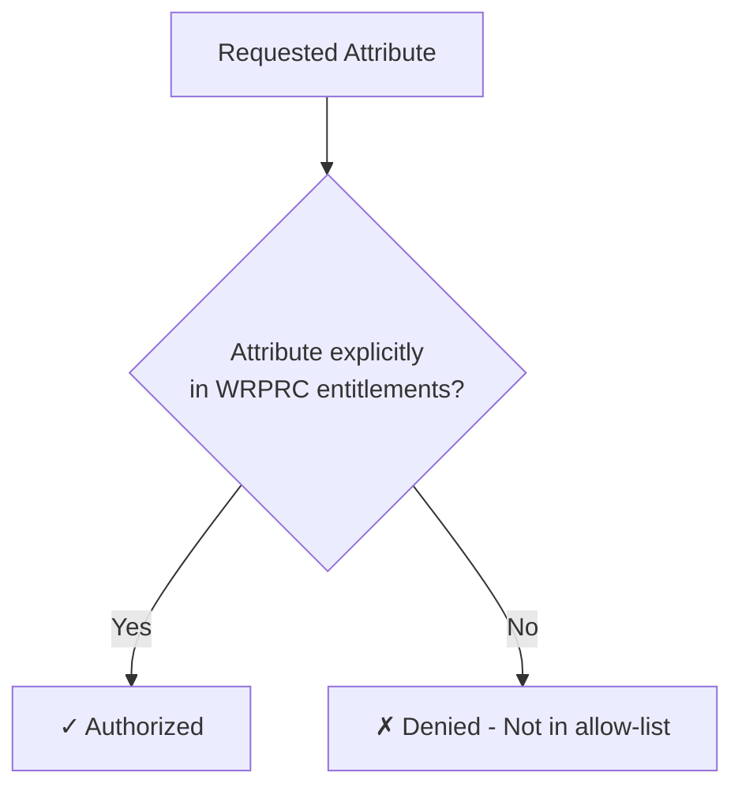

**Implementation:**
- The wallet checks if each requested attribute is explicitly listed in the WRPRC `credentials` claim
- If not explicitly authorized, the attribute request is denied
- User is notified of unauthorized requests

#### Subtractive Policy Approach

The **Subtractive Policy Approach** implements an explicit deny-list model where permissions are granted by default except for explicitly restricted items. This follows the principle: **"Everything is permitted unless explicitly denied."**

**Characteristics:**
- **Default Action**: Allow all requests
- **Authorization Model**: Explicit deny-list
- **Security Posture**: Permissive, flexible
- **Use Cases**: Open ecosystems, development environments, innovation platforms

**Wallet Validation Logic:**
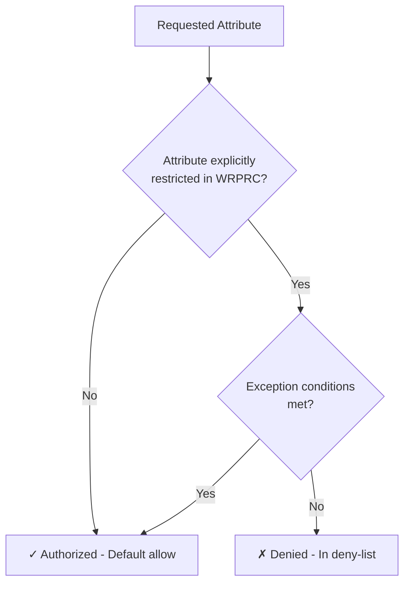

**Implementation:**
- The wallet checks if the requested attribute is explicitly restricted in the WRPRC
- If not restricted, the attribute request is allowed by default
- User is notified of restricted attributes and any applicable exceptions

#### Policy Approach Identification

The policy approach may be indicated in the WRPRC through:

| WRPRC Field | Description | Reference |
|-------------|-------------|-----------|
| `policy_approach` | Explicit field indicating "additive" or "subtractive" | Implementation-specific (not ETSI-standardized) |
| `entitlements` structure | Presence/absence patterns indicate approach | ETSI TS 119 475 Table 7 |
| `credentials` claim | Explicit allow-list suggests additive | ETSI TS 119 475 Table 9 |
| `restrictions` claim | Explicit deny-list suggests subtractive | Implementation-specific (not ETSI-standardized) |

**Default Behavior:**
- If policy approach is not explicitly stated, the wallet should default to **additive** (zero-trust) for security
- The wallet may query the National Register or Trusted List for policy approach metadata

#### Policy Approach Comparison

| Aspect | Additive Approach | Subtractive Approach |
|--------|------------------|---------------------|
| **Security Model** | Zero-trust | Permissive |
| **Default State** | Deny all | Allow all |
| **Authorization** | Explicit allow-list | Explicit deny-list |
| **Risk Level** | Lower (conservative) | Higher (permissive) |
| **Configuration** | Grant specific permissions | Block specific restrictions |
| **Wallet Behavior** | Strict validation required | Permissive validation |
| **User Notification** | Show authorized attributes | Show restricted attributes |

---

## 4. Attribute Request Validation

### 4.1 Matching Requested Attributes to Entitlements

When a Relying Party requests attributes, the wallet validates using the WRPRC and applies the appropriate policy approach:

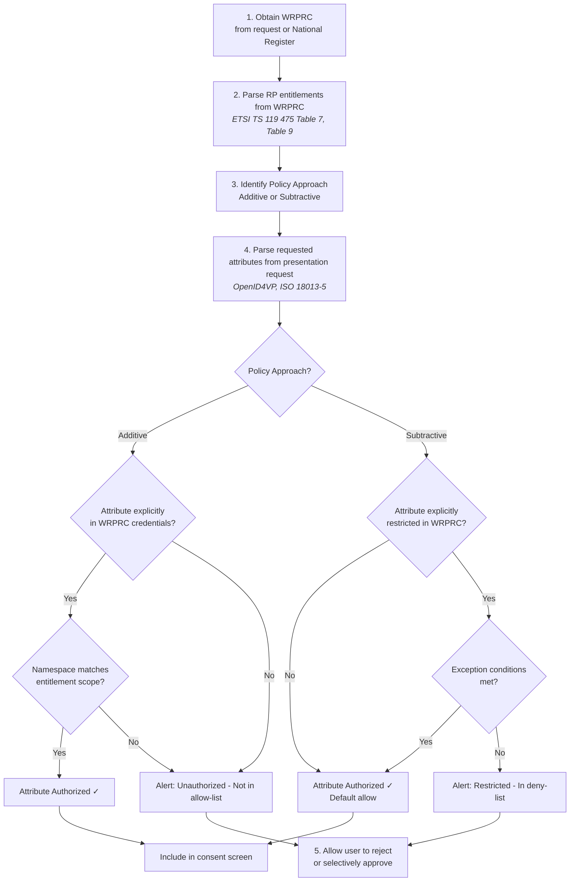

### 4.2 Entitlement-to-Attribute Mapping

The WRPRC `credentials` claim (for service providers) specifies which attestations and attributes the RP is authorized to request:

| WRPRC Field | Description | Reference |
|-------------|-------------|-----------|
| `entitlements` | List of entitlement URIs/OIDs | ETSI TS 119 475 Table 7 |
| `credentials` | Requestable attestations with format, meta, claim | ETSI TS 119 475 Table 9 |
| `purpose` | Purpose descriptions for data processing | ETSI TS 119 475 Table 9 |
| `policy_approach` | Policy approach: "additive" or "subtractive" | Implementation-specific (not ETSI-standardized) |
| `restrictions` | Restricted attributes (for subtractive approach) | Implementation-specific |

| Entitlement | Authorized Attributes | Reference |
|-------------|----------------------|-----------|
| `id-etsi-qcs-SemanticsId-eudirp` | As specified in `credentials` claim of WRPRC | ETSI TS 119 475 Table 9 |
| Age Verification | `age_over_18`, `age_over_21`, `birth_date` | CIR 2025/848 Annex II |
| KYC/AML | Full PID attributes | National regulations |
| Healthcare | Healthcare-specific EAAs | ETSI TS 119 475 Annex B |

### 4.3 Policy Approach in Attribute Validation

The wallet applies different validation logic based on the policy approach:

#### 4.3.1 Additive Approach Validation

For additive policies, the wallet:
1. Checks if each requested attribute is explicitly listed in the WRPRC `credentials` claim
2. Verifies namespace and scope match the entitlement
3. Denies any attribute not explicitly authorized
4. Presents only authorized attributes to the user for consent

**Example:**
```json
{
  "policy_approach": "additive",
  "credentials": [
    {
      "format": "dc+sd-jwt",
      "credential_definition": "https://example.com/credentials/identity",
      "claims": ["given_name", "family_name", "email"]
    }
  ]
}
```
- ✅ `given_name` - Authorized (explicitly listed)
- ✅ `family_name` - Authorized (explicitly listed)
- ✅ `email` - Authorized (explicitly listed)
- ❌ `phone_number` - Denied (not in allow-list)
- ❌ `address` - Denied (not in allow-list)

#### 4.3.2 Subtractive Approach Validation

For subtractive policies, the wallet:
1. Checks if the requested attribute is explicitly restricted in the WRPRC
2. Allows attributes by default unless restricted
3. Checks for exception conditions if restricted
4. Presents all allowed attributes to the user for consent

**Example:**
```json
{
  "policy_approach": "subtractive",
  "restrictions": [
    {
      "attribute": "biometric_data",
      "restriction_reason": "Privacy protection",
      "exceptions": ["law_enforcement", "national_security"]
    },
    {
      "attribute": "financial_data",
      "restriction_reason": "Data protection",
      "exceptions": ["financial_services"]
    }
  ]
}
```
- ✅ `given_name` - Authorized (not restricted)
- ✅ `family_name` - Authorized (not restricted)
- ✅ `email` - Authorized (not restricted)
- ❌ `biometric_data` - Denied (restricted, no exception)
- ✅ `financial_data` (if RP is financial service) - Authorized (exception applies)

---

## 5. Trust List Caching and Update

### 5.1 Caching Strategy

| Parameter | Value | Reference |
|-----------|-------|-----------|
| Cache Duration | Until `NextUpdate` field | ETSI TS 119 612 clause 5.3.9 |
| Refresh Trigger | `NextUpdate` reached or manual | ETSI TS 119 612 clause 5.3.9 |
| Fallback | Use cached list if fetch fails | Implementation-specific |

### 5.2 Trust List Update Monitoring

```xml
<!-- Reference: ETSI TS 119 612 v2.4.1 -->
<SchemeInformation>
  <ListIssueDateTime>2024-01-01T00:00:00Z</ListIssueDateTime>
  <NextUpdate>2024-01-02T00:00:00Z</NextUpdate>
  <DistributionPoints>
    <DistributionPoint>
      <URI>https://trust.wallet.gov.it/tsl/tsl.xml</URI>
    </DistributionPoint>
  </DistributionPoints>
</SchemeInformation>
```

---

## 6. Error Handling and User Notification

### 6.1 Validation Failure Scenarios

| Scenario | Wallet Action | User Notification |
|----------|---------------|-------------------|
| CA not in Trusted List | Reject interaction | "Unrecognized service provider" |
| Service status `withdrawn` | Reject interaction | "Service provider authorization revoked" |
| Service status `suspended` | Warn user | "Service provider temporarily suspended" |
| Certificate revoked | Reject interaction | "Service provider certificate invalid" |
| Entitlement mismatch (additive) | Alert user | "Requested attributes not authorized in registration certificate" |
| Attribute restricted (subtractive) | Alert user | "Requested attributes are restricted by policy" |
| Policy approach unknown | Default to additive, warn user | "Policy approach not specified, applying strict validation" |
| Certificate expired | Reject interaction | "Service provider certificate expired" |
| WRPRC signature invalid | Reject interaction | "Registration certificate signature verification failed" |
| WRPRC Provider not in Trusted List | Reject interaction | "Registration certificate issuer not recognized" |

### 6.2 User Consent Flow

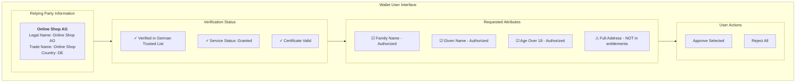

---

## 7. Implementation Considerations

### 7.1 Performance Optimization

| Optimization | Description | Reference |
|--------------|-------------|-----------|
| LOTL Caching | Cache List of Trusted Lists locally | ETSI TS 119 612 clause D.5 |
| TSL Prefetching | Prefetch commonly used Member State TSLs | Implementation-specific |
| OCSP Stapling | Accept stapled OCSP responses | IETF RFC 6961 |
| Delta Updates | Support incremental TSL updates | ETSI TS 119 612 clause 5.3 |

### 7.2 Offline Scenarios

| Scenario | Wallet Behavior |
|----------|-----------------|
| No network, cached TSL valid | Use cached TSL |
| No network, cached TSL expired | Warn user, allow limited interaction |
| No network, no cached TSL | Reject interaction |

### 7.3 Cross-Border Discovery

For cross-border interactions, the wallet:

1. Fetches LOTL to discover foreign Member State TSLs
2. Fetches relevant foreign TSL based on counterparty's country
3. Validates counterparty against foreign TSL
4. Applies same entitlement verification logic

---

## 8. Security Considerations

| Consideration | Mitigation | Reference |
|---------------|------------|-----------|
| TSL Tampering | Verify TSL digital signature | ETSI TS 119 612 clause 5.7 |
| Man-in-the-Middle | Use HTTPS for all TSL fetches | ETSI TS 119 612 clause 6.1 |
| Replay Attacks | Check `ListIssueDateTime` freshness | ETSI TS 119 612 clause 5.3.8 |
| Certificate Substitution | Bind certificate to TLS session | Implementation-specific |

---

## References

### ETSI Standards

- ETSI TS 119 612 v2.4.1 - Electronic Signatures and Trust Infrastructures; Trusted Lists
- ETSI TS 119 602 v1.1.1 - Electronic Signatures and Trust Infrastructures; Lists of Trusted Entities (LoTE)
- ETSI TS 119 411-8 - Policy and security requirements for TSPs issuing certificates; Part 8: Access Certificate Policy for EUDI Wallet Relying Parties
- ETSI TS 119 475 - Relying party attributes supporting EUDI Wallet user's authorization decisions
- ETSI EN 319 412-1 - Certificate Profiles; Part 1: Overview and common data structures
- ETSI EN 319 412-6 - Certificate Profile for EUDI Wallet Providers
- ETSI EN 319 401 - General Policy Requirements for Trust Service Providers
- ETSI EN 319 411-1 - Policy and security requirements for TSPs issuing certificates; Part 1: General requirements
- ETSI EN 319 411-2 - Policy and security requirements for TSPs issuing certificates; Part 2: Requirements for Qualified Certificate Issuers

### EU Regulations

- CIR (EU) 2025/848 - Commission Implementing Regulation on the registration of wallet-relying parties

### IETF Standards

- IETF RFC 5280 - Internet X.509 PKI Certificate and CRL Profile
- IETF RFC 6961 - TLS Multiple Certificate Status Request Extension

### Related Documents

- Policy Approaches Definition: Additive vs Subtractive (task5-participants-certificates-policies/policy-approaches-definition.md)
- ETSI Policy Application Mechanisms (task5-participants-certificates-policies/etsi-policy-enumeration.md)
- ETSI Policy Evaluation (task5-participants-certificates-policies/etsi-policy-evaluation.md)

---

**Document Version**: 1.0  
**Last Updated**: 2025-11-25

