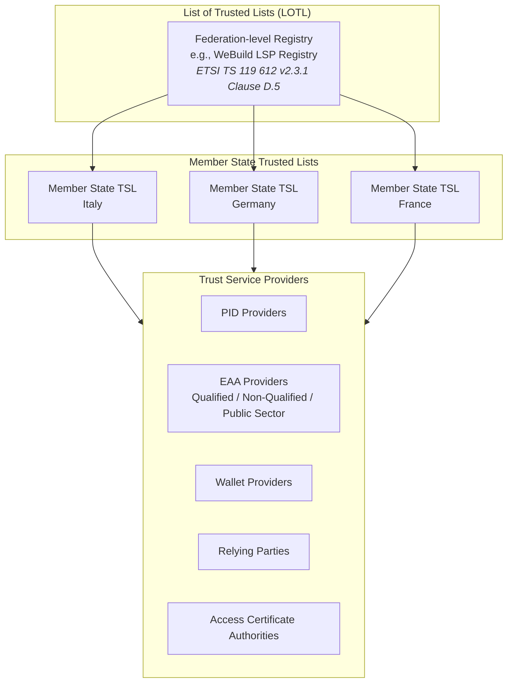
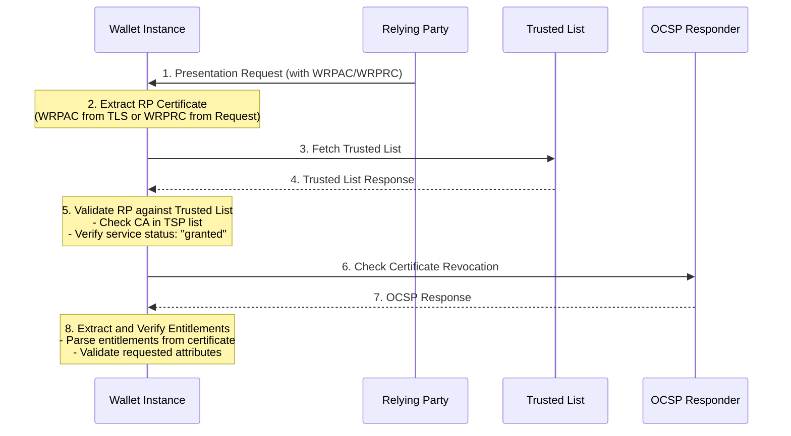
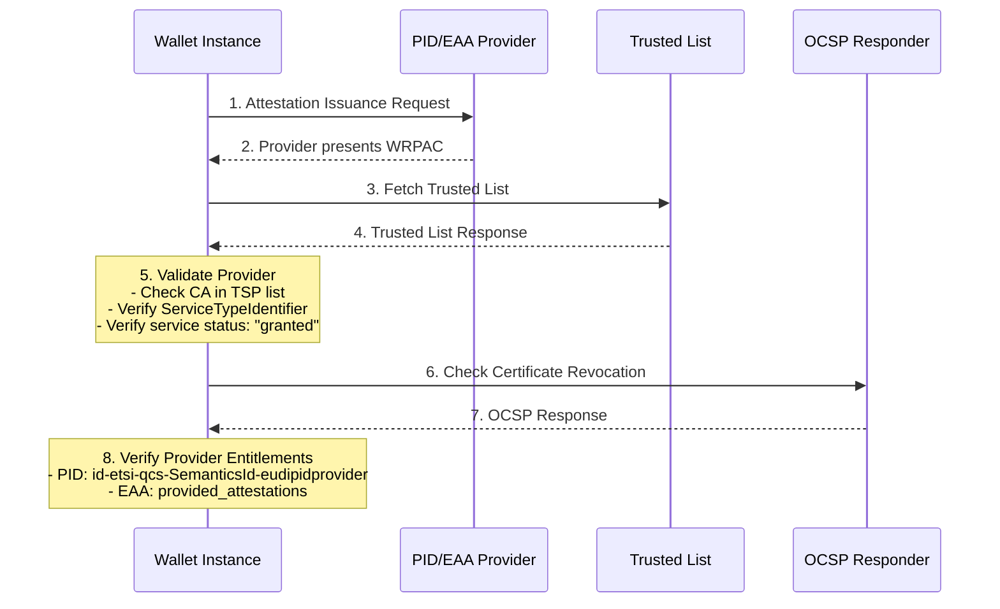
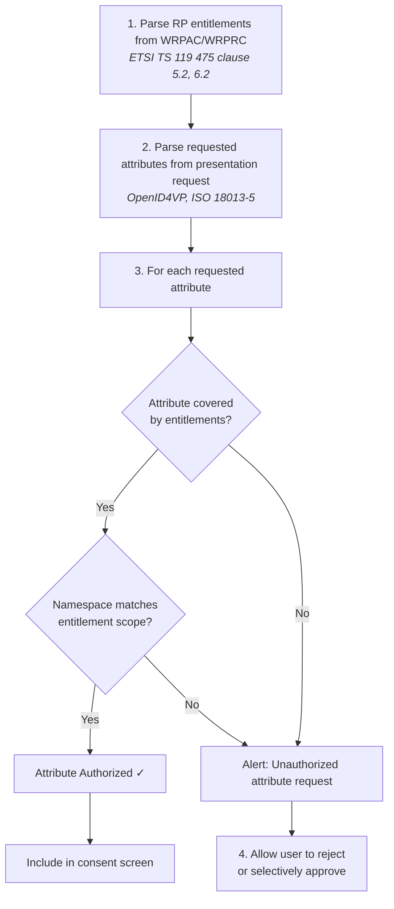
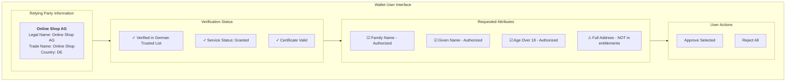

# Wallet Instance Policy Discovery

## Overview

This document describes the policy discovery process performed by an EUDI Wallet Instance (holder) when interacting with Relying Parties (RPs) and Attestation Providers (PID Providers and EAA Providers). The discovery mechanism enables the wallet to verify the trustworthiness and entitlements of counterparties before disclosing user attributes.

## Normative References

| Reference | Document |
|-----------|----------|
| ETSI TS 119 612 v2.3.1 | Electronic Signatures and Trust Infrastructures; Trusted Lists |
| ETSI TS 119 411-8 | Policy and security requirements for TSPs issuing certificates; Part 8: Access Certificate Policy for EUDI Wallet Relying Parties |
| ETSI TS 119 475 | Relying party attributes supporting EUDI Wallet user's authorization decisions |
| ETSI EN 319 412-1 | Certificate Profiles; Part 1: Overview and common data structures |
| CIR (EU) 2025/848 | Commission Implementing Regulation on the registration of wallet-relying parties |

---

## 1. Trust Infrastructure Architecture

### 1.1 Trust List Hierarchy

The EUDI Wallet ecosystem uses a hierarchical trust infrastructure based on ETSI TS 119 612:



### 1.2 Service Type Identifiers

| Entity Type | Service Type URI | Reference |
|-------------|------------------|-----------|
| PID Provider | `http://uri.etsi.org/TrstSvc/Svctype/CredentialIssuer` | ETSI TS 119 612 clause 5.5.1 |
| EAA Provider | `http://uri.etsi.org/TrstSvc/Svctype/CredentialIssuer` | ETSI TS 119 612 clause 5.5.1 |
| Wallet Provider | `http://uri.etsi.org/TrstSvc/Svctype/WalletProvider` | ETSI TS 119 612 clause 5.5.1 |
| Relying Party | `http://uri.etsi.org/TrstSvc/Svctype/RelyingParty` | ETSI TS 119 612 clause 5.5.1 |
| Access Certificate CA | `http://uri.etsi.org/TrstSvc/Svctype/CA/PKC` | ETSI TS 119 612 clause 5.5.1 |

---

## 2. Policy Discovery Flow

### 2.1 Discovery Sequence for Relying Party Interaction



### 2.2 Discovery Sequence for Attestation Provider Interaction



---

## 3. Policy Verification Steps

### 3.1 Step 1: Obtain Counterparty Certificate

The wallet extracts the counterparty's certificate from:

| Source | Certificate Type | Reference |
|--------|------------------|-----------|
| TLS Handshake | WRPAC (Wallet-Relying Party Access Certificate) | ETSI TS 119 411-8 clause 5 |
| Signed Request | WRPRC (Wallet-Relying Party Registration Certificate) | ETSI TS 119 475 clause 6 |
| OpenID4VP Request | JWT/CWT with embedded certificate | ETSI TS 119 475 clause 6.2, 6.3 |

### 3.2 Step 2: Trusted List Lookup

The wallet performs the following lookups:

```xml
<!-- Reference: ETSI TS 119 612 v2.3.1 -->

<!-- Step 2a: Fetch LOTL -->
<ListOfTrustedLists>
  <TrustedLists>
    <TrustedListPointer>
      <TSLLocation>https://trust.wallet.gov.it/tsl/tsl.xml</TSLLocation>
      <TSLType>http://uri.etsi.org/TrstSvc/TrustedList/TSLType/EUgeneric</TSLType>
      <SchemeTerritory>IT</SchemeTerritory>
    </TrustedListPointer>
  </TrustedLists>
</ListOfTrustedLists>

<!-- Step 2b: Fetch Member State TSL -->
<TrustServiceStatusList>
  <TrustServiceProviderList>
    <TrustServiceProvider>
      <TSPServices>
        <ServiceInformation>
          <ServiceTypeIdentifier>http://uri.etsi.org/TrstSvc/Svctype/CA/PKC</ServiceTypeIdentifier>
          <ServiceDigitalIdentity>
            <X509Certificate><!-- Issuer CA Certificate --></X509Certificate>
          </ServiceDigitalIdentity>
          <ServiceCurrentStatus>http://uri.etsi.org/TrstSvc/TrustedList/Svcstatus/granted</ServiceCurrentStatus>
        </ServiceInformation>
      </TSPServices>
    </TrustServiceProvider>
  </TrustServiceProviderList>
</TrustServiceStatusList>
```

### 3.3 Step 3: Certificate Chain Validation

| Validation Step | Description | Reference |
|-----------------|-------------|-----------|
| Issuer Match | Verify certificate issuer matches TSP in Trusted List | ETSI TS 119 612 clause 5.5.3 |
| Service Status | Verify `ServiceCurrentStatus` is `granted` | ETSI TS 119 612 clause 5.5.4 |
| Certificate Path | Build and validate certificate chain to trust anchor | IETF RFC 5280 clause 6 |
| Validity Period | Check `Not Before` and `Not After` dates | IETF RFC 5280 clause 4.1.2.5 |
| Revocation Status | Check OCSP or CRL | ETSI TS 119 411-8 GEN-6.6.1-08 |

### 3.4 Step 4: Entitlement Verification

#### 3.4.1 For Relying Parties

Extract and verify entitlements from certificate or registration certificate:

| Entitlement Source | Field | Reference |
|--------------------|-------|-----------|
| X.509 Certificate | `qcStatements` extension | ETSI TS 119 475 clause 5.2 |
| WRPRC (JWT) | `entitlements` claim | ETSI TS 119 475 clause 6.2 |
| WRPRC (CWT) | `entitlements` claim | ETSI TS 119 475 clause 6.3 |

**Entitlement Structure (ETSI TS 119 475 Annex A):**

```
entitlements ::= SEQUENCE OF Entitlement

Entitlement ::= SEQUENCE {
    entitlementType   OBJECT IDENTIFIER,  -- OID or URI
    entitlementValue  ANY DEFINED BY entitlementType OPTIONAL
}
```

**Common Entitlement OIDs:**

| Entitlement | OID | Reference |
|-------------|-----|-----------|
| PID Provider | `id-etsi-qcs-SemanticsId-eudipidprovider` | ETSI TS 119 475 Annex A.1 |
| Qualified EAA Provider | `id-etsi-qcs-SemanticsId-eudiqeaaprovider` | ETSI TS 119 475 Annex A.2 |
| Non-Qualified EAA Provider | `id-etsi-qcs-SemanticsId-eudinqeaaprovider` | ETSI TS 119 475 Annex A.3 |
| Public Sector EAA Provider | `id-etsi-qcs-SemanticsId-eudipubeaaprovider` | ETSI TS 119 475 Annex A.4 |
| General Relying Party | `id-etsi-qcs-SemanticsId-eudirp` | ETSI TS 119 475 Annex A.5 |

#### 3.4.2 For Attestation Providers

| Provider Type | Required Entitlement | Verification |
|---------------|---------------------|--------------|
| PID Provider | `id-etsi-qcs-SemanticsId-eudipidprovider` | Must be present in `qcStatements` |
| Qualified EAA Provider | `id-etsi-qcs-SemanticsId-eudiqeaaprovider` + `provided_attestations` | Must list attestation types |
| Non-Qualified EAA Provider | `id-etsi-qcs-SemanticsId-eudinqeaaprovider` + `provided_attestations` | Must list attestation types |
| Public Sector EAA Provider | `id-etsi-qcs-SemanticsId-eudipubeaaprovider` + `provided_attestations` | Must list attestation types |

---

## 4. Attribute Request Validation

### 4.1 Matching Requested Attributes to Entitlements

When a Relying Party requests attributes, the wallet validates:



### 4.2 Entitlement-to-Attribute Mapping

| Entitlement | Authorized Attributes | Reference |
|-------------|----------------------|-----------|
| `id-etsi-qcs-SemanticsId-eudirp` | As specified in `entitlements` claim | ETSI TS 119 475 Table 1 |
| Age Verification | `age_over_18`, `age_over_21`, `birth_date` | CIR 2025/848 Annex II |
| KYC/AML | Full PID attributes | National regulations |
| Healthcare | Healthcare-specific EAAs | ETSI TS 119 475 Annex B |

---

## 5. Trust List Caching and Update

### 5.1 Caching Strategy

| Parameter | Value | Reference |
|-----------|-------|-----------|
| Cache Duration | Until `NextUpdate` field | ETSI TS 119 612 clause 5.3.9 |
| Refresh Trigger | `NextUpdate` reached or manual | ETSI TS 119 612 clause 5.3.9 |
| Fallback | Use cached list if fetch fails | Implementation-specific |

### 5.2 Trust List Update Monitoring

```xml
<!-- Reference: ETSI TS 119 612 v2.3.1 -->
<SchemeInformation>
  <ListIssueDateTime>2024-01-01T00:00:00Z</ListIssueDateTime>
  <NextUpdate>2024-01-02T00:00:00Z</NextUpdate>
  <DistributionPoints>
    <DistributionPoint>
      <URI>https://trust.wallet.gov.it/tsl/tsl.xml</URI>
    </DistributionPoint>
  </DistributionPoints>
</SchemeInformation>
```

---

## 6. Error Handling and User Notification

### 6.1 Validation Failure Scenarios

| Scenario | Wallet Action | User Notification |
|----------|---------------|-------------------|
| CA not in Trusted List | Reject interaction | "Unrecognized service provider" |
| Service status `withdrawn` | Reject interaction | "Service provider authorization revoked" |
| Service status `suspended` | Warn user | "Service provider temporarily suspended" |
| Certificate revoked | Reject interaction | "Service provider certificate invalid" |
| Entitlement mismatch | Alert user | "Requested attributes exceed authorization" |
| Certificate expired | Reject interaction | "Service provider certificate expired" |

### 6.2 User Consent Flow



---

## 7. Implementation Considerations

### 7.1 Performance Optimization

| Optimization | Description | Reference |
|--------------|-------------|-----------|
| LOTL Caching | Cache List of Trusted Lists locally | ETSI TS 119 612 clause D.5 |
| TSL Prefetching | Prefetch commonly used Member State TSLs | Implementation-specific |
| OCSP Stapling | Accept stapled OCSP responses | IETF RFC 6961 |
| Delta Updates | Support incremental TSL updates | ETSI TS 119 612 clause 5.3 |

### 7.2 Offline Scenarios

| Scenario | Wallet Behavior |
|----------|-----------------|
| No network, cached TSL valid | Use cached TSL |
| No network, cached TSL expired | Warn user, allow limited interaction |
| No network, no cached TSL | Reject interaction |

### 7.3 Cross-Border Discovery

For cross-border interactions, the wallet:

1. Fetches LOTL to discover foreign Member State TSLs
2. Fetches relevant foreign TSL based on counterparty's country
3. Validates counterparty against foreign TSL
4. Applies same entitlement verification logic

---

## 8. Security Considerations

| Consideration | Mitigation | Reference |
|---------------|------------|-----------|
| TSL Tampering | Verify TSL digital signature | ETSI TS 119 612 clause 5.7 |
| Man-in-the-Middle | Use HTTPS for all TSL fetches | ETSI TS 119 612 clause 6.1 |
| Replay Attacks | Check `ListIssueDateTime` freshness | ETSI TS 119 612 clause 5.3.8 |
| Certificate Substitution | Bind certificate to TLS session | Implementation-specific |

---

## References

- ETSI TS 119 612 v2.3.1 - Trusted Lists
- ETSI TS 119 411-8 - Access Certificate Policy for EUDI Wallet Relying Parties
- ETSI TS 119 475 - Relying party attributes supporting EUDI Wallet user's authorization decisions
- ETSI EN 319 412-1 - Certificate Profiles; Part 1: Overview and common data structures
- CIR (EU) 2025/848 - Registration of wallet-relying parties
- IETF RFC 5280 - Internet X.509 PKI Certificate and CRL Profile
- IETF RFC 6961 - TLS Multiple Certificate Status Request Extension

---

**Document Version**: 1.0  
**Last Updated**: 2025-11-25

