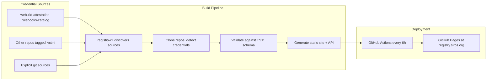

# Credential Catalog Service

The WP4 Trust Infrastructure includes a **Credential Catalog** that serves as the official registry of credential type metadata for the weBuild consortium. This document describes the service instance at **https://registry.siros.org**, its role in the trust framework, how credentials are onboarded, and how new credential types can be added.

## Service Instance

| Property | Value |
|----------|-------|
| **URL** | https://registry.siros.org |
| **Operator** | SIROS Foundation |
| **Source code** | https://github.com/sirosfoundation/registry-cli |
| **Site repository** | https://github.com/sirosfoundation/registry.siros.org |
| **Attestation Rulebooks** | https://github.com/webuild-consortium/webuild-attestation-rulebooks-catalog |
| **Status** | Production (deployed, auto-updated every 6 hours) |

## Role in the WP4 Trust Infrastructure

The Credential Catalog implements the **Catalogue of Attestation Schemes** concept from the ARF (Architecture and Reference Framework) v2.9.0 Section 5.5 and [Technical Specification 11 (TS11)](https://github.com/eu-digital-identity-wallet/eudi-doc-standards-and-technical-specifications/blob/main/docs/technical-specifications/ts11-interfaces-and-formats-for-catalogue-of-attributes-and-catalogue-of-schemes.md). It provides:

1. **Discovery** — Relying Parties, Wallet Units, and Attestation Providers can discover which credential types exist in the weBuild ecosystem
2. **Interoperability** — Machine-readable metadata (schema, claims, formats) enabling technical and semantic interoperability across participants
3. **Governance** — A single authoritative source for credential type definitions used in the consortium pilot

### Relationship to Other WP4 Services

| Service | Role | Relationship |
|---------|------|--------------|
| **LoTL** (List of Trusted Lists) | Lists **who** is trusted (entities, certificates) | Credential Catalog defines **what** credential types exist; LoTL defines who may issue/verify them |
| **Trusted Lists** (LoTE) | Per-type entity lists | TL entries reference credential types by identifier; the catalog provides the canonical metadata for those identifiers |
| **Onboarding API** | Participant registration | Onboarded issuers reference credential types from the catalog when declaring which attestations they issue |

## How It Works

### Architecture



### Credential Detection

The build tool (`registry-cli`) discovers credential type metadata from source repositories. For each repository it looks for:

- **`schema-meta.yaml`** — TS11 SchemaMeta envelopes declaring attestation level of security, binding type, and rulebook reference
- **`.vctm.json`** / **`.mdoc.json`** / **`.vc.json`** — Credential metadata in SD-JWT VC, mso_mdoc, and W3C VC formats
- **Markdown credential files** with `vct:` front matter — Automatically converted to metadata (supports nested claims, per-credential format overrides)

### TS11 API

The catalog exposes a TS11-compliant REST API:

| Endpoint | Description |
|----------|-------------|
| `GET /api/v1/schemas.json` | All registered credential schemas |
| `GET /api/v1/schemas/{id}.json` | Individual schema by identifier |

Per-credential metadata is also available at:

```
https://registry.siros.org/<org>/<slug>.vctm.json
https://registry.siros.org/<org>/<slug>.mdoc.json
https://registry.siros.org/<org>/<slug>.vc.json
```

### Autodiscovery

Repositories tagged with the GitHub topic **`vctm`** are automatically discovered and included in the catalog. This enables decentralised contribution: any consortium participant can publish credential type definitions in their own repository and have them indexed by the catalog.

## Credential Sources for weBuild

The catalog is configured via a `sources.yaml` manifest. The current weBuild configuration includes:

| Source | Type | Description |
|--------|------|-------------|
| `github:topic/vctm` | Autodiscovery | All GitHub repositories tagged `vctm` |
| `webuild-attestation-rulebooks-catalog` | Explicit | The consortium's official attestation rulebooks, using the `rulebook-catalog` layout plugin |

The **webuild-attestation-rulebooks-catalog** repository contains EUDI-style rulebook definitions that the catalog renders with attestation level of security and binding type metadata.

## How Credentials Were Onboarded

The initial set of weBuild credential types was onboarded through:

1. **Consortium agreement** — Credential types for the pilot were defined collaboratively in WP4 Task 2 and Task 5
2. **Schema and rulebook creation** — Each credential type was defined as a JSON Schema 2020-12 data definition (under `data-schemas/sd-jwt/`) together with a governance rulebook (under `rulebooks/rb-<slug>/`) in the [webuild-attestation-rulebooks-catalog](https://github.com/webuild-consortium/webuild-attestation-rulebooks-catalog) repository
3. **Automated ingestion** — The catalog's build pipeline discovers the rulebook repository, converts JSON Schema definitions into VCTM format, and publishes the credential type metadata with TS11-compliant schema information

## How to Onboard New Credential Types

There are two methods for adding new credential types to the weBuild Credential Catalog:

### Method 1: Attestation Rulebook + Data Schema (Recommended for weBuild)

The [webuild-attestation-rulebooks-catalog](https://github.com/webuild-consortium/webuild-attestation-rulebooks-catalog) follows the EUDI ARF directory layout. Adding a new credential type requires **both** a JSON Schema data definition **and** a governance rulebook:

**Required directory structure:**
```
data-schemas/
  sd-jwt/<slug>-sd-jwt.json       # JSON Schema 2020-12 — defines claims, types, mandatory/optional
  mdoc/<slug>-mdoc.json            # mDOC schema (if the credential supports mso_mdoc)
rulebooks/
  rb-<slug>/README.md              # Governance rulebook (EUDI template)
```

**Steps:**
1. **Create the JSON Schema** under `data-schemas/sd-jwt/<slug>-sd-jwt.json`. This is a JSON Schema 2020-12 document that defines the credential's claims, types, and validation rules. The `vct` identifier is extracted from `properties.vct.const` or `properties.vct.examples[0]`. Claims in the `required` array are marked mandatory; descriptions containing "selectively disclosable" set `sd: "always"`.
2. **Create the governance rulebook** under `rulebooks/rb-<slug>/README.md` following the EUDI attestation rulebook template
3. **(Optional) Add an mDOC schema** under `data-schemas/mdoc/<slug>-mdoc.json` if the credential type also supports mso_mdoc format
4. **(Optional) Add visual assets** — see [Visual Assets (SVG Card Templates and Logos)](#visual-assets-svg-card-templates-and-logos) below
5. **Open a Pull Request** in the rulebooks catalog repository
6. **Review and merge** — Consortium members review the PR; on merge, the catalog picks up the new credential type within 6 hours

> **Note:** The JSON Schema is the primary input — the catalog's build tool (`registry-cli`) automatically converts it into VCTM (Verifiable Credential Type Metadata) format with TS11-compliant claim structures. The rulebook provides the governance context (issuer requirements, legal basis, attribute semantics).

### Method 2: VCTM in Own Repository

1. **Create a credential metadata file** (`.vctm.json`, `.mdoc.json`, or Markdown with `vct:` front matter) in your own GitHub repository
2. **Tag the repository** with the `vctm` GitHub topic for autodiscovery, **or** request addition to `sources.yaml` in the [registry.siros.org](https://github.com/sirosfoundation/registry.siros.org) repository
3. **Include a `schema-meta.yaml`** envelope with TS11-required fields (attestation level of security, binding type, rulebook reference)
4. The catalog will discover and include the credential type on the next build cycle (every 6 hours or on manual trigger)

### Visual Assets (SVG Card Templates and Logos)

Credential types can include SVG card templates and logos for rich visual rendering in wallets and the catalog site. The build tool discovers visual assets by convention from several locations (searched in priority order):

**Preferred: `assets/<slug>/` directory**
```
assets/
  <slug>/
    card.svg              # Card template (light mode)
    card-dark.svg          # Card template (dark mode, optional)
    logo.svg               # Issuer/credential logo (SVG preferred)
    logo.png               # Issuer/credential logo (PNG fallback)
```

**Alternative: co-located with schema**
```
data-schemas/
  sd-jwt/
    <slug>-card.svg        # Card template next to the JSON Schema
    <slug>-logo.svg        # Logo next to the JSON Schema
```

**Alternative: `display/` directory**
```
display/
  <slug>-card.svg          # Card template
  <slug>-logo.svg          # Logo
```

Discovered SVG templates are embedded as `svg_templates` references in the published VCTM, enabling wallets to render credential cards. Logos are included as `logo` references.

### Validation

All credential type definitions are validated against the TS11 JSON Schema during the build process. Invalid entries are rejected and do not appear in the published catalog. Contributors can validate locally:

```bash
# Install the build tool
go install github.com/sirosfoundation/registry-cli/cmd/registry-cli@latest

# Validate a credential definition
registry-cli validate --sources sources.yaml
```

## Security and Integrity

- **JWS signing** — API responses can be signed with JWS (PKCS#11 or development key) to ensure integrity
- **Immutable publication** — The catalog is a static site deployed to GitHub Pages; no runtime state or database
- **Source transparency** — All credential definitions are tracked in version-controlled git repositories with full audit trail via pull request history
- **Automated builds** — No manual intervention in the publication pipeline; credentials are validated and published automatically

## References

- [ARF v2.9.0 Section 5.5 — Catalogue of attributes and catalogue of attestation schemes](https://eudi.dev/2.9.0/architecture-and-reference-framework-main/#55-catalogue-of-attributes-and-catalogue-of-attestation-schemes)
- [Technical Specification 11 — Interfaces and formats for catalogue of attributes and catalogue of schemes](https://github.com/eu-digital-identity-wallet/eudi-doc-standards-and-technical-specifications/blob/main/docs/technical-specifications/ts11-interfaces-and-formats-for-catalogue-of-attributes-and-catalogue-of-schemes.md)
- [Credential Catalogue (WP4)](../task2-trust-framework/credential-catalogue.md) — Background on EUDI catalogues
- [LoTL automation and TL integration](lotl-automation-and-tl-integration.md) — Companion trust infrastructure service
- [registry-cli documentation](https://github.com/sirosfoundation/registry-cli) — Build tool source and usage
