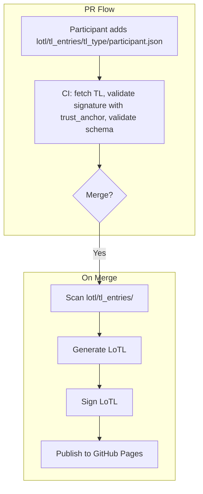

# LoTL Publication and Trusted Lists Integration

The WP4 Trust Infrastructure requires an automated system for LoTL (List of Trusted Lists) publication. **This PR focuses on LoTL only**: WP4 produces and publishes the LoTL of the WP4 trust registry. Participants are encouraged to act as Trusted List Providers (TLPs), producing and publishing their own TLs; the WP4 LoTL references and aggregates those TLs by URL. This document defines the LoTL automation scope, following the ETSI standards and the ARF, as defined in [Task 3](../task3-x509-pki-etsi/).

### TL Types and Published TLs

Per the EUDIW trust model in [Trust Infrastructure Schema](../task2-trust-framework/trust-infrastructure-schema.md) **§3**, **PuB-EAA**, **national non-qualified EAA**, and **QEAA** are **different trusted lists** (different compilers, formats, and ETSI references). The `lotl/tl_entries/{tl_type}/` folder names below mirror that split. Normative technical detail remains in the [Task 3 implementation profile](../task3-x509-pki-etsi/etsi_trusted_lists_implementation_profile.md).

| TL type (folder) | Trusted List (Task 2) | Compiler | Expected list format | `referencedListTypeUri` in LoTL JSON (`tools/lotl/settings.py`) |
|------------------|----------------------|----------|----------------------|------------------------------------------------------------------|
| `pub-eaa-provider` | EU-level **PuB-EAA** Providers TL | European Commission | TS 119 602 Annex H (LoTE) / profile §7.3 | `http://uri.etsi.org/19602/LoTEType/EUPubEAAProvidersList` |
| `eaa-provider` | National **non-qualified EAA** Provider TL | Member State TLP | TS 119 602 Annex H (LoTE) / profile §7.3 | `http://uri.etsi.org/19602/LoTEType/EUPubEAAProvidersList` |
| `qeaa-provider` | National **QTSP** TL for **QEAA** Providers | Member State TLP | **TS 119 612** national trusted list (XML TSL; Article 22 eIDAS) | `http://uri.etsi.org/TrstSvc/TrustedList/TSLType/EUgeneric` |
| `pid-provider` | EU PID Providers List | EC | Profile §7.1 | `…/LoTEType/EUPIDProvidersList` |
| `wallet-provider` | EU Wallet Providers List | EC | Profile §7.2 | `…/LoTEType/EUWalletProvidersList` |
| `wrpac-provider` | EU WRPAC Providers List | EC | Profile | `…/LoTEType/EUWRPACProvidersList` |
| `wrprc-provider` | EU WRPRC Providers List | EC | Profile | `…/LoTEType/EUWRPRCProvidersList` |
| `ebwoid-provider` | Registrars / registers (EBWOID) | Per Task 3 / ARF | Profile | `…/LoTEType/EURegistrarsAndRegistersList` |

For **PuB-EAA** and **non-qualified EAA**, **`referencedListTypeUri` is the same LoTE type** because both follow **Annex H / `EUPubEAAProvidersList`**; they differ by **who publishes** (EC vs MS) and by notification rules (see Task 2). **QEAA** pointers denote **Member State national trusted lists**; consumers validate them per **ETSI TS 119 615** and TS 119 612 rules, not the Annex H LoTE profile. CI **must** validate each `tl_url` against the applicable format (LoTE JSON/XML vs TS 119 612 XML).

## Process Overview



## Solution Overview

This PR focuses on **LoTL automation** and **TL integration** (as per the model above):

1. **List of Trusted Lists (LoTL) generation and signing** — Produces and publishes the WP4 LoTL, referencing TLs supplied by participant TLPs (by URL). TLPs publish their own TLs; the LoTL references them.
2. **Publication** — Publishes the LoTL to GitHub Pages.

### Integration of Participant TLPs

- **Trusted List Providers (TLPs)**: Participants act as TLPs by adding a `lotl/tl_entries/{tl_type}/{participant_id}.json` file via PR. Each file contains the TL URL and the participant's X.509 certificate (trust anchor) to validate the TL. CI validates the TL on PR; on merge, the LoTL is updated and published.

## Functional Requirements

### 1. Out of Scope (see `registry-validation` branch)

- **Entity Registration Validation Tool** — Defined in `registry-validation`
- **Single-entity onboarding** — `onboarding/` directories, entity files, file naming, entity file format
- **Registry integration** — Registry query API, entity lookup
- **Baseline TL generation** — Entity-specific TLs (wrpac-provider, wrprc-provider, pid-provider, wallet-provider, etc.) from onboarding data
- **GitHub Workflow for PR Validation** — Schema validation, test platforms, certificate provisioning

### 2. Directory Structure

**Folder hierarchy**:

```
lotl/
├── tl_entries/
│   ├── wrpac-provider/
│   │   └── {participant_id}.json
│   ├── wrprc-provider/
│   │   └── {participant_id}.json
│   ├── pub-eaa-provider/
│   │   └── {participant_id}.json
│   ├── pid-provider/
│   │   └── {participant_id}.json
│   ├── qeaa-provider/
│   │   └── {participant_id}.json
│   ├── eaa-provider/
│   │   └── {participant_id}.json
│   ├── wallet-provider/
│   │   └── {participant_id}.json
│   └── ebwoid-provider/
│       └── {participant_id}.json
├── list_of_trusted_lists.xml
└── list_of_trusted_lists.json
```

- **`lotl/`** — Root directory for LoTL input data and output. LoTL producer writes `list_of_trusted_lists.{xml,json}` here.
- **`lotl/tl_entries/`** — One subfolder per TL type (see [TL Types and Published TLs](#tl-types-and-published-tls)). Each subfolder holds TL entry files for that TL type.
- **`lotl/tl_entries/{tl_type}/`** — Contains one JSON file per participant TLP. File name: `{participant_id}.json` (e.g. `acme.json`, `example-corp.json`).

### 3. TL Entry File Format

Each `{participant_id}.json` file MUST contain:

| Field | Required | Description |
|-------|----------|-------------|
| `tl_url` | Yes | URL of the TL (JSON or XML; at least one format) |
| `tl_url_xml` | No | URL of the TL in XML format (if different from `tl_url`) |
| `tl_url_json` | No | URL of the TL in JSON format (if different from `tl_url`) |
| `trust_anchor` | Yes | X.509 certificate in PEM format — participant public key used to validate the TL signature |
| `metadata` | No | Additional metadata per TL type (e.g. operator name, country) |

**Example** (`lotl/tl_entries/pid-provider/example-tlp.json`):
```json
{
  "tl_url": "https://example.com/pid_providers.json",
  "tl_url_xml": "https://example.com/pid_providers.xml",
  "trust_anchor": "-----BEGIN CERTIFICATE-----\nMIIB...\n-----END CERTIFICATE-----",
  "metadata": {
    "operator_name": "Example TLP",
    "country": "IT"
  }
}
```

### 4. LoTL Producer and Signer

**Location**: `tools/lotl/` (see [tools/lotl/README.md](../tools/lotl/README.md))

**Data Collection** (inputs):
- **From `lotl/tl_entries/`**: Scan all `lotl/tl_entries/{tl_type}/*.json` files; parse each entry to obtain TL URL(s) and metadata. The LoTL references these TLs by URL; TLPs publish their own TLs.

**Structure**:
```
tools/lotl/
├── __init__.py
├── cli.py
├── create_signing_cert.py   # ETSI-compliant self-signed cert generator
├── producer.py
├── collector.py
├── validator.py
├── tl_entry.py
├── json_generator.py
├── xml_generator.py
├── xades_signer.py
├── jades_signer.py
├── settings.py
├── schemas/tl_entry.json
├── README.md
└── tests/
```

**Requirements**:
- Standalone Python program with CLI
- Scan `tl_entries/`; generate LoTL referencing participant TLs by URL
- Output LoTL in both XML and JSON formats per the [Task 3 implementation profile](../task3-x509-pki-etsi/etsi_trusted_lists_implementation_profile.md). JSON (signed with JAdES) uses the TS 119 602-1 `1960201` document shape: root `LoTE`, `ListAndSchemeInformation` with `PointersToOtherLoTE` and URI-only `DistributionPoints` (see [conformance analysis](../docs/etsi-ts-119-602-1-json-schema-conformance-analysis.md) §9–10).
- Sign using XAdES Baseline B (XML) and JAdES Compact Baseline B (JSON) per [Task 3](../task3-x509-pki-etsi/)
- **Sequence number**: Increment on each publication
- **Error handling**: On signing failure, exit non-zero; on TLP URL unreachable, log and optionally skip or fail

**CLI Interface**:
```bash
# Produce LoTL (validates tl_entries first, then produces and signs). Key/cert from env or inline:
python -m tools.lotl --tl-entries-dir lotl/tl_entries/ --output-dir lotl/
# With inline key/cert:
python -m tools.lotl --signing-key key.pem --signing-cert cert.pem --tl-entries-dir lotl/tl_entries/ --output-dir lotl/
# Validate-only (for CI): no signing required
python -m tools.lotl --validate-only --tl-entries-dir lotl/tl_entries/
```

- **LoTL is signed**: XAdES Baseline B (XML) and JAdES Compact Baseline B (JSON).
- **Validation is part of produce**: produce validates tl_entries first; on failure, produce fails.
- **Key/cert**: use `--signing-key` / `--signing-cert` if provided, else `os.environ.get("LOTL_SIGNING_KEY")` and or `os.environ.get("LOTL_SIGNING_CERT")`.
- **Logging**: Eloquent INFO and DEBUG logging to stderr. Use `--log-level DEBUG` or `LOTL_LOG_LEVEL=DEBUG` for verbose output.

**Testing**: pytest required, minimum 90% code coverage. See [Running Tests](#51-running-tests).

#### 4.1 Signing Certificate Creation and Configuration

The LoTL signing certificate must comply with ETSI TS 119 612 clause 5.7.1 (Subject DN, KeyUsage, ExtendedKeyUsage id-tsl-kp-tslSigning, BasicConstraints CA=false, SubjectKeyIdentifier). Use the provided command to create a self-signed, ETSI-compliant certificate:

```bash
# Create cert (default: lotl/certs/, Scheme Territory=EU)
python -m tools.lotl.create_signing_cert

# Custom scheme territory and operator name (must match LoTL scheme info)
python -m tools.lotl.create_signing_cert \
  --output-dir lotl/certs/ \
  --scheme-territory IT \
  --scheme-operator-name "Example TLP"
```

**Configuration of LOTL_SIGNING_KEY and LOTL_SIGNING_CERT**:

| Method | Example |
|--------|---------|
| Environment variables | `export LOTL_SIGNING_KEY=$(cat lotl/certs/lotl_signing_key.pem)`<br>`export LOTL_SIGNING_CERT=$(cat lotl/certs/lotl_signing_cert.pem)` |
| CLI arguments | `python -m tools.lotl --signing-key lotl/certs/lotl_signing_key.pem --signing-cert lotl/certs/lotl_signing_cert.pem ...` |

Full workflow example:
```bash
# 1. Create certificate
python -m tools.lotl.create_signing_cert -o lotl/certs/ -t EU -n "WP4 Trust Group"

# 2. Produce LoTL using env vars
export LOTL_SIGNING_KEY=$(cat lotl/certs/lotl_signing_key.pem)
export LOTL_SIGNING_CERT=$(cat lotl/certs/lotl_signing_cert.pem)
python -m tools.lotl --tl-entries-dir lotl/tl_entries/ --output-dir lotl/

# Or using file paths
python -m tools.lotl --signing-key lotl/certs/lotl_signing_key.pem --signing-cert lotl/certs/lotl_signing_cert.pem \
  --tl-entries-dir lotl/tl_entries/ --output-dir lotl/
```

### 5. TL Entry Validation

**Location**: `tools/lotl/`

**Purpose**: Validation is part of the produce flow. When producing LoTL:
1. Validate all tl_entry files first (schema, required fields, PEM format)
2. On success: collect entries, generate LoTL, sign LoTL
3. On failure: produce exits non-zero

For CI (PR validation without producing): `python -m tools.lotl --validate-only --tl-entries-dir lotl/tl_entries/` (no signing required).

### 5.1 Running Tests

From the project root, using the project virtualenv:

```bash
# Run all LoTL tests
env/bin/pytest tools/lotl/tests/ -v

# Run with coverage report
env/bin/pytest tools/lotl/tests/ --cov=tools.lotl --cov-report=term-missing

# Run a specific test file
env/bin/pytest tools/lotl/tests/test_producer.py -v
```

**Prerequisites**: Install dev dependencies with `pip install -r requirements-dev.txt` (or use the project `env/`).

### 6. CI Workflows

#### 6.0 LoTL CI (tests)

**Location**: `.github/workflows/lotl-ci.yml`

**Trigger**: Push or pull_request to `main`/`develop` when files under `lotl/`, `tools/lotl/`, or `requirements-dev.txt` change.

**Steps**: Install deps, run `pytest tools/lotl/tests/` with coverage.

#### 6.1 PR Validation (tl-entry.json)

**Location**: `.github/workflows/tl-entry-validation.yml`

**Trigger**: PRs that add or modify files under `lotl/tl_entries/`

**Steps**:
1. For each new or modified `lotl/tl_entries/{tl_type}/*.json`:
   - Parse the file; validate against the TL entry JSON schema (required fields: `tl_url`, `trust_anchor`)
   - Fetch the TL from `tl_url` (or `tl_url_json`/`tl_url_xml`)
   - Validate the TL signature using the provided `trust_anchor` (X.509 certificate)
   - Validate the TL against the ETSI schema for that TL type (per [Task 3 implementation profile](../task3-x509-pki-etsi/etsi_trusted_lists_implementation_profile.md))
2. If all validations pass: PR is mergeable
3. If any validation fails: CI fails; PR cannot be merged

#### 6.2 LoTL Update on Merge

**Location**: `.github/workflows/lotl-update.yml`

**Trigger Conditions**:
- On merge to `main` branch (when `lotl/tl_entries/` changes)
- Manual trigger via workflow_dispatch

**Workflow Steps**:

1. **Load TL Entries**:
   - Scan `lotl/tl_entries/{tl_type}/*.json` for all valid entries
   - Parse each file to obtain TL URL(s) and metadata

2. **Generate and Sign LoTL**:
   - Execute LoTL producer with `--tl-entries-dir` and `--output-dir`
   - Output: `lotl/list_of_trusted_lists.{xml,json}` (signed)

3. **Commit and Push** (if changes):
   - Compare generated LoTL with current `lotl/`; commit only if diff exists
   - Commit LoTL to repository
   - Push to `main` branch
   - Create git tag for version tracking (e.g. `lotl-v{sequence}`)

4. **Publish to GitHub Pages**:
   - Copy the LoTL (XML and JSON) to the `gh-pages` branch
   - [OPTIONAL] Set proper MIME types: `application/vnd.etsi.tsl+xml` (XML) or `application/json`/`application/vnd.etsi.lote+json` (JSON)
     - Note: The Task 3 implementation profile specifies MIME types for TL distribution; GitHub Pages does not support custom MIME type configuration. This is a platform limitation.
   - Update the GitHub Pages landing page: copy **`lotl/pages/index.html`** to the **`gh-pages` branch root**, and sync the entire **`lotl/pages/assets/`** tree to **`assets/`** on `gh-pages` (vendored WE BUILD `custom.css`, Fracktif/slick fonts, Bootstrap bundle, logos, favicon). The site does not load CSS or images from webuildconsortium.eu. Consortium portal links (Newsletter, Partner Portal, Privacy, etc.) remain absolute URLs.

**LoTL publication URL** (GitHub Pages, `gh-pages` branch):

| Format | Absolute URL |
|--------|--------------|
| JSON | `https://webuild-consortium.github.io/wp4-trust-group/list_of_trusted_lists.json` |
| XML | `https://webuild-consortium.github.io/wp4-trust-group/list_of_trusted_lists.xml` |

The `gh-pages` branch is an empty branch used solely for LoTL publication. Enable GitHub Pages in the repository settings (Source: `gh-pages` branch) to serve these URLs.

### 7. Configuration Management

**Location**: `tools/lotl/settings.py`

**Requirements**:
- Centralized configuration in `settings.py` (no hardcoded constants)
- Support environment variable overrides
- Configuration sections:
  - **TL entries**: Path to `tl_entries/` directory
  - **Output paths**: `lotl/`
  - **Signing**: Certificate paths, private key (from env), algorithm
  - **Sequence number**: Persist or derive from git tag

**Example Structure**:
```python
# LoTL root directory
LOTL_DIR = 'lotl/'

# TL entries directory (folder-per-TL-type)
TL_ENTRIES_DIR = 'lotl/tl_entries/'

# Output directory for LoTL
LOTL_OUTPUT_DIR = 'lotl/'

# Signing (certificate paths, private key from env)
SIGNING_CERT_PATH = 'certs/lotl_signing.pem'
# Private key via env: LOTL_SIGNING_KEY
```

## Acceptance Criteria

- [ ] TL entry format: one JSON file per participant per TL type in `lotl/tl_entries/{tl_type}/{participant_id}.json`
- [ ] Each TL entry contains `tl_url` and `trust_anchor` (X.509 PEM) for TL signature validation
- [ ] TL entry validator: fetches TL, validates signature with trust anchor, validates against ETSI schema
- [ ] PR validation: CI runs tl-entry validator on changed files; PR mergeable only when all pass
- [ ] LoTL producer generates signed LoTL in both XML (XAdES) and JSON (JAdES) formats
- [ ] LoTL references participant TLs by URL (from tl_entries)
- [ ] LoTL producer includes unit and integration tests using pytest (minimum 90% code coverage)
- [ ] On merge: CI updates LoTL, signs it, publishes to GitHub Pages
- [ ] All Python code uses `settings.py` for configuration (no hardcoded constants)
- [ ] Directory `lotl/` with `tl_entries/` created
- [ ] Private keys for signature operations stored in GitHub Secrets and provided via environment variables

## Additional Context

### WE BUILD-Specific Practical Documentation

- **TLP participation**: Participants add `lotl/tl_entries/{tl_type}/{participant_id}.json` via PR. Human reviewers ensure only WE BUILD participants are included.
- **Functional flow**: PR with tl-entry → CI validates (fetch TL, verify signature with trust anchor, validate schema) → merge → CI updates LoTL, signs, publishes to GitHub Pages.

### Workflow Example

1. Participant creates PR adding `lotl/tl_entries/pid-provider/my-org.json` with `tl_url`, `trust_anchor` (PEM), and optional `metadata`
2. CI fetches the TL from `tl_url`, validates the signature using `trust_anchor`, validates against ETSI schema
3. If valid: PR is mergeable; human review and merge
4. On merge: CI scans `tl_entries/`, generates LoTL referencing all valid TLs, signs it, publishes to GitHub Pages

## Dependencies

- [Task 3](../task3-x509-pki-etsi/) documentation (LoTL generation and signing specifications)
- [Task 3 implementation profile](../task3-x509-pki-etsi/etsi_trusted_lists_implementation_profile.md) (schema references, ETSI standards)
- JSON schema for TL entry format (`lotl/tl_entries/{tl_type}/*.json`) — to be defined in `schemas/` or equivalent
- [eIDAS validation tests](https://eidas.ec.europa.eu/efda/validation-tests) — reference for TL validation (LOTL-2, TL-21, TL-22, TL-23)
