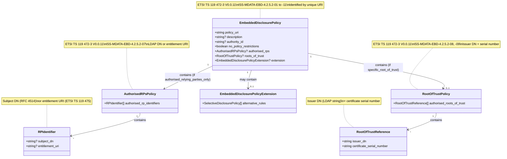
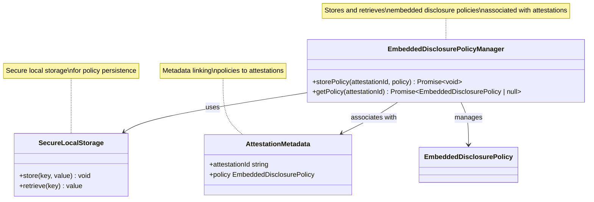
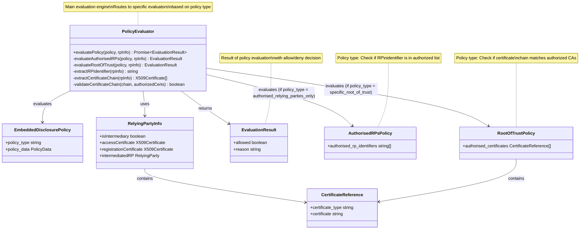

# Embedded Disclosure Policies: Implementation Guide

## Executive Summary

This document provides a guide on implementing **Embedded Disclosure Policies** (EDP) as defined in the ARF (Architecture and Reference Framework), ETSI TS 119 472-2 V1.1.1 (for presentation protocols), and ETSI TS 119 472-3 V0.0.11 (for OpenID4VCI metadata extension). 

Embedded disclosure policies are mechanisms that allow Attestation Providers to specify restrictions on which Relying Parties can access specific attestations, providing a crucial layer of data protection for users.

## 1. Overview and Legal Framework

### 1.1 Definition

An **Embedded Disclosure Policy** is a policy associated with an attestation (QEAA, PuB-EAA, or non-qualified EAA) that specifies conditions under which the attestation can be disclosed to Relying Parties. The policy is embedded in the Issuer metadata (OpenID4VCI) during issuance, not within the digital credential itself. The Wallet Unit retrieves and stores the policy locally, associating it with the credential for evaluation during presentation requests. These policies are defined by the Attestation Provider and are evaluated by the Wallet Unit before allowing credential presentation.

### 1.2 Legal Basis

- **ARF Topic 43**: Defines the high-level requirements for embedded disclosure policies. The following ARF 2.7.3 requirements (EDP_01 through EDP_11) are specified:

  1. **EDP_01**: A Wallet Unit SHALL enable an Attestation Provider to optionally express an embedded disclosure policy for a QEAA, PuB-EAA, or non-qualified EAA. *Note: The European Digital Identity Regulation does not contain a requirement for PIDs to be able to contain an embedded disclosure policy.*

  2. **EDP_02**: A Wallet Unit SHALL support embedded disclosure policies implementing the 'Authorised relying parties only policy' described in Annex III of Implementing Regulation (EU) 2024/2979. If present, such an embedded disclosure policy SHALL contain a list of EU-wide unique identifiers of Relying Parties, as specified in Reg_32. The Wallet Unit SHALL retrieve the Relying Party identifier from the access certificate presented by the Relying Party, and compare it to the list of authorised identifiers in the policy, unless the Relying Party is an intermediary. If the Relying Party is an intermediary, the Wallet Unit SHALL retrieve the unique identifier of the intermediated Relying Party from the presentation request or from the registration certificate of the intermediated Relying Party and compare this identifier to the list of authorised identifiers in the policy.

  3. **EDP_03**: A Wallet Unit SHALL support embedded disclosure policies implementing the 'Specific root of trust' policy described in Annex III of Implementing Regulation (EU) 2024/2979. If present, such an embedded disclosure policy SHALL contain a list of root or intermediate certificates used for signing Relying Party access certificates. The Wallet Unit SHALL compare the certificate chain that was used to sign the access certificate provided by the Relying Party to the list of authorised root or intermediate certificates in the policy, unless the Relying Party is an intermediary. If the Relying Party is an intermediary, the Wallet Unit SHALL retrieve the root certificate of the Provider of registration certificates of the intermediated Relying Party from the presentation request or from the Registrar's online service (as applicable) and compare this certificate to the list of authorised certificates in the policy.

  4. **EDP_04**: (Empty requirement)

  5. **EDP_05**: An embedded disclosure policy SHOULD contain a link to a website of the Attestation Provider explaining the disclosure policy in layman's terms. If this is the case, the Wallet Unit SHALL display the link to the User and allow them to navigate to that website.

  6. **EDP_06**: The Wallet Unit SHALL evaluate an embedded disclosure policy in conjunction with the information received from the requesting Relying Party, in order to determine if the Relying Party has permission from the Attestation Provider to access the requested attestation.

  7. **EDP_07**: The Wallet Unit SHALL enable the User, based on the outcome of the evaluation of the applicable embedded disclosure policy(s), to deny or allow the presentation of the requested attestation to the Relying Party.

  8. **EDP_08**: The Commission SHALL take measures to ensure a technical specification is created establishing common mechanisms for the specification of embedded disclosure policies by Attestation Providers, and for the evaluation of such policies by Wallet Units.

  9. **EDP_09**: An Attestation Provider SHALL include an embedded disclosure policy (if any) by value in the Issuer metadata related to the attestation, in compliance with the OpenID4VCI issuance protocol or an extension thereof specified in the technical specification mentioned in EDP_08.

  10. **EDP_10**: During attestation issuance, a Wallet Unit SHALL retrieve and store locally the corresponding embedded disclosure policy, if any.

  11. **EDP_11**: An Attestation Provider SHALL revoke an attestation if a corresponding embedded disclosure policy is added, changed, or deleted.

- **Implementing Regulation (EU) 2024/2979, Annex III**: Describes the specific policy types:
  - "Authorised relying parties only policy"
  - "Specific root of trust" policy

- **ETSI TS 119 472-2 V1.1.1**: Technical specification for extensions to ISO/IEC 18013-5 and OpenID4VP (referenced in ARF requirements RPRC_20 and RPRC_20a)
- **ETSI TS 119 472-3 V0.0.11**: Technical specification defining the embedded disclosure policy extension for OpenID4VCI metadata (Section 4.2.5 "Provision of Embedded Disclosure Policy"). This is the technical specification mentioned in ARF requirement EDP_08, which establishes:
  - Requirements for the data model of Embedded Disclosure Policy (ISS-MDATA-EBD-4.2.5.2-01 through ISS-MDATA-EBD-4.2.5.2-11)
  - Policy identification by unique URI
  - Authorised relying parties identification (LDAP DN or entitlement URI)
  - Roots of trust specification (issuer DN + certificate serial number)
  - Extensions for selective disclosure

### 1.3 Scope

Embedded disclosure policies apply to:
- **QEAA** (Qualified Electronic Attestations of Attributes)
- **PuB-EAA** (Public Electronic Attestations of Attributes)
- **Non-qualified EAA**

**Note**: PIDs (Person Identification Data) do NOT support embedded disclosure policies according to the European Digital Identity Regulation.

## 2. Policy Types

### 2.1 Authorised Relying Parties Only Policy

This policy restricts disclosure to a specific list of authorized Relying Parties.

#### Structure

**Note**: This policy structure is embedded in the Issuer metadata (OpenID4VCI), not within the digital credential itself. The policy is included in the `credential_configurations_supported` metadata during issuance and stored locally by the Wallet Unit.

**ETSI TS 119 472-3 V0.0.11 Requirements (ISS-MDATA-EBD-4.2.5.2-07)**:

According to ETSI TS 119 472-3 V0.0.11, the authorised relying parties may be identified by:
- **Subject distinguished name** (LDAP string per IETF RFC 4514) as held in the wallet-relying party access certificate
- **URI encoded entitlements** as specified in ETSI TS 119 475, held in the access certificate or registration certificate

For legal persons: commonName, organizationName, organizationIdentifier (ORGID), countryName  
For natural persons: commonName, givenName, surname, serialNumber (SN), countryName

```json
{
  "policy_uri": "https://attestation-provider.example.com/policies/authorised-rps-policy",
  "policy_type": "authorised_relying_parties_only",
  "authorised_rp_identifiers": [
    {
      "subject_dn": "CN=Example RP, O=Example Org, ORGID=EU.RP.123456789, C=IT"
    },
    {
      "entitlement_uri": "https://example.com/entitlements/banking-service"
    }
  ],
  "description": "Policy restricting access to authorized banking services",
  "authority_id": "https://authority.example.com",
  "explanation_url": "https://attestation-provider.example.com/policy-explanation"
}
```

#### Implementation Requirements (EDP_02)

1. **Policy Content**: The policy MUST contain a list of EU-wide unique identifiers of Relying Parties (as specified in Reg_32).

2. **Identifier Retrieval**:
   - For direct Relying Parties: Retrieve the identifier from the **access certificate** presented by the Relying Party
   - For intermediaries: Retrieve the unique identifier of the **intermediated Relying Party** from:
     - The presentation request, OR
     - The registration certificate of the intermediated Relying Party

3. **Evaluation**: Compare the retrieved identifier against the list of authorized identifiers in the policy.

### 2.2 Specific Root of Trust Policy

This policy restricts disclosure to Relying Parties whose access certificates are signed by specific root or intermediate certificate authorities.

#### Structure

**Note**: This policy structure is embedded in the Issuer metadata (OpenID4VCI), not within the digital credential itself. The policy is included in the `credential_configurations_supported` metadata during issuance and stored locally by the Wallet Unit.

**ETSI TS 119 472-3 V0.0.11 Requirements (ISS-MDATA-EBD-4.2.5.2-08, ISS-MDATA-EBD-4.2.5.2-09)**:

According to ETSI TS 119 472-3 V0.0.11, each element of the list of roots of trust **shall** include:
- The issuer's distinguished name in the form of LDAP string as specified in IETF RFC 4514
- The issuer's certificate serial number

```json
{
  "policy_uri": "https://attestation-provider.example.com/policies/root-of-trust-policy",
  "policy_type": "specific_root_of_trust",
  "authorised_roots_of_trust": [
    {
      "issuer_dn": "CN=Trusted CA Root, O=Trusted CA Organization, C=EU",
      "certificate_serial_number": "1234567890123456789012345678901234"
    },
    {
      "issuer_dn": "CN=Intermediate CA, O=Trusted CA Organization, C=EU",
      "certificate_serial_number": "9876543210987654321098765432109876"
    }
  ],
  "description": "Policy restricting access to RPs with certificates from trusted CAs",
  "authority_id": "https://authority.example.com",
  "explanation_url": "https://attestation-provider.example.com/policy-explanation"
}
```

#### Implementation Requirements (EDP_03)

1. **Policy Content**: The policy MUST contain a list of root or intermediate certificates used for signing Relying Party access certificates.

2. **Certificate Chain Validation**:
   - For direct Relying Parties: Compare the certificate chain used to sign the access certificate against the list of authorized certificates
   - For intermediaries: Retrieve the root certificate of the Provider of registration certificates of the intermediated Relying Party from:
     - The presentation request, OR
     - The Registrar's online service (as applicable)
   - Compare this certificate against the list of authorized certificates

3. **Evaluation**: Verify that the certificate chain matches one of the authorized root or intermediate certificates.

## 3. Implementation Architecture

### 3.1 Policy Storage and Retrieval

#### During Issuance (EDP_09, EDP_10)

1. **Attestation Provider**:
   - Includes the embedded disclosure policy **by value** in the Issuer metadata
   - Complies with OpenID4VCI issuance protocol or extensions specified in the technical specification (EDP_08)

2. **Wallet Unit**:
   - Retrieves the policy from the Issuer metadata during attestation issuance
   - Stores the policy locally, associated with the attestation
   - Maintains the policy for the lifetime of the attestation

#### Metadata Structure (OpenID4VCI Extension)

The policy should be included in the `credential_configurations_supported` metadata:

> ⚠️ **Warning**: The field name `embedded_disclosure_policy` used in the examples below is illustrative and may differ from the official field name defined in the final version of ETSI TS 119 472-3. Please refer to the official ETSI TS 119 472-3 specification for the exact field name and structure.

```json
{
  "credential_configurations_supported": {
    "credential_type_1": {
      "format": "dc+sd-jwt",
      "embedded_disclosure_policy": {
        "policy_type": "authorised_relying_parties_only",
        "authorised_rp_identifiers": [...],
        "explanation_url": "https://..."
      },
      ...
    }
  }
}
```

### 3.2 Policy Evaluation Flow

```
┌─────────────────┐
│  Relying Party  │
│  Presentation   │
│     Request     │
└────────┬────────┘
         │
         ▼
┌─────────────────────────┐
│   Wallet Unit           │
│                         │
│ 1. Retrieve Attestation │
│ 2. Check for EDP        │
└────────┬────────────────┘
         │
         ▼
┌─────────────────────────┐
│  Policy Evaluation      │
│                         │
│ - Extract RP Info       │
│ - Check Policy Type     │
│ - Evaluate Conditions   │
└────────┬────────────────┘
         │
         ▼
    ┌────┴────┐
    │         │
    ▼         ▼
┌────────┐ ┌────────┐
│ ALLOW  │ │ DENY   │
└───┬────┘ └───┬────┘
    │          │
    ▼          ▼
┌─────────────────────┐
│  User Decision      │
│  (EDP_07)           │
└─────────────────────┘
```

### 3.3 Evaluation Process (EDP_06)

The Wallet Unit MUST:

1. **Retrieve Policy**: Load the embedded disclosure policy associated with the requested attestation
2. **Extract Relying Party Information**:
   - Access certificate (for direct RPs)
   - Registration certificate (for intermediated RPs)
   - Certificate chain validation
3. **Evaluate Policy**:
   - Determine policy type
   - Apply appropriate evaluation logic
   - Check if RP meets policy conditions
4. **Decision**: Determine if RP has permission from Attestation Provider

### 3.4 User Interaction (EDP_07)

After policy evaluation, the Wallet Unit MUST:

1. **Present Result**: Show the user the outcome of policy evaluation
2. **Display Policy Information**:
   - Policy explanation URL (if available, EDP_05)
   - Policy type and restrictions
   - RP information
3. **User Decision**: Enable user to:
   - **Allow** presentation (if policy permits)
   - **Deny** presentation (even if policy permits, user has final say)

## 4. Technical Implementation Details

### 4.1 Policy Data Model

**Based on ETSI TS 119 472-3 V0.0.11 Section 4.2.5.2 Requirements**



### 4.2 Wallet Unit Implementation

#### High-Level Architecture Diagram

```mermaid
graph TB
    subgraph "Issuance Flow"
        AP[Attestation Provider]
        CIM[CredentialIssuerMetadata]
        AP -->|1. Build Metadata| CIM
        CIM -->|2. Include Policy| OID4VCI[OpenID4VCI Metadata]
        OID4VCI -->|3. Issue Credential| WU[Wallet Unit]
        WU -->|4. Extract Policy| EPM[EmbeddedDisclosurePolicyManager]
        EPM -->|5. Store Policy| LS[(Secure Local Storage)]
    end

    subgraph "Presentation Flow"
        RP[Relying Party]
        RP -->|1. Presentation Request| WU2[Wallet Unit]
        WU2 -->|2. Get Policy| EPM2[EmbeddedDisclosurePolicyManager]
        EPM2 -->|3. Load from Storage| LS2[(Secure Local Storage)]
        EPM2 -->|4. Return Policy| PE[PolicyEvaluator]
        RP -->|5. Provide RP Info| PE
        PE -->|6. Evaluate| EVAL{Policy Type?}
        
        EVAL -->|Authorised RPs| ARP[evaluateAuthorisedRPs]
        EVAL -->|Root of Trust| ROT[evaluateRootOfTrust]
        
        ARP -->|Extract| ERI[extractRPIdentifier]
        ERI -->|Check| CHK1{In Authorized List?}
        
        ROT -->|Extract| ECC[extractCertificateChain]
        ECC -->|Validate| VCC[validateCertificateChain]
        VCC -->|Check| CHK2{Chain Matches?}
        
        CHK1 -->|Yes| ALLOW1[EvaluationResult: allowed=true]
        CHK1 -->|No| DENY1[EvaluationResult: allowed=false]
        CHK2 -->|Yes| ALLOW2[EvaluationResult: allowed=true]
        CHK2 -->|No| DENY2[EvaluationResult: allowed=false]
        
        ALLOW1 --> USER[User Decision]
        DENY1 --> USER
        ALLOW2 --> USER
        DENY2 --> USER
        
        USER -->|Allow| PRESENT[Present Credential]
        USER -->|Deny| REJECT[Reject Request]
    end

    subgraph "Component Details"
        subgraph EPM_Detail[EmbeddedDisclosurePolicyManager]
            STORE[storePolicy<br/>attestationId, policy]
            GET[getPolicy<br/>attestationId]
        end
        
        subgraph PE_Detail[PolicyEvaluator]
            EVAL_MAIN[evaluatePolicy<br/>policy, rpInfo]
            EVAL_ARP[evaluateAuthorisedRPs<br/>policy, rpInfo]
            EVAL_ROT[evaluateRootOfTrust<br/>policy, rpInfo]
            EXT_ID[extractRPIdentifier<br/>rpInfo]
            EXT_CERT[extractCertificateChain<br/>rpInfo]
            VAL_CERT[validateCertificateChain<br/>chain, authorizedCerts]
        end
        
        subgraph CIM_Detail[CredentialIssuerMetadata]
            BUILD[buildMetadata<br/>credentialType]
            SERIALIZE[serializePolicyData<br/>policy]
        end
    end

    style AP fill:#e1f5ff
    style WU fill:#fff4e1
    style WU2 fill:#fff4e1
    style PE fill:#e8f5e9
    style USER fill:#fce4ec
    style PRESENT fill:#c8e6c9
    style REJECT fill:#ffcdd2
```



#### Policy Storage



#### Policy Evaluation



### 4.3 Attestation Provider Implementation

#### Policy Inclusion in Metadata

The embedded disclosure policy is included in the OpenID4VCI Credential Issuer metadata within the `credential_configurations_supported` object, as an extension to the standard OpenID4VCI 1.0 specification (Section 12.2.4).

**Source of Requirement**: This requirement comes directly from **ARF requirement EDP_09**, which states: "An Attestation Provider SHALL include an embedded disclosure policy (if any) by value in the Issuer metadata related to the attestation, in compliance with the [OpenID4VCI] issuance protocol or an extension thereof specified in the technical specification mentioned in EDP_08."

**Reference**: OpenID for Verifiable Credential Issuance 1.0, Section 12.2.4 - `credential_configurations_supported` parameter (for the base metadata structure). 

**ETSI TS 119 472-3 V0.0.11 Evidence**: The embedded disclosure policy extension for OpenID4VCI metadata is defined in **ETSI TS 119 472-3 V0.0.11**, Section 4.2.5 "Provision of Embedded Disclosure Policy". This specification (referenced in ARF requirement EDP_08) establishes common mechanisms for:
- The specification of embedded disclosure policies by Attestation Providers
- The evaluation of such policies by Wallet Units
- The data model and structure of embedded disclosure policies

**Key Evidence from ETSI TS 119 472-3 V0.0.11**:

1. **Definition (Section 4.2.5.1)**: "An embedded disclosure policy is meta data associated with an EAA when issued to a wallet holder either using the URI identifying the policy or by including the content of the policy itself."

2. **Loading Mechanism (Section 4.2.5.1)**: "This policy may be loaded into a wallet using the EAA issuer protocol as specified in the present document, or through direct access by the wallet to the URI identifying the policy."

3. **Data Model Requirements (Section 4.2.5.2)**: The specification defines 11 requirements (ISS-MDATA-EBD-4.2.5.2-01 through ISS-MDATA-EBD-4.2.5.2-11) for the embedded disclosure policy data model, including:
   - Policy identification by unique URI (ISS-MDATA-EBD-4.2.5.2-01)
   - Authorised relying parties list (ISS-MDATA-EBD-4.2.5.2-07) - identified by subject distinguished name (LDAP string per RFC 4514) or URI-encoded entitlements
   - Specific roots of trust list (ISS-MDATA-EBD-4.2.5.2-08) - with issuer distinguished name and certificate serial number
   - Extensions for selective disclosure (ISS-MDATA-EBD-4.2.5.2-11)

4. **Legal Basis**: The specification references CIR 2024/2979 [i.3] Annex III for the common embedded disclosure policies ("Authorised relying parties only policy" and "Specific root of trust" policy).

**Note**: While ETSI TS 119 472-3 V0.0.11 defines the data model requirements for embedded disclosure policies, the exact field name and location within the `credential_configurations_supported` or `credential_metadata` structure may be further specified. 

> ⚠️ **Warning**: The field name `embedded_disclosure_policy` used in the examples below is illustrative and may differ from the official field name defined in the final version of ETSI TS 119 472-3. Please refer to the official ETSI TS 119 472-3 specification for the exact field name and structure.

**Example OpenID4VCI Metadata with Embedded Disclosure Policy**:

```json
{
  "credential_issuer": "https://credential-issuer.example.com",
  "credential_endpoint": "https://credential-issuer.example.com/credential",
  "credential_configurations_supported": {
    "eu.europa.ec.eudiw.pid.1": {
      "format": "dc+sd-jwt",
      "scope": "eu.europa.ec.eudiw.pid.1",
      "cryptographic_binding_methods_supported": ["jwk"],
      "credential_signing_alg_values_supported": ["ES256", "ES384"],
      "proof_types_supported": {
        "jwt": {
          "proof_signing_alg_values_supported": ["ES256", "ES384"]
        }
      },
      "vct": "https://trust-anchor.eid-wallet.example.it/vct/pid",
      "credential_metadata": {
        "display": [
          {
            "name": "European Digital Identity Wallet PID",
            "locale": "en",
            "description": "Person Identification Data"
          }
        ],
        "claims": [
          {
            "path": "$.given_name",
            "mandatory": true,
            "sd": "always",
            "display": [
              {
                "name": "Given Name",
                "description": "First name of the person",
                "locale": "en"
              }
            ]
          }
        ]
      },
      "schema_id": "https://registry.example.com/schemas/pid/v1",
      "authentic_sources": {
        "entity_id": "https://authentic-source.example.com",
        "dataset_id": "pid-dataset-1"
      },
      "embedded_disclosure_policy": {
        "policy_type": "authorised_relying_parties_only",
        "authorised_rp_identifiers": [
          "EU.RP.123456789",
          "EU.RP.987654321"
        ],
        "explanation_url": "https://credential-issuer.example.com/policies/pid-disclosure-policy"
      }
    },
    "eu.europa.ec.eudiw.qeaa.age.1": {
      "format": "dc+sd-jwt",
      "scope": "eu.europa.ec.eudiw.qeaa.age.1",
      "cryptographic_binding_methods_supported": ["jwk"],
      "credential_signing_alg_values_supported": ["ES256"],
      "proof_types_supported": {
        "jwt": {
          "proof_signing_alg_values_supported": ["ES256"]
        }
      },
      "vct": "https://trust-anchor.eid-wallet.example.it/vct/qeaa-age",
      "credential_metadata": {
        "display": [
          {
            "name": "Age Verification",
            "locale": "en",
            "description": "Qualified Electronic Attestation of Attributes for age verification"
          }
        ]
      },
      "schema_id": "https://registry.example.com/schemas/qeaa-age/v1",
      "authentic_sources": {
        "entity_id": "https://authentic-source.example.com",
        "dataset_id": "age-dataset-1"
      },
      "embedded_disclosure_policy": {
        "policy_type": "specific_root_of_trust",
        "authorised_certificates": [
          {
            "certificate_type": "root",
            "certificate": "MIIBkTCB+wIJAK..."
          },
          {
            "certificate_type": "intermediate",
            "certificate": "MIIBkTCB+wIJAK..."
          }
        ],
        "explanation_url": "https://credential-issuer.example.com/policies/qeaa-age-disclosure-policy"
      }
    }
  }
}
```

**Note**: The field name `embedded_disclosure_policy` used in this example may differ from the official field name defined in ETSI TS 119 472-3. Please refer to ETSI TS 119 472-3 for the exact field name, structure, and format of the embedded disclosure policy extension in OpenID4VCI metadata.

## 5. Data Protection Mechanisms

### 5.1 How Embedded Policies Protect User Data

1. **Access Control at Source**:
   - Attestation Providers define who can access their attestations
   - Policies are embedded at issuance time, ensuring consistent enforcement

2. **Automatic Enforcement**:
   - Wallet Units automatically evaluate policies before presentation
   - Users are informed of policy restrictions
   - Prevents unauthorized disclosure attempts

3. **Granular Control**:
   - Different policies for different attestations
   - Fine-grained control over data sharing

4. **Trust-Based Restrictions**:
   - Root of trust policies ensure only trusted certificate authorities' RPs can access data
   - Authorized RPs policies ensure only pre-approved entities can access data

### 5.2 User Privacy Protection

1. **Transparency**:
   - Policy explanation URLs provide clear information about restrictions
   - Users understand why certain RPs may be restricted

2. **User Override**:
   - Even if policy allows, user can deny (EDP_07)
   - User maintains final control

3. **Policy Changes**:
   - If policy changes, attestation must be revoked (EDP_11)
   - Ensures users are not bound by outdated policies

### 5.3 Compliance with Data Protection Regulations

- **GDPR Compliance**: Policies help enforce data minimization and purpose limitation
- **Consent Management**: Policies work alongside user consent mechanisms
- **Audit Trail**: Policy evaluations can be logged for compliance

## 6. Integration with ETSI Specifications

### 6.1 ETSI TS 119 472-2 V1.1.1

This specification (referenced in ARF requirements RPRC_20, RPRC_20a) defines extensions for:
- ISO/IEC 18013-5 (mDL)
- OpenID4VP

**Scope**: ETSI TS 119 472-2 V1.1.1 focuses on **presentation protocols** (OpenID4VP and ISO/IEC 18013-5), not issuance protocols (OpenID4VCI). This specification may define how embedded disclosure policies are evaluated or used during presentation flows.

### 6.2 ETSI TS 119 472-3 V0.0.11

This specification defines the embedded disclosure policy extension for **OpenID4VCI metadata** (issuance protocol). This is the technical specification mentioned in ARF requirement EDP_08, which establishes:

- Common mechanisms for the specification of embedded disclosure policies by Attestation Providers
- Common mechanisms for the evaluation of such policies by Wallet Units
- The data model and structure of embedded disclosure policies

**Reference**: ETSI TS 119 472-3 V0.0.11 is the specification that defines how embedded disclosure policies are included in OpenID4VCI Credential Issuer metadata, as required by ARF requirement EDP_09.

#### Evidence from ETSI TS 119 472-3 V0.0.11

**Section 4.2.5 - Provision of Embedded Disclosure Policy**

**4.2.5.1 Introduction (informative)**:

According to ETSI TS 119 472-3 V0.0.11:

- **Definition**: "As specified in CIR 2024/2979 [i.3] 'embedded disclosure policy' means a set of rules, embedded in an electronic attestation of attributes by its provider, that indicates the conditions that a wallet-relying party has to meet to access the electronic attestation of attributes."

- **Metadata Association**: "An embedded disclosure policy is meta data associated with an EAA when issued to a wallet holder either using the URI identifying the policy or by including the content of the policy itself."

- **Loading Mechanism**: "This policy may be loaded into a wallet using the EAA issuer protocol as specified in the present document, or through direct access by the wallet to the URI identifying the policy."

- **Application**: "The embedded disclosure policy is applied by wallet to control the disclosure of an EAA including selective disclosure of attributes within an EAA."

**4.2.5.2 Requirements for the data model of Embedded Disclosure Policy**:

The specification defines the following requirements (ISS-MDATA-EBD-4.2.5.2-01 through ISS-MDATA-EBD-4.2.5.2-11):

1. **ISS-MDATA-EBD-4.2.5.2-01**: The Embedded Disclosure Policy shall be identified by a unique URI.

2. **ISS-MDATA-EBD-4.2.5.2-02**: The Embedded Disclosure Policy may be accessible via this URI.

3. **ISS-MDATA-EBD-4.2.5.2-03**: The Embedded Disclosure Policy associated with attributes may be just identified by including its unique URI or also by proving the data set for the Embedded Disclosure Policy as specified below with the unique URI.

4. **ISS-MDATA-EBD-4.2.5.2-04**: The Embedded Disclosure Policy may include a description of the applicability of an embedded disclosure to a particular community and/or class of application with common security requirements.

5. **ISS-MDATA-EBD-4.2.5.2-05**: The Embedded Disclosure Policy may include an identifier of the authority responsible for the policy.

6. **ISS-MDATA-EBD-4.2.5.2-06**: The Embedded Disclosure Policy may indicate that no policy restrictions apply for the associated EAA.

7. **ISS-MDATA-EBD-4.2.5.2-07**: The Embedded Disclosure Policy may contain a list of authorised relying parties for the associated EAA:
   - **a)** As identified by their subject distinguished name as held in the wallet-relying party access certificate in the form of LDAP string as specified in IETF RFC 4514: "Lightweight Directory Access Protocol (LDAP): String Representation of Distinguished Names"
   - **b)** As indicated by the URI encoded entitlements required of relying parties as specified in ETSI TS 119 475, or other equivalent form of URI encoded authorisations, and held in the wallet-relying party access certificate or wallet-relying party registration certificate.

8. **ISS-MDATA-EBD-4.2.5.2-08**: The Embedded Disclosure Policy may define a specific list of roots of trust, to indicate that EUDI Wallet users should only disclose specific EAAs to Relying Parties in possession of access certificates derived from one of these roots or intermediate certificates.

9. **ISS-MDATA-EBD-4.2.5.2-09**: Each element of the list of roots of trust shall include the issuer's distinguished name in the form of LDAP string as specified in IETF RFC 4514 and the issuer's certificate serial number.

10. **ISS-MDATA-EBD-4.2.5.2-10**: Other information may be included in an Embedded Disclosure Policy Extension which may be ignored by the wallet.

11. **ISS-MDATA-EBD-4.2.5.2-11**: An Embedded Disclosure Policy Extension may be defined which contains alternative policy rules (no policy, authorised relying party only, or specific roots of trust) to be applied to specified attributes within the EAA which are allowed to be disclosed using selective disclosure.

**Legal Framework Reference**: The specification references CIR 2024/2979 [i.3] Annex III for the common embedded disclosure policies, aligning with the ARF requirements.

### 6.3 Implementation Considerations

1. **Protocol Extensions**: Policies must be supported in both ISO/IEC 18013-5 and OpenID4VP flows
2. **Certificate Handling**: Proper validation of certificate chains as per ETSI standards
3. **Intermediary Support**: Handling of intermediated Relying Parties as specified

## 7. Best Practices

### 7.1 For Attestation Providers

1. **Clear Policies**: Define policies that are clear and enforceable
2. **Explanation URLs**: Always provide explanation URLs for transparency
3. **Policy Updates**: Revoke and re-issue attestations when policies change
4. **Testing**: Test policy evaluation with various RP scenarios

### 7.2 For Wallet Units

1. **Secure Storage**: Store policies securely, associated with attestations
2. **Efficient Evaluation**: Cache certificate validations where possible
3. **User Experience**: Present policy information clearly to users
4. **Error Handling**: Handle policy evaluation failures gracefully
5. **Logging**: Log policy evaluations for audit purposes

### 7.3 For Relying Parties

1. **Certificate Management**: Ensure access certificates are properly signed
2. **Registration**: Register properly to obtain unique identifiers
3. **Compliance**: Understand and respect policy restrictions

## 8. Testing and Validation

### 8.1 Test Scenarios

1. **Authorized RP Policy**:
   - RP in authorized list → should allow
   - RP not in list → should deny
   - Intermediated RP → should check intermediated RP identifier

2. **Root of Trust Policy**:
   - Valid certificate chain → should allow
   - Invalid certificate chain → should deny
   - Intermediated RP → should check registrar's root certificate

3. **Policy Absence**:
   - No policy → should allow (no restrictions)

4. **User Override**:
   - Policy allows but user denies → should deny
   - Policy denies → should deny (user cannot override denial)

## 8. Future Considerations

### 8.1 Technical Specification (EDP_08)

ARF requirement EDP_08 requires the Commission to ensure a technical specification is created establishing:
- Common mechanisms for policy specification by Attestation Providers
- Common mechanisms for policy evaluation by Wallet Units

**ETSI TS 119 472-3 V0.0.11** is the technical specification that fulfills this requirement. Section 4.2.5 "Provision of Embedded Disclosure Policy" defines:

- **Policy Definition** (Section 4.2.5.1): Embedded disclosure policy as metadata associated with an EAA, loaded via the EAA issuer protocol or direct URI access
- **Data Model Requirements** (Section 4.2.5.2): 11 requirements (ISS-MDATA-EBD-4.2.5.2-01 through ISS-MDATA-EBD-4.2.5.2-11) covering:
  - Policy identification by unique URI
  - Authorised relying parties identification (subject DN in LDAP format per RFC 4514, or entitlement URI per ETSI TS 119 475)
  - Roots of trust specification (issuer DN + certificate serial number)
  - Extensions for selective disclosure
- **Legal Framework Alignment**: References CIR 2024/2979 Annex III for common embedded disclosure policies
- **Wallet Requirements**: Specifies that wallet instances must process and verify compliance with embedded disclosure policies

### 8.2 Potential Extensions

Future policy types may include:
- Time-based restrictions
- Purpose-based restrictions
- Geographic restrictions
- Usage count limits

## 9. References

- **ARF Topic 43**: [Embedded disclosure policies requirements](https://github.com/eu-wallet/ARF/blob/main/utils/arf_requirements/tables_by_topic/Topic_43_-_Embedded_disclosure_policies.md)
- **Implementing Regulation (EU) 2024/2979, Annex III**: Policy type definitions
- **ETSI TS 119 472-2 V1.1.1**: Extensions for ISO/IEC 18013-5 and OpenID4VP (presentation protocols)
- **ETSI TS 119 472-3 V0.0.11**: Embedded disclosure policy extension for OpenID4VCI metadata (issuance protocol) - Section 4.2.5 "Provision of Embedded Disclosure Policy"
- **OpenID4VCI**: Credential issuance protocol
- **OpenID4VP**: Credential presentation protocol